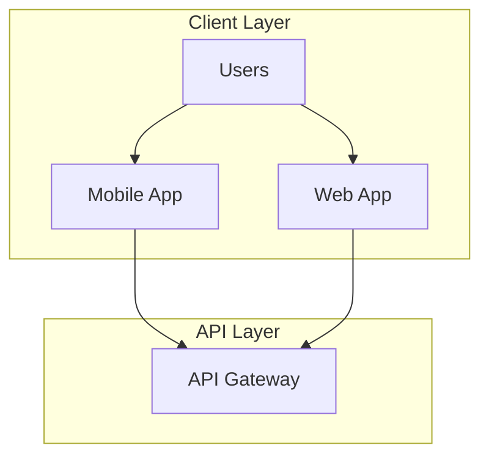

# Contributing to System Design Course

Thank you for your interest in contributing to this project! This is a community-driven course, and we welcome contributions from developers of all skill levels. 

## How You Can Contribute

### Content Contributions
- **Add new episodes** covering advanced topics
- **Improve existing explanations** with clearer examples
- **Create visual diagrams** for better understanding
- **Add real-world case studies** from your experience
- **Write tutorials** for specific technologies

### Code Contributions
- **Improve example implementations** 
- **Add new project examples** (Chat systems, Social feeds, etc.)
- **Fix bugs** in existing code
- **Add unit tests** and integration tests
- **Optimize performance** of example applications

### Design & Documentation
- **Create better diagrams** and visual content
- **Improve README** and documentation
- **Design infographics** for complex concepts
- **Record video explanations** for difficult topics
- **Add translations** to other languages

### Bug Reports & Feature Requests
- **Report issues** you find in the content or code
- **Suggest new topics** to cover
- **Request clarifications** on confusing sections
- **Propose improvements** to existing content

## Getting Started

### 1. Fork the Repository
```bash
# Fork this repository to your GitHub account
# Then clone your fork
git clone https://github.com/harshpreet931/SystemDesignNotes.git
cd SystemDesignNotes
```

### 2. Set Up Development Environment
```bash
# Install dependencies for examples
cd episodes/01-fundamentals/url-shortener-example
npm install

# Start development environment
docker-compose up -d
```

### 3. Create a Feature Branch
```bash
# Create a new branch for your contribution
git checkout -b feature/your-feature-name

# Or for content additions
git checkout -b content/episode-name
```

## Content Guidelines

### Writing Style
- **Use simple, clear language** - Explain complex concepts simply
- **Include practical examples** - Show, don't just tell
- **Add code snippets** - Make concepts tangible
- **Use analogies** - Help readers relate to familiar concepts
- **Structure content logically** - Follow a clear learning progression

### Episode Structure
Each episode should follow this structure:
```markdown
# Episode X: Topic Name

## What You'll Learn
- Clear learning objectives

## Core Concepts
- Main content with examples

## Practical Example
- Hands-on implementation

## Deep Dive
- Advanced topics and considerations

## Key Takeaways
- Summary and action items

## What's Next
- Preview of upcoming content
```

### Code Examples
- **Use TypeScript/JavaScript** for consistency
- **Include comprehensive comments** 
- **Follow clean code principles**
- **Add error handling** and validation
- **Include tests** when possible
- **Document API endpoints** clearly

## Visual Content Guidelines

### Diagrams
- Use **Mermaid** for system diagrams (renders in GitHub)
- Create **high-resolution images** for complex diagrams
- Use **consistent color schemes** across diagrams
- Include **alternative text** for accessibility

### Example Mermaid Diagram


## Testing Guidelines

### Content Testing
- **Check all links** work correctly
- **Verify code examples** compile and run
- **Test instructions** on fresh environment
- **Validate diagrams** render properly

### Code Testing
```bash
# Run tests for backend
cd backend
npm test

# Run integration tests
npm run test:integration

# Check code coverage
npm run test:coverage
```

## Pull Request Process

### Before Submitting
1. **Test your changes** thoroughly
2. **Update documentation** if needed
3. **Add yourself** to CONTRIBUTORS.md
4. **Write clear commit messages**

### PR Template
```markdown
## Description
Brief description of changes

## Type of Change
- [ ] New episode/content
- [ ] Bug fix
- [ ] New feature
- [ ] Documentation update
- [ ] Code improvement

## Testing
- [ ] Tested locally
- [ ] Added/updated tests
- [ ] Documentation updated

## Screenshots (if applicable)
Include screenshots for visual changes

## Related Issues
Closes #issue_number
```

### Review Process
1. **Automated checks** must pass
2. **At least one maintainer** review required
3. **Community feedback** encouraged
4. **Changes addressed** before merge

## Recognition

### Contributor Levels

#### **First-Time Contributors**
- Added to CONTRIBUTORS.md
- Welcome package with course materials
- Invitation to contributor Discord channel

#### **Regular Contributors** (5+ contributions)
- Featured in README.md
- Early access to new content
- Input on course direction

#### **Core Contributors** (20+ contributions)
- Co-author status on major episodes
- Speaking opportunities at events
- Revenue sharing from course sales

#### **Maintainers** (50+ contributions)
- Full repository access
- Course planning involvement
- Long-term partnership opportunities

### Current Contributors
See [CONTRIBUTORS.md](./CONTRIBUTORS.md) for our amazing contributors!

## Getting Help

### Discord Community
Join our [Discord server](https://discord.gg/your-server) for:
- **Quick questions** and help
- **Collaboration** on projects
- **Live discussions** about system design
- **Networking** with other contributors

### GitHub Discussions
Use [GitHub Discussions](https://github.com/harshpreet931/SystemDesignNotes/discussions) for:
- **Feature requests** and ideas
- **General questions** about the course
- **Showing off** your projects
- **Getting feedback** on contributions

### Issue Templates
We have templates for:
- [Bug Report](.github/ISSUE_TEMPLATE/bug_report.md)
- [Feature Request](.github/ISSUE_TEMPLATE/feature_request.md)
- [Content Request](.github/ISSUE_TEMPLATE/content_request.md)
- [Question](.github/ISSUE_TEMPLATE/question.md)

## Resources for Contributors

### System Design Learning
- [System Design Primer](https://github.com/donnemartin/system-design-primer)
- [High Scalability](http://highscalability.com/)
- [Engineering Blogs](https://github.com/kilimchoi/engineering-blogs)

### Development Tools
- [Mermaid Live Editor](https://mermaid-js.github.io/mermaid-live-editor/)
- [Draw.io](https://app.diagrams.net/) for complex diagrams
- [VS Code](https://code.visualstudio.com/) with recommended extensions

### Best Practices
- [Clean Code Principles](https://github.com/ryanmcdermott/clean-code-javascript)
- [Git Commit Messages](https://www.conventionalcommits.org/)
- [Documentation Guide](https://www.writethedocs.org/guide/)

## Contribution Ideas

### Beginner-Friendly
- Fix typos and improve clarity
- Add missing comments to code examples
- Create simple diagrams for existing content
- Test examples and report issues
- Improve README sections

### Intermediate
- Add new project examples
- Create video explanations
- Write integration tests
- Design infographics
- Translate content to other languages

### Advanced
- Design new episodes
- Create comprehensive case studies
- Build advanced examples (distributed systems)
- Add performance monitoring
- Create automation tools

## What We Don't Accept

- **Plagiarized content** - All contributions must be original
- **Promotional content** - No self-promotion or spam
- **Off-topic material** - Keep contributions relevant to system design
- **Poor quality code** - Code must follow our standards
- **Inappropriate content** - Maintain professional standards

## License

By contributing, you agree that your contributions will be licensed under the same [MIT License](./LICENSE) as the project.

---

<div align="center">

**Every contribution matters!**

Whether you're fixing a typo or designing a new episode, you're helping thousands of developers learn system design. Thank you for being part of this community!

Watch Videos](http://youtube.com/@ThatNotesGuy)

</div>
