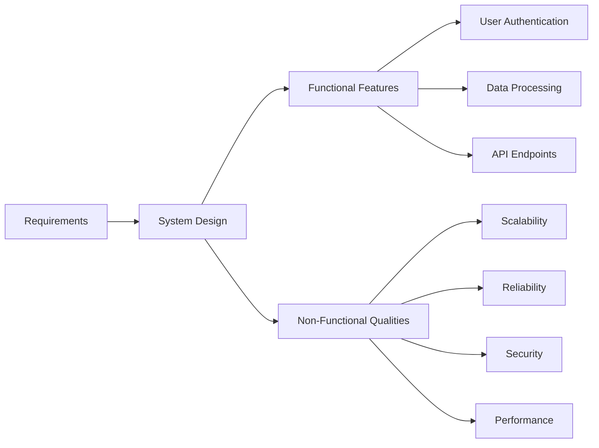
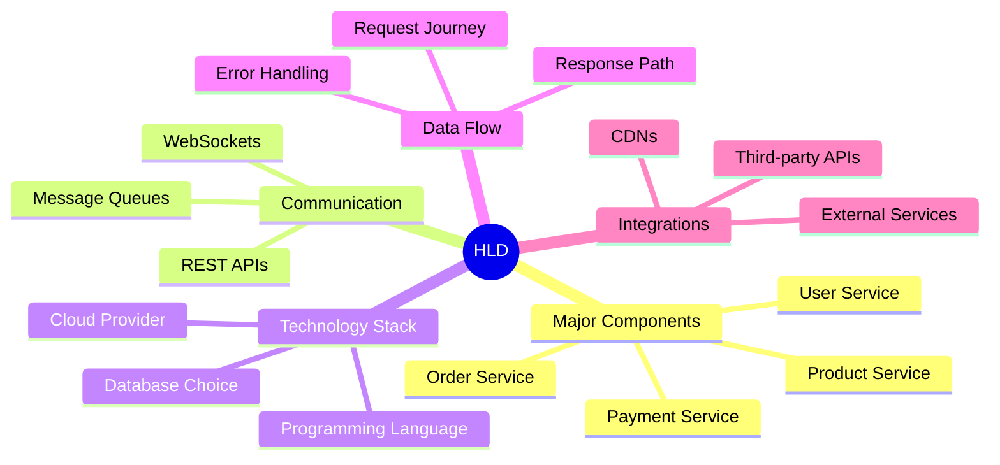
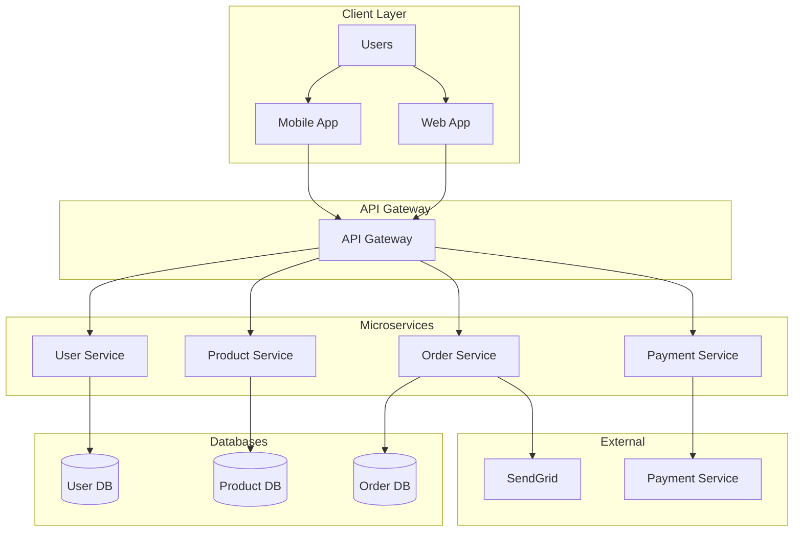
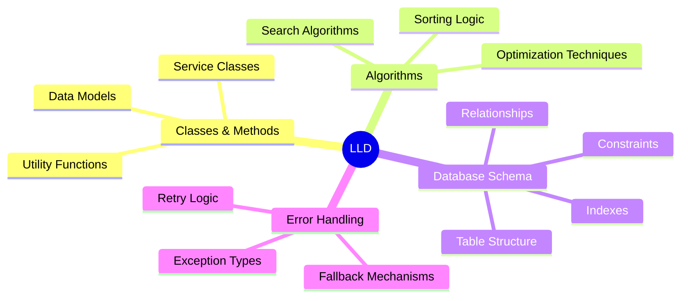
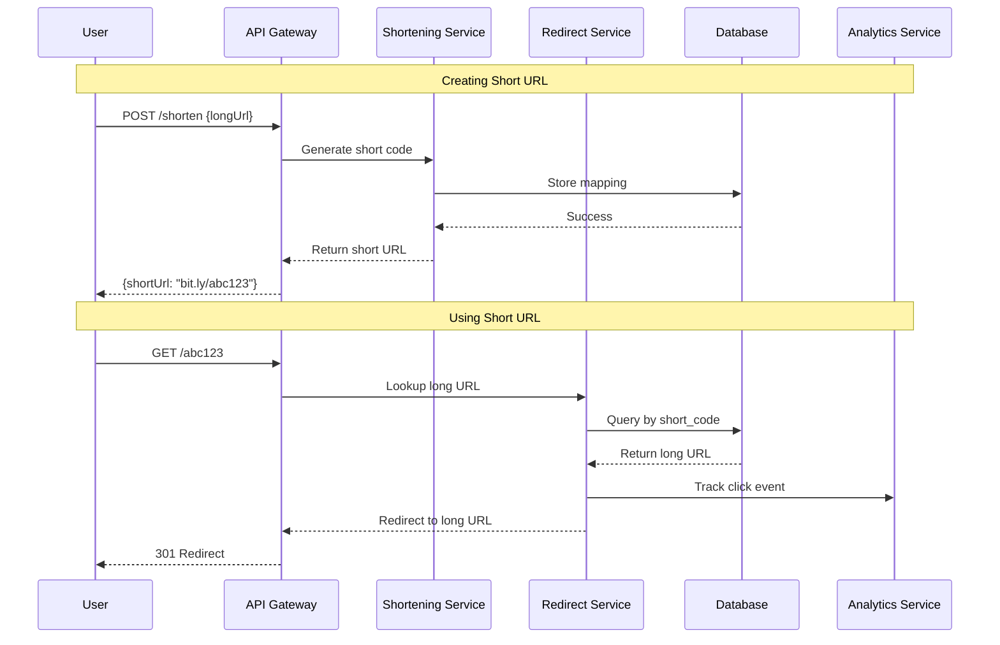
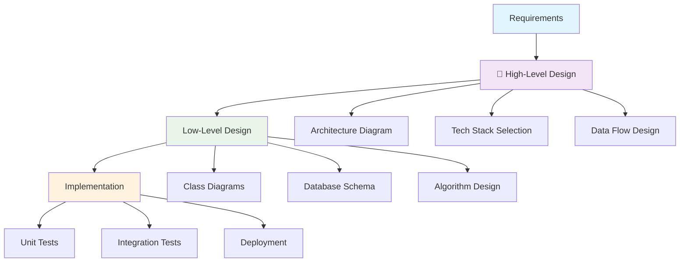

# Episode 1: System Design Fundamentals

[](http://youtube.com/@ThatNotesGuy)
[](#)

> **"What separates your weekend project from Netflix or Uber? It's not just more servers or code—it's the blueprint. It's system design."**

## What You'll Learn

By the end of this episode, you'll understand:
- ✅ What system design is and why it's crucial
- ✅ The difference between High-Level Design (HLD) and Low-Level Design (LLD)
- ✅ How to think like a system architect
- ✅ Real example: URL Shortener architecture

---

## What is System Design?

Think of system design as an **architect designing a skyscraper**. Before any construction begins, the architect creates detailed blueprints. 

**System design is the blueprinting phase for software.**

### Core Definition

System design is the process of defining:
-  **System architecture** and its components
-  **How components interact** through interfaces
-  **How data flows** and is managed
-  **Both functional and non-functional requirements**



---

## Why is System Design Important?

### Without System Design
```bash
# Just jumping into coding
git clone weekend-project
cd weekend-project
npm start
# Works for 10 users... 
# Crashes at 100 users
```

### With System Design
```bash
# Thoughtful planning first
1. Understand requirements
2. Design architecture
3. Choose right technologies
4. Plan for scale
5. Then code
# Works for 10 users... 
# Scales to 10M users ; )
```

### Key Benefits

| Benefit | Description | Example |
|---------|-------------|---------|
| **Manage Complexity** | Break massive problems into smaller pieces | Netflix's microservices architecture |
| **Proactive Scaling** | Think about performance before problems arise | Instagram handling 4B likes/day |
| **Better Reliability** | Systems that don't crumble under pressure | WhatsApp's 99.9% uptime |
| **Cost Effective** | Prevent expensive rewrites later | Avoiding Twitter's "Fail Whale" |
| **Communication Tool** | Everyone understands the plan | Developers, PMs, stakeholders aligned |

---

## High-Level Design (HLD) vs Low-Level Design (LLD)

Think of it like **viewing a city**:

### High-Level Design (HLD)
**"View from an airplane"**
- See major districts, highways, landmarks
- Big picture architecture
- No coding details yet

### Low-Level Design (LLD)  
**"Zoom into one building"**
- Detailed floor plans, wiring, plumbing
- Specific implementation details
- Ready-to-code specifications

---

## High-Level Design (HLD) Deep Dive

### What HLD Focuses On



### Example: E-Commerce Platform HLD



### HLD Technology Decisions

```yaml
# Example HLD Tech Stack
Cloud_Provider: "AWS"
Programming_Language: "Node.js"
Database: 
  Primary: "PostgreSQL"
  Cache: "Redis"
  Search: "Elasticsearch"
Communication:
  Sync: "REST APIs"
  Async: "RabbitMQ"
Monitoring: "DataDog"
CDN: "CloudFlare"
```

---

## Low-Level Design (LLD) Deep Dive

### What LLD Focuses On



### Example: URL Shortener LLD

```typescript
// URL Shortener Service - Low Level Design

interface URLShortenerService {
  generateShortUrl(longUrl: string): Promise<string>;
  getLongUrl(shortCode: string): Promise<string>;
  getClickStats(shortCode: string): Promise<ClickStats>;
}

class URLShortenerServiceImpl implements URLShortenerService {
  private idGenerator: UniqueIdGenerator;
  private database: URLDatabase;
  private cache: Cache;

  async generateShortUrl(longUrl: string): Promise<string> {
    // 1. Validate URL
    if (!this.isValidUrl(longUrl)) {
      throw new InvalidURLError("Invalid URL format");
    }

    // 2. Check if already shortened
    const existing = await this.database.findByLongUrl(longUrl);
    if (existing) {
      return existing.shortCode;
    }

    // 3. Generate unique ID
    const uniqueId = await this.idGenerator.getNextId();
    
    // 4. Convert to base62
    const shortCode = this.base62Encode(uniqueId);
    
    // 5. Store mapping
    await this.database.save({
      shortCode,
      longUrl,
      createdAt: new Date(),
      clickCount: 0
    });

    // 6. Cache for fast access
    await this.cache.set(shortCode, longUrl, 3600); // 1 hour TTL

    return shortCode;
  }

  private base62Encode(num: number): string {
    const chars = '0123456789abcdefghijklmnopqrstuvwxyzABCDEFGHIJKLMNOPQRSTUVWXYZ';
    let result = '';
    
    while (num > 0) {
      result = chars[num % 62] + result;
      num = Math.floor(num / 62);
    }
    
    return result || '0';
  }

  private isValidUrl(url: string): boolean {
    try {
      new URL(url);
      return true;
    } catch {
      return false;
    }
  }
}
```

### Database Schema (LLD)

```sql
-- URLs Table Schema
CREATE TABLE urls (
    short_code VARCHAR(10) PRIMARY KEY,
    long_url TEXT NOT NULL,
    created_at TIMESTAMP DEFAULT CURRENT_TIMESTAMP,
    updated_at TIMESTAMP DEFAULT CURRENT_TIMESTAMP,
    click_count INTEGER DEFAULT 0,
    expires_at TIMESTAMP NULL,
    user_id INTEGER REFERENCES users(id),
    
    -- Indexes for performance
    INDEX idx_long_url (long_url),
    INDEX idx_user_id (user_id),
    INDEX idx_created_at (created_at)
);

-- Click Analytics Table
CREATE TABLE click_analytics (
    id SERIAL PRIMARY KEY,
    short_code VARCHAR(10) REFERENCES urls(short_code),
    clicked_at TIMESTAMP DEFAULT CURRENT_TIMESTAMP,
    ip_address INET,
    user_agent TEXT,
    referrer TEXT,
    country VARCHAR(2),
    city VARCHAR(100)
);
```

---

## Real Example: URL Shortener System

Let's walk through designing a URL shortener like Bit.ly or TinyURL from HLD to LLD.

### HLD: The Big Picture



### LLD: The Implementation Details

```javascript
// ID Generation Strategy - Counter + Base62
class UniqueIdGenerator {
  constructor() {
    this.counter = 1000000; // Start from 1M for shorter codes
    this.lock = new Mutex();
  }

  async getNextId() {
    return await this.lock.runExclusive(() => {
      return ++this.counter;
    });
  }
}

// Error Handling Strategy
class URLShortenerError extends Error {
  constructor(message, code) {
    super(message);
    this.code = code;
  }
}

class InvalidURLError extends URLShortenerError {
  constructor(message) {
    super(message, 'INVALID_URL');
  }
}

class DuplicateCodeError extends URLShortenerError {
  constructor(message) {
    super(message, 'DUPLICATE_CODE');
  }
}

// Collision Handling
class CollisionResolver {
  static async handleCollision(shortCode, database) {
    let attempts = 0;
    const maxAttempts = 5;
    
    while (attempts < maxAttempts) {
      const newCode = shortCode + this.generateSuffix();
      const exists = await database.exists(newCode);
      
      if (!exists) {
        return newCode;
      }
      
      attempts++;
    }
    
    throw new Error('Unable to resolve collision after 5 attempts');
  }
  
  static generateSuffix() {
    return Math.random().toString(36).substring(2, 4);
  }
}
```

---

## HLD to LLD Process Flow



---

## Key Takeaways

### Do This
-  **Start with HLD** - Get the big picture right first
-  **Iterate between levels** - HLD and LLD inform each other
-  **Document decisions** - Future you will thank present you
-  **Get feedback early** - Share designs before coding
-  **Think about testing** - How will you verify it works?

###  Avoid This
-  **Jumping straight to LLD** - You'll miss the forest for the trees
-  **Over-engineering** - Keep it as simple as possible
-  **Ignoring non-functional requirements** - Scalability matters
-  **Designing in isolation** - Get input from stakeholders
-  **Forgetting about operations** - How will you deploy and monitor?

---

<div align="center">

[⏮ Previous: Course Intro](../../) | [Course Home](../../) | [⏭ Next: Episode 2](../02-monolith-microservices/)

</div>