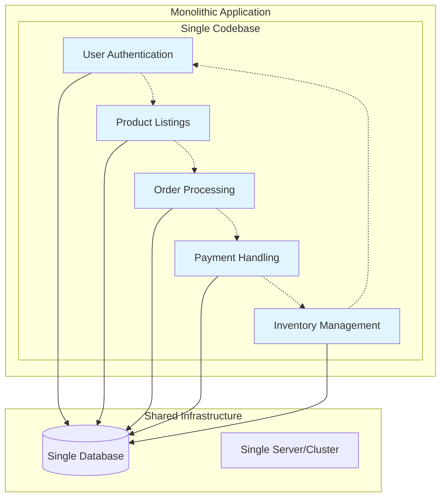
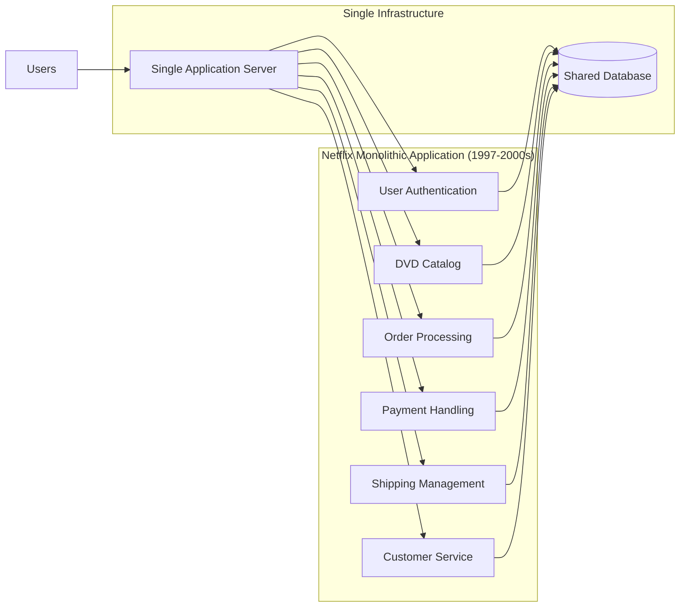
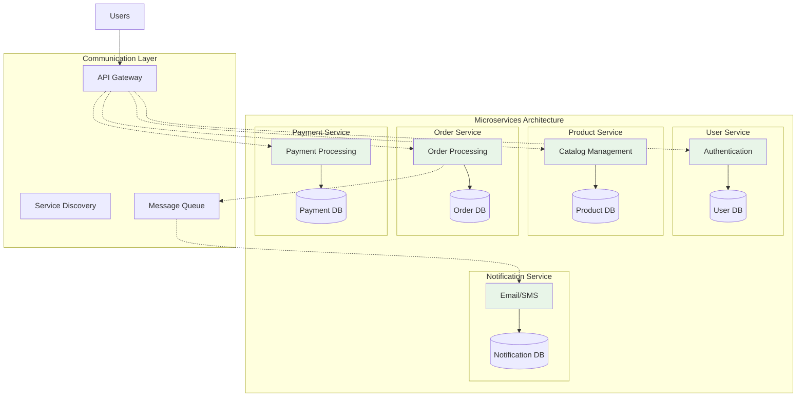
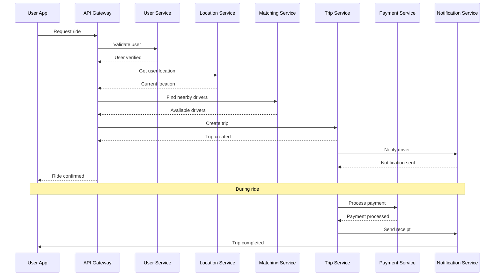
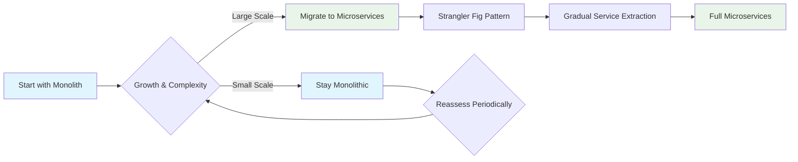

# Episode 2: Monoliths vs Microservices

[](http://youtube.com/@ThatNotesGuy)
[](#)

> **"The choice between monoliths and microservices isn't about what's trendy—it's about what fits your team, your timeline, and your scale."**

## What You'll Learn

By the end of this episode, you'll understand:
- ✅ What monolithic architecture is and when to use it
- ✅ What microservices architecture is and its benefits
- ✅ Real-world examples: Netflix's evolution and Uber's architecture
- ✅ Practical decision framework for choosing between the two approaches
- ✅ Trade-offs and considerations for each architectural pattern

---

## Episode Timeline & Key Topics

| Timestamp | Topic | Key Points |
|-----------|-------|------------|
| **00:00-00:16** | Introduction | Overview of monoliths vs microservices comparison |
| **00:16-01:00** | Monolith Definition | Department store analogy, single codebase concept |
| **01:00-01:48** | Monolith Advantages | Simple development, performance, debugging, operational simplicity |
| **01:48-02:55** | Netflix Case Study | Original monolithic architecture (1997-late 2000s), migration challenges |
| **02:55-03:40** | Monolith Disadvantages | Scalability issues, technology limitations, reliability risks |
| **03:40-04:30** | Microservices Definition | Shopping mall analogy, independent services concept |
| **04:30-05:31** | Microservices Advantages | Independent scaling, technology diversity, fault isolation |
| **05:31-06:20** | Uber Case Study | Real-world microservices implementation and architecture |
| **06:20-06:50** | Microservices Disadvantages | Distributed complexity, operational overhead, testing challenges |
| **06:50-07:00** | Decision Framework | When to choose each approach |

---

## Monolithic Architecture

### Definition

Think of a monolith as a **traditional department store** where everything is under one roof - clothes, electronics, home goods, and food. All departments are interconnected and managed as a single unit.

In software terms, a monolith is a single large application where different functions and modules (user authentication, product listings, order processing) are bundled together in one big codebase.



### Key Characteristics

- **Single Deployable Unit**: When you update the application, you deploy the entire unit
- **Shared Resources**: All components use the same database and infrastructure
- **Tight Coupling**: Components are interconnected within the same process
- **Unified Technology Stack**: Entire application uses the same programming language and frameworks

### Netflix Case Study: The Monolithic Era (1997-Late 2000s)

Netflix started with a monolithic architecture during their DVD-by-mail era. This single massive application handled:



**The Challenge**: As Netflix grew, this architecture became difficult to scale. Every small change required redeploying the entire application, and if one component failed, it could bring down the whole system.

### Monolith Advantages

| Advantage | Description | Why It Matters |
|-----------|-------------|----------------|
| **Simple Development** | Everything in one place, easier for small teams to build features quickly | Perfect for MVPs and small projects |
| **High Performance** | Components communicate directly within the same process, no network calls | Faster than inter-service communication |
| **Straightforward Debugging** | Can trace issues through the entire system in one codebase | Easier troubleshooting and monitoring |
| **Less Operational Overhead** | Only one thing to deploy, monitor, and maintain | Reduced DevOps complexity |

### Monolith Disadvantages

| Disadvantage | Description | Real Impact |
|--------------|-------------|-------------|
| **Scalability Issues** | Must scale the entire application, even if only one component needs more resources | Like expanding an entire department store when only the electronics section is popular |
| **Technology Stack Limitations** | Stuck with one programming language and framework | Hard to adopt new technologies for specific use cases |
| **Reliability Risks** | Single point of failure - one bug can bring down everything | High blast radius for issues |
| **Development Slowdowns** | Large codebase becomes harder to understand and modify | Team productivity decreases over time |
| **Risky Deployments** | Every change requires deploying the entire application | Fear of breaking existing functionality |

---

## Microservices Architecture

### Definition

Think of microservices as a **modern shopping mall** with many smaller, specialized stores. Each store (shoe store, bookstore, tech store, restaurants) operates independently but contributes to the overall mall experience.

In software terms, microservices break down a large application into a collection of smaller, independent services, each responsible for a specific business function.



### Uber Case Study: Microservices in Action

When you request an Uber ride, here's what happens behind the scenes:



### Service Breakdown

| Service | Responsibility | Database | Technology Choice |
|---------|---------------|----------|------------------|
| **User Service** | Profile management, authentication | User DB | Java/Spring Boot |
| **Location Service** | Real-time GPS tracking | Location DB | Go (for performance) |
| **Matching Service** | Driver-rider pairing algorithm | Matching DB | Python (ML algorithms) |
| **Trip Service** | Ride lifecycle management | Trip DB | Node.js |
| **Payment Service** | Billing and payments | Payment DB | Java (security focus) |
| **Notification Service** | Push notifications, SMS, email | Notification DB | Python |

### Microservices Advantages

| Advantage | Description | Business Impact |
|-----------|-------------|-----------------|
| **Independent Scaling** | Scale services individually based on demand | Cost-effective resource utilization |
| **Technology Diversity** | Choose the best tool for each job | Optimal performance and developer productivity |
| **Fault Isolation** | Failure in one service doesn't crash everything | Higher system availability |
| **Faster Deployments** | Teams can deploy services independently | Faster time-to-market for features |
| **Team Autonomy** | Small teams own services end-to-end | Better accountability and innovation |

### Microservices Disadvantages

| Disadvantage | Description | Operational Impact |
|--------------|-------------|-------------------|
| **Distributed System Complexity** | Network latency, service discovery, failure handling | Requires sophisticated infrastructure |
| **Operational Overhead** | Many services to deploy, monitor, and secure | Need strong DevOps and monitoring |
| **Testing Complexity** | End-to-end testing across multiple services | More complex test strategies required |
| **Data Consistency** | Managing transactions across multiple databases | Need for eventual consistency patterns |
| **Communication Overhead** | Network calls between services add latency | Performance considerations |

---

## Decision Framework: When to Choose What

### Choose Monolith When:

```yaml
Project_Characteristics:
  - Small to medium project
  - MVP or prototype stage
  - Simple business logic
  - Predictable traffic patterns

Team_Characteristics:
  - Small team (< 10 developers)
  - Limited DevOps expertise
  - Tight deadlines
  - Single product focus

Technical_Requirements:
  - Low latency requirements
  - Simple data consistency needs
  - Limited scalability requirements
  - Budget constraints
```

### Choose Microservices When:

```yaml
Project_Characteristics:
  - Large, complex application
  - Multiple business domains
  - High traffic with varying patterns
  - Need for rapid feature development

Team_Characteristics:
  - Large team (> 20 developers)
  - Multiple autonomous teams
  - Strong DevOps culture
  - Long-term product vision

Technical_Requirements:
  - Independent scaling needs
  - Technology diversity requirements
  - High availability demands
  - Complex business logic separation
```

### The Evolution Path



---

## Practical Recommendations

### For Personal Projects
**Recommendation**: 100% Monolith
- Faster development
- Simpler deployment
- Lower operational overhead
- Focus on features, not infrastructure

### For Startups
**Recommendation**: Start with Monolith, Plan for Microservices
- Build MVP quickly with monolith
- Design with service boundaries in mind
- Extract services when team grows beyond 10-15 people

### For Enterprise
**Recommendation**: Microservices with Careful Planning
- Massive teams benefit from service ownership
- Complex business domains need separation
- Investment in DevOps infrastructure is worthwhile

---

## Key Takeaways

### Remember This
- **There's no one-size-fits-all solution** - context matters
- **Start simple, evolve as needed** - premature optimization is costly
- **Team size is often the deciding factor** - not just technical requirements
- **Operational maturity is crucial** - especially for microservices
- **Migration is possible** - you're not locked into your initial choice

### Common Mistakes to Avoid
- **Choosing microservices for small teams** - operational complexity outweighs benefits
- **Creating too many services** - nano-services create unnecessary overhead
- **Ignoring data consistency** - distributed data is complex
- **Underestimating monitoring needs** - observability is critical for microservices
- **Following trends blindly** - your requirements should drive the decision

---

## Real-World Examples Summary

| Company | Architecture Choice | Reason | Outcome |
|---------|-------------------|--------|---------|
| **Netflix (Early)** | Monolith | Simple DVD rental business | Worked until scale demanded change |
| **Netflix (Current)** | Microservices | Global streaming, multiple teams | Enables rapid feature development |
| **Uber** | Microservices | Complex logistics, real-time processing | Handles millions of rides daily |
| **WhatsApp** | Monolith | Simple messaging, small team | Served 900M users with 50 engineers |
| **Amazon** | Microservices | Massive scale, multiple business units | Each team can innovate independently |

---

<div align="center">

[⏮ Previous: Episode 1](../01-fundamentals/) | [Course Home](../../) | [⏭ Next: Episode 3](../03-load-balancing/)

</div>