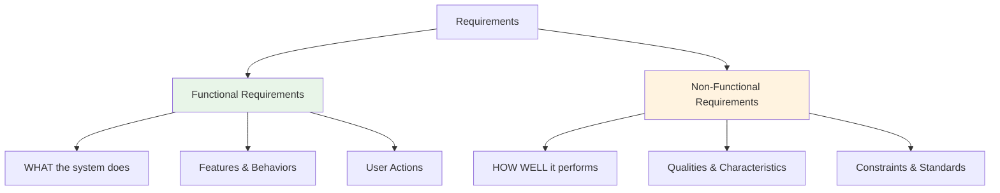
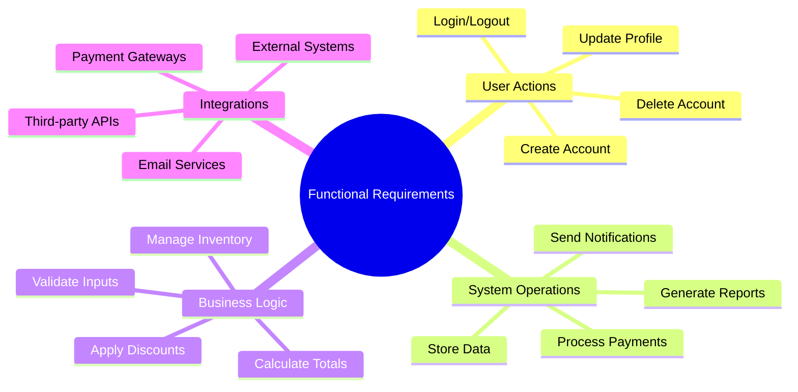
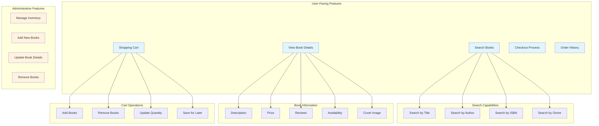
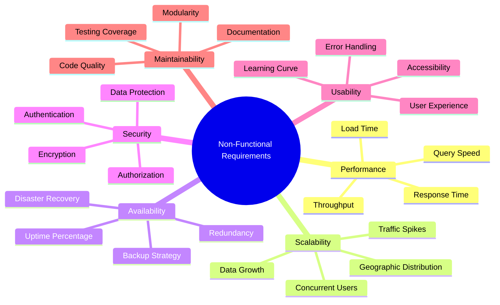
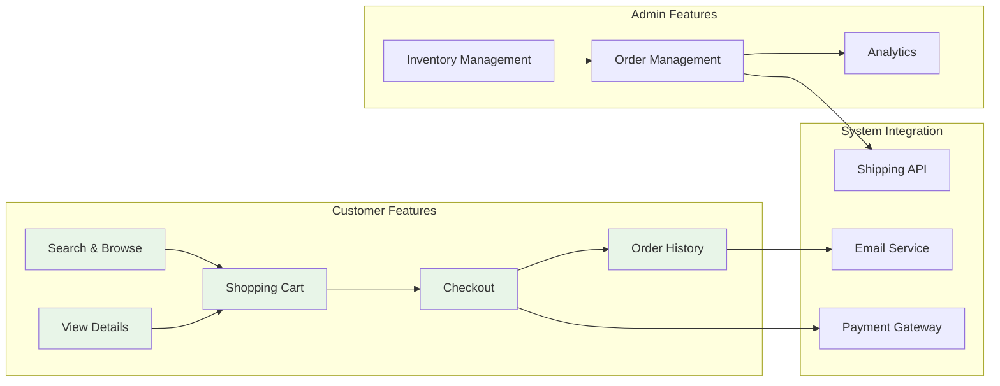
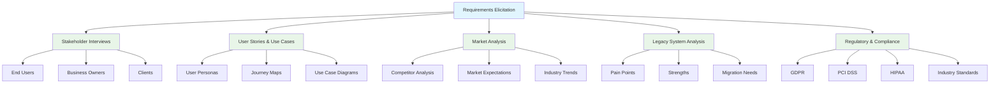
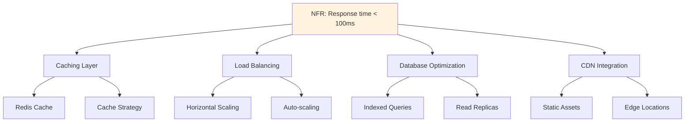
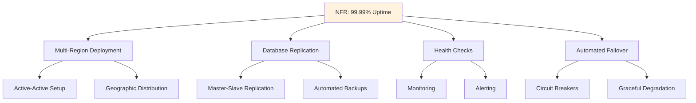
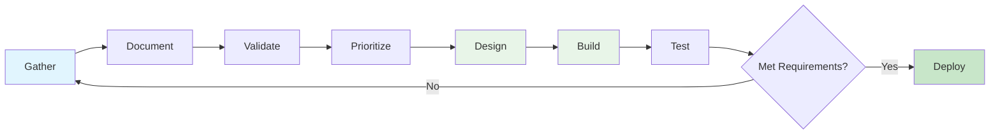

# Episode 3: Functional vs Non-Functional Requirements

[](http://youtube.com/@ThatNotesGuy)
[](#)

> **"Requirements are the bedrock of your entire project. Get them wrong or miss them, and you're setting yourself up for a lot of trouble later on."**

## What You'll Learn

By the end of this episode, you'll understand:
- ✅ What requirements are and why they're critical to system design
- ✅ The difference between functional and non-functional requirements
- ✅ How to identify and document functional requirements
- ✅ Key categories of non-functional requirements (performance, scalability, security)
- ✅ Real-world example: Online bookstore requirements breakdown
- ✅ The requirements elicitation process

---

## What Are Requirements?

Think of requirements as a **detailed recipe for cooking**. Just as a chef needs precise instructions about ingredients, quantities, and cooking methods, software engineers need clear specifications about what to build and how it should behave.

### Core Definition

**Requirements are statements that describe:**
- The services your system should offer
- The constraints it must operate under
- The qualities it must possess



### Why Requirements Matter

| Without Clear Requirements | With Clear Requirements |
|---------------------------|------------------------|
| Building the wrong features | Building what users actually need |
| Missing critical constraints | Meeting performance expectations |
| Costly rework and rewrites | Smooth development and delivery |
| Team confusion and conflicts | Aligned stakeholders and developers |
| Failed projects | Successful system deployment |

---

## Functional Requirements

Functional requirements describe **specific actions or functionalities** the system must provide. Think of them as the **verbs of your system** - what can a user do? What tasks can the system perform?

### Key Characteristics

- **Action-Oriented**: Describe specific features and behaviors
- **User-Centric**: Directly tied to user needs and stories
- **Testable**: Either the system does it or it doesn't
- **Feature-Focused**: Define the core capabilities



### E-Commerce Example: Functional Requirements

For an e-commerce website, here are typical functional requirements:

| Requirement ID | Category | Description |
|----------------|----------|-------------|
| **FR-001** | User Management | A user shall be able to create a new account |
| **FR-002** | Authentication | The system shall allow users to log in with email and password |
| **FR-003** | Shopping Cart | Users shall be able to add items to the shopping cart |
| **FR-004** | Shopping Cart | Users shall be able to remove items from the shopping cart |
| **FR-005** | Shopping Cart | The system shall display the total price including taxes |
| **FR-006** | Payment | The system shall process payments via credit card and PayPal |
| **FR-007** | Orders | Users shall be able to view all their past orders |
| **FR-008** | Search | Users shall be able to search for products by name or category |

### Online Bookstore: Detailed Functional Requirements

Let's examine a comprehensive online bookstore system:



#### Bookstore Functional Requirements Breakdown

**1. Search Functionality**
- Users must be able to search for books using different criteria:
  - Title search
  - Author search
  - ISBN lookup
  - Genre/category browsing

**2. Book Information Display**
- Users should be able to view detailed information about each book:
  - Full description
  - Current price
  - Customer reviews and ratings
  - Availability status
  - Cover image and preview pages

**3. Shopping Cart Management**
- Users need to be able to:
  - Add books to a virtual shopping cart
  - Update quantities
  - Remove items
  - View cart total

**4. Checkout and Purchase**
- Users must be able to:
  - Proceed to checkout
  - Enter shipping information
  - Complete purchase
  - Receive order confirmation

**5. Payment Integration**
- The system needs to:
  - Integrate with payment gateways
  - Handle secure transactions
  - Process refunds
  - Store payment history

**6. Order Management**
- Users should be able to:
  - View past orders
  - Track shipments
  - Download invoices
  - Request returns

**7. Administrative Functions**
- Administrators need to:
  - Manage book inventory
  - Add new books
  - Update book details (price, description, availability)
  - Remove discontinued books
  - View sales reports

### Writing Good Functional Requirements

```yaml
# Template for Functional Requirements
FR-ID: <Unique Identifier>
Title: <Short descriptive name>
Description: <Clear statement of what the system shall do>
Priority: <High/Medium/Low>
User_Story: As a [user role], I want to [action] so that [benefit]

# Example
FR-042:
  Title: "Password Reset Functionality"
  Description: "The system shall allow users to reset their password by
                receiving a secure link via email that expires in 24 hours"
  Priority: High
  User_Story: "As a user who forgot my password, I want to reset it via
               email so that I can regain access to my account"
  Acceptance_Criteria:
    - User enters email address
    - System sends reset link if email exists
    - Link expires after 24 hours
    - User creates new password meeting security requirements
```

---

## Non-Functional Requirements

If functional requirements tell us **what** the system does, non-functional requirements tell us **how well** it does it. They define the qualities, characteristics, and operational constraints.

### Key Characteristics

- **Quality-Focused**: Describe adjectives and adverbs of system behavior
- **Architecture-Impacting**: Often drive major design decisions
- **Measurable**: Should have specific, quantifiable metrics
- **Cross-Cutting**: Apply across multiple features



---

## Categories of Non-Functional Requirements

### 1. Performance

**Definition**: How fast is the system?

**Key Metrics**:
- Response time
- Throughput (requests per second)
- Page load time
- Query execution time

**Examples**:
```yaml
Performance_Requirements:
  Search_Response:
    Metric: "Search results should load under 2 seconds"
    Percentile: "95th percentile"

  Page_Load:
    Metric: "Home page must load under 3 seconds for 95% of users"
    Network: "On 4G connection"

  API_Response:
    Metric: "API endpoints must respond within 500ms"
    Condition: "Under normal load"
```

### 2. Scalability

**Definition**: Can the system handle growth in users or data?

**Key Metrics**:
- Concurrent users
- Data volume
- Transaction rate
- Geographic distribution

**Examples**:
```yaml
Scalability_Requirements:
  Concurrent_Users:
    Normal: "Support 10,000 concurrent users"
    Peak: "Support 50,000 concurrent users during holiday sales"

  Data_Growth:
    Rate: "Handle 100,000 new books added per year"
    Storage: "Scale to 10 million product listings"

  Geographic:
    Regions: "Serve users across 5 continents"
    Latency: "Maintain < 200ms latency globally"
```

### 3. Availability / Reliability

**Definition**: How often is the system up and running correctly?

**Key Metrics**:
- Uptime percentage
- Mean Time Between Failures (MTBF)
- Mean Time To Recovery (MTTR)
- Disaster recovery time

**Examples**:
```yaml
Availability_Requirements:
  Uptime:
    Target: "99.9% uptime"
    Calculation: "8.76 hours downtime per year maximum"

  Recovery:
    MTTR: "Recovery within 1 hour of failure"
    RTO: "Recovery Time Objective: 30 minutes"
    RPO: "Recovery Point Objective: 5 minutes data loss max"
```

**Industry Standard Uptimes**:

| SLA | Uptime | Downtime per Year | Downtime per Month |
|-----|--------|-------------------|-------------------|
| 99% | Two nines | 3.65 days | 7.31 hours |
| 99.9% | Three nines | 8.77 hours | 43.83 minutes |
| 99.99% | Four nines | 52.60 minutes | 4.38 minutes |
| 99.999% | Five nines | 5.26 minutes | 26.30 seconds |

### 4. Security

**Definition**: How well is the system and its data protected?

**Key Areas**:
- Authentication and authorization
- Data encryption
- Password security
- Compliance standards

**Examples**:
```yaml
Security_Requirements:
  Data_Encryption:
    In_Transit: "All communication containing payment information must use HTTPS/TLS 1.3"
    At_Rest: "All sensitive data must be encrypted using AES-256"

  Password_Security:
    Hashing: "User passwords must be stored using bcrypt with cost factor 12"
    Policy: "Minimum 8 characters, requiring uppercase, lowercase, number, special char"

  Authentication:
    Method: "Support multi-factor authentication (MFA)"
    Session: "Sessions expire after 30 minutes of inactivity"

  Compliance:
    Standards: "GDPR compliant for EU users"
    PCI_DSS: "Level 1 compliance for payment processing"
```

### 5. Usability

**Definition**: How easy is it to learn and use the system?

**Key Metrics**:
- Time to complete tasks
- Number of clicks/steps
- Learning curve
- Error rates

**Examples**:
```yaml
Usability_Requirements:
  First_Time_User:
    Task: "Find a book and complete purchase within 5 steps"
    Time: "Complete checkout within 3 minutes"

  Accessibility:
    Standards: "WCAG 2.1 Level AA compliance"
    Screen_Readers: "Full support for screen readers"

  Mobile_Experience:
    Responsive: "Fully responsive design for mobile devices"
    Touch: "Touch targets minimum 44x44 pixels"
```

### 6. Maintainability

**Definition**: How easy is it to fix bugs or add new features?

**Key Metrics**:
- Code quality metrics
- Test coverage
- Time to integrate changes
- Documentation completeness

**Examples**:
```yaml
Maintainability_Requirements:
  Code_Quality:
    Coverage: "Minimum 80% unit test coverage"
    Documentation: "All public APIs must be documented"

  Integration:
    New_Payment_Gateway: "Integrate new payment module within 2 weeks"
    Bug_Fixes: "Critical bugs fixed within 24 hours"

  Modularity:
    Architecture: "Loosely coupled components following SOLID principles"
    Dependencies: "Minimize external dependencies"
```

### 7. Portability

**Definition**: Can the system run in different environments?

**Examples**:
```yaml
Portability_Requirements:
  Platforms:
    Browsers: "Support Chrome, Firefox, Safari, Edge (latest 2 versions)"
    Mobile_OS: "iOS 14+ and Android 10+"

  Deployment:
    Environments: "Run on AWS, Azure, or Google Cloud"
    Containers: "Fully containerized using Docker"
```

---

## Online Bookstore: Complete Requirements Case Study

Let's examine both functional and non-functional requirements for our online bookstore system.

### Functional Requirements Summary



### Non-Functional Requirements Summary

| Category | Requirement | Specific Metric |
|----------|-------------|-----------------|
| **Performance** | Search Speed | Results appear under 2 seconds |
| **Performance** | Page Load | Home page loads under 3 seconds for 95% of users |
| **Scalability** | Concurrent Users | Support 5,000 concurrent users during holiday sales |
| **Scalability** | Data Growth | Handle 1 million book entries |
| **Availability** | Uptime | 99.9% availability (less than 9 hours downtime/year) |
| **Availability** | Recovery | Automatic failover within 5 minutes |
| **Security** | Transport | All payment communication encrypted using HTTPS/TLS |
| **Security** | Password Storage | Bcrypt hashing with salt |
| **Security** | Compliance | PCI DSS Level 2 compliant |
| **Usability** | Purchase Flow | First-time user completes purchase within 5 clicks |
| **Usability** | Accessibility | WCAG 2.1 AA compliant |
| **Maintainability** | Payment Integration | Add new payment gateway within 2 weeks |
| **Maintainability** | Test Coverage | Minimum 75% code coverage |

### Complete Requirements Document Example

```markdown
## Online Bookstore Requirements Specification

### 1. Functional Requirements

#### 1.1 User Management
FR-1.1.1: Users must be able to create an account with email and password
FR-1.1.2: Users must be able to reset forgotten passwords
FR-1.1.3: Users must be able to update profile information
FR-1.1.4: Users must be able to save multiple shipping addresses

#### 1.2 Search and Discovery
FR-1.2.1: Users must be able to search books by title
FR-1.2.2: Users must be able to search books by author name
FR-1.2.3: Users must be able to search books by ISBN
FR-1.2.4: Users must be able to filter by genre, price range, publication date
FR-1.2.5: System must display search results with relevance ranking

#### 1.3 Book Details
FR-1.3.1: System must display book description, price, and availability
FR-1.3.2: System must display customer reviews and ratings
FR-1.3.3: System must show book cover image and preview pages
FR-1.3.4: System must display related book recommendations

#### 1.4 Shopping Cart
FR-1.4.1: Users must be able to add books to cart
FR-1.4.2: Users must be able to update quantities
FR-1.4.3: Users must be able to remove items from cart
FR-1.4.4: System must calculate and display total price with taxes

#### 1.5 Checkout and Payment
FR-1.5.1: Users must be able to select shipping address
FR-1.5.2: System must integrate with payment gateways (Stripe, PayPal)
FR-1.5.3: System must send order confirmation email
FR-1.5.4: Users must be able to apply discount codes

#### 1.6 Order Management
FR-1.6.1: Users must be able to view order history
FR-1.6.2: Users must be able to track shipments
FR-1.6.3: Users must be able to download invoices
FR-1.6.4: Users must be able to initiate returns

#### 1.7 Administrative Functions
FR-1.7.1: Admins must be able to add new books to inventory
FR-1.7.2: Admins must be able to update book details
FR-1.7.3: Admins must be able to manage stock levels
FR-1.7.4: Admins must be able to view sales analytics

### 2. Non-Functional Requirements

#### 2.1 Performance
NFR-2.1.1: Search results must appear within 2 seconds (95th percentile)
NFR-2.1.2: Home page must load within 3 seconds on 4G connection
NFR-2.1.3: API response time must be under 500ms (average)
NFR-2.1.4: Database queries must complete within 100ms (95th percentile)

#### 2.2 Scalability
NFR-2.2.1: System must support 5,000 concurrent users during peak sales
NFR-2.2.2: System must handle 10,000 daily active users
NFR-2.2.3: Database must scale to 1 million book entries
NFR-2.2.4: System must support 100 transactions per minute

#### 2.3 Availability & Reliability
NFR-2.3.1: System must achieve 99.9% uptime
NFR-2.3.2: Automatic failover within 5 minutes
NFR-2.3.3: Daily automated backups with 30-day retention
NFR-2.3.4: Zero data loss in case of system failure

#### 2.4 Security
NFR-2.4.1: All communication must use HTTPS/TLS 1.3
NFR-2.4.2: Passwords must be hashed using bcrypt (cost 12)
NFR-2.4.3: PCI DSS Level 2 compliance for payment processing
NFR-2.4.4: Rate limiting: 100 requests per minute per IP
NFR-2.4.5: SQL injection and XSS protection on all inputs

#### 2.5 Usability
NFR-2.5.1: First-time user must complete purchase within 5 clicks
NFR-2.5.2: Mobile-responsive design for all pages
NFR-2.5.3: WCAG 2.1 Level AA accessibility compliance
NFR-2.5.4: Support for screen readers

#### 2.6 Maintainability
NFR-2.6.1: Minimum 75% unit test coverage
NFR-2.6.2: New payment gateway integration within 2 weeks
NFR-2.6.3: All APIs must have OpenAPI documentation
NFR-2.6.4: Critical bugs fixed within 24 hours

#### 2.7 Portability
NFR-2.7.1: Support latest 2 versions of Chrome, Firefox, Safari, Edge
NFR-2.7.2: Mobile support for iOS 14+ and Android 10+
NFR-2.7.3: Deployable on AWS, Azure, or GCP
NFR-2.7.4: Containerized using Docker
```

---

## Requirements Elicitation Process

Understanding where requirements come from is critical. This process is called **requirements elicitation** or **requirements gathering**.



### Sources of Requirements

**1. Stakeholder Engagement**
- End users who will use the system
- Business owners with strategic goals
- Clients with specific needs
- Subject matter experts

**2. User Research**
- User stories describing interactions
- Use cases detailing workflows
- Personas representing user types
- User journey mapping

**3. Competitive Analysis**
- What competitors offer
- Market expectations
- Industry best practices
- Emerging trends

**4. Legacy System Analysis**
- If replacing an old system:
  - What works well (keep)
  - What causes problems (fix)
  - What's missing (add)

**5. Regulatory & Compliance**
- Legal obligations (GDPR, CCPA)
- Industry standards (PCI DSS for payments)
- Accessibility requirements (WCAG)
- Security standards (ISO 27001)

### Requirements Gathering Techniques

| Technique | Description | Best For |
|-----------|-------------|----------|
| **Interviews** | One-on-one discussions with stakeholders | Deep insights, expert knowledge |
| **Surveys** | Questionnaires to large user groups | Quantitative data, trends |
| **Workshops** | Collaborative sessions with multiple stakeholders | Alignment, consensus building |
| **Observation** | Watching users in their environment | Understanding actual behavior |
| **Prototyping** | Building mockups to validate ideas | Visual feedback, usability testing |
| **Document Analysis** | Reviewing existing documentation | Legacy systems, regulations |

### Example: User Story to Requirements

```gherkin
# User Story
As a customer
I want to search for books by author
So that I can find all books by my favorite authors

# Derived Functional Requirements
FR-042: The system shall provide an author search field
FR-043: Search results shall display all books by matching authors
FR-044: Search shall support partial author name matching
FR-045: Results shall be sorted by publication date (newest first)

# Derived Non-Functional Requirements
NFR-042: Author search results must appear within 2 seconds
NFR-043: Search shall handle up to 50,000 authors in database
NFR-044: Search algorithm must support fuzzy matching
```

### Requirements Documentation Best Practices

```yaml
Good_Requirements_Are:
  Specific: "Page loads in < 3 seconds" (not "page is fast")
  Measurable: "Support 10,000 concurrent users" (not "handle many users")
  Testable: "Password requires 8+ characters" (clear pass/fail)
  Relevant: Tied to business goals and user needs
  Time_Bound: "Migration completes within 6 months"

Avoid:
  - Ambiguous terms: "fast", "user-friendly", "robust"
  - Technical implementation details in functional requirements
  - Conflicting requirements
  - Unrealistic expectations
  - Missing prioritization
```

---

## Impact on System Architecture

Non-functional requirements often have a **bigger impact on system architecture** than functional requirements.

### Example: High Performance Requirement



### Example: High Availability Requirement



### Architectural Decisions Driven by NFRs

| Non-Functional Requirement | Architectural Impact |
|---------------------------|---------------------|
| **High Performance** | Caching, CDN, database optimization, load balancing |
| **High Scalability** | Microservices, horizontal scaling, message queues |
| **High Availability** | Multi-region deployment, redundancy, failover mechanisms |
| **Strong Security** | Encryption, authentication services, API gateways, firewalls |
| **Easy Maintainability** | Modular architecture, comprehensive testing, documentation |
| **Global Portability** | Cloud-agnostic design, containerization, IaC |

---

## Functional vs Non-Functional: Side-by-Side Comparison

| Aspect | Functional Requirements | Non-Functional Requirements |
|--------|------------------------|----------------------------|
| **Focus** | WHAT the system does | HOW WELL it does it |
| **Type** | Features and behaviors | Qualities and constraints |
| **Examples** | "User can login", "Process payment" | "Login completes in < 2s", "99.9% uptime" |
| **Testing** | Functional testing, integration testing | Performance testing, load testing, security testing |
| **Impact** | Features users interact with | Overall system quality and experience |
| **Grammar** | Verbs and actions | Adjectives and adverbs |
| **Documentation** | User stories, use cases | SLAs, quality attributes, constraints |
| **Stakeholders** | End users, product owners | Architects, DevOps, security teams |
| **Priority** | Business value driven | Risk and compliance driven |
| **Change Frequency** | Changes frequently | More stable over time |

---

## Key Takeaways

### Remember This
- **Both requirement types are essential** - you need the right features delivered with the right quality
- **Functional = Features** - what users can do with the system
- **Non-Functional = Quality** - performance, security, scalability, usability
- **NFRs drive architecture** - they often have the biggest impact on system design
- **Requirements must be measurable** - avoid vague terms like "fast" or "user-friendly"
- **Gather requirements early** - engage with stakeholders before building anything

### Common Mistakes to Avoid
- **Ignoring non-functional requirements** - focusing only on features leads to poor quality
- **Vague specifications** - "the system should be fast" is not a requirement
- **Not validating with stakeholders** - assumptions lead to building the wrong thing
- **Forgetting about compliance** - regulatory requirements are non-negotiable
- **Not prioritizing** - not all requirements are equally important
- **Writing too much too early** - start with high-level, refine iteratively

### The Requirements Process



### Quick Reference Template

```markdown
## Project Requirements Template

### Functional Requirements
1. User Management
   - FR-1.1: [What users can do]
   - FR-1.2: [What system must provide]

2. Core Features
   - FR-2.1: [Feature description]
   - FR-2.2: [Feature description]

### Non-Functional Requirements
1. Performance
   - NFR-1.1: [Specific metric with number]
   - NFR-1.2: [Response time requirement]

2. Scalability
   - NFR-2.1: [Concurrent user capacity]
   - NFR-2.2: [Data volume capacity]

3. Security
   - NFR-3.1: [Encryption requirement]
   - NFR-3.2: [Authentication requirement]

4. Availability
   - NFR-4.1: [Uptime percentage]
   - NFR-4.2: [Recovery time]
```

---

## Real-World Application

### Scenario: Building a Video Streaming Platform

**Functional Requirements**:
- Users can browse video catalog
- Users can search for videos
- Users can play videos
- Users can create playlists
- Users can rate and review videos

**Non-Functional Requirements**:
- **Performance**: Videos start playing within 2 seconds
- **Scalability**: Support 1 million concurrent streams
- **Availability**: 99.99% uptime (Netflix standard)
- **Security**: DRM protection for premium content
- **Quality**: Adaptive bitrate streaming (144p to 4K)
- **Global**: CDN with < 100ms latency worldwide

**Architecture Impact**:
- CDN for content delivery (performance + global reach)
- Microservices for scalability
- Multi-region deployment for availability
- Adaptive streaming protocols for quality
- DRM integration for security

---

<div align="center">

[⏮ Previous: Episode 2](../02-monolith-microservices/) | [Course Home](../../) | [⏭ Next: Episode 4](../04-coming-soon/)

</div>
