# Episode 4: Horizontal vs Vertical Scaling

[](http://youtube.com/@ThatNotesGuy)
[](#)

> **"Scaling isn't just about handling more users. It's about maintaining your performance metrics even as demand grows exponentially."**

## What You'll Learn

By the end of this episode, you'll understand:
- ✅ What scalability really means across three dimensions: load, data, and compute
- ✅ Vertical scaling: upgrading hardware power and when to use it
- ✅ Horizontal scaling: distributed systems architecture and its benefits
- ✅ The engineering trade-offs between both approaches
- ✅ Real-world case study: Netflix's evolution from vertical to horizontal scaling
- ✅ Decision frameworks for choosing the right scaling strategy
- ✅ Monitoring metrics and autoscaling strategies
- ✅ Interview cheat sheet for scaling system design questions

## What is Scalability?

Scalability is **not just about handling more users**. It's a multi-dimensional challenge that encompasses how your system grows across three critical dimensions.

### The Three Dimensions of Scalability

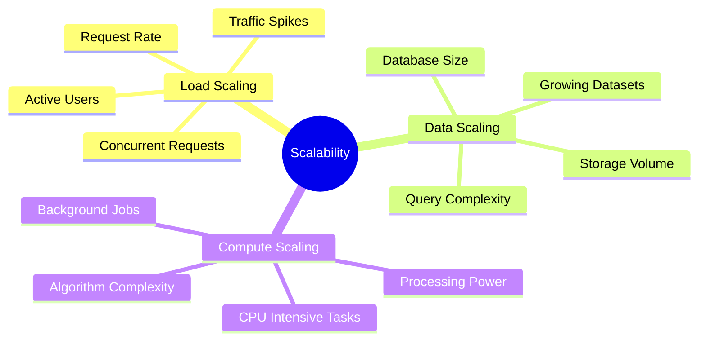

#### 1. Load Scaling
Handling increasing numbers of **concurrent requests** from users.

**Examples**:
- Supporting 100 users simultaneously → 100,000 users
- Processing 10 requests/second → 10,000 requests/second
- Black Friday traffic surges

#### 2. Data Scaling
Managing **growing datasets** as your application stores more information.

**Examples**:
- Database grows from 1GB → 1TB → 1PB
- User-generated content accumulation
- Transaction history retention
- Log data growth

#### 3. Compute Scaling
Handling increasing **processing complexity** and computational requirements.

**Examples**:
- Machine learning model training
- Video transcoding
- Complex analytics queries
- Real-time data processing

### The Key Performance Goal

```yaml
Scalability_Objective:
  Goal: "Maintain performance metrics as demand grows"

  Performance_Metrics:
    Response_Time: "< 200 milliseconds"
    Throughput: "10,000+ requests/second"
    Error_Rate: "< 0.1%"
    Availability: "99.9%+ uptime"

  Challenge: "Meet these metrics at 10 users AND 10 million users"
```

**The Definition**: Scalability is maintaining your performance SLAs (Service Level Agreements) even as load, data, and compute requirements grow exponentially.

---

## Vertical Scaling (Scale Up)

### Definition

**Vertical scaling means making one machine more powerful** by upgrading its hardware resources.

Think of it as **upgrading your computer** - more RAM, faster CPU, bigger SSD. Same machine, more power.

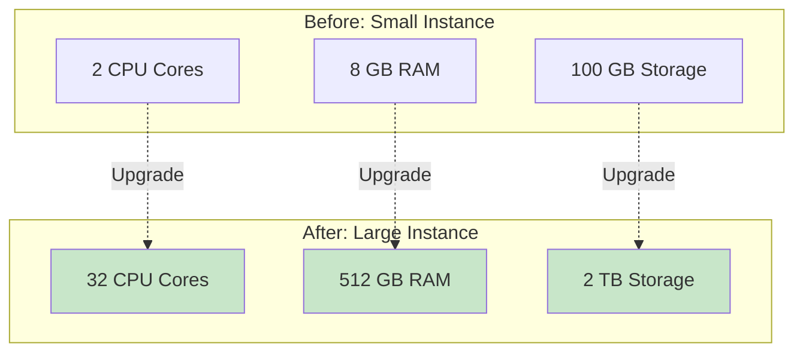

### Real-World Example: AWS Instance Scaling

Amazon Web Services provides a perfect example of vertical scaling capabilities:

| Instance Type | vCPUs | RAM | Use Case | Monthly Cost* |
|--------------|-------|-----|----------|--------------|
| **r6i.large** | 2 | 16 GB | Small apps, development | ~$100 |
| **r6i.xlarge** | 4 | 32 GB | Medium traffic websites | ~$200 |
| **r6i.4xlarge** | 16 | 128 GB | High-traffic applications | ~$800 |
| **r6i.8xlarge** | 32 | 256 GB | Database servers | ~$1,600 |
| **r6i.16xlarge** | 64 | 512 GB | Large databases | ~$3,200 |
| **r6i.24xlarge** | 96 | 768 GB | Enterprise workloads | ~$4,800 |

**Scaling Factor**: From smallest to largest = **48x more powerful**

**Application Code**: Stays exactly the same - zero changes needed!

*Note: Costs are approximate and vary by region and usage patterns.

### Vertical Scaling Architecture

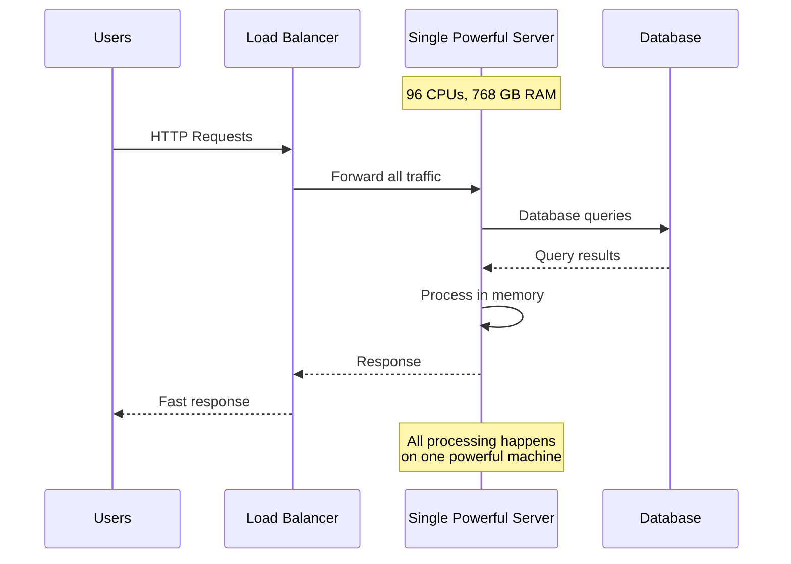

### Advantages of Vertical Scaling

| Advantage | Description | Why It Matters |
|-----------|-------------|----------------|
| **Zero Code Changes** | Application works exactly as-is | No refactoring or redesign needed |
| **Simple Architecture** | One server, one database | Easy to understand and debug |
| **Low Latency** | In-process communication | Microseconds vs milliseconds |
| **ACID Consistency** | Single database maintains full consistency | No distributed data challenges |
| **Easy Debugging** | One log file, one server | 3am troubleshooting is straightforward |
| **Reduced Complexity** | No distributed systems overhead | Fewer moving parts to manage |
| **Immediate Results** | Instant performance boost | Just resize the instance |

### Technical Benefits Deep Dive

#### 1. In-Process Communication
```python
# Vertical Scaling: Same Process
class MonolithicApp:
    def process_order(self, order):
        # All in memory - nanosecond speed
        user = self.user_service.get_user(order.user_id)
        inventory = self.inventory_service.check_stock(order.items)
        payment = self.payment_service.process(order.total)

        # Direct function calls - no network overhead
        return self.create_order(user, inventory, payment)

# Execution time: 0.000001 seconds (1 microsecond)
```

#### 2. Operational Simplicity
```yaml
Monitoring_Requirements:
  Servers: 1
  Log_Files: 1
  Metrics_Sources: 1
  Deployment_Targets: 1

DevOps_Complexity: "Minimal"
Team_Size_Needed: "1-2 engineers"
```

### Disadvantages of Vertical Scaling

| Disadvantage | Description | Real Impact |
|--------------|-------------|-------------|
| **Physical Limits** | Can't scale beyond largest available hardware | Moore's Law is slowing down |
| **Single Point of Failure** | When the server fails, everything fails | High blast radius |
| **Exponential Costs** | Price increases non-linearly with power | 2x power ≠ 2x cost |
| **Downtime for Upgrades** | Must stop server to resize | Planned maintenance windows |
| **Limited Redundancy** | Can't distribute across regions | Geographic constraints |
| **Vendor Lock-in** | Dependent on provider's largest instances | Limited flexibility |

### The Hard Limits

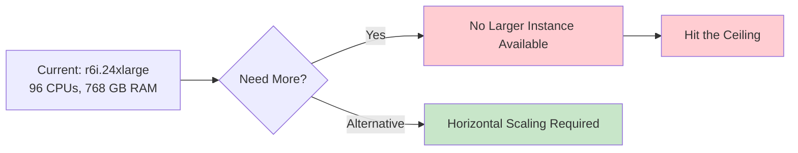

#### Moore's Law Reality

```yaml
Historical_Trend:
  1970s_to_2000s: "CPU power doubled every 18-24 months"
  2010s_to_Present: "Doubling slowed to 36+ months"
  Physical_Limits:
    - Heat dissipation challenges
    - Quantum tunneling effects
    - Fabrication process limits (3nm approaching atomic scale)

Maximum_Available_Power:
  AWS: "96 vCPUs, 768 GB RAM (r6i.24xlarge)"
  Azure: "128 vCPUs, 2 TB RAM (M416s)"
  GCP: "96 vCPUs, 624 GB RAM (n2-highmem-96)"

Reality: "There IS a ceiling, and it's not infinite"
```

### Cost Economics

```python
# AWS r6i instances (approximate pricing)
pricing = {
    "r6i.large":     100,   # 2 CPUs, 16 GB
    "r6i.xlarge":    200,   # 4 CPUs, 32 GB    (2x resources, 2x cost)
    "r6i.4xlarge":   800,   # 16 CPUs, 128 GB  (8x resources, 8x cost)
    "r6i.16xlarge":  3200,  # 64 CPUs, 512 GB  (32x resources, 32x cost)
    "r6i.24xlarge":  4800,  # 96 CPUs, 768 GB  (48x resources, 48x cost)
}

# Linear cost scaling for vertical - but you hit the ceiling fast
```

### When Vertical Scaling Works Best

```yaml
Ideal_Scenarios:
  - Small to medium applications
  - Monolithic architectures
  - Legacy applications not designed for distribution
  - Tight deadlines with limited engineering resources
  - Applications requiring strong ACID consistency
  - In-memory databases (Redis, Memcached)
  - Single-tenant applications

Team_Profile:
  - Small engineering team (< 10 people)
  - Limited DevOps expertise
  - Need to move fast

Example_Use_Cases:
  - Internal company tools
  - MVPs and prototypes
  - Traditional relational databases
  - Development/staging environments
```

---

## Horizontal Scaling (Scale Out)

### Definition

**Horizontal scaling is distributed systems engineering.** Instead of one powerful machine, you coordinate multiple servers working together, with a load balancer directing traffic across them.

Think of it as **hiring more workers** instead of making one worker superhuman.

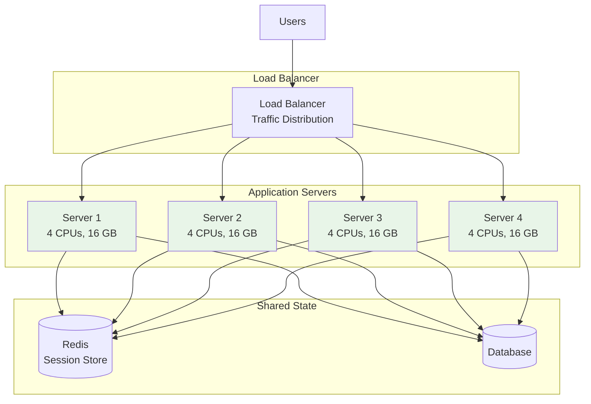

### The Core Requirement: Stateless Architecture

**Critical Principle**: Any server must be able to handle any request.

```python
# BAD: Stateful Architecture (Won't Work Horizontally)
class StatefulServer:
    def __init__(self):
        self.user_sessions = {}  # Stored in memory on THIS server

    def login(self, user_id):
        self.user_sessions[user_id] = create_session()
        return "Session created on Server 1"

    def get_cart(self, user_id):
        # Problem: If request goes to Server 2, session doesn't exist!
        return self.user_sessions.get(user_id)  # KeyError!


# GOOD: Stateless Architecture (Horizontally Scalable)
class StatelessServer:
    def __init__(self):
        self.redis = RedisClient()  # External shared storage

    def login(self, user_id):
        session = create_session()
        self.redis.set(f"session:{user_id}", session)
        return "Session created (accessible from any server)"

    def get_cart(self, user_id):
        # Works from any server - state is external
        return self.redis.get(f"session:{user_id}")
```

### Stateless vs Stateful Comparison

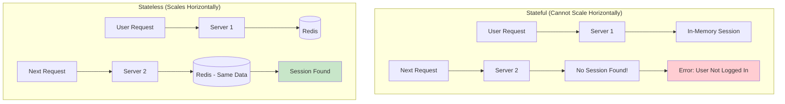

### External State Storage Options

| Storage | Use Case | Example |
|---------|----------|---------|
| **Redis** | User sessions, caching | Session tokens, shopping carts |
| **Memcached** | Simple caching | API responses, computed values |
| **Database** | Persistent data | User profiles, order history |
| **S3/Blob Storage** | File uploads | Images, documents, videos |
| **Message Queues** | Async jobs | RabbitMQ, SQS, Kafka |

### Advantages of Horizontal Scaling

| Advantage | Description | Business Impact |
|-----------|-------------|-----------------|
| **N+1 Redundancy** | Losing one server doesn't impact users | High availability |
| **Unlimited Scaling** | Add more servers indefinitely | No ceiling |
| **Auto-Scaling** | Scale from 1 to 1000 servers based on demand | Cost optimization |
| **Commodity Hardware** | Use cheaper, smaller instances | Lower per-unit costs |
| **Global Distribution** | Deploy across regions worldwide | Reduced latency |
| **Fault Isolation** | One server failure isolated | Graceful degradation |
| **Rolling Deployments** | Update servers one at a time | Zero downtime |

### Auto-Scaling in Action

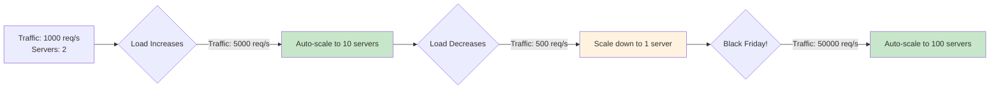

### Netflix Case Study: 1000+ Microservices

**Scale**: Netflix serves over 300 million subscribers worldwide using horizontal scaling.

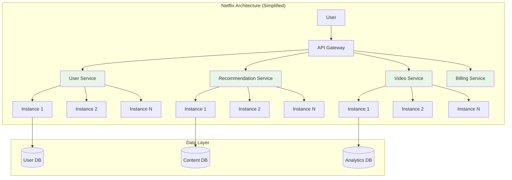

**Netflix Numbers**:
- **1000+ microservices** running in production
- **300+ million subscribers** globally
- **Tens of billions of hours** streamed per year
- **Auto-scales** based on viewing patterns and demand
- **Multi-region deployment** for global low latency

### Disadvantages of Horizontal Scaling

| Disadvantage | Description | Technical Challenge |
|--------------|-------------|---------------------|
| **Distributed Systems Complexity** | CAP theorem, network partitions | Requires expert knowledge |
| **Network Latency** | 0.5-2ms within region, more across regions | Performance overhead |
| **Consistency Challenges** | Eventual consistency vs strong consistency | Data synchronization |
| **Operational Overhead** | Many services to monitor, deploy, secure | DevOps complexity |
| **Testing Complexity** | Integration testing across services | QA challenges |
| **Cascading Failures** | One service failure can cascade | Circuit breakers needed |
| **Higher Initial Costs** | Infrastructure for load balancing, orchestration | Investment required |

### The Distributed Systems Tax

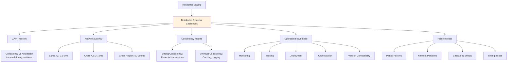

#### CAP Theorem & PACELC

**CAP Theorem**: In the face of network Partitions, choose between Consistency and Availability.

**PACELC Extension**: Even when there's no partition:
- **If** there's a Partition → choose between Availability and Consistency
- **Else** (no partition) → choose between Latency and Consistency

```yaml
CAP_Examples:
  Strong_Consistency:
    Use_Cases: "Banking, payments, authentication"
    Trade_Off: "May sacrifice availability during partitions"
    Example: "PostgreSQL with synchronous replication"

  High_Availability:
    Use_Cases: "Social media feeds, caching, analytics"
    Trade_Off: "Accept eventual consistency"
    Example: "Cassandra, DynamoDB"

  Partition_Tolerance:
    Reality: "Network failures WILL happen"
    Requirement: "Always needed in distributed systems"
```

**Note**: We'll dive deep into CAP theorem, PACELC, and consistency models in future episodes.

#### Network Latency Overhead

```python
# Vertical Scaling: In-Process Call
def get_user_order_summary(user_id):
    user = get_user(user_id)           # 0.000001s (1 microsecond)
    orders = get_orders(user_id)       # 0.000001s
    payments = get_payments(user_id)   # 0.000001s
    # Total: ~3 microseconds

# Horizontal Scaling: Network Calls
def get_user_order_summary(user_id):
    user = user_service.get(user_id)       # 0.001s (1 millisecond)
    orders = order_service.get(user_id)    # 0.001s
    payments = payment_service.get(user_id) # 0.001s
    # Total: ~3 milliseconds
    # That's 1000x slower than in-process!
```

**Network Latency by Region**:
```yaml
Within_Same_AZ:      "0.5 - 2 milliseconds"
Across_AZs:          "2 - 10 milliseconds"
Same_Region:         "10 - 20 milliseconds"
Cross_Region_US:     "50 - 100 milliseconds"
US_to_Europe:        "80 - 150 milliseconds"
US_to_Asia:          "150 - 300 milliseconds"
```

#### Operational Complexity Growth

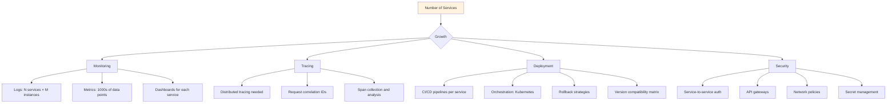

**Team Size Impact**:
```yaml
Small_Scale:
  Services: "1-5"
  Servers: "5-20"
  Team: "2-5 engineers"
  Overhead: "Manageable"

Medium_Scale:
  Services: "10-50"
  Servers: "50-200"
  Team: "10-30 engineers"
  Overhead: "Requires dedicated DevOps"

Large_Scale:
  Services: "100-1000+"
  Servers: "1000s"
  Team: "50-500+ engineers"
  Overhead: "Platform engineering teams needed"
```

---

## Decision Matrix: Vertical vs Horizontal

### Core Engineering Trade-offs

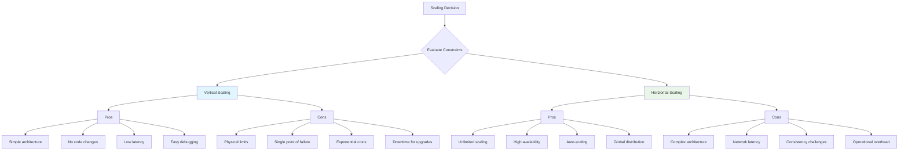

### Comparison Table

| Aspect | Vertical Scaling | Horizontal Scaling |
|--------|------------------|-------------------|
| **Complexity** | Simple - one server | Complex - distributed systems |
| **Latency** | Nanoseconds (in-process) | Milliseconds (network calls) |
| **Scaling Limit** | Physical hardware ceiling | Theoretically unlimited |
| **Cost Model** | Exponential per unit | Linear per unit |
| **Availability** | Single point of failure | N+1 redundancy |
| **Consistency** | Easy - single database | Complex - distributed data |
| **Code Changes** | None required | Requires stateless design |
| **Team Size** | Small (1-10) | Large (10-100+) |
| **DevOps Skill** | Basic | Advanced (Kubernetes, monitoring) |
| **Failure Impact** | Total system down | Graceful degradation |
| **Deployment** | Downtime required | Zero-downtime rolling updates |
| **Best For** | Monoliths, databases | Microservices, web apps |

### Decision Framework

```yaml
Choose_Vertical_When:
  Project_Characteristics:
    - Small to medium application
    - MVP or prototype phase
    - Legacy application not designed for distribution
    - Predictable traffic patterns
    - Strong consistency requirements

  Team_Characteristics:
    - Small team (< 10 developers)
    - Limited DevOps expertise
    - Tight deadlines
    - Budget constraints

  Technical_Requirements:
    - Low latency critical (< 10ms)
    - ACID compliance needed
    - Simple operational model preferred
    - Current scale < 100,000 users

Choose_Horizontal_When:
  Project_Characteristics:
    - Large, complex application
    - Global platform
    - Unpredictable traffic spikes
    - Need for rapid growth
    - High availability requirements (99.9%+)

  Team_Characteristics:
    - Large team (> 20 developers)
    - Multiple autonomous teams
    - Strong DevOps culture
    - Long-term product vision

  Technical_Requirements:
    - Need to scale beyond one machine's capacity
    - Geographic distribution needed
    - Zero-downtime deployments required
    - Fault tolerance critical
    - Scale > 100,000 concurrent users
```

### Quick Decision Tree

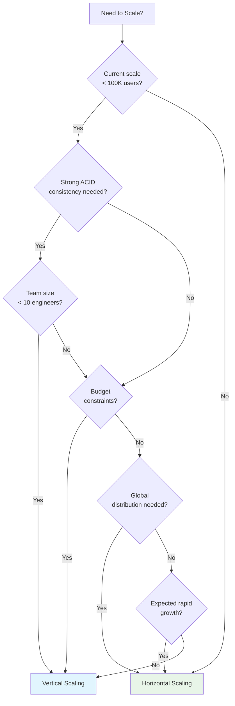

---

## Hybrid Approach: The Best of Both Worlds

In practice, **most successful systems don't choose just one approach**. They use vertical scaling for some components and horizontal scaling for others.

### Hybrid Architecture Pattern

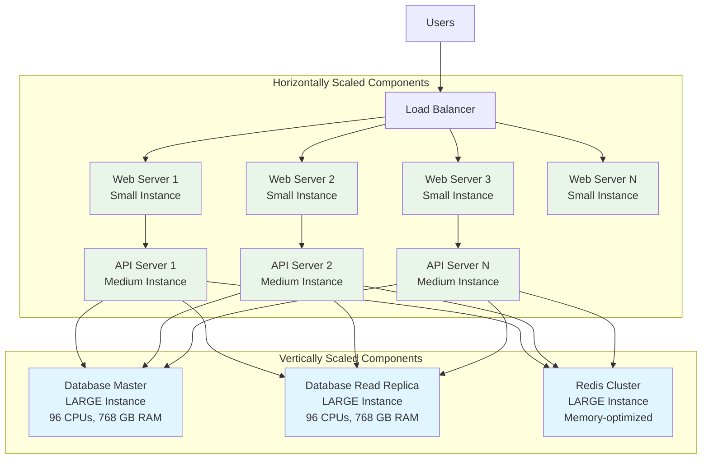

### Hybrid Strategy Breakdown

**Horizontally Scale** (Many small instances):
- Web servers (stateless)
- API servers (stateless)
- Microservices
- Worker processes
- Background job processors

**Vertically Scale** (Few powerful instances):
- Database masters (write operations)
- In-memory caches (Redis, Memcached)
- Search engines (Elasticsearch)
- Write-heavy services
- Services requiring strong consistency

### Real-World Hybrid Example

```yaml
E_Commerce_Platform:
  Horizontal_Components:
    Web_Servers:
      Instance: "t3.medium (2 vCPU, 4 GB)"
      Count: "10-100 instances (auto-scaled)"
      Cost_Per_Instance: "$30/month"
      Use_Case: "Serve static pages, handle user requests"

    API_Servers:
      Instance: "c5.xlarge (4 vCPU, 8 GB)"
      Count: "20-200 instances (auto-scaled)"
      Cost_Per_Instance: "$120/month"
      Use_Case: "Business logic, stateless operations"

    Worker_Processes:
      Instance: "t3.small (2 vCPU, 2 GB)"
      Count: "5-50 instances (auto-scaled)"
      Cost_Per_Instance: "$15/month"
      Use_Case: "Email sending, image processing"

  Vertical_Components:
    Database_Master:
      Instance: "r6i.8xlarge (32 vCPU, 256 GB)"
      Count: "1 instance"
      Cost: "$1,600/month"
      Use_Case: "Handle all write operations"

    Database_Replicas:
      Instance: "r6i.4xlarge (16 vCPU, 128 GB)"
      Count: "2-3 instances"
      Cost: "$800/month each"
      Use_Case: "Handle read operations, reporting"

    Redis_Cache:
      Instance: "r6g.2xlarge (8 vCPU, 64 GB)"
      Count: "1 instance"
      Cost: "$400/month"
      Use_Case: "Session storage, caching"
```

### Benefits of Hybrid Approach

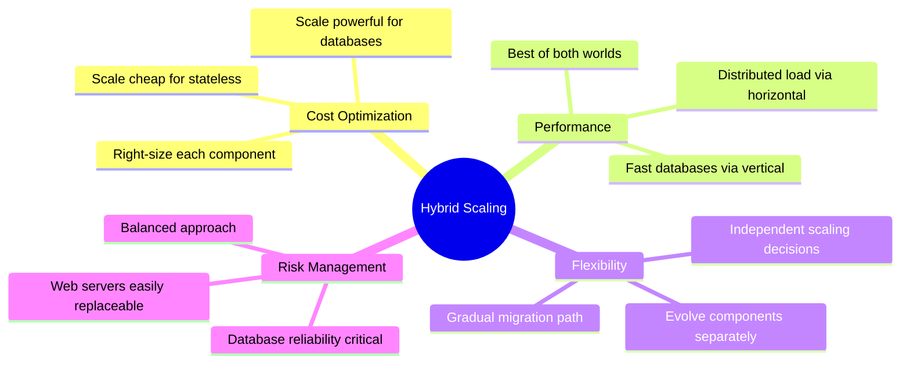

### Evolution Path: Start Vertical, Add Horizontal

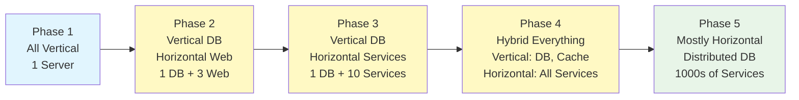

### Practical Example: Web App Architecture

```yaml
Startup_Architecture:
  # Year 1: All Vertical
  Year_1:
    Setup: "Single powerful server"
    Instance: "1x r6i.4xlarge"
    Cost: "$800/month"
    Users: "< 10,000"

  # Year 2: Hybrid Emerging
  Year_2:
    Database: "1x r6i.8xlarge (vertical)"
    Web_Servers: "5x t3.medium (horizontal)"
    Cost: "$1,600 + $150 = $1,750/month"
    Users: "10,000 - 100,000"

  # Year 3: Mature Hybrid
  Year_3:
    Database: "1x r6i.16xlarge + 2x r6i.8xlarge replicas (vertical)"
    Web_Servers: "20x t3.medium (horizontal, auto-scaled)"
    API_Servers: "30x c5.xlarge (horizontal, auto-scaled)"
    Cache: "1x r6g.4xlarge (vertical)"
    Workers: "10x t3.small (horizontal)"
    Cost: "$3,200 + $3,200 + $600 + $3,600 + $800 + $150 = $11,550/month"
    Users: "100,000 - 1,000,000"
```

---

## Netflix Case Study: Evolution from Vertical to Horizontal

Netflix's scaling journey perfectly illustrates the evolution from vertical to horizontal scaling as a company grows.

### Phase 1: The DVD Era (1997-2008) - Vertical Scaling

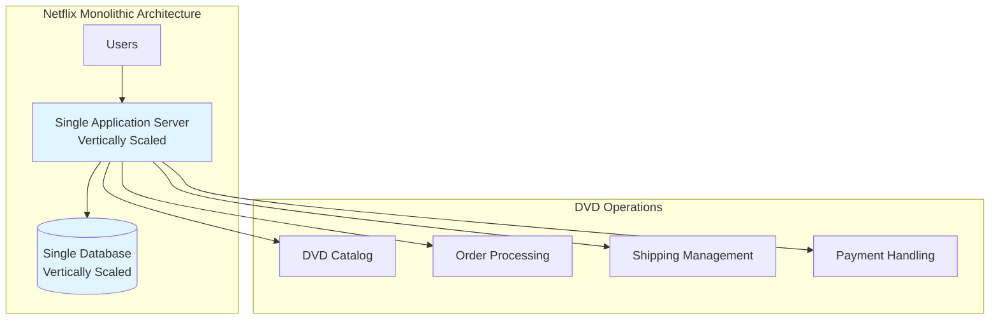

**Characteristics**:
- Traditional monolithic application
- Single large database
- Vertical scaling for growth
- Simpler times, simpler architecture

**Scale**:
- Thousands of users
- DVD catalog management
- Order processing
- Predictable traffic

### Phase 2: Streaming Begins (2007-2011) - Transition Period

**Challenges**:
- Exponential user growth
- Streaming video demands
- Global expansion
- 24/7 uptime requirements

**The Breaking Point**:
```yaml
Problems_Faced:
  Database_Corruption: "3-day outage in 2008"
  Scaling_Limits: "Single database couldn't handle load"
  Deployment_Risk: "Every update risked entire system"
  Geographic_Limits: "Couldn't serve global users efficiently"

Decision: "Re-architect for horizontal scaling"
```

### Phase 3: Cloud Migration (2008-2016) - Horizontal Transformation

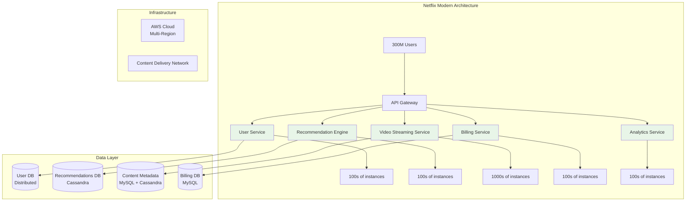

**The Migration Journey**:

| Year | Milestone | Architecture Change |
|------|-----------|-------------------|
| **2008** | Database corruption incident | Decision to move to cloud |
| **2009** | Start AWS migration | Begin extracting services |
| **2010** | Partial cloud deployment | Hybrid on-premise + cloud |
| **2011** | Major service extraction | 100+ microservices |
| **2012** | Global expansion | Multi-region deployment |
| **2015** | Full cloud migration | Datacenter closure |
| **2016** | Microservices maturity | 1000+ microservices |

### Current Netflix Architecture (2024)

```yaml
Scale_Numbers:
  Subscribers: "300+ million globally"
  Microservices: "1000+ services"
  Daily_Streaming: "Billions of hours per year"
  AWS_Instances: "Tens of thousands"
  Regions: "Deployed across multiple AWS regions"
  Traffic: "Accounts for 15% of global internet bandwidth"

Key_Services:
  User_Service:
    Responsibility: "Authentication, profiles, preferences"
    Instances: "100s"
    Database: "MySQL + EVCache"

  Recommendation_Service:
    Responsibility: "Personalized content suggestions"
    Instances: "1000s"
    Database: "Cassandra"
    Tech: "Machine learning models"

  Video_Streaming_Service:
    Responsibility: "Video delivery, adaptive bitrate"
    Instances: "1000s"
    Tech: "CDN + Edge locations"

  Billing_Service:
    Responsibility: "Subscriptions, payments"
    Instances: "100s"
    Database: "MySQL"
    Requirements: "Strong consistency, ACID compliance"

  Analytics_Service:
    Responsibility: "Viewing patterns, A/B testing"
    Instances: "1000s"
    Database: "S3 + Redshift"

Scaling_Strategies:
  Auto_Scaling: "Based on viewing patterns"
  Peak_Hours: "Evening hours in each timezone"
  Event_Based: "New show releases spike traffic 10-50x"
  Geographic: "Scale up regions based on local demand"
  Chaos_Engineering: "Netflix Chaos Monkey tests failure scenarios"
```

### Netflix's Scaling Innovations

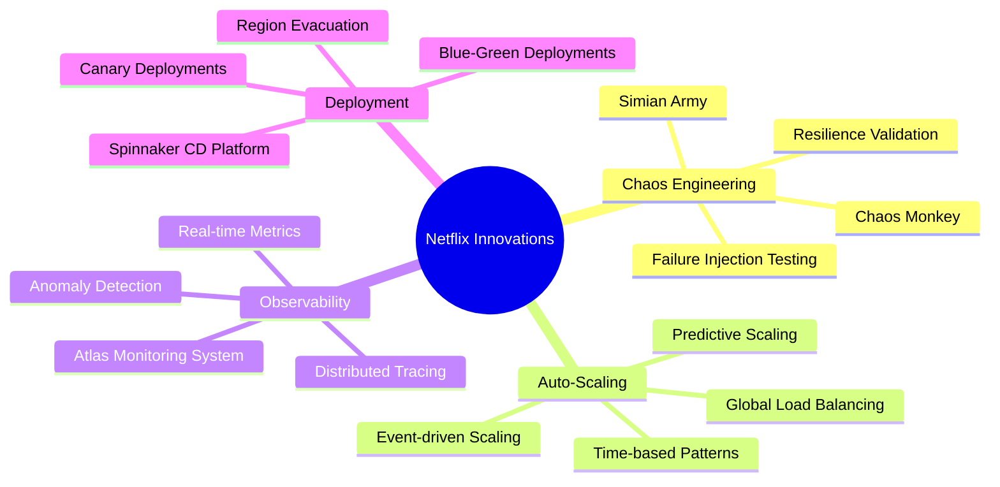

### Key Takeaways from Netflix's Journey

**1. Start Simple, Evolve as Needed**
```yaml
Netflix_Lesson_1:
  Mistake: "Don't build for 300M users when you have 300"
  Wisdom: "Vertical scaling worked fine for DVD era"
  Evolution: "Migrated when business demands required it"
```

**2. Embrace Failure**
```yaml
Netflix_Lesson_2:
  Chaos_Engineering: "Intentionally break things to find weaknesses"
  Chaos_Monkey: "Randomly terminates instances in production"
  Goal: "Build systems that survive failures"
```

**3. Gradual Migration**
```yaml
Netflix_Lesson_3:
  Timeline: "7+ years to fully migrate"
  Approach: "Strangler fig pattern - gradually extract services"
  Risk_Management: "Hybrid architecture during transition"
```

**4. Observability is Critical**
```yaml
Netflix_Lesson_4:
  Challenge: "1000s of services hard to monitor"
  Solution: "Comprehensive observability platform"
  Tools: "Atlas, Vizceral, Hystrix, Turbine"
```

---

## Monitoring & Metrics: Making Scaling Decisions

You can't scale what you don't measure. Before making scaling decisions, you need **comprehensive visibility** into your system's performance.

### Key Metrics to Monitor

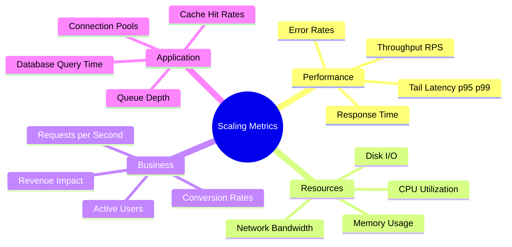

### Tail Latency: The Hidden Problem

**Why averages lie**:

```python
# Misleading Average
requests = [10, 12, 11, 13, 9, 10, 2500]  # milliseconds
average = sum(requests) / len(requests)    # = 366ms

print(f"Average response time: {average}ms")  # Looks terrible!

# Reality: 6 out of 7 requests were fast
# But one slow request skews the average

# Percentiles tell the truth
p50 = 11ms   # Median - 50% of users
p95 = 13ms   # 95% of users experience this or better
p99 = 2500ms # Slowest 1% of users
```

**Percentile Importance**:

| Percentile | What It Means | Why It Matters |
|-----------|---------------|----------------|
| **p50 (Median)** | Half of requests faster, half slower | Typical user experience |
| **p95** | 95% of requests faster | Most users experience this |
| **p99** | 99% of requests faster | Tail latency, outlier detection |
| **p99.9** | 99.9% of requests faster | Critical for high-scale systems |

**Netflix's Standard**: Focus on **p99 latency** because 1% of 300 million users = 3 million unhappy users!

### Monitoring Dashboard Example

```yaml
System_Health_Dashboard:
  Performance_Metrics:
    Response_Time:
      p50: "< 100ms"
      p95: "< 200ms"
      p99: "< 500ms"
      Alert_When: "p99 > 1000ms for 5 minutes"

    Throughput:
      Current: "5,000 requests/second"
      Peak_Capacity: "10,000 requests/second"
      Alert_When: "Approaching 80% capacity"

    Error_Rate:
      Target: "< 0.1%"
      Current: "0.05%"
      Alert_When: "> 0.5%"

  Resource_Metrics:
    CPU_Usage:
      Current: "45%"
      Alert_When: "> 70% sustained for 5 minutes"
      Scale_Out_Trigger: "> 75%"

    Memory_Usage:
      Current: "60%"
      Alert_When: "> 85%"
      Scale_Up_Trigger: "> 80% sustained"

    Database_Connections:
      Used: "150 / 200"
      Alert_When: "> 180"

  Business_Metrics:
    Active_Users: "12,000 concurrent"
    Requests_per_Second: "5,000 RPS"
    Revenue_per_Hour: "$50,000"
    Impact_of_Downtime: "$50,000 per hour lost"
```

### Scaling Triggers: When to Scale

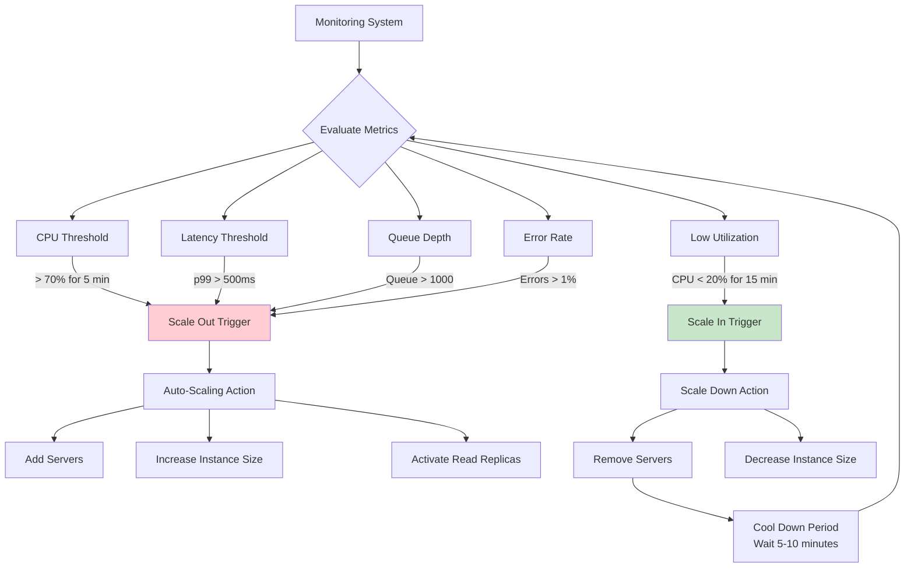

### Common Scaling Triggers

```yaml
Scale_Out_Triggers:
  CPU_Based:
    Trigger: "CPU > 70-80% sustained for 5 minutes"
    Action: "Add instances"
    Cool_Down: "5 minutes before next scale"

  Latency_Based:
    Trigger: "p95 latency > SLA threshold"
    Example: "p95 > 200ms for 3 minutes"
    Action: "Add instances or scale up"

  Request_Rate:
    Trigger: "Approaching capacity limits"
    Example: "Current RPS > 80% of max capacity"
    Action: "Preemptive scaling"

  Queue_Depth:
    Trigger: "Background job queue growing"
    Example: "Queue length > 1000 jobs"
    Action: "Add worker instances"

  Time_Based:
    Trigger: "Known traffic patterns"
    Example: "Scale up at 8am, down at 10pm"
    Action: "Predictive scaling"

Scale_In_Triggers:
  Low_Utilization:
    Trigger: "CPU < 20% for 15 minutes"
    Action: "Remove instances (min threshold: 2 instances)"
    Cool_Down: "10 minutes (longer than scale out)"

  Off_Peak_Hours:
    Trigger: "Known low-traffic periods"
    Example: "3am - 6am"
    Action: "Scale down to minimum capacity"

  Cost_Optimization:
    Trigger: "Weekend or holiday traffic drops"
    Action: "Reduce to 50% capacity"
```

### Monitoring Tools Ecosystem

```yaml
Popular_Monitoring_Solutions:
  Application_Performance:
    - DataDog: "Full-stack monitoring and APM"
    - New Relic: "Application performance monitoring"
    - AppDynamics: "Business transaction monitoring"

  Infrastructure:
    - Prometheus: "Time-series metrics collection"
    - Grafana: "Metrics visualization"
    - CloudWatch: "AWS native monitoring"
    - Azure Monitor: "Azure native monitoring"

  Distributed_Tracing:
    - Jaeger: "Open-source distributed tracing"
    - Zipkin: "Distributed tracing system"
    - AWS X-Ray: "AWS distributed tracing"

  Logging:
    - ELK Stack: "Elasticsearch, Logstash, Kibana"
    - Splunk: "Log analysis and SIEM"
    - Loki: "Log aggregation by Grafana"

  Alerting:
    - PagerDuty: "Incident response platform"
    - Opsgenie: "Alert and on-call management"
    - Slack/Discord: "Team notifications"
```

---

## Cost Analysis: Vertical vs Horizontal

Understanding the economics of scaling is critical for making informed decisions.

### Cost Comparison: Early Stage

```yaml
Scenario_1_Small_Application:
  Traffic: "1,000 concurrent users"
  Requests: "100 requests/second"

  Vertical_Approach:
    Instance: "1x r6i.2xlarge (8 vCPU, 64 GB)"
    Monthly_Cost: "$400"
    Simplicity: "High"
    Availability: "Single point of failure"

  Horizontal_Approach:
    Instances: "4x t3.xlarge (4 vCPU, 16 GB each)"
    Load_Balancer: "$20"
    Monthly_Cost: "$140 × 4 + $20 = $580"
    Simplicity: "Low (load balancer, orchestration)"
    Availability: "High (N+1 redundancy)"

  Winner: "Vertical - 31% cheaper, simpler"
```

### Cost Comparison: Growth Stage

```yaml
Scenario_2_Medium_Application:
  Traffic: "50,000 concurrent users"
  Requests: "5,000 requests/second"

  Vertical_Approach:
    Instance: "1x r6i.16xlarge (64 vCPU, 512 GB)"
    Monthly_Cost: "$3,200"
    Availability: "Single point of failure (unacceptable)"
    Limit: "Near maximum instance size"

  Horizontal_Approach:
    Web_Servers: "20x t3.medium (2 vCPU, 4 GB)"
    API_Servers: "30x c5.xlarge (4 vCPU, 8 GB)"
    Database: "1x r6i.4xlarge (16 vCPU, 128 GB) + 2x replicas"
    Load_Balancer: "$50"
    Cache: "1x r6g.xlarge (4 vCPU, 32 GB)"
    Monthly_Cost: "$600 + $3,600 + $2,400 + $50 + $200 = $6,850"
    Availability: "High (multiple instances, failover)"
    Scalability: "Can easily add more servers"

  Winner: "Horizontal - better availability, room to grow"
```

### Hidden Costs of Horizontal Scaling

```mermaid
graph TB
    A[Horizontal Scaling Costs] --> B[Infrastructure]
    A --> C[Operations]
    A --> D[Engineering]

    B --> B1[Load Balancers: $20-500/month]
    B --> B2[Service Discovery: Consul, etc.]
    B --> B3[Orchestration: Kubernetes cluster]
    B --> B4[Monitoring: $200-2000/month]
    B --> B5[Network Traffic: Cross-AZ fees]

    C --> C1[DevOps Engineers: $150k+/year]
    C --> C2[On-Call Rotation: 24/7]
    C --> C3[Training: Learning curve]
    C --> C4[Incident Response: Complex debugging]

    D --> D1[Initial Development: Weeks/months]
    D --> D2[Refactoring: Stateless architecture]
    D --> D3[Testing: Integration complexity]
    D --> D4[Maintenance: Ongoing updates]

    style A fill:#fff3e0
```

### Total Cost of Ownership (TCO)

```yaml
TCO_Comparison:
  Vertical_Scaling:
    Infrastructure: "$400-4,800/month"
    DevOps_Team: "1-2 engineers ($150k-300k/year)"
    Monitoring: "$50-200/month"
    Training: "Minimal"
    Development_Time: "0 (no code changes)"

    Annual_TCO_Small: "$10,000-20,000"
    Annual_TCO_Large: "$60,000-100,000"

  Horizontal_Scaling:
    Infrastructure: "$1,000-50,000/month"
    DevOps_Team: "3-10 engineers ($450k-1.5M/year)"
    Monitoring: "$500-5,000/month"
    Service_Mesh: "$100-1,000/month"
    Training: "High (workshops, courses)"
    Development_Time: "2-6 months refactoring"

    Annual_TCO_Small: "$50,000-100,000"
    Annual_TCO_Large: "$500,000-2,000,000+"
```

### Cost Optimization Strategies

**For Vertical Scaling**:
```yaml
Optimization_Vertical:
  - Use Reserved Instances (30-70% savings)
  - Schedule scaling (downsize during off-hours)
  - Right-size instances (don't over-provision)
  - Use Spot Instances for dev/test
  - Monitor and optimize database queries
```

**For Horizontal Scaling**:
```yaml
Optimization_Horizontal:
  - Auto-scaling (scale down when not needed)
  - Use Spot Instances for stateless workloads
  - Kubernetes pod autoscaling
  - Cache aggressively to reduce backend load
  - Use CDN for static assets
  - Implement request throttling
  - Optimize container images (smaller = cheaper)
```

### Break-Even Analysis

```mermaid
graph LR
    A[0-10K Users<br/>Vertical Wins] --> B[10K-100K Users<br/>Transition Zone]
    B --> C[100K-1M Users<br/>Horizontal Wins]
    C --> D[1M+ Users<br/>Horizontal Required]

    style A fill:#e1f5fe
    style B fill:#fff9c4
    style C fill:#e8f5e8
    style D fill:#e8f5e8
```

**General Guidelines**:
```yaml
Scale_Decision_by_Traffic:
  "< 10,000 users":
    Recommendation: "Vertical"
    Reason: "Lower cost, simpler operations"

  "10,000 - 100,000 users":
    Recommendation: "Start vertical, plan horizontal"
    Reason: "Prepare for migration, but don't over-engineer"

  "100,000 - 1,000,000 users":
    Recommendation: "Hybrid (vertical DB, horizontal services)"
    Reason: "Balance cost and scalability"

  "> 1,000,000 users":
    Recommendation: "Primarily horizontal"
    Reason: "Scale requirements exceed single server"
```

### Downtime Cost Consideration

```yaml
Downtime_Economics:
  E_Commerce:
    Revenue_per_Hour: "$10,000 - $1,000,000"
    Cost_of_1_Hour_Outage: "Lost revenue + reputation damage"
    Vertical_Risk: "Single point of failure = total outage"
    Horizontal_Benefit: "Partial degradation vs total failure"

  SaaS_Platform:
    Customers: "10,000 businesses"
    SLA: "99.9% uptime"
    Penalty: "$100,000 per incident"
    Investment_in_Redundancy: "Justified by SLA penalties"

  Social_Media:
    Users: "Millions"
    Ad_Revenue: "$100,000s per hour"
    User_Trust: "Irreplaceable"
    Availability: "Critical - must be 99.99%+"
```

**Key Insight**: Sometimes spending extra on horizontal scaling and redundancy is **cheaper than the cost of downtime**.

---

## Autoscaling Strategies

Modern scaling is **automated and intelligent**, responding to demand in real-time or even predicting future needs.

### Types of Autoscaling

```mermaid
graph TB
    A[Autoscaling Strategies] --> B[Reactive Autoscaling]
    A --> C[Predictive Autoscaling]
    A --> D[Scheduled Autoscaling]
    A --> E[Serverless Autoscaling]

    B --> B1[Metric-based]
    B --> B2[Responds to actual load]
    B --> B3[Time lag exists]

    C --> C1[ML-based prediction]
    C --> C2[Historical patterns]
    C --> C3[Proactive scaling]

    D --> D1[Time-based rules]
    D --> D2[Known patterns]
    D --> D3[Business schedules]

    E --> E1[Lambda, Cloud Functions]
    E --> E2[Zero to thousands]
    E --> E3[Pay per execution]

    style B fill:#e1f5fe
    style C fill:#e8f5e8
    style D fill:#fff9c4
    style E fill:#f3e5f5
```

### 1. Reactive Autoscaling

**Definition**: Scale in response to metrics breaching thresholds.

```yaml
AWS_Auto_Scaling_Group:
  Min_Instances: 2
  Max_Instances: 100
  Desired_Capacity: 10

  Scale_Out_Policy:
    Metric: "CPUUtilization"
    Threshold: "> 70%"
    Duration: "5 minutes"
    Action: "Add 20% more instances (min +2, max +10)"
    Cool_Down: "300 seconds"

  Scale_In_Policy:
    Metric: "CPUUtilization"
    Threshold: "< 20%"
    Duration: "15 minutes"
    Action: "Remove 10% of instances (min -1)"
    Cool_Down: "600 seconds"
```

**The Time Lag Problem**:

```mermaid
sequenceDiagram
    participant Traffic
    participant Metrics
    participant ASG as Auto-Scaling
    participant AWS
    participant App as New Instance

    Traffic->>Metrics: Spike at 12:00:00
    Note over Traffic,Metrics: CPU hits 80%

    Metrics->>Metrics: Wait 5 minutes<br/>Sustained high CPU
    Note over Metrics: 12:05:00

    Metrics->>ASG: Trigger scale-out
    ASG->>AWS: Launch new instance

    AWS->>AWS: Provision instance<br/>(1-3 minutes)
    Note over AWS: 12:06:00-12:08:00

    AWS->>App: Instance booting
    App->>App: Application startup<br/>(30s-2 minutes)
    Note over App: 12:08:30-12:10:00

    App->>ASG: Health check passing
    ASG->>ASG: Add to load balancer

    Note over Traffic,ASG: Finally ready!<br/>Total lag: 10 minutes
```

**Total Lag Components**:
1. **Metric collection**: 1-5 minutes
2. **Threshold evaluation**: 1-5 minutes
3. **Instance provisioning**: 1-3 minutes
4. **Application startup**: 30 seconds - 5 minutes
5. **Health checks**: 30 seconds - 2 minutes

**Total**: 4-20 minutes from spike to capacity

### 2. Predictive Autoscaling

**Definition**: Use machine learning to predict traffic and scale proactively.

```yaml
Predictive_Scaling_Example:
  Pattern_Detection:
    - "Monday mornings: 2x traffic at 9am"
    - "Friday afternoons: 0.5x traffic at 4pm"
    - "End of month: 3x traffic (billing cycles)"
    - "Black Friday: 10x traffic all day"

  ML_Model:
    Training_Data: "Historical metrics from past 6 months"
    Prediction_Window: "Next 48 hours"
    Confidence_Level: "85%"

  Proactive_Action:
    Forecast: "Traffic will spike at 9am tomorrow"
    Action: "Scale up at 8:45am (before spike)"
    Benefit: "Zero lag, users experience no slowdown"
```

**AWS Predictive Scaling Configuration**:

```json
{
  "MetricSpecification": {
    "TargetValue": 70.0,
    "PredefinedMetricType": "ASGAverageCPUUtilization"
  },
  "Mode": "ForecastAndScale",
  "SchedulingBufferTime": 600,
  "MaxCapacityBreachBehavior": "IncreaseMaxCapacity"
}
```

### 3. Scheduled Autoscaling

**Definition**: Scale based on known patterns and schedules.

```yaml
E_Commerce_Schedule:
  Weekday_Business_Hours:
    Time: "9am - 5pm"
    Instances: 20
    Reason: "Peak shopping hours"

  Weekday_Off_Hours:
    Time: "5pm - 9am"
    Instances: 5
    Reason: "Low traffic"

  Weekend:
    Time: "Saturday - Sunday"
    Instances: 30
    Reason: "Highest shopping traffic"

  Black_Friday:
    Time: "12am Fri - 11:59pm Fri"
    Instances: 100
    Reason: "Annual peak"

  End_of_Month:
    Time: "28th - 31st"
    Instances: 40
    Reason: "Billing cycle traffic"
```

**Cron-based Scaling Example**:

```yaml
# AWS Auto Scaling Scheduled Actions
Scheduled_Actions:
  - Name: "scale-up-morning"
    Recurrence: "0 8 * * MON-FRI"  # 8am weekdays
    MinSize: 10
    MaxSize: 50
    DesiredCapacity: 20

  - Name: "scale-down-evening"
    Recurrence: "0 18 * * MON-FRI"  # 6pm weekdays
    MinSize: 2
    MaxSize: 20
    DesiredCapacity: 5

  - Name: "black-friday"
    StartTime: "2024-11-29T00:00:00Z"
    EndTime: "2024-11-30T00:00:00Z"
    MinSize: 50
    MaxSize: 200
    DesiredCapacity: 100
```

### 4. Serverless Autoscaling

**Definition**: Platform handles scaling automatically, from zero to thousands.

```yaml
AWS_Lambda_Autoscaling:
  Scaling_Model: "Per-request"
  Min_Instances: 0
  Max_Instances: 1000 (configurable)

  Scaling_Behavior:
    - Request arrives → Lambda spins up function
    - No requests → Scales to zero (no cost)
    - 1000 concurrent requests → 1000 instances

  Cold_Start_Issue:
    First_Request: "500ms - 2 seconds delay"
    Warm_Instances: "< 10ms"
    Mitigation: "Provisioned concurrency (keep N instances warm)"

  Cost_Model:
    Free_Tier: "1M requests/month"
    Per_Request: "$0.20 per 1M requests"
    Per_GB_Second: "$0.0000166667"
```

**Serverless Platforms**:

| Platform | Provider | Scaling | Cold Start | Best For |
|----------|----------|---------|------------|----------|
| **AWS Lambda** | Amazon | 0-1000+ | 100ms-2s | Event-driven, APIs |
| **Cloud Functions** | Google | 0-3000+ | 100ms-1s | HTTP triggers, Pub/Sub |
| **Azure Functions** | Microsoft | 0-200+ | 100ms-3s | Event processing |
| **Cloud Run** | Google | 0-1000+ | 50ms-500ms | Containerized apps |
| **Fargate** | Amazon | 0-1000s | 1-3 minutes | Container workloads |

### Kubernetes Horizontal Pod Autoscaler (HPA)

```yaml
apiVersion: autoscaling/v2
kind: HorizontalPodAutoscaler
metadata:
  name: web-app-hpa
spec:
  scaleTargetRef:
    apiVersion: apps/v1
    kind: Deployment
    name: web-app

  minReplicas: 3
  maxReplicas: 100

  metrics:
  - type: Resource
    resource:
      name: cpu
      target:
        type: Utilization
        averageUtilization: 70

  - type: Resource
    resource:
      name: memory
      target:
        type: Utilization
        averageUtilization: 80

  - type: Pods
    pods:
      metric:
        name: http_requests_per_second
      target:
        type: AverageValue
        averageValue: "1000"

  behavior:
    scaleUp:
      stabilizationWindowSeconds: 60
      policies:
      - type: Percent
        value: 50
        periodSeconds: 60
      - type: Pods
        value: 5
        periodSeconds: 60
      selectPolicy: Max

    scaleDown:
      stabilizationWindowSeconds: 300
      policies:
      - type: Percent
        value: 10
        periodSeconds: 60
```

### Autoscaling Best Practices

```yaml
Best_Practices:
  Avoid_Flapping:
    Problem: "Scale up, scale down, scale up repeatedly"
    Solution: "Longer stabilization window for scale-down"
    Example: "Scale out in 1 min, scale in after 10 min"

  Health_Checks:
    Startup_Probe: "Wait for app to be ready before traffic"
    Liveness_Probe: "Restart unhealthy containers"
    Readiness_Probe: "Remove from load balancer if failing"

  Gradual_Scaling:
    Avoid: "0 to 100 instances instantly"
    Instead: "Scale by 20-50% increments"
    Reason: "Prevent overwhelming dependencies"

  Min_Capacity:
    Never_Scale_to_Zero: "Always keep 2+ instances for availability"
    Exception: "Serverless for infrequent workloads"

  Multi_Metric:
    Use_Multiple_Signals: "CPU + Memory + Request Rate"
    Avoid: "Scaling on single metric"
```

---

## Interview Cheat Sheet: Scaling System Design

When asked to design a scalable system in interviews, use this framework to quickly propose appropriate solutions based on scale.

### The Scaling Framework

```mermaid
graph TB
    A[System Design Question] --> B{User Scale?}

    B -->|< 100K| C[Small Scale]
    B -->|100K - 1M| D[Medium Scale]
    B -->|> 1M| E[Large Scale]

    C --> C1[Simple & Vertical]
    D --> D1[Hybrid Approach]
    E --> E1[Distributed & Horizontal]

    C1 --> C2[Single Server<br/>DB Tuning<br/>Basic Caching<br/>CDN]

    D1 --> D2[Load Balancer<br/>Multi Web Servers<br/>DB Replicas<br/>Distributed Cache<br/>Auto-scaling]

    E1 --> E2[Microservices<br/>Multi-region<br/>DB Sharding<br/>Advanced Caching<br/>Global CDN]

    style C fill:#e1f5fe
    style D fill:#fff9c4
    style E fill:#e8f5e8
```

### Small Scale (< 100,000 Users)

**Approach**: **Keep it simple. Start vertical.**

```yaml
Architecture:
  Users: "< 100,000"
  Traffic: "< 1,000 requests/second"

  Components:
    - Single powerful server (vertical scaling)
    - Single database with indexes
    - Basic caching (Redis)
    - CDN for static assets

  Diagram:
    Users → CDN (static files)
    Users → Web Server (1 powerful instance)
    Web Server → Redis Cache
    Web Server → PostgreSQL Database

  Optimizations:
    - Database indexing
    - Query optimization
    - Application-level caching
    - CDN for images/CSS/JS

  Cost: "$200-500/month"
  Team: "1-3 engineers"
  Complexity: "Low"
```

**Interview Talking Points**:
- "For this scale, I'd start with a single powerful server to keep things simple"
- "We can vertically scale the database and application server as needed"
- "Add Redis for caching frequently accessed data"
- "Use a CDN like CloudFront for static assets"
- "Focus on code optimization and database tuning before distributing"

### Medium Scale (100,000 - 1 Million Users)

**Approach**: **Introduce horizontal scaling for stateless parts.**

```yaml
Architecture:
  Users: "100,000 - 1,000,000"
  Traffic: "1,000 - 10,000 requests/second"

  Components:
    Load_Balancer: "Application Load Balancer"

    Web_Tier:
      - Multiple web servers (horizontal)
      - Auto-scaling group (5-20 instances)
      - Stateless design

    Application_Tier:
      - Multiple API servers (horizontal)
      - Auto-scaling group (10-50 instances)

    Data_Tier:
      - Database master (vertical - powerful instance)
      - Database read replicas (2-3 instances)
      - Distributed cache (Redis cluster)

    Storage:
      - S3 for file uploads
      - CloudFront CDN

  Diagram:
    Users → CloudFront CDN
    Users → Application Load Balancer
    ALB → Web Servers (5-20)
    Web Servers → API Servers (10-50)
    API Servers → Redis Cluster
    API Servers → DB Master (writes)
    API Servers → DB Read Replicas (reads)
    API Servers → S3 (file storage)

  Cost: "$2,000-10,000/month"
  Team: "5-15 engineers"
  Complexity: "Medium"
```

**Interview Talking Points**:
- "At this scale, we need horizontal scaling for the application layer"
- "Keep the database vertically scaled with read replicas for reads"
- "Implement auto-scaling to handle traffic variations"
- "Use distributed caching to reduce database load"
- "Session state goes in Redis, not application servers"
- "Consider separating reads and writes to different database instances"

### Large Scale (1 Million+ Users)

**Approach**: **Fully distributed, multi-region, microservices architecture.**

```yaml
Architecture:
  Users: "> 1,000,000"
  Traffic: "> 10,000 requests/second"

  Components:
    Global:
      - Multi-region deployment
      - Global load balancing (Route53, Traffic Manager)
      - CDN with edge locations worldwide

    Application_Layer:
      - Microservices architecture
      - Auto-scaling (10-1000s of instances)
      - Service mesh (Istio, Linkerd)
      - API Gateway

    Data_Layer:
      - Database sharding / partitioning
      - Multi-master replication
      - NoSQL for specific use cases (Cassandra, DynamoDB)
      - Event streaming (Kafka)

    Caching_Layer:
      - Multi-level caching
      - Edge caching (CloudFront)
      - Application cache (Redis)
      - Database query cache

    Observability:
      - Distributed tracing (Jaeger)
      - Centralized logging (ELK)
      - Metrics and alerting (Prometheus, Grafana)

  Diagram:
    [Users Worldwide]
           ↓
    [Global CDN + Edge Locations]
           ↓
    [Route53 Geo-routing]
           ↓
    ┌──────────────┬──────────────┬──────────────┐
    │   US-East    │   EU-West    │  Asia-Pacific│
    │              │              │              │
    │ API Gateway  │ API Gateway  │ API Gateway  │
    │      ↓       │      ↓       │      ↓       │
    │ Microservices│ Microservices│ Microservices│
    │ (100s)       │ (100s)       │ (100s)       │
    │      ↓       │      ↓       │      ↓       │
    │ Sharded DB   │ Sharded DB   │ Sharded DB   │
    │ Redis Cache  │ Redis Cache  │ Redis Cache  │
    └──────────────┴──────────────┴──────────────┘

  Cost: "$50,000-500,000+/month"
  Team: "50-500+ engineers"
  Complexity: "Very High"
```

**Interview Talking Points**:
- "At this scale, we need a global, distributed architecture"
- "Deploy across multiple regions to reduce latency for worldwide users"
- "Use microservices to allow independent scaling of different features"
- "Database sharding is critical - partition data by user ID or geography"
- "Implement multi-level caching: edge, application, and database"
- "Use event-driven architecture with message queues for async operations"
- "Chaos engineering to test resilience (Netflix Chaos Monkey approach)"
- "Advanced observability with distributed tracing to debug issues"

### Interview Script Template

```markdown
## When asked: "Design a scalable system for [X]"

Step 1: Clarify Requirements
- "How many users are we expecting? Daily active users?"
- "What's the traffic pattern? Spiky or steady?"
- "Are users global or regional?"
- "What's the read/write ratio?"
- "What are the latency requirements?"

Step 2: Start Simple
- "For the initial version with [small number] users, I'd start with:"
  - Single server architecture
  - Vertical scaling
  - Basic optimizations (indexing, caching)

Step 3: Plan for Scale
- "As we grow to [medium number] users, we'd evolve to:"
  - Horizontal scaling for application servers
  - Read replicas for database
  - Distributed caching
  - Auto-scaling

Step 4: Discuss Large Scale
- "At [large number] users, we'd need:"
  - Microservices architecture
  - Database sharding
  - Multi-region deployment
  - Advanced caching strategies

Step 5: Trade-offs
- "The key trade-off is complexity vs scalability"
- "Vertical scaling is simpler but has limits"
- "Horizontal scaling is unlimited but adds operational overhead"
- "For this use case, I'd recommend [choice] because [reasoning]"
```

### Common Interview Scenarios

#### Scenario 1: Design Twitter

```yaml
Scale: "300M+ users, 500M tweets/day"

Approach:
  Write_Path:
    - Horizontally scaled API servers
    - Message queue for async processing
    - Fan-out to followers' timelines
    - Sharded database for tweets

  Read_Path:
    - CDN for static assets
    - Redis for timeline cache
    - Read replicas for database
    - Pre-computed timelines for heavy users

  Special_Considerations:
    - Celebrity users (millions of followers) need special handling
    - Real-time updates via WebSockets
    - Media storage in S3/CDN
```

#### Scenario 2: Design URL Shortener

```yaml
Scale: "1B URLs shortened, 10B redirects/month"

Approach:
  Small_Scale:
    - Single server
    - PostgreSQL with base62 encoding
    - Redis cache for popular URLs

  Large_Scale:
    - Horizontally scaled API servers
    - Distributed ID generation (Snowflake)
    - Sharded database (partition by URL hash)
    - Multi-level caching
    - CDN for redirects
```

#### Scenario 3: Design Netflix

```yaml
Scale: "300M+ users, billions of streaming hours"

Approach:
  Video_Delivery:
    - Global CDN (edge locations worldwide)
    - Adaptive bitrate streaming
    - Pre-fetching based on viewing patterns

  Microservices:
    - User service
    - Recommendation engine (ML-based)
    - Video catalog service
    - Billing service
    - Analytics service

  Data_Layer:
    - Cassandra for scale
    - S3 for video storage
    - ElasticSearch for search

  Scaling:
    - Auto-scaling based on viewing patterns
    - Predictive scaling for new releases
    - Multi-region for global reach
```

### Key Metrics to Mention in Interviews

```yaml
Always_Discuss:
  Performance:
    - "Target p99 latency < 200ms"
    - "Support X requests per second"
    - "Page load time < 3 seconds"

  Availability:
    - "99.9% uptime SLA"
    - "Multi-AZ for redundancy"
    - "Failover within 5 minutes"

  Scalability:
    - "Support X concurrent users"
    - "Auto-scale from N to M instances"
    - "Handle 10x traffic spikes"

  Consistency:
    - "Eventual consistency acceptable for [use case]"
    - "Strong consistency needed for [use case]"
```

---

## Key Takeaways

### Remember This

- **Scalability has three dimensions**: Load (users), Data (storage), and Compute (processing)
- **Vertical = Scale Up**: More powerful hardware, simpler architecture, physical limits
- **Horizontal = Scale Out**: More servers, distributed systems, theoretically unlimited
- **No silver bullet**: Your choice depends on constraints (team, timeline, requirements)
- **Hybrid is common**: Vertical for databases, horizontal for application servers
- **Start simple**: Don't over-engineer for scale you don't have yet
- **Measure everything**: You can't scale what you don't monitor
- **Tail latency matters**: p99 > average for understanding user experience

### Common Mistakes to Avoid

- **Premature optimization**: Building for 1M users when you have 100
- **Ignoring monitoring**: Scaling blind without metrics
- **Single point of failure**: Not planning for redundancy
- **Forgetting cost**: Horizontal scaling adds infrastructure and operational costs
- **Underestimating complexity**: Distributed systems are hard
- **Network latency blindness**: Ignoring the milliseconds added by network calls
- **Scaling the wrong thing**: Scale bottlenecks, not everything

### The Scaling Journey

```mermaid
graph LR
    A[MVP<br/>Vertical] --> B[Growth<br/>Hybrid]
    B --> C[Scale<br/>Horizontal]
    C --> D[Global<br/>Multi-Region]

    A --> A1[1-10K users<br/>$500/month]
    B --> B1[10K-100K users<br/>$5K/month]
    C --> C1[100K-1M users<br/>$50K/month]
    D --> D1[1M+ users<br/>$500K+/month]

    style A fill:#e1f5fe
    style B fill:#fff9c4
    style C fill:#e8f5e8
    style D fill:#c8e6c9
```

### Decision Framework Summary

**Choose Vertical When**:
- Small team, tight deadline
- Legacy application
- Strong consistency needed
- Budget constraints
- Simple operational model

**Choose Horizontal When**:
- Rapid growth expected
- Global user base
- High availability required
- Scale beyond single server
- Team has DevOps expertise

**Use Hybrid When**:
- Medium to large scale
- Different components have different needs
- Balancing cost and scalability
- Transitioning from vertical to horizontal

### Quick Reference

| Metric | Vertical | Horizontal |
|--------|----------|-----------|
| **Complexity** | Low | High |
| **Latency** | Microseconds | Milliseconds |
| **Limit** | Physical ceiling | Unlimited |
| **Cost/Unit** | Exponential | Linear |
| **Availability** | Low (SPOF) | High (redundancy) |
| **Team Size** | 1-10 | 10-100+ |

---

<div align="center">

[⏮ Previous: Episode 3](../03-functional-nonfunctional-requirements/) | [Course Home](../../) | [⏭ Next: Episode 5](../05-coming-soon/)

</div>
