# Episode 6: Load Balancing in System Design

[](http://youtube.com/@ThatNotesGuy)
[](#)

> **"A load balancer is the traffic cop of your distributed system. It ensures no single server is overwhelmed while others sit idle, enabling both scalability and high availability."**

## What You'll Learn

By the end of this episode, you'll understand:
- ✅ What load balancing is and why it's critical for modern systems
- ✅ The two primary objectives: Scalability and High Availability
- ✅ Health monitoring mechanisms: L4 TCP vs L7 HTTP checks
- ✅ Nine essential load balancing algorithms and when to use each
- ✅ Session persistence strategies: IP Hash vs Cookie-Based
- ✅ Geographic load balancing (GSLB) for global applications
- ✅ Real-world case study: Netflix's multi-layer load balancing architecture
- ✅ Load balancer types: Hardware, Software, and Cloud
- ✅ L4 vs L7 load balancing: key differences and trade-offs
- ✅ Decision framework for choosing the right algorithm

---

## What is Load Balancing and Why It Matters

### Core Definition

A **load balancer** is a traffic distribution system that sits between clients and servers, intelligently routing incoming requests across multiple backend servers.

Think of it as a **restaurant host**:
- Customers (requests) arrive at the entrance
- The host (load balancer) checks which tables (servers) are available
- Distributes customers evenly so no waiter is overwhelmed
- If a table becomes unavailable, redirects customers elsewhere

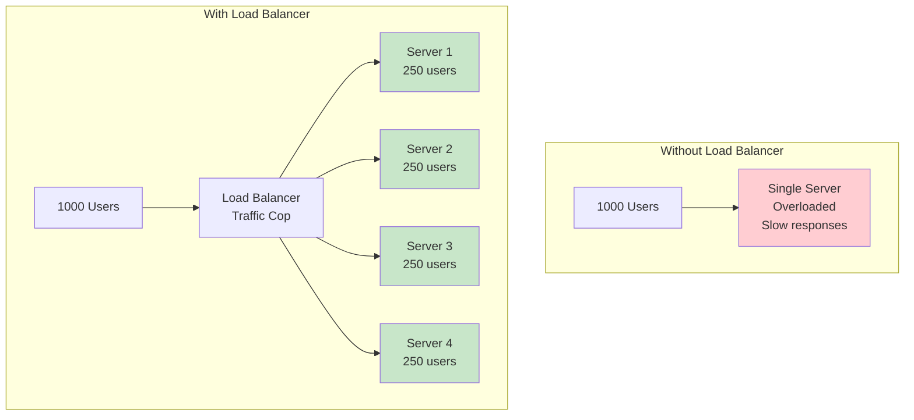
```mermaid
graph TB
    subgraph "Without Load Balancer"
        U1[1000 Users] --> S[Single Server<br/>Overloaded<br/>Slow responses]

        style S fill:#ffcdd2
    end

    subgraph "With Load Balancer"
        U2[1000 Users] --> LB[Load Balancer<br/>Traffic Cop]

        LB --> S1[Server 1<br/>250 users]
        LB --> S2[Server 2<br/>250 users]
        LB --> S3[Server 3<br/>250 users]
        LB --> S4[Server 4<br/>250 users]

        style S1 fill:#c8e6c9
        style S2 fill:#c8e6c9
        style S3 fill:#c8e6c9
        style S4 fill:#c8e6c9
    end
```

### The Problem Load Balancers Solve

**Scenario**: Your startup launches a new app.

```yaml
Day_1:
  Users: 100
  Servers: 1
  Status: "Works perfectly"

Day_30:
  Users: 10000
  Servers: 1
  Status: "Server at 95% CPU, crashing frequently"

Solution_Without_LB:
  Option_1: "Vertical scaling (bigger server)"
  Problem: "Physical limits, expensive, single point of failure"

Solution_With_LB:
  Option_2: "Horizontal scaling (add servers + load balancer)"
  Benefit: "Distribute load, fault tolerance, cost-effective"
  Result: "10 smaller servers behind load balancer"
```

---

## Primary Objectives of Load Balancing

Load balancers serve two critical objectives in modern distributed systems.

### Objective 1: Scalability - Horizontal Scaling

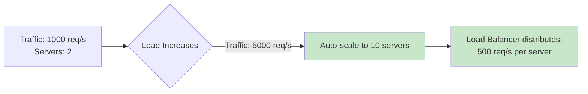
```mermaid
graph LR
    A[Traffic: 1000 req/s<br/>Servers: 2] --> B{Load Increases}
    B -->|Traffic: 5000 req/s| C[Auto-scale to 10 servers]
    C --> D[Load Balancer distributes:<br/>500 req/s per server]

    style C fill:#c8e6c9
    style D fill:#c8e6c9
```

**Why Horizontal Scaling?**

```yaml
Horizontal_Scaling_Benefits:
  Commodity_Hardware:
    - "Use cheap, standard servers instead of expensive specialized hardware"
    - "Example: 10x $200/month servers vs 1x $2000/month server"

  Unlimited_Capacity:
    - "Add servers on demand"
    - "Black Friday spike? Add 100 servers in minutes"

  Cost_Efficiency:
    - "Scale down during off-peak hours"
    - "Pay only for what you use"

  Fault_Isolation:
    - "One server failure = 10% capacity loss (not 100%)"
```

**Traffic Distribution Example**:

```python
# Load Balancer distributes incoming requests

# Without Load Balancer:
single_server_capacity = 1000  # requests per second
incoming_traffic = 5000        # requests per second
result = "Server crashes (500% overload)"

# With Load Balancer:
servers = 10
per_server_traffic = incoming_traffic / servers  # 500 req/s each
per_server_capacity = 1000
result = "All servers running at 50% capacity (healthy)"
```

### Objective 2: High Availability - Fault Tolerance

**High availability** means your system stays operational even when individual components fail.

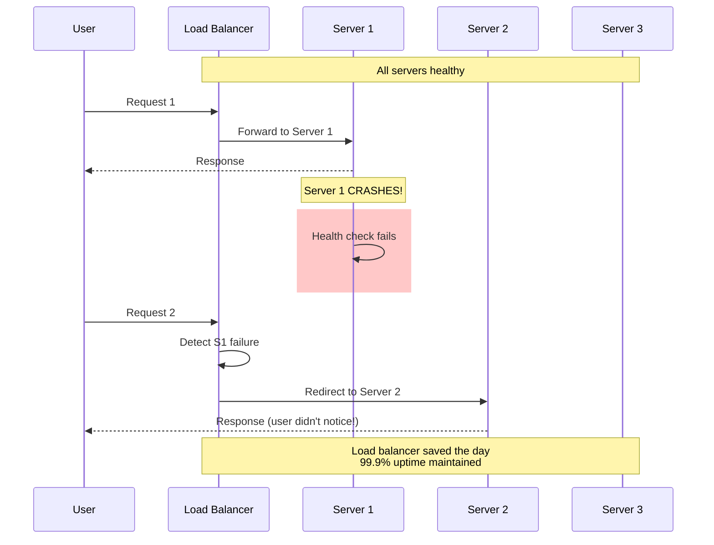
```mermaid
sequenceDiagram
    participant U as User
    participant LB as Load Balancer
    participant S1 as Server 1
    participant S2 as Server 2
    participant S3 as Server 3

    Note over LB,S3: All servers healthy
    U->>LB: Request 1
    LB->>S1: Forward to Server 1
    S1-->>U: Response

    Note over S1: Server 1 CRASHES!
    rect rgb(255, 200, 200)
        S1->>S1: Health check fails
    end

    U->>LB: Request 2
    LB->>LB: Detect S1 failure
    LB->>S2: Redirect to Server 2
    S2-->>U: Response (user didn't notice!)

    Note over LB,S3: Load balancer saved the day<br/>99.9% uptime maintained
```

**High Availability Metrics**:

| Uptime SLA | Downtime per Year | Downtime per Month | Typical Use Case |
|-----------|-------------------|-------------------|------------------|
| **99%** (Two nines) | 3.65 days | 7.31 hours | Internal tools |
| **99.9%** (Three nines) | 8.77 hours | 43.83 minutes | Standard web apps |
| **99.99%** (Four nines) | 52.60 minutes | 4.38 minutes | E-commerce, SaaS |
| **99.999%** (Five nines) | 5.26 minutes | 26.30 seconds | Financial services, critical systems |

**Load balancers enable high availability by**:
- Detecting server failures through health checks
- Automatically routing traffic away from failed servers
- Restoring traffic when servers recover

---

## Health Monitoring: Keeping Servers Healthy

Load balancers continuously monitor backend servers to ensure they're healthy and capable of handling requests.

### Health Check Mechanisms

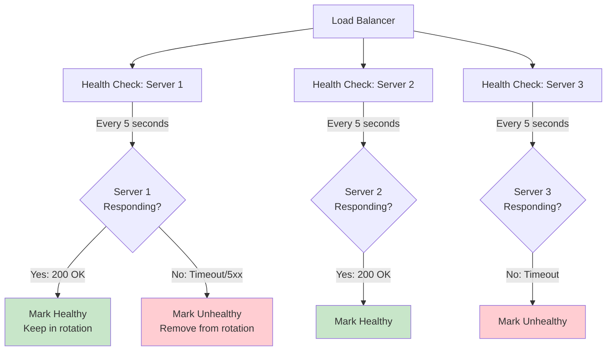
```mermaid
graph TB
    LB[Load Balancer] --> HC1[Health Check: Server 1]
    LB --> HC2[Health Check: Server 2]
    LB --> HC3[Health Check: Server 3]

    HC1 -->|Every 5 seconds| S1{Server 1<br/>Responding?}
    HC2 -->|Every 5 seconds| S2{Server 2<br/>Responding?}
    HC3 -->|Every 5 seconds| S3{Server 3<br/>Responding?}

    S1 -->|Yes: 200 OK| H1[Mark Healthy<br/>Keep in rotation]
    S1 -->|No: Timeout/5xx| U1[Mark Unhealthy<br/>Remove from rotation]

    S2 -->|Yes: 200 OK| H2[Mark Healthy]
    S3 -->|No: Timeout| U3[Mark Unhealthy]

    style H1 fill:#c8e6c9
    style H2 fill:#c8e6c9
    style U1 fill:#ffcdd2
    style U3 fill:#ffcdd2
```

### L4 vs L7 Health Checks

#### Layer 4 (L4) Health Checks - TCP Handshake

**How it works**: Load balancer attempts to establish a TCP connection with the server.

```yaml
L4_TCP_Health_Check:
  Method: "TCP handshake"

  Process:
    Step_1: "Load balancer sends SYN packet"
    Step_2: "Server responds with SYN-ACK (if healthy)"
    Step_3: "Load balancer confirms with ACK"
    Result: "Connection successful = server is alive"

  Check_Interval: "Every 5 seconds"
  Timeout: "2 seconds"
  Failure_Threshold: "3 consecutive failures = mark unhealthy"

  Pros:
    - "Fast (microseconds)"
    - "Low overhead"
    - "Simple to implement"

  Cons:
    - "Only checks if server process is running"
    - "Doesn't verify application is actually working"
    - "Example: Web server running but database connection failed"
```

**TCP Handshake Diagram**:

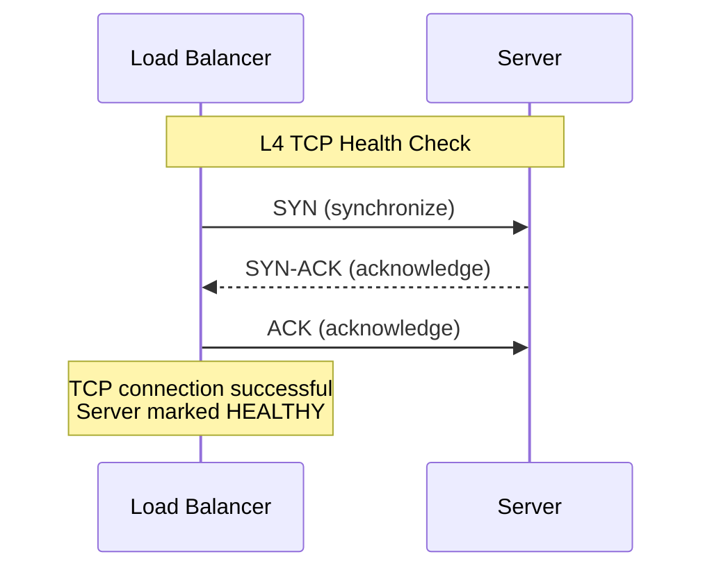
```mermaid
sequenceDiagram
    participant LB as Load Balancer
    participant S as Server

    Note over LB,S: L4 TCP Health Check
    LB->>S: SYN (synchronize)
    S-->>LB: SYN-ACK (acknowledge)
    LB->>S: ACK (acknowledge)

    Note over LB: TCP connection successful<br/>Server marked HEALTHY
```

#### Layer 7 (L7) Health Checks - HTTP/HTTPS

**How it works**: Load balancer sends an HTTP request and validates the response.

```yaml
L7_HTTP_Health_Check:
  Method: "HTTP GET request to specific endpoint"

  Configuration:
    URL: "GET /health"
    Expected_Status: "200 OK"
    Expected_Body: '{"status": "healthy"}'
    Timeout: "5 seconds"
    Interval: "10 seconds"

  Health_Endpoint_Logic:
    Checks:
      - "Database connectivity"
      - "Cache (Redis) connectivity"
      - "Disk space availability"
      - "CPU/memory within thresholds"

    Response:
      Healthy: '{"status": "healthy", "database": "ok", "cache": "ok"}'
      Unhealthy: '{"status": "unhealthy", "database": "connection_failed"}'

  Pros:
    - "Application-level verification"
    - "Can check dependencies (DB, cache, etc.)"
    - "Custom health logic"

  Cons:
    - "Slower (HTTP request/response)"
    - "More overhead on server"
    - "Requires application code to implement /health endpoint"
```

**HTTP Health Check Example**:

```python
# Server-side health check endpoint

from flask import Flask, jsonify
import psycopg2
import redis

app = Flask(__name__)

@app.route('/health')
def health_check():
    health_status = {
        "status": "healthy",
        "checks": {}
    }

    # Check database connection
    try:
        db = psycopg2.connect(host='db.example.com', database='myapp')
        db.close()
        health_status["checks"]["database"] = "ok"
    except Exception as e:
        health_status["status"] = "unhealthy"
        health_status["checks"]["database"] = f"failed: {str(e)}"
        return jsonify(health_status), 503

    # Check Redis cache
    try:
        r = redis.Redis(host='cache.example.com')
        r.ping()
        health_status["checks"]["cache"] = "ok"
    except Exception as e:
        health_status["status"] = "unhealthy"
        health_status["checks"]["cache"] = f"failed: {str(e)}"
        return jsonify(health_status), 503

    # All checks passed
    return jsonify(health_status), 200

# Load balancer receives:
# HTTP/1.1 200 OK
# {"status": "healthy", "checks": {"database": "ok", "cache": "ok"}}
```

### Failover: Automatic Recovery

```yaml
Failover_Process:
  Detection:
    Health_Check: "Server 2 returns 503 Service Unavailable"
    Consecutive_Failures: "3 failed health checks in 15 seconds"
    Action: "Mark Server 2 as UNHEALTHY"

  Immediate_Response:
    Traffic_Routing: "Stop sending requests to Server 2"
    Active_Connections: "Allow existing connections to complete"
    New_Requests: "Route to healthy servers (1, 3, 4)"

  Recovery:
    Monitoring: "Continue health checks every 5 seconds"
    Server_2_Recovers: "Responds 200 OK"
    Consecutive_Successes: "3 successful health checks"
    Action: "Mark Server 2 as HEALTHY, resume traffic"

  Uptime_Impact:
    Without_LB: "Server 2 failure = 100% downtime"
    With_LB: "Server 2 failure = 0% downtime (traffic rerouted)"
    Result: "99.99% uptime achieved"
```

---

## Load Balancing Algorithms

Load balancers use various algorithms to decide which backend server should handle each request. The choice of algorithm significantly impacts performance and user experience.

### 1. Round Robin

**Definition**: Distribute requests sequentially across all servers in rotation.

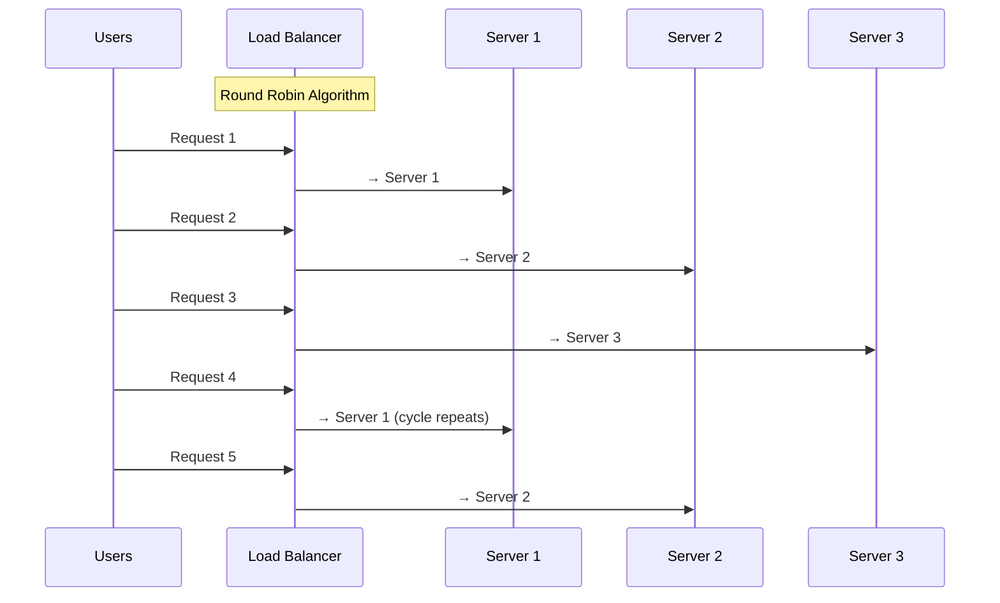
```mermaid
sequenceDiagram
    participant U as Users
    participant LB as Load Balancer
    participant S1 as Server 1
    participant S2 as Server 2
    participant S3 as Server 3

    Note over LB: Round Robin Algorithm

    U->>LB: Request 1
    LB->>S1: → Server 1

    U->>LB: Request 2
    LB->>S2: → Server 2

    U->>LB: Request 3
    LB->>S3: → Server 3

    U->>LB: Request 4
    LB->>S1: → Server 1 (cycle repeats)

    U->>LB: Request 5
    LB->>S2: → Server 2
```

**Characteristics**:

```yaml
Round_Robin:
  Algorithm: "requests % num_servers"

  How_It_Works:
    - "Maintain counter starting at 0"
    - "For each request: send to servers[counter % total_servers]"
    - "Increment counter"

  Advantages:
    Simple: "Easiest algorithm to implement"
    Zero_Overhead: "No state tracking required"
    Default_Choice: "Used by most load balancers as default"
    Even_Distribution: "Perfectly balanced over time"

  Best_For:
    - "Stateless traffic (no session affinity needed)"
    - "Homogeneous servers (all same capacity)"
    - "Short-lived connections (HTTP requests)"

  When_Not_To_Use:
    - "Servers have different capacities"
    - "Long-lived connections (some servers get overloaded)"
    - "Stateful applications requiring sticky sessions"
```

**Example**:

```python
class RoundRobinLoadBalancer:
    def __init__(self, servers):
        self.servers = servers
        self.counter = 0

    def get_next_server(self):
        server = self.servers[self.counter % len(self.servers)]
        self.counter += 1
        return server

# Usage
lb = RoundRobinLoadBalancer(['server1', 'server2', 'server3'])

lb.get_next_server()  # → server1
lb.get_next_server()  # → server2
lb.get_next_server()  # → server3
lb.get_next_server()  # → server1 (cycle repeats)
```

### 2. Weighted Round Robin

**Definition**: Round robin with capacity weights - more powerful servers receive proportionally more traffic.

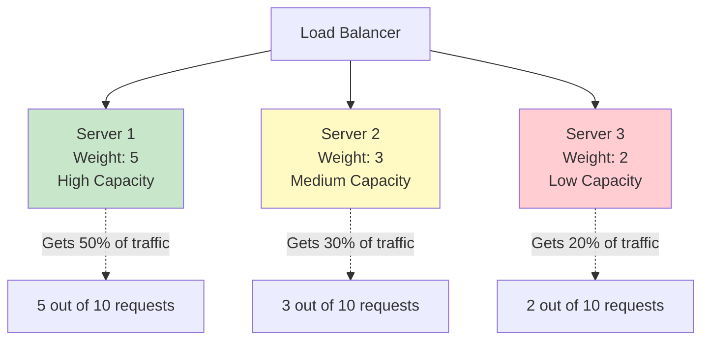
```mermaid
graph TB
    LB[Load Balancer] --> W1[Server 1<br/>Weight: 5<br/>High Capacity]
    LB --> W2[Server 2<br/>Weight: 3<br/>Medium Capacity]
    LB --> W3[Server 3<br/>Weight: 2<br/>Low Capacity]

    W1 -.->|Gets 50% of traffic| T1[5 out of 10 requests]
    W2 -.->|Gets 30% of traffic| T2[3 out of 10 requests]
    W3 -.->|Gets 20% of traffic| T3[2 out of 10 requests]

    style W1 fill:#c8e6c9
    style W2 fill:#fff9c4
    style W3 fill:#ffcdd2
```

**Use Case: Heterogeneous Hardware**

```yaml
Weighted_Round_Robin:
  Scenario: "Mixed server hardware"

  Server_Specs:
    Server_1:
      CPU: "32 cores"
      RAM: "128 GB"
      Weight: 5

    Server_2:
      CPU: "16 cores"
      RAM: "64 GB"
      Weight: 3

    Server_3:
      CPU: "8 cores"
      RAM: "32 GB"
      Weight: 2

  Distribution:
    Total_Weight: 10

    Request_1: "Server 1"
    Request_2: "Server 1"
    Request_3: "Server 1"
    Request_4: "Server 1"
    Request_5: "Server 1"
    Request_6: "Server 2"
    Request_7: "Server 2"
    Request_8: "Server 2"
    Request_9: "Server 3"
    Request_10: "Server 3"
    # Cycle repeats

  Advantages:
    - "Utilize heterogeneous hardware efficiently"
    - "More powerful servers do more work"
    - "Manual capacity assignment"

  Disadvantages:
    - "Requires manual weight configuration"
    - "Doesn't adapt to real-time load"
    - "Fixed weights don't account for varying request complexity"
```

**Configuration Example**:

```nginx
# NGINX Weighted Round Robin Configuration

upstream backend {
    server server1.example.com weight=5;  # Powerful server
    server server2.example.com weight=3;  # Medium server
    server server3.example.com weight=2;  # Smaller server
}

server {
    listen 80;
    location / {
        proxy_pass http://backend;
    }
}
```

### 3. Least Connections

**Definition**: Route requests to the server with the fewest active connections.

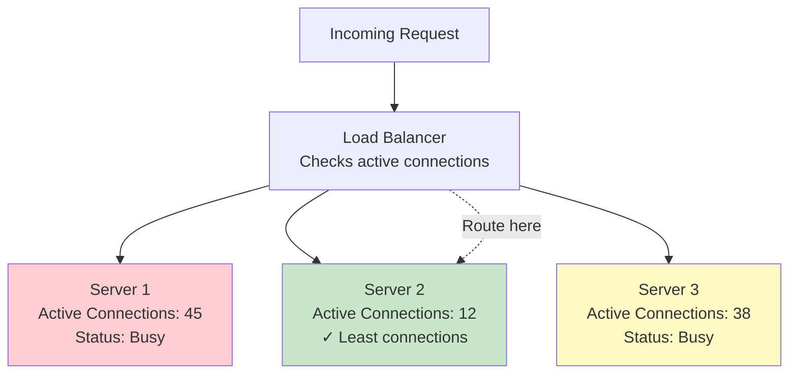
```mermaid
graph TB
    U[Incoming Request] --> LB[Load Balancer<br/>Checks active connections]

    LB --> S1[Server 1<br/>Active Connections: 45<br/>Status: Busy]
    LB --> S2[Server 2<br/>Active Connections: 12<br/>✓ Least connections]
    LB --> S3[Server 3<br/>Active Connections: 38<br/>Status: Busy]

    LB -.->|Route here| S2

    style S2 fill:#c8e6c9
    style S1 fill:#ffcdd2
    style S3 fill:#fff9c4
```

**Why Least Connections?**

Different connections have different durations:

```yaml
Connection_Duration_Problem:
  Round_Robin_Issue:
    Scenario: "Requests have varying processing times"

    Server_1:
      Request_1: "Video upload (10 minutes)"
      Request_4: "Image upload (5 minutes)"
      Request_7: "File download (8 minutes)"
      Total: "3 connections, all long-lived"
      Status: "Overloaded"

    Server_2:
      Request_2: "Simple API call (0.1 seconds)"
      Request_5: "Simple API call (0.1 seconds)"
      Request_8: "Simple API call (0.1 seconds)"
      Total: "3 connections, all completed quickly"
      Status: "Idle most of the time"

    Problem: "Round robin gave equal requests, but unequal load"

  Least_Connections_Solution:
    Server_1: "45 active long connections"
    Server_2: "12 active short connections"
    Next_Request: "Goes to Server 2 (fewer connections)"
    Result: "Dynamic load balancing based on actual server state"
```

**Characteristics**:

```yaml
Least_Connections:
  How_It_Works:
    - "Track active connections per server"
    - "For each request: choose server with min(active_connections)"
    - "Increment connection count when request arrives"
    - "Decrement when request completes"

  Advantages:
    State_Aware: "Accounts for current server load"
    Dynamic: "Adapts to varying request durations"
    Better_Distribution: "Works well with long-lived connections"

  Disadvantages:
    Overhead: "Must track connection counts (state)"
    Complexity: "More complex than round robin"
    Not_Load_Based: "Connections != CPU load"

  Best_For:
    - "Long-lived connections (WebSockets, database connections)"
    - "Requests with varying duration"
    - "File uploads/downloads"

  Example_Use_Cases:
    - "Database connection pools"
    - "WebSocket servers"
    - "FTP servers"
    - "SSH connection gateways"
```

**Implementation**:

```python
class LeastConnectionsLoadBalancer:
    def __init__(self, servers):
        self.servers = servers
        self.connections = {server: 0 for server in servers}

    def get_next_server(self):
        # Choose server with minimum active connections
        server = min(self.connections, key=self.connections.get)
        self.connections[server] += 1
        return server

    def release_connection(self, server):
        # Called when request completes
        self.connections[server] -= 1

# Usage
lb = LeastConnectionsLoadBalancer(['server1', 'server2', 'server3'])

# Initial state: {server1: 0, server2: 0, server3: 0}
lb.get_next_server()  # → server1, connections: {server1: 1, server2: 0, server3: 0}
lb.get_next_server()  # → server2, connections: {server1: 1, server2: 1, server3: 0}
lb.get_next_server()  # → server3, connections: {server1: 1, server2: 1, server3: 1}
lb.get_next_server()  # → server1, connections: {server1: 2, server2: 1, server3: 1}

# Request on server2 completes
lb.release_connection('server2')  # {server1: 2, server2: 0, server3: 1}
lb.get_next_server()  # → server2 (fewest connections)
```

### 4. Weighted Least Connections (WLC)

**Definition**: Combines weighted round robin with least connections - considers both server capacity and current load.

```yaml
Weighted_Least_Connections:
  Formula: "Choose server with lowest (active_connections / weight)"

  Example:
    Server_1:
      Weight: 5
      Active_Connections: 50
      Ratio: "50 / 5 = 10"

    Server_2:
      Weight: 3
      Active_Connections: 25
      Ratio: "25 / 3 = 8.33"  ✓ Lowest ratio

    Server_3:
      Weight: 2
      Active_Connections: 20
      Ratio: "20 / 2 = 10"

    Decision: "Route to Server 2 (lowest ratio)"

  Advantages:
    - "Best of both worlds: capacity + current load"
    - "Accounts for heterogeneous servers"
    - "Dynamic load distribution"

  Best_For:
    - "Heterogeneous server hardware"
    - "Varying request durations"
    - "Production environments with mixed workloads"
```

### 5. Least Response Time

**Definition**: Route to the server with the fastest response time (combination of lowest latency + fewest connections).

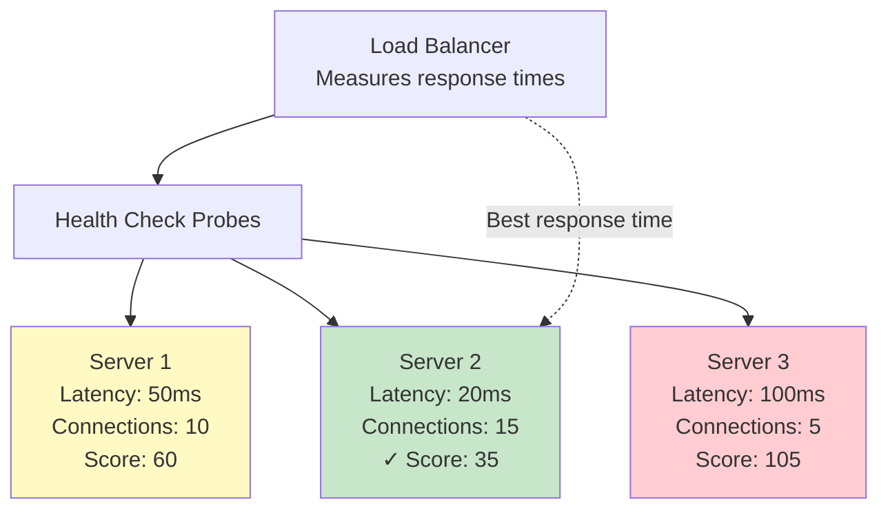
```mermaid
graph TB
    LB[Load Balancer<br/>Measures response times] --> HC[Health Check Probes]

    HC --> S1[Server 1<br/>Latency: 50ms<br/>Connections: 10<br/>Score: 60]
    HC --> S2[Server 2<br/>Latency: 20ms<br/>Connections: 15<br/>✓ Score: 35]
    HC --> S3[Server 3<br/>Latency: 100ms<br/>Connections: 5<br/>Score: 105]

    LB -.->|Best response time| S2

    style S2 fill:#c8e6c9
    style S1 fill:#fff9c4
    style S3 fill:#ffcdd2
```

**How It Works**:

```yaml
Least_Response_Time:
  Measurement:
    Health_Probes: "Send periodic health check requests"
    Measure_Latency: "Track time to receive response"
    Track_Connections: "Monitor active connections"

  Scoring_Algorithm:
    Formula: "score = latency + (connections × weight_factor)"
    Decision: "Route to server with lowest score"

  Example:
    Server_1:
      Latency: "50ms"
      Connections: 10
      Score: "50 + (10 × 1) = 60"

    Server_2:
      Latency: "20ms"
      Connections: 15
      Score: "20 + (15 × 1) = 35"  ✓ Winner

    Server_3:
      Latency: "100ms (degraded performance)"
      Connections: 5
      Score: "100 + (5 × 1) = 105"

  Advantages:
    Direct_Performance_Measure: "Actual latency, not just connection count"
    Detects_Degradation: "Slow server automatically receives less traffic"
    User_Experience: "Routes users to fastest servers"

  Disadvantages:
    Overhead: "Continuous latency measurement"
    Health_Probe_Load: "Additional traffic from probes"

  Best_For:
    - "Geographically distributed servers"
    - "Servers with varying performance"
    - "When user experience latency is critical"
```

**NGINX Configuration**:

```nginx
# NGINX Least Time Configuration

upstream backend {
    least_time header;  # Use response header time

    server server1.example.com;
    server server2.example.com;
    server server3.example.com;
}

# Alternative: least_time last_byte (measures full response time)
```

### 6. Resource-Based Algorithm

**Definition**: Route based on actual server resource utilization (CPU, memory, disk I/O) using monitoring agents.

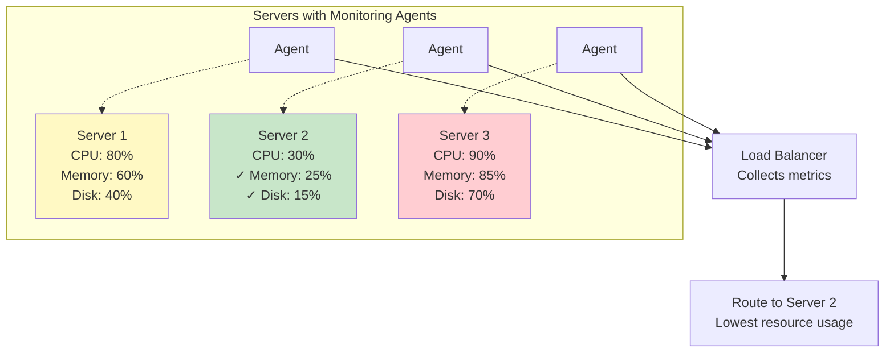
```mermaid
graph TB
    subgraph "Servers with Monitoring Agents"
        S1[Server 1<br/>CPU: 80%<br/>Memory: 60%<br/>Disk: 40%]
        S2[Server 2<br/>CPU: 30%<br/>✓ Memory: 25%<br/>✓ Disk: 15%]
        S3[Server 3<br/>CPU: 90%<br/>Memory: 85%<br/>Disk: 70%]

        A1[Agent] -.-> S1
        A2[Agent] -.-> S2
        A3[Agent] -.-> S3
    end

    A1 --> LB[Load Balancer<br/>Collects metrics]
    A2 --> LB
    A3 --> LB

    LB --> Decision[Route to Server 2<br/>Lowest resource usage]

    style S2 fill:#c8e6c9
    style S1 fill:#fff9c4
    style S3 fill:#ffcdd2
```

**How It Works**:

```yaml
Resource_Based_Algorithm:
  Architecture:
    Agents: "Installed on each backend server"
    Monitoring: "Agents collect CPU, memory, disk I/O metrics"
    Reporting: "Agents send metrics to load balancer every 5-10 seconds"
    Decision: "Load balancer routes to least utilized server"

  Metrics_Collected:
    CPU_Utilization: "% of CPU in use"
    Memory_Usage: "% of RAM consumed"
    Disk_IO: "Read/write operations per second"
    Network_IO: "Bandwidth utilization"

  Scoring_Example:
    Server_1:
      CPU: "80%"
      Memory: "60%"
      Disk: "40%"
      Score: "(80 + 60 + 40) / 3 = 60%"

    Server_2:
      CPU: "30%"
      Memory: "25%"
      Disk: "15%"
      Score: "(30 + 25 + 15) / 3 = 23.3%"  ✓ Route here

    Server_3:
      CPU: "90%"
      Memory: "85%"
      Disk: "70%"
      Score: "(90 + 85 + 70) / 3 = 81.7%"

  Advantages:
    Ultimate_Accuracy: "Routes based on actual resource consumption"
    Proactive: "Prevents overload before it happens"
    Comprehensive: "Considers all resource dimensions"

  Disadvantages:
    Complexity: "Requires agent deployment and management"
    Overhead: "Agent uses CPU/memory to monitor"
    Lifecycle_Management: "Agent updates, security patches"
    Lag: "Metrics may be 5-10 seconds stale"

  Best_For:
    - "Critical production environments"
    - "Heterogeneous workloads (CPU-heavy, memory-heavy, I/O-heavy)"
    - "When absolute optimal distribution is required"

  Tools:
    - "F5 BIG-IP (commercial)"
    - "Citrix ADC (commercial)"
    - "Custom solutions with Prometheus + custom LB logic"
```

### 7. Geographic Load Balancing (GSLB)

**Definition**: DNS-based global load balancing that routes users to the nearest data center based on geographic location.

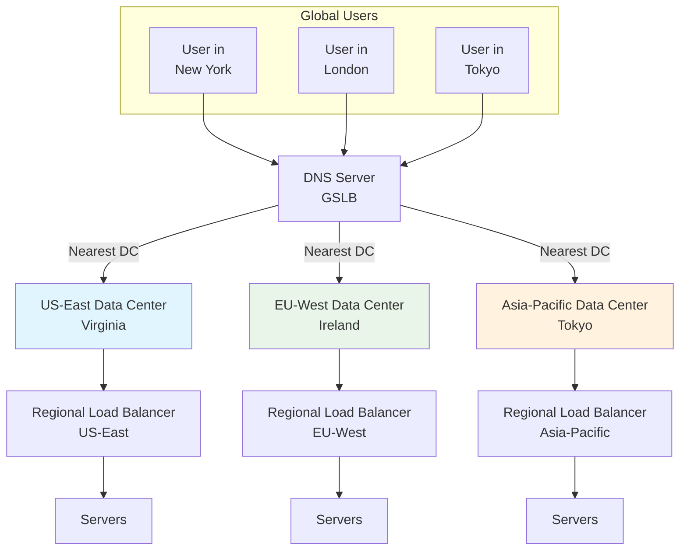
```mermaid
graph TB
    subgraph "Global Users"
        U1[User in<br/>New York]
        U2[User in<br/>London]
        U3[User in<br/>Tokyo]
    end

    U1 --> DNS[DNS Server<br/>GSLB]
    U2 --> DNS
    U3 --> DNS

    DNS -->|Nearest DC| DC1[US-East Data Center<br/>Virginia]
    DNS -->|Nearest DC| DC2[EU-West Data Center<br/>Ireland]
    DNS -->|Nearest DC| DC3[Asia-Pacific Data Center<br/>Tokyo]

    DC1 --> LB1[Regional Load Balancer<br/>US-East]
    DC2 --> LB2[Regional Load Balancer<br/>EU-West]
    DC3 --> LB3[Regional Load Balancer<br/>Asia-Pacific]

    LB1 --> S1[Servers]
    LB2 --> S2[Servers]
    LB3 --> S3[Servers]

    style DC1 fill:#e1f5fe
    style DC2 fill:#e8f5e8
    style DC3 fill:#fff3e0
```

**How GSLB Works**:

```yaml
Geographic_Load_Balancing:
  DNS_Based_Routing:
    Step_1: "User queries DNS for www.example.com"
    Step_2: "GSLB DNS server detects user's geographic location (by IP)"
    Step_3: "Returns IP address of nearest data center"
    Step_4: "User connects to local data center (low latency)"

  Example_Flow:
    User_Location: "San Francisco, USA"
    DNS_Query: "What is the IP for www.netflix.com?"
    GSLB_Decision: "User is in USA → Return US-West data center IP"
    Response: "IP: 54.183.45.123 (AWS US-West-1)"

    User_Location: "Paris, France"
    DNS_Query: "What is the IP for www.netflix.com?"
    GSLB_Decision: "User is in Europe → Return EU-West data center IP"
    Response: "IP: 52.48.156.78 (AWS EU-West-1)"

  Latency_Optimization:
    User_in_NY_to_US_East: "Latency: 10ms"
    User_in_NY_to_EU_West: "Latency: 80ms"
    User_in_NY_to_Asia_Pacific: "Latency: 200ms"

    Benefit: "8x faster by routing to nearest region"

  Disaster_Recovery:
    Primary_DC: "US-East (healthy)"
    Failover_DC: "US-West (standby)"

    Scenario: "US-East data center failure"
    GSLB_Action: "Detect health check failure"
    DNS_Update: "Start returning US-West IP for US users"
    Recovery_Time: "DNS TTL (typically 60 seconds)"
    Result: "Automatic failover with minimal downtime"

  Advantages:
    - "Global footprint with low latency"
    - "Disaster recovery across regions"
    - "Compliance (data residency requirements)"
    - "Traffic distribution across continents"

  Disadvantages:
    - "DNS propagation delay (TTL)"
    - "Client-side DNS caching"
    - "Cost of multi-region deployment"

  Best_For:
    - "Global SaaS applications"
    - "Content delivery (Netflix, YouTube)"
    - "E-commerce with international users"
    - "Mission-critical applications requiring disaster recovery"
```

**GSLB Configuration Example**:

```yaml
# AWS Route 53 GSLB Configuration

HostedZone:
  Name: "example.com"

RecordSets:
  - Name: "www.example.com"
    Type: "A"
    SetIdentifier: "US-East"
    GeoLocation:
      ContinentCode: "NA"  # North America
    ResourceRecords:
      - "54.123.45.67"
    TTL: 60
    HealthCheckId: "health-check-us-east"

  - Name: "www.example.com"
    Type: "A"
    SetIdentifier: "EU-West"
    GeoLocation:
      ContinentCode: "EU"  # Europe
    ResourceRecords:
      - "52.48.156.78"
    TTL: 60
    HealthCheckId: "health-check-eu-west"

  - Name: "www.example.com"
    Type: "A"
    SetIdentifier: "Asia-Pacific"
    GeoLocation:
      ContinentCode: "AS"  # Asia
    ResourceRecords:
      - "13.239.45.90"
    TTL: 60
    HealthCheckId: "health-check-asia-pacific"
```

### 8. IP Hash (Sticky Sessions)

**Definition**: Hash the client's IP address to consistently route them to the same server.

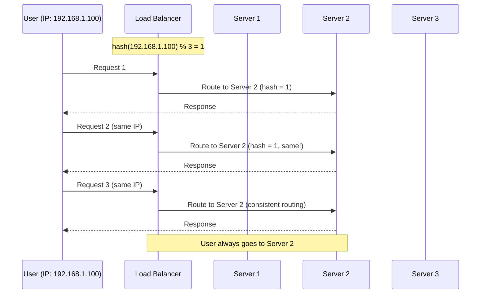
```mermaid
sequenceDiagram
    participant U as User (IP: 192.168.1.100)
    participant LB as Load Balancer
    participant S1 as Server 1
    participant S2 as Server 2
    participant S3 as Server 3

    Note over LB: hash(192.168.1.100) % 3 = 1

    U->>LB: Request 1
    LB->>S2: Route to Server 2 (hash = 1)
    S2-->>U: Response

    U->>LB: Request 2 (same IP)
    LB->>S2: Route to Server 2 (hash = 1, same!)
    S2-->>U: Response

    U->>LB: Request 3 (same IP)
    LB->>S2: Route to Server 2 (consistent routing)
    S2-->>U: Response

    Note over LB,S2: User always goes to Server 2
```

**How It Works**:

```yaml
IP_Hash:
  Algorithm:
    Formula: "server_index = hash(client_ip) % num_servers"

    Example:
      Client_IP: "192.168.1.100"
      Hash: "hash('192.168.1.100') = 2843674"
      Servers: 3
      Result: "2843674 % 3 = 1 → Server 2"

  Characteristics:
    Layer_4: "Works at TCP/IP level"
    Session_Persistence: "Same client always routed to same server"
    Stateful_Apps: "Enables session storage in server memory"

  Advantages:
    - "Sticky sessions (user always hits same server)"
    - "Enables stateful applications"
    - "Simple to implement"

  Disadvantages:
    NAT_Problem:
      Issue: "Users behind same NAT/proxy have same IP"
      Example: "Office with 100 employees, all see same public IP"
      Result: "All 100 users routed to same server (uneven distribution)"

    Proxy_Imbalance:
      Issue: "Users behind CDNs/proxies get imbalanced"
      Example: "Cloudflare proxy IP → all Cloudflare users to one server"

    Scaling:
      Issue: "Adding/removing servers changes hash distribution"
      Result: "Users get routed to different servers (sessions lost)"

  Best_For:
    - "Internal applications (controlled network)"
    - "When cookie-based persistence not possible"
    - "Simple stateful apps"

  Not_Recommended:
    - "Public internet users (NAT/proxy issues)"
    - "Cloud-native applications (use L7 cookie-based instead)"
```

**NGINX IP Hash Configuration**:

```nginx
upstream backend {
    ip_hash;  # Enable IP hash algorithm

    server server1.example.com;
    server server2.example.com;
    server server3.example.com;
}

server {
    listen 80;
    location / {
        proxy_pass http://backend;
    }
}
```

### 9. Cookie-Based Persistence (Sticky Sessions - L7)

**Definition**: Load balancer sets a cookie to track which server handled the first request, ensuring subsequent requests go to the same server.

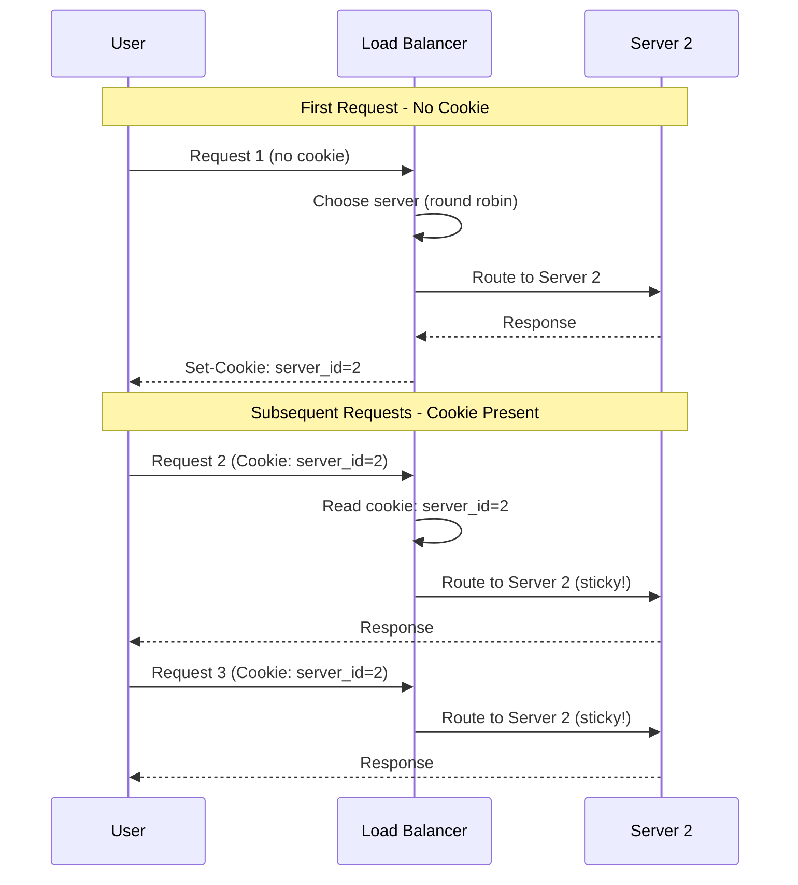
```mermaid
sequenceDiagram
    participant U as User
    participant LB as Load Balancer
    participant S2 as Server 2

    Note over U,S2: First Request - No Cookie
    U->>LB: Request 1 (no cookie)
    LB->>LB: Choose server (round robin)
    LB->>S2: Route to Server 2
    S2-->>LB: Response
    LB-->>U: Set-Cookie: server_id=2

    Note over U,S2: Subsequent Requests - Cookie Present
    U->>LB: Request 2 (Cookie: server_id=2)
    LB->>LB: Read cookie: server_id=2
    LB->>S2: Route to Server 2 (sticky!)
    S2-->>U: Response

    U->>LB: Request 3 (Cookie: server_id=2)
    LB->>S2: Route to Server 2 (sticky!)
    S2-->>U: Response
```

**How It Works**:

```yaml
Cookie_Based_Persistence:
  Layer_7_Mechanism: "HTTP-level (reads/writes cookies)"

  Process:
    First_Request:
      Step_1: "User makes first request (no cookie)"
      Step_2: "Load balancer chooses server (e.g., round robin)"
      Step_3: "LB sets cookie: Set-Cookie: lb_server=server2"
      Step_4: "User receives response with cookie"

    Subsequent_Requests:
      Step_1: "User sends request with Cookie: lb_server=server2"
      Step_2: "Load balancer reads cookie"
      Step_3: "Routes to Server 2 (from cookie)"
      Step_4: "Session persists on Server 2"

  Advantages:
    No_NAT_Problem: "Works correctly behind proxies/NATs"
    Even_Distribution: "First request distributed evenly (round robin)"
    Subsequent_Stickiness: "Later requests stick to assigned server"

  Cookie_Options:
    HttpOnly: "Prevents JavaScript access (security)"
    Secure: "Only sent over HTTPS"
    SameSite: "CSRF protection"
    Max_Age: "Cookie expiration (e.g., 1 hour)"

  Disadvantages:
    - "Requires L7 load balancer (more expensive)"
    - "Users can clear cookies (session lost)"
    - "Privacy concerns (tracking)"

  Best_For:
    - "Public internet applications"
    - "Shopping carts (session persistence)"
    - "Multi-step workflows"
    - "Stateful web applications"
```

**HAProxy Cookie-Based Stickiness**:

```haproxy
# HAProxy configuration for cookie-based persistence

backend web_servers
    balance roundrobin
    cookie SERVERID insert indirect nocache httponly secure

    server server1 192.168.1.10:80 check cookie s1
    server server2 192.168.1.11:80 check cookie s2
    server server3 192.168.1.12:80 check cookie s3

# Load balancer will:
# 1. Choose server via round robin on first request
# 2. Set cookie: Set-Cookie: SERVERID=s2; HttpOnly; Secure
# 3. Future requests with this cookie always go to server2
```

### Algorithm Comparison Table

| Algorithm | State Tracking | Best For | Pros | Cons |
|-----------|---------------|----------|------|------|
| **Round Robin** | None | Stateless apps, homogeneous servers | Simple, zero overhead | Doesn't account for load variations |
| **Weighted Round Robin** | None | Heterogeneous hardware | Capacity-aware | Manual weight configuration |
| **Least Connections** | Connection counts | Long-lived connections | Dynamic, load-aware | Doesn't measure actual CPU/memory |
| **Weighted Least Connections** | Connection counts + weights | Mixed hardware + varying loads | Best of both worlds | More complex |
| **Least Response Time** | Latency + connections | Performance-critical apps | Direct latency measurement | Health probe overhead |
| **Resource-Based** | CPU, memory, disk metrics | Critical production | Most accurate | Requires agents, complexity |
| **Geographic (GSLB)** | Geographic location | Global applications | Low latency worldwide | DNS propagation delay |
| **IP Hash** | None (deterministic) | Internal apps, simple stickiness | Easy sticky sessions | NAT/proxy imbalance |
| **Cookie-Based** | Cookie tracking | Public web apps, shopping carts | Works behind proxies | Users can clear cookies |

---

## Real-World Case Study: Netflix Multi-Layer Load Balancing

Netflix serves **300+ million subscribers** globally using a sophisticated **multi-layered load balancing architecture**.

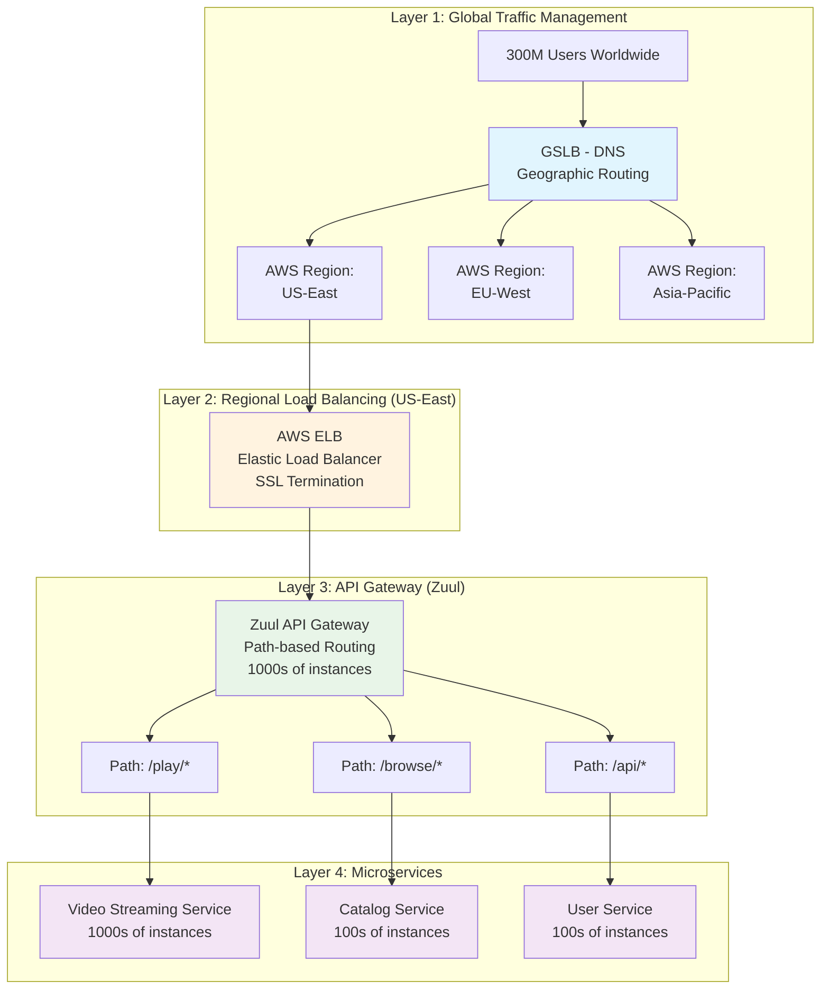
```mermaid
graph TB
    subgraph "Layer 1: Global Traffic Management"
        U[300M Users Worldwide] --> GSLB[GSLB - DNS<br/>Geographic Routing]

        GSLB --> R1[AWS Region:<br/>US-East]
        GSLB --> R2[AWS Region:<br/>EU-West]
        GSLB --> R3[AWS Region:<br/>Asia-Pacific]
    end

    subgraph "Layer 2: Regional Load Balancing (US-East)"
        R1 --> ELB[AWS ELB<br/>Elastic Load Balancer<br/>SSL Termination]
    end

    subgraph "Layer 3: API Gateway (Zuul)"
        ELB --> Zuul[Zuul API Gateway<br/>Path-based Routing<br/>1000s of instances]

        Zuul --> P1[Path: /play/*]
        Zuul --> P2[Path: /browse/*]
        Zuul --> P3[Path: /api/*]
    end

    subgraph "Layer 4: Microservices"
        P1 --> MS1[Video Streaming Service<br/>1000s of instances]
        P2 --> MS2[Catalog Service<br/>100s of instances]
        P3 --> MS3[User Service<br/>100s of instances]
    end

    style GSLB fill:#e1f5fe
    style ELB fill:#fff3e0
    style Zuul fill:#e8f5e8
    style MS1 fill:#f3e5f5
    style MS2 fill:#f3e5f5
    style MS3 fill:#f3e5f5
```

### Netflix's Multi-Layer Architecture

```yaml
Layer_1_GSLB:
  Purpose: "Route users to nearest AWS region"
  Technology: "DNS-based geographic routing"

  Routing_Logic:
    User_in_California: "US-West-2 (Oregon)"
    User_in_New_York: "US-East-1 (Virginia)"
    User_in_London: "EU-West-1 (Ireland)"
    User_in_Tokyo: "AP-Northeast-1 (Tokyo)"

  Benefits:
    - "Minimized latency (< 50ms for most users)"
    - "Compliance (GDPR data residency)"
    - "Disaster recovery (failover to next region)"

Layer_2_ELB:
  Purpose: "Regional load balancing and SSL termination"
  Technology: "AWS Elastic Load Balancer (ALB)"

  Functions:
    SSL_Termination:
      - "Decrypts HTTPS traffic"
      - "Reduces load on backend services"
      - "Centralized certificate management"

    Health_Checks:
      - "L7 HTTP checks to /health endpoint"
      - "Remove unhealthy Zuul instances"

    Auto_Scaling:
      - "Scales Zuul instances based on traffic"
      - "Handles traffic spikes (new show releases)"

  Configuration:
    Algorithm: "Round robin"
    Health_Check: "GET /health every 10 seconds"
    Timeout: "5 seconds"

Layer_3_Zuul:
  Purpose: "API Gateway - path-based routing to microservices"
  Technology: "Netflix Zuul (open-source)"

  Routing_Rules:
    "/play/*": "Video Streaming Service"
    "/browse/*": "Content Catalog Service"
    "/search/*": "Search Service"
    "/api/users/*": "User Service"
    "/api/billing/*": "Billing Service"

  Features:
    - "Dynamic routing"
    - "Request filtering (authentication, rate limiting)"
    - "Circuit breaker (Hystrix integration)"
    - "Monitoring and metrics"

  Scale:
    Instances: "1000s of Zuul instances per region"
    Auto_Scaling: "Based on request rate"

Layer_4_Microservices:
  Purpose: "Business logic execution"
  Technology: "1000+ microservices"

  Load_Balancing:
    Client_Side: "Ribbon (Netflix OSS)"
    Algorithm: "Weighted round robin + zone-aware routing"

    Example:
      Video_Streaming_Service:
        Instances: "1000s per region"
        Load_Balancer: "Ribbon (client-side)"
        Zone_Affinity: "Prefer same availability zone (lower latency)"

  Health_Monitoring:
    - "Eureka service discovery"
    - "Health checks every 30 seconds"
    - "Automatic instance registration/deregistration"

Traffic_Flow_Example:
  User_Action: "User in New York clicks 'Play' on Stranger Things"

  Step_1_GSLB:
    DNS_Query: "api.netflix.com"
    Response: "IP of US-East region (52.123.45.67)"

  Step_2_ELB:
    Request: "HTTPS GET /play/stranger-things"
    SSL_Termination: "Decrypt HTTPS"
    Route_To: "Zuul instance (random healthy instance)"

  Step_3_Zuul:
    Parse_Path: "/play/*"
    Route_To: "Video Streaming Service"
    Add_Headers: "Request ID, authentication token"

  Step_4_Microservice:
    Service: "Video Streaming Service"
    Instance_Selection: "Ribbon load balancer (client-side)"
    Zone_Affinity: "Choose instance in same AZ (us-east-1a)"

  Step_5_Response:
    Video_Service: "Returns video stream URL (from CDN)"
    User: "Starts streaming Stranger Things"

Scale_Numbers:
  Daily_Streaming: "Billions of hours per year"
  Peak_Traffic: "Accounts for 15% of global internet bandwidth"
  Traffic_Spikes: "10-50x on new show releases"
  Auto_Scaling: "From 100s to 10,000s of instances"
  Availability: "99.99% uptime SLA"

Key_Takeaways:
  Multi_Layer: "Each layer solves different problem"
  Redundancy: "Failure at any layer doesn't impact users"
  Scalability: "Each layer auto-scales independently"
  Latency_Optimized: "GSLB + zone-aware routing"
  SSL_Offload: "ELB handles encryption (not microservices)"
```

---

## Load Balancer Types: Hardware, Software, and Cloud

Load balancers come in three main categories, each with distinct trade-offs.

### 1. Hardware Load Balancers

**Definition**: Dedicated physical appliances with specialized silicon chips (ASICs) optimized for load balancing.

```yaml
Hardware_Load_Balancers:
  Examples:
    - "F5 BIG-IP"
    - "Citrix NetScaler (now Citrix ADC)"
    - "A10 Networks Thunder"

  Characteristics:
    Architecture: "Custom ASIC chips for packet processing"
    Performance: "Millions of connections per second"
    Latency: "< 1 millisecond"
    Throughput: "10-100 Gbps"

  Advantages:
    Ultra_Low_Latency: "Hardware-accelerated packet processing"
    High_Throughput: "Handles massive traffic volumes"
    Dedicated_Resources: "Not affected by software overhead"
    Enterprise_Features: "WAF, SSL acceleration, DDoS protection"

  Disadvantages:
    Cost: "$10,000 - $250,000+ per appliance"
    Inflexible: "Hardware refresh cycle (3-5 years)"
    Vendor_Lock_In: "Proprietary technology"
    Datacenter_Only: "Can't deploy in cloud environments"
    Complex_Management: "Specialized expertise required"

  Best_For:
    - "Large enterprises with on-premise datacenters"
    - "Financial institutions (ultra-low latency trading)"
    - "Telcos and ISPs"
    - "Legacy infrastructure"

  Typical_Deployment:
    Cost: "$50,000 - $100,000 for redundant pair"
    Lifespan: "5 years"
    Annual_Support: "$10,000 - $20,000"
```

### 2. Software Load Balancers

**Definition**: Software-based solutions running on commodity servers.

```yaml
Software_Load_Balancers:
  Popular_Solutions:
    Open_Source:
      - "HAProxy (most popular)"
      - "NGINX (web server + load balancer)"
      - "Traefik (cloud-native)"
      - "Envoy (service mesh)"

    Commercial:
      - "NGINX Plus"
      - "HAProxy Enterprise"

  Characteristics:
    Platform: "Runs on Linux servers (x86 hardware)"
    Deployment: "Virtual machines or containers"
    Configuration: "Text-based config files"

  HAProxy:
    Features:
      - "L4 and L7 load balancing"
      - "TCP and HTTP protocols"
      - "SSL termination"
      - "Advanced health checks"
      - "Stick tables (session persistence)"

    Performance: "100,000+ connections per second on standard hardware"
    Cost: "Free (open-source)"

  NGINX:
    Features:
      - "HTTP/HTTPS load balancing"
      - "Reverse proxy"
      - "Web server"
      - "SSL/TLS termination"
      - "Caching"

    Performance: "50,000+ requests per second"
    Cost: "Free (open-source), NGINX Plus: $2,500/year"

  Advantages:
    Cost_Effective: "Free (open-source) or low cost"
    Flexible: "Deploy anywhere (VMs, containers, bare metal)"
    Scalable: "Horizontal scaling (add more LB instances)"
    Cloud_Ready: "Works in AWS, Azure, GCP"
    Customizable: "Full configuration control"

  Disadvantages:
    Performance: "Lower than hardware LBs (but sufficient for most)"
    Resource_Consumption: "Uses server CPU/memory"
    Management_Overhead: "Self-managed (patches, updates)"

  Best_For:
    - "Startups and small businesses"
    - "Cloud-native applications"
    - "Microservices architectures"
    - "Dev/test environments"
    - "Modern web applications"

  Typical_Deployment:
    Cost: "$0 (HAProxy/NGINX) or $2,500/year (NGINX Plus)"
    Infrastructure: "2x t3.medium instances ($60/month)"
    Total: "$60/month (vs $50,000 hardware)"
```

**HAProxy Configuration Example**:

```haproxy
# /etc/haproxy/haproxy.cfg

global
    maxconn 50000
    log /dev/log local0
    user haproxy
    group haproxy

defaults
    mode http
    timeout connect 5000ms
    timeout client 50000ms
    timeout server 50000ms
    option httplog
    option dontlognull

# Frontend: Accepts incoming traffic
frontend http_front
    bind *:80
    bind *:443 ssl crt /etc/ssl/certs/example.com.pem

    # Redirect HTTP to HTTPS
    redirect scheme https if !{ ssl_fc }

    default_backend web_servers

# Backend: Pool of servers
backend web_servers
    balance roundrobin
    option httpchk GET /health
    http-check expect status 200

    server web1 192.168.1.10:8080 check inter 5s fall 3 rise 2
    server web2 192.168.1.11:8080 check inter 5s fall 3 rise 2
    server web3 192.168.1.12:8080 check inter 5s fall 3 rise 2

# Statistics page
listen stats
    bind *:8080
    stats enable
    stats uri /stats
    stats refresh 10s
    stats auth admin:password
```

### 3. Cloud Load Balancers

**Definition**: Fully managed load balancing services provided by cloud platforms.

```yaml
Cloud_Load_Balancers:
  AWS:
    Application_Load_Balancer_ALB:
      Layer: "L7 (HTTP/HTTPS)"
      Features:
        - "Path-based routing (/api/* vs /static/*)"
        - "Host-based routing (api.example.com vs www.example.com)"
        - "WebSocket support"
        - "HTTP/2 and gRPC"
        - "Lambda target support"
      Cost: "$0.0225/hour + $0.008/LCU-hour"
      Best_For: "Microservices, containerized apps"

    Network_Load_Balancer_NLB:
      Layer: "L4 (TCP/UDP)"
      Features:
        - "Ultra-low latency (< 1ms)"
        - "Millions of requests per second"
        - "Static IP support"
        - "Preserve client IP"
      Cost: "$0.0225/hour + $0.006/NLCU-hour"
      Best_For: "Real-time apps, gaming, IoT"

    Classic_Load_Balancer_CLB:
      Status: "Legacy (use ALB/NLB instead)"

  Google_Cloud:
    HTTP_Load_Balancer:
      Scope: "Global (single IP serves worldwide)"
      Features:
        - "Anycast IP (users route to nearest region)"
        - "CDN integration"
        - "SSL certificates managed by Google"
        - "Auto-scaling"
      Cost: "$0.025/hour + traffic charges"

    Network_Load_Balancer:
      Layer: "L4"
      Scope: "Regional"

  Azure:
    Application_Gateway:
      Layer: "L7"
      Features:
        - "WAF (Web Application Firewall)"
        - "SSL termination"
        - "URL-based routing"
      Cost: "$0.36/hour + data processing"

    Azure_Load_Balancer:
      Layer: "L4"
      Scope: "Regional or zone-redundant"

  Advantages:
    Fully_Managed: "No server management, patches, updates"
    Auto_Scaling: "Scales automatically with traffic"
    High_Availability: "Built-in redundancy across AZs"
    Integration: "Native integration with cloud services"
    Pay_As_You_Go: "No upfront cost"
    Global_Reach: "Multi-region deployment easy"

  Disadvantages:
    Cost: "Can be expensive at high scale"
    Vendor_Lock_In: "Tied to specific cloud provider"
    Limited_Customization: "Can't modify underlying behavior"
    Configuration_Limits: "Some advanced features unavailable"

  Best_For:
    - "Cloud-native applications (default choice)"
    - "Startups (no upfront investment)"
    - "Auto-scaling workloads"
    - "Global applications"
    - "Teams without DevOps expertise"

  Cost_Comparison:
    Small_Scale:
      Traffic: "10 TB/month, 1000 req/s"
      AWS_ALB: "~$20/month"
      Advantage: "Cloud LB wins (vs $60 software LB infrastructure)"

    Large_Scale:
      Traffic: "100 TB/month, 50,000 req/s"
      AWS_ALB: "~$500/month"
      HAProxy_Self_Hosted: "~$200/month (infrastructure)"
      Consideration: "Software LB cheaper, but requires management"
```

### Load Balancer Type Comparison

| Type | Cost | Performance | Flexibility | Management | Best For |
|------|------|-------------|-------------|------------|----------|
| **Hardware** | Very High ($10K-250K) | Excellent (<1ms) | Low (vendor lock-in) | Complex | Enterprises, finance, legacy |
| **Software** | Low (free-$2.5K/yr) | Good (10ms) | High (full control) | Self-managed | Cloud apps, microservices |
| **Cloud** | Variable (pay-as-you-go) | Excellent (managed) | Medium (provider features) | Fully managed | Startups, cloud-native, default choice |

---

## L4 vs L7 Load Balancing

Load balancers operate at different layers of the OSI model, which fundamentally changes how they work.

### OSI Model Context

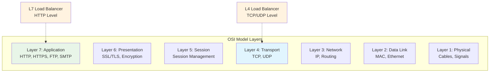
```mermaid
graph TB
    subgraph "OSI Model Layers"
        L7[Layer 7: Application<br/>HTTP, HTTPS, FTP, SMTP]
        L6[Layer 6: Presentation<br/>SSL/TLS, Encryption]
        L5[Layer 5: Session<br/>Session Management]
        L4[Layer 4: Transport<br/>TCP, UDP]
        L3[Layer 3: Network<br/>IP, Routing]
        L2[Layer 2: Data Link<br/>MAC, Ethernet]
        L1[Layer 1: Physical<br/>Cables, Signals]
    end

    L4LB[L4 Load Balancer<br/>TCP/UDP Level] -.-> L4
    L7LB[L7 Load Balancer<br/>HTTP Level] -.-> L7

    style L4 fill:#e1f5fe
    style L7 fill:#e8f5e8
    style L4LB fill:#fff3e0
    style L7LB fill:#fff3e0
```

### Layer 4 (L4) Load Balancing - Transport Layer

**Definition**: Routes traffic based on IP address and TCP/UDP port without inspecting packet contents.

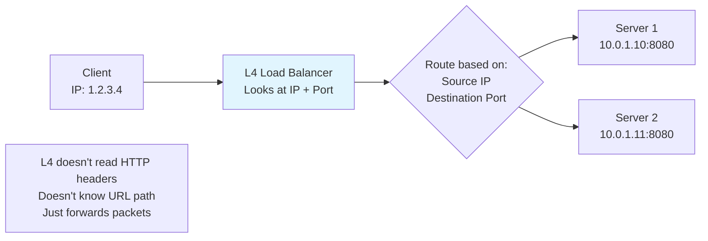
```mermaid
graph LR
    C[Client<br/>IP: 1.2.3.4] --> L4[L4 Load Balancer<br/>Looks at IP + Port]

    L4 --> Decision{Route based on:<br/>Source IP<br/>Destination Port}

    Decision --> S1[Server 1<br/>10.0.1.10:8080]
    Decision --> S2[Server 2<br/>10.0.1.11:8080]

    Note1[L4 doesn't read HTTP headers<br/>Doesn't know URL path<br/>Just forwards packets]

    style L4 fill:#e1f5fe
```

**How L4 Works**:

```yaml
L4_Load_Balancing:
  What_It_Sees:
    - "Source IP: 192.168.1.100"
    - "Destination IP: Load balancer IP"
    - "Protocol: TCP"
    - "Destination Port: 443"

  What_It_Doesnt_See:
    - "HTTP method (GET, POST)"
    - "URL path (/api/users vs /api/orders)"
    - "HTTP headers (Host, User-Agent, Cookies)"
    - "Request body"

  Routing_Decision:
    Based_On:
      - "IP address (IP hash)"
      - "Port number"
      - "Load balancing algorithm (round robin, least connections)"

    Example:
      Client: "192.168.1.100 → Load Balancer:443"
      LB_Decision: "Route to Server 2 (round robin)"
      Forward: "192.168.1.100 → Server 2:443"

  Connection_Handling:
    Mode: "Pass-through (NAT mode)"
    TCP_Handshake: "LB forwards packets between client and server"
    Latency: "Minimal (< 1ms overhead)"

  Advantages:
    Fast: "Doesn't parse HTTP, just forwards packets"
    Simple: "Less processing overhead"
    Protocol_Agnostic: "Works with any TCP/UDP protocol (HTTP, HTTPS, FTP, SMTP, database connections)"
    Low_Latency: "Ideal for real-time applications"

  Disadvantages:
    No_Content_Routing: "Can't route based on URL path"
    No_SSL_Termination: "Can't decrypt HTTPS traffic"
    Limited_Routing: "Only IP + port"
    No_HTTP_Features: "No cookie-based stickiness, no header manipulation"

  Best_For:
    - "Simple load distribution"
    - "Non-HTTP protocols (databases, SMTP, FTP)"
    - "High-performance requirements (< 1ms latency)"
    - "When you don't need content-based routing"

  Use_Cases:
    - "Database load balancing (MySQL, PostgreSQL)"
    - "SMTP server load balancing"
    - "Gaming servers"
    - "VoIP and real-time communication"
```

### Layer 7 (L7) Load Balancing - Application Layer

**Definition**: Routes traffic based on HTTP content - URL paths, headers, cookies, request methods.

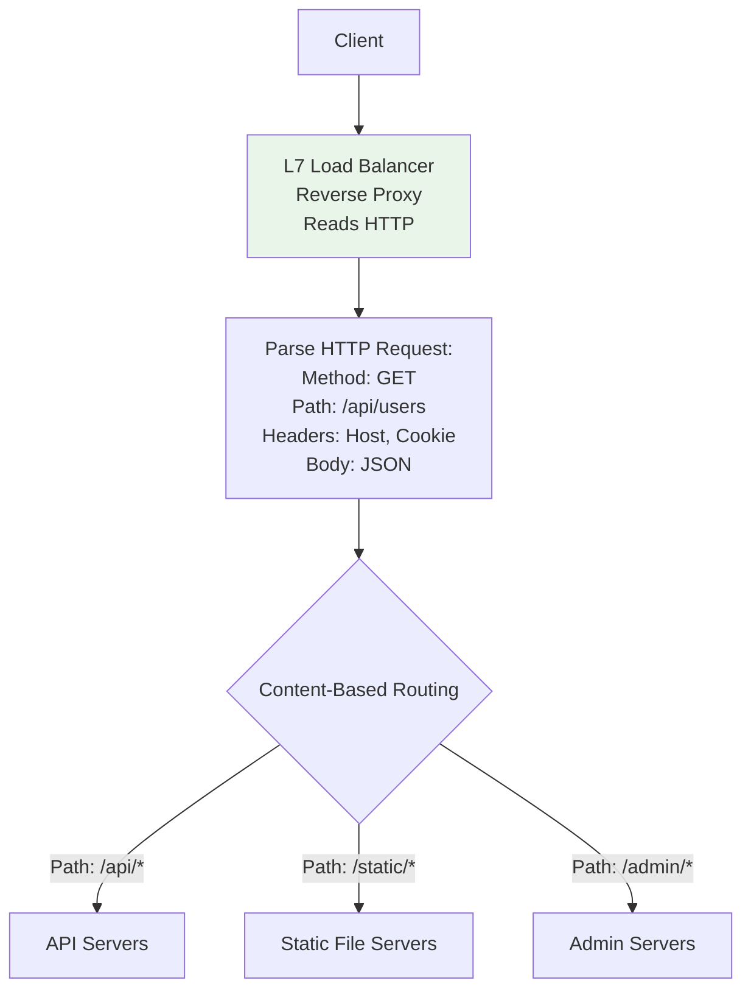
```mermaid
graph TB
    C[Client] --> L7[L7 Load Balancer<br/>Reverse Proxy<br/>Reads HTTP]

    L7 --> Parse[Parse HTTP Request:<br/>Method: GET<br/>Path: /api/users<br/>Headers: Host, Cookie<br/>Body: JSON]

    Parse --> Route{Content-Based Routing}

    Route -->|Path: /api/*| API[API Servers]
    Route -->|Path: /static/*| Static[Static File Servers]
    Route -->|Path: /admin/*| Admin[Admin Servers]

    style L7 fill:#e8f5e8
```

**How L7 Works**:

```yaml
L7_Load_Balancing:
  What_It_Sees:
    - "HTTP Method: POST"
    - "URL Path: /api/orders"
    - "Host Header: api.example.com"
    - "Cookie: session_id=abc123"
    - "User-Agent: Mozilla/5.0"
    - "Request Body: JSON payload"

  Routing_Capabilities:
    Path_Based:
      "/api/*": "API server pool"
      "/static/*": "Static file server pool"
      "/admin/*": "Admin server pool"

    Host_Based:
      "api.example.com": "API servers"
      "www.example.com": "Web servers"
      "admin.example.com": "Admin servers"

    Method_Based:
      "GET /users": "Read-only server pool"
      "POST /users": "Write server pool"

    Header_Based:
      "User-Agent: Mobile": "Mobile-optimized servers"
      "Accept-Language: es": "Spanish language servers"

    Cookie_Based:
      "Cookie: beta=true": "Beta testing servers"
      "Cookie: session_id=*": "Sticky session to same server"

  Features:
    SSL_Termination:
      - "Decrypt HTTPS traffic at load balancer"
      - "Backend servers receive plain HTTP"
      - "Reduces CPU load on application servers"
      - "Centralized certificate management"

    Header_Manipulation:
      - "Add headers: X-Forwarded-For (client IP)"
      - "Remove headers: Server (hide server version)"
      - "Modify headers: Host header rewriting"

    Content_Switching:
      - "Route based on request content"
      - "A/B testing (10% to new version)"
      - "Canary deployments"

  Advantages:
    Content_Routing: "Smart routing based on request content"
    SSL_Termination: "Offload encryption from backend"
    Application_Features: "Cookie stickiness, header manipulation"
    Microservices_Friendly: "Path-based routing to different services"
    Advanced_Health_Checks: "HTTP-level health verification"

  Disadvantages:
    Higher_Latency: "Must parse HTTP (5-10ms overhead)"
    More_CPU: "Content inspection requires processing"
    HTTP_Only: "Doesn't work for non-HTTP protocols"

  Best_For:
    - "Microservices architectures"
    - "Path-based routing (/api vs /static)"
    - "SSL termination required"
    - "Cookie-based session persistence"
    - "Content-based decisions"

  Use_Cases:
    - "Modern web applications"
    - "API gateways"
    - "Microservices platforms"
    - "Multi-tenant applications"
    - "A/B testing and canary deployments"
```

### L4 vs L7 Detailed Comparison

**Traffic Flow Comparison**:

```yaml
L4_Traffic_Flow:
  Client_Request: "TCP packet: 192.168.1.100:54321 → LB:443"

  L4_Processing:
    Step_1: "Receive TCP SYN packet"
    Step_2: "Choose backend server (round robin)"
    Step_3: "Forward packet: 192.168.1.100:54321 → Server1:443"
    Step_4: "Maintain connection state"

  Latency: "< 1ms"

L7_Traffic_Flow:
  Client_Request: "HTTPS GET /api/users HTTP/1.1"

  L7_Processing:
    Step_1: "Receive TCP connection"
    Step_2: "Perform SSL handshake (decrypt HTTPS)"
    Step_3: "Parse HTTP request (method, path, headers)"
    Step_4: "Choose backend based on path '/api/users'"
    Step_5: "Forward HTTP request to API server pool"
    Step_6: "Receive response, re-encrypt (if needed)"
    Step_7: "Send to client"

  Latency: "5-10ms"
```

### Feature Comparison Table

| Feature | L4 Load Balancer | L7 Load Balancer |
|---------|------------------|------------------|
| **OSI Layer** | Transport (Layer 4) | Application (Layer 7) |
| **Protocol** | TCP, UDP | HTTP, HTTPS, WebSocket |
| **Routing Based On** | IP address, port | URL path, headers, cookies, method |
| **Content Inspection** | No (blind forwarding) | Yes (reads HTTP) |
| **SSL Termination** | No (pass-through) | Yes (decrypt at LB) |
| **Latency** | < 1ms | 5-10ms |
| **Throughput** | Millions of connections/sec | Tens of thousands req/sec |
| **Session Persistence** | IP hash | Cookie-based, header-based |
| **Use Cases** | Database, SMTP, gaming | Web apps, APIs, microservices |
| **Examples** | AWS NLB, HAProxy (TCP mode) | AWS ALB, NGINX, HAProxy (HTTP mode) |
| **Path Routing** | No (/api vs /static) | Yes |
| **Health Checks** | TCP handshake | HTTP GET /health |
| **Complexity** | Simple | Complex |
| **CPU Usage** | Low | Medium-High |

### When to Choose L4 vs L7

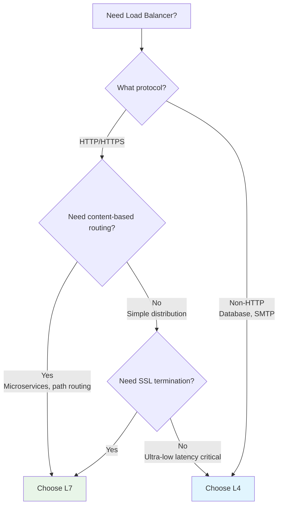
```mermaid
graph TB
    Start[Need Load Balancer?] --> Q1{What protocol?}

    Q1 -->|HTTP/HTTPS| Q2{Need content-based routing?}
    Q1 -->|Non-HTTP<br/>Database, SMTP| L4Choice[Choose L4]

    Q2 -->|Yes<br/>Microservices, path routing| L7Choice[Choose L7]
    Q2 -->|No<br/>Simple distribution| Q3{Need SSL termination?}

    Q3 -->|Yes| L7Choice
    Q3 -->|No<br/>Ultra-low latency critical| L4Choice

    style L4Choice fill:#e1f5fe
    style L7Choice fill:#e8f5e8
```

```yaml
Choose_L4_When:
  Requirements:
    - "Non-HTTP protocols (databases, FTP, SMTP)"
    - "Ultra-low latency critical (< 1ms)"
    - "High throughput (millions of connections)"
    - "Simple IP-based routing sufficient"
    - "Pass-through SSL (no termination needed)"

  Examples:
    - "MySQL/PostgreSQL load balancing"
    - "Redis cluster routing"
    - "Gaming servers"
    - "VoIP and real-time communication"
    - "SMTP mail server distribution"

Choose_L7_When:
  Requirements:
    - "HTTP/HTTPS applications"
    - "Microservices architecture (path-based routing)"
    - "SSL termination required"
    - "Cookie-based session persistence"
    - "Content-based routing (/api vs /static)"
    - "Header manipulation needed"

  Examples:
    - "Modern web applications"
    - "API gateways"
    - "Microservices platforms (Netflix, Uber)"
    - "E-commerce sites"
    - "SaaS applications"
```

### Real-World Configuration Examples

**L4 Load Balancer (HAProxy TCP Mode)**:

```haproxy
# L4 Load Balancing for PostgreSQL Database

global
    maxconn 10000

defaults
    mode tcp  # Layer 4 mode
    timeout connect 5s
    timeout client 1m
    timeout server 1m

frontend postgres_front
    bind *:5432
    default_backend postgres_servers

backend postgres_servers
    mode tcp
    balance leastconn

    option tcp-check
    tcp-check connect

    server pg1 10.0.1.10:5432 check
    server pg2 10.0.1.11:5432 check
    server pg3 10.0.1.12:5432 check

# L4 doesn't know SQL queries, just forwards TCP packets
```

**L7 Load Balancer (NGINX)**:

```nginx
# L7 Load Balancing with Content-Based Routing

http {
    upstream api_servers {
        least_conn;
        server 10.0.1.10:8080;
        server 10.0.1.11:8080;
        server 10.0.1.12:8080;
    }

    upstream static_servers {
        server 10.0.2.10:80;
        server 10.0.2.11:80;
    }

    upstream admin_servers {
        server 10.0.3.10:8080;
        server 10.0.3.11:8080;
    }

    server {
        listen 80;
        listen 443 ssl http2;
        server_name example.com;

        # SSL Termination
        ssl_certificate /etc/ssl/example.com.crt;
        ssl_certificate_key /etc/ssl/example.com.key;

        # Path-based routing
        location /api/ {
            proxy_pass http://api_servers;
            proxy_set_header Host $host;
            proxy_set_header X-Real-IP $remote_addr;
            proxy_set_header X-Forwarded-For $proxy_add_x_forwarded_for;
        }

        location /static/ {
            proxy_pass http://static_servers;
            proxy_cache static_cache;
            proxy_cache_valid 200 1h;
        }

        location /admin/ {
            proxy_pass http://admin_servers;

            # Basic auth for admin
            auth_basic "Admin Area";
            auth_basic_user_file /etc/nginx/.htpasswd;
        }

        # Default location
        location / {
            proxy_pass http://api_servers;
        }
    }
}
```

---

## Decision Framework: Choosing the Right Algorithm

Selecting the appropriate load balancing algorithm depends on your specific requirements and constraints.

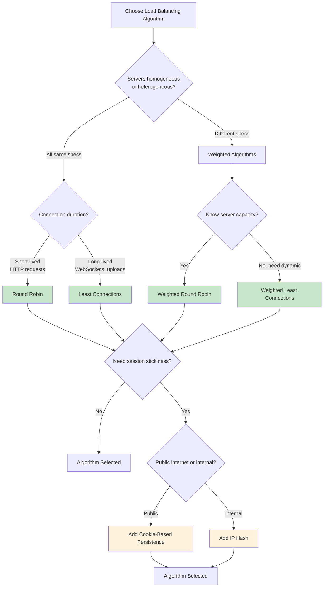
```mermaid
graph TB
    Start[Choose Load Balancing Algorithm] --> Q1{Servers homogeneous<br/>or heterogeneous?}

    Q1 -->|All same specs| Q2{Connection duration?}
    Q1 -->|Different specs| Weighted[Weighted Algorithms]

    Q2 -->|Short-lived<br/>HTTP requests| RR[Round Robin]
    Q2 -->|Long-lived<br/>WebSockets, uploads| LC[Least Connections]

    Weighted --> Q3{Know server capacity?}
    Q3 -->|Yes| WRR[Weighted Round Robin]
    Q3 -->|No, need dynamic| WLC[Weighted Least Connections]

    RR --> Q4{Need session stickiness?}
    LC --> Q4
    WRR --> Q4
    WLC --> Q4

    Q4 -->|No| Done1[Algorithm Selected]
    Q4 -->|Yes| Q5{Public internet or internal?}

    Q5 -->|Public| Cookie[Add Cookie-Based Persistence]
    Q5 -->|Internal| IP[Add IP Hash]

    Cookie --> Done2[Algorithm Selected]
    IP --> Done2

    style RR fill:#c8e6c9
    style LC fill:#c8e6c9
    style WRR fill:#c8e6c9
    style WLC fill:#c8e6c9
    style Cookie fill:#fff3e0
    style IP fill:#fff3e0
```

### Algorithm Selection Guide

```yaml
Decision_Matrix:
  Simple_Web_App:
    Characteristics:
      - "Stateless HTTP requests"
      - "All servers same specs"
      - "No session persistence needed"
    Recommendation: "Round Robin"
    Reason: "Simple, zero overhead, even distribution"

  E_Commerce_Platform:
    Characteristics:
      - "Shopping cart sessions"
      - "Need persistence"
      - "Public internet users"
    Recommendation: "Round Robin + Cookie-Based Persistence"
    Reason: "Even distribution with session stickiness"

  Microservices_API:
    Characteristics:
      - "Varying request complexity"
      - "Different server capacities"
      - "Auto-scaling"
    Recommendation: "Weighted Least Connections"
    Reason: "Accounts for heterogeneous servers and varying loads"

  File_Upload_Service:
    Characteristics:
      - "Long-lived connections (10+ minutes)"
      - "Varying upload sizes"
      - "Homogeneous servers"
    Recommendation: "Least Connections"
    Reason: "Prevents overloading servers with long uploads"

  Real_Time_Chat:
    Characteristics:
      - "WebSocket connections"
      - "Persistent connections"
      - "Need session affinity"
    Recommendation: "Least Connections + Cookie-Based Persistence"
    Reason: "Dynamic distribution with stickiness for WebSockets"

  Global_SaaS_Application:
    Characteristics:
      - "Worldwide users"
      - "Multiple data centers"
      - "Low latency critical"
    Recommendation: "GSLB (Geographic) + Regional Round Robin"
    Reason: "Route to nearest DC, then distribute within DC"

  High_Performance_API:
    Characteristics:
      - "Latency-sensitive"
      - "Servers have varying performance"
      - "Need best response time"
    Recommendation: "Least Response Time"
    Reason: "Routes to fastest server based on measured latency"

  Legacy_Datacenter:
    Characteristics:
      - "Mix of old and new hardware"
      - "Known server capacities"
      - "Manual management"
    Recommendation: "Weighted Round Robin"
    Reason: "Manually assign weights based on server specs"

  Critical_Production:
    Characteristics:
      - "Can't afford imbalance"
      - "Budget for complexity"
      - "Need ultimate accuracy"
    Recommendation: "Resource-Based Algorithm"
    Reason: "Routes based on actual CPU/memory/disk metrics"
```

### Quick Reference Decision Table

| Scenario | Primary Algorithm | Session Persistence | Health Check |
|----------|------------------|-------------------|--------------|
| **Simple stateless app** | Round Robin | None | L7 HTTP |
| **E-commerce** | Round Robin | Cookie-Based | L7 HTTP |
| **Microservices** | Weighted Least Connections | None (stateless) | L7 HTTP |
| **File uploads** | Least Connections | IP Hash or Cookie | L4 TCP |
| **WebSocket chat** | Least Connections | Cookie-Based | L7 HTTP |
| **Global app** | GSLB → Round Robin | Cookie-Based | L7 HTTP |
| **Mixed hardware** | Weighted Round Robin | As needed | L7 HTTP |
| **Ultra-critical** | Resource-Based | Cookie-Based | L7 HTTP + metrics |

---

## Key Takeaways

### Remember This

- **Load balancers enable horizontal scaling** - distribute traffic across multiple servers
- **Two primary objectives**: Scalability (handle more users) and High Availability (fault tolerance)
- **Health monitoring is critical** - L4 TCP checks vs L7 HTTP checks
- **Nine essential algorithms**: Each solves different problems
  - Round Robin: Simple default
  - Weighted Round Robin: Heterogeneous hardware
  - Least Connections: Long-lived connections
  - Weighted Least Connections: Best of both worlds
  - Least Response Time: Latency-optimized
  - Resource-Based: Ultimate accuracy
  - Geographic (GSLB): Global distribution
  - IP Hash: Simple stickiness
  - Cookie-Based: L7 session persistence
- **Netflix uses multi-layer LB**: GSLB → ELB → Zuul → Microservices
- **L4 vs L7 trade-off**: Speed (L4) vs Features (L7)
- **Choose based on context**: No one-size-fits-all solution

### Common Mistakes to Avoid

- **No health checks** - assuming all servers are always healthy
- **Using round robin for long connections** - causes uneven load
- **IP hash on public internet** - NAT/proxy issues
- **Forgetting SSL termination** - wasting server CPU on encryption
- **Single load balancer** - single point of failure
- **Not monitoring metrics** - connection counts, latency, error rates
- **Wrong algorithm choice** - using least connections for short HTTP requests
- **Ignoring session persistence** - breaking stateful apps

### Best Practices

```yaml
Production_Load_Balancer_Setup:
  Redundancy:
    - "Deploy load balancers in pairs (active-passive or active-active)"
    - "Multi-AZ deployment for cloud load balancers"

  Health_Checks:
    - "Use L7 HTTP health checks (not just TCP)"
    - "Check dependencies (database, cache) in /health endpoint"
    - "Set reasonable thresholds (3 failures = unhealthy)"

  Monitoring:
    - "Track active connections per server"
    - "Monitor p95/p99 latency"
    - "Alert on health check failures"
    - "Dashboard for traffic distribution"

  Security:
    - "SSL termination at load balancer"
    - "TLS 1.3 minimum"
    - "DDoS protection (rate limiting)"
    - "Web Application Firewall (WAF) integration"

  Configuration:
    - "Start with simple (round robin), evolve as needed"
    - "Enable connection draining for graceful shutdowns"
    - "Set appropriate timeouts"
    - "Use cookie-based persistence over IP hash for public apps"

  Scaling:
    - "Cloud LBs auto-scale (AWS ALB, GCP HTTP LB)"
    - "Software LBs: deploy multiple instances behind DNS"
    - "Monitor load balancer CPU/network utilization"
```

### Quick Reference: Default Recommendations

```yaml
Starting_Point:
  Default_Algorithm: "Round Robin"
  Default_Health_Check: "L7 HTTP GET /health"
  Default_Session_Persistence: "Cookie-Based (if needed)"
  Default_Type: "Cloud Load Balancer (AWS ALB for new projects)"
  Default_Layer: "L7 (application-level for web apps)"

Evolve_As_Needed:
  Heterogeneous_Servers: "Add weights → Weighted Round Robin"
  Long_Connections: "Switch to Least Connections"
  Performance_Critical: "Use Least Response Time"
  Global_Users: "Add GSLB layer"
  Ultimate_Accuracy: "Implement Resource-Based"
```

### The Load Balancing Journey

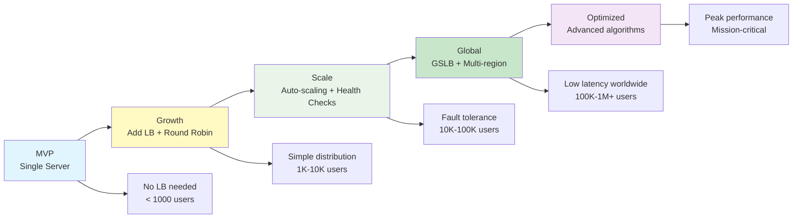
```mermaid
graph LR
    A[MVP<br/>Single Server] --> B[Growth<br/>Add LB + Round Robin]
    B --> C[Scale<br/>Auto-scaling + Health Checks]
    C --> D[Global<br/>GSLB + Multi-region]
    D --> E[Optimized<br/>Advanced algorithms]

    A --> A1[No LB needed<br/>< 1000 users]
    B --> B1[Simple distribution<br/>1K-10K users]
    C --> C1[Fault tolerance<br/>10K-100K users]
    D --> D1[Low latency worldwide<br/>100K-1M+ users]
    E --> E1[Peak performance<br/>Mission-critical]

    style A fill:#e1f5fe
    style B fill:#fff9c4
    style C fill:#e8f5e8
    style D fill:#c8e6c9
    style E fill:#f3e5f5
```

**Start simple, evolve as you grow**. Don't over-engineer for scale you don't have yet.

---

<div align="center">

[⏮ Previous: Episode 5](../05-stateless-stateful-systems/) | [Course Home](../../) | [⏭ Next: Episode 7](../07-coming-soon/)

</div>
