# Episode 7: Caching - Speeding Up Your Systems with Smart Memory

[](http://youtube.com/@ThatNotesGuy)

> **"There are only two hard things in Computer Science: cache invalidation and naming things." - Phil Karlton**

## What is Caching? The Core Idea

### Core Definition

**Caching** is the process of storing copies of frequently accessed data in a temporary, high-speed storage location (the "cache") closer to the requester.

The goal is simple but powerful: **avoid fetching data from slower, more distant, or computationally expensive sources** every single time.

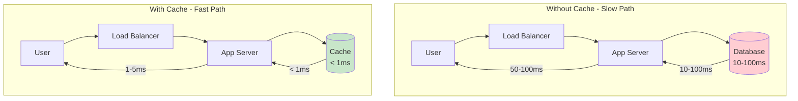
```mermaid
graph TB
    subgraph "Without Cache - Slow Path"
        U[User] --> LB[Load Balancer]
        LB --> AS[App Server]
        AS --> DB[(Database<br/>10-100ms)]
        DB -- 10-100ms --> AS
        AS -- 50-100ms --> U
        style DB fill:#ffcdd2
    end

    subgraph "With Cache - Fast Path"
        U2[User] --> LB2[Load Balancer]
        LB2 --> AS2[App Server]
        AS2 --> C[(Cache<br/>< 1ms)]
        C -- < 1ms --> AS2
        AS2 -- 1-5ms --> U2
        style C fill:#c8e6c9
    end
```

### The Performance Impact

```yaml
Performance_Comparison:
  Database_Query:
    Without_Cache: "10-100 milliseconds"
    With_Cache: "1-5 milliseconds"
    Speedup: "10-100x faster"

  API_Response:
    Without_Cache: "200-500 milliseconds"
    With_Cache: "10-50 milliseconds"
    Speedup: "5-50x faster"

  Static_Assets:
    Origin_Server: "50-200 milliseconds (depending on distance)"
    CDN_Cache: "5-20 milliseconds (nearby edge)"
    Speedup: "2-40x faster"

  Complex_Calculation:
    Without_Cache: "500-5000 milliseconds (full computation)"
    With_Cache: "1-10 milliseconds (cached result)"
    Speedup: "50-5000x faster"
```

### The Workshop Analogy

Think of caching like your **workshop setup**:

```yaml
Workshop_Analogy:
  Workbench:
    What: "Frequently used tools (hammer, screwdriver)"
    Location: "Right next to you"
    Access_Time: "Instant"
    Equivalent: "Application in-memory cache"

  Toolbox:
    What: "Less frequently used tools"
    Location: "Corner of workshop"
    Access_Time: "5 seconds to walk over"
    Equivalent: "Shared distributed cache (Redis)"

  Shed:
    What: "Rarely used tools, raw materials"
    Location: "Outside in the shed"
    Access_Time: "30 seconds to walk, find, return"
    Equivalent: "Database or external service"

  Store:
    What: "Need to buy new tools"
    Location: "Hardware store across town"
    Access_Time: "30 minutes round trip"
    Equivalent: "External API, third-party service"
```

### Key Benefits of Caching

```yaml
Caching_Benefits:
  Reduced_Latency:
    Description: "Data served from fast cache instead of slow origin"
    Impact: "10-100x faster response times"
    User_Experience: "Snappier applications"

  Increased_Throughput:
    Description: "System handles more requests per second"
    Impact: "2-10x more requests with same infrastructure"
    Scalability: "Better resource utilization"

  Reduced_Load:
    Description: "Fewer requests hit the backend"
    Impact: "50-90% reduction in database queries"
    Cost: "Lower infrastructure costs, fewer database licenses"

  Cost_Savings:
    Description: "Reduced computation and data transfer"
    Impact: "Lower cloud bills, fewer expensive API calls"
    Example: "Caching API responses saves $10,000/month at scale"

  Improved_Availability:
    Description: "Cache can serve data even if origin fails"
    Impact: "Graceful degradation during outages"
    Resilience: "Origin can be down, cache still serves stale data"
```

---

## Where Can Caching Happen? (Locations Overview)

Caching isn't a single technology—it's a strategy that can be implemented at multiple layers.

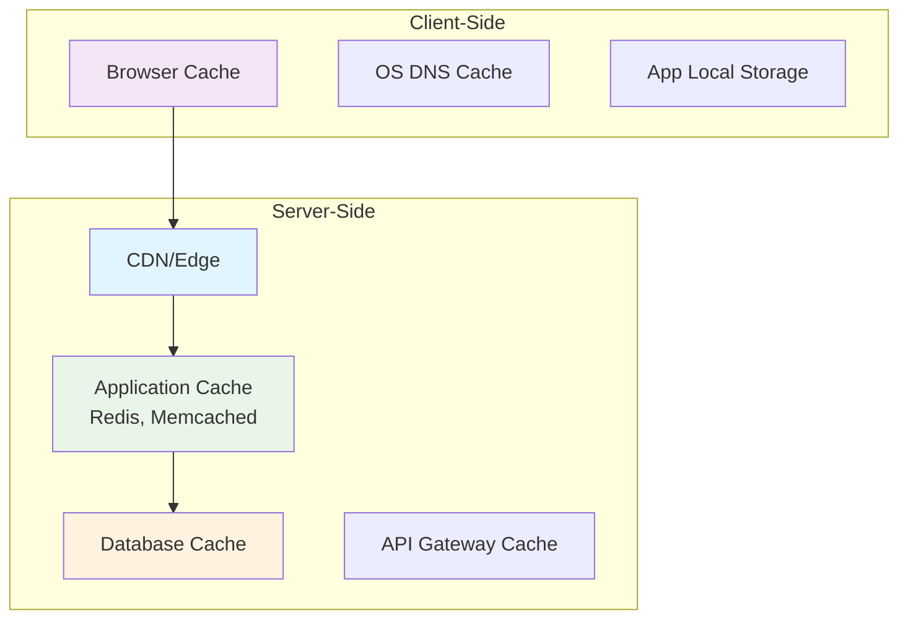
```mermaid
graph TB
    subgraph "Client-Side"
        B[Browser Cache]
        OS[OS DNS Cache]
        APP[App Local Storage]
    end

    subgraph "Server-Side"
        CDN[CDN/Edge]
        APP_CACHE[Application Cache<br/>Redis, Memcached]
        DB_CACHE[Database Cache]
        GW[API Gateway Cache]
    end

    B --> CDN
    CDN --> APP_CACHE
    APP_CACHE --> DB_CACHE

    style CDN fill:#e1f5fe
    style APP_CACHE fill:#e8f5e8
    style DB_CACHE fill:#fff3e0
    style B fill:#f3e5f5
```

### Caching Location Comparison

| Location | Speed | Scope | Control | Use Case |
|----------|-------|-------|---------|----------|
| **Browser Cache** | < 1ms | Single user | Low (HTTP headers) | Static assets, API responses |
| **CDN Cache** | 5-20ms | Global users | Medium | Static content, images, videos |
| **Application Cache** | 1-5ms | All app users | High | Database queries, API responses |
| **Database Cache** | 1-10ms | All queries | Medium | Query results, data blocks |
| **Browser Storage** | < 1ms | Single user | High | Offline data, preferences |

---

## Client-Side Caching: Empowering the User's Device

Client-side caching stores data directly on the user's device, providing the fastest possible access since no network request is needed.

### Browser Cache

```yaml
Browser_Cache:
  What_It_Stores:
    - "Static assets (images, CSS, JavaScript)"
    - "API responses (GET requests)"
    - "Fonts and icons"

  How_It_Works:
    - "HTTP headers control caching"
    - "Browser checks cache before making request"
    - "Cached resources served instantly"

  Key_Headers:
    Cache_Control:
      - "max-age: How long to cache (seconds)"
      - "no-cache: Must revalidate"
      - "no-store: Don't cache at all"
      - "public: Can be cached by any proxy"
      - "private: Only browser cache"

    Other_Headers:
      - "ETag: Version token for revalidation"
      - "Last-Modified: Timestamp for conditional requests"
      - "Vary: Headers that make cached response unique"

  Example:
    Request: "GET /static/app.js HTTP/1.1"

    Response: |
      HTTP/1.1 200 OK
      Cache-Control: public, max-age=31536000
      ETag: "abc123"
      Content-Type: application/javascript

    Browser_Behavior: "Store response, use on next request"
    Next_Request: "Browser sends: If-None-Match: abc123"
    Origin_Response: "304 Not Modified (no body sent!)"
```

**Cache Flow Diagram**:

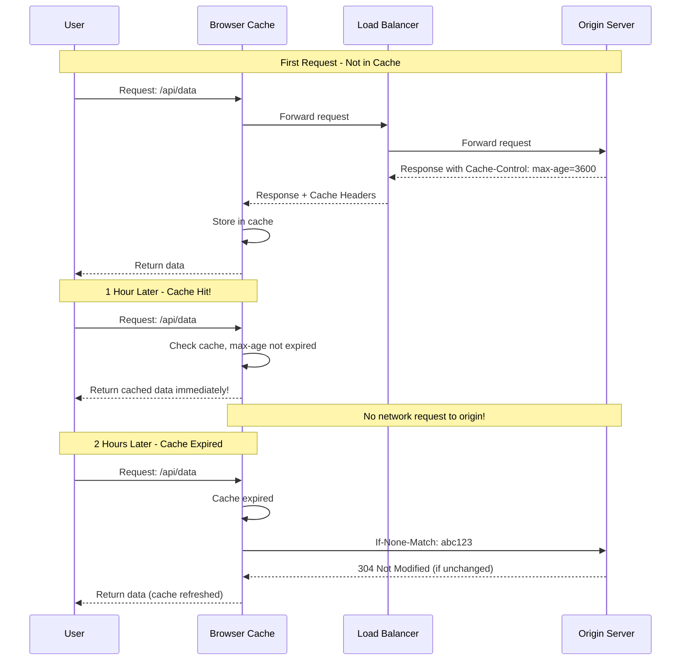
```mermaid
sequenceDiagram
    participant U as User
    participant B as Browser Cache
    participant LB as Load Balancer
    participant O as Origin Server

    Note over U,O: First Request - Not in Cache
    U->>B: Request: /api/data
    B->>LB: Forward request
    LB->>O: Forward request
    O-->>LB: Response with Cache-Control: max-age=3600
    LB-->>B: Response + Cache Headers
    B->>B: Store in cache
    B-->>U: Return data

    Note over U,B: 1 Hour Later - Cache Hit!
    U->>B: Request: /api/data
    B->>B: Check cache, max-age not expired
    B-->>U: Return cached data immediately!
    Note over B,O: No network request to origin!

    Note over U,B: 2 Hours Later - Cache Expired
    U->>B: Request: /api/data
    B->>B: Cache expired
    B->>O: If-None-Match: abc123
    O-->>B: 304 Not Modified (if unchanged)
    B-->>U: Return data (cache refreshed)
```

### Browser Cache Implementation

```javascript
// Server-side: Set cache headers properly

// Static assets - cache for 1 year
app.use('/static/', express.static('public', {
  maxAge: '365d',
  etag: true,
  lastModified: true
}));

// API responses - cache for 5 minutes with revalidation
app.get('/api/products', (req, res) => {
  // Check if client sent ETag
  if (req.headers['if-none-match']) {
    const products = getProducts();
    const etag = generateETag(products);
    if (req.headers['if-none-match'] === etag) {
      return res.status(304).end();  // Not Modified
    }
  }

  const products = getProducts();
  res.set({
    'Cache-Control': 'public, max-age=300',
    'ETag': generateETag(products)
  });
  res.json(products);
});

// Dynamic content - no caching
app.post('/api/cart', (req, res) => {
  res.set({
    'Cache-Control': 'no-store, private'
  });
  res.json({ /* response */ });
});
```

### Mobile App Cache

```yaml
Mobile_Cache_Strategies:
  Local_Storage:
    - "Key-value pairs (AsyncStorage in React Native)"
    - "Simple data, user preferences"
    - "Not encrypted by default"

  SQLite:
    - "Full database on device"
    - "Complex queries, structured data"
    - "Offline-first applications"

  Cache_Headers:
    - "Similar to browser caching"
    - "Control freshness of cached data"

  Offline_Support:
    - "Cache critical data for offline use"
    - "Sync when connection restored"

  Example_Use_Case:
    News_App: |
      - Cache articles for offline reading
      - Cache user preferences locally
      - Store last sync timestamp
      - Background sync when online
```

### DNS Cache

```yaml
DNS_Caching:
  What: "Domain name to IP address mappings"

  Where_Cached:
    - "Operating system (hosts file, DNS resolver)"
    - "Browser (Chrome, Firefox have DNS cache)"
    - "Router/modem"

  Why_It_Matters:
    - "First step in any network request"
    - "Saves 20-100ms per new domain"
    - "Reduces DNS server load"

  TTL_Duration:
    - "Typically 1 hour to 1 day"
    - "Controlled by DNS record's TTL setting"

  View_Cache:
    Mac: "sudo dscacheutil -cachedump"
    Linux: "nslookup -type=a example.com +short"
    Windows: "ipconfig /displaydns"
```

### Client-Side Cache: Pros and Cons

```yaml
Client_Side_Advantages:
  Speed: "Instant access, no network latency"
  Offline_Work: "Works without internet connection"
  Server_Load: "Zero impact on backend servers"
  Cost: "No infrastructure cost"

Client_Side_Disadvantages:
  Limited_Control: "Server can't force cache updates"
  Stale_Data: "Users may see old content"
  Limited_Size: "Device storage is constrained"
  Privacy: "Cached data on user device"
  Inconsistency: "Different users see different cached versions"
```

---

## Server-Side Caching: Optimizing Your Infrastructure

Server-side caching happens within your application infrastructure, giving you more control and consistency.

### Server-Side Caching Types Overview

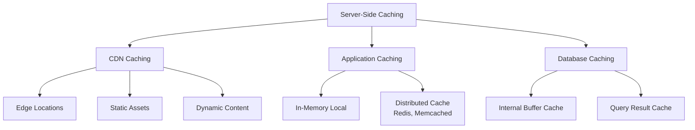
```mermaid
graph TB
    A[Server-Side Caching] --> B[CDN Caching]
    A --> C[Application Caching]
    A --> D[Database Caching]

    B --> B1[Edge Locations]
    B --> B2[Static Assets]
    B --> B3[Dynamic Content]

    C --> C1[In-Memory Local]
    C --> C2[Distributed Cache<br/>Redis, Memcached]

    D --> D1[Internal Buffer Cache]
    D --> D2[Query Result Cache]
```

---

## Server-Side Type 1: Content Delivery Network (CDN) Caching

A CDN is a geographically distributed network of servers that caches content closer to end-users.

### How CDN Caching Works

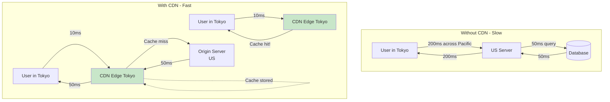
```mermaid
graph TB
    subgraph "Without CDN - Slow"
        U1[User in Tokyo] -->|"200ms across Pacific"| US[US Server]
        US -- 50ms query --> DB[(Database)]
        DB -- 50ms --> US
        US -- 200ms --> U1
    end

    subgraph "With CDN - Fast"
        U2[User in Tokyo] -->|"10ms"| EDGE[CDN Edge Tokyo]
        EDGE -->|"Cache hit!"| U2

        U3[User in Tokyo] -->|"10ms"| EDGE2[CDN Edge Tokyo]
        EDGE2 -->|"Cache miss"| ORIGIN[Origin Server<br/>US]
        ORIGIN -->|"50ms"| EDGE2
        EDGE2 -->|"50ms"| U3

        EDGE2 -.->|"Cache stored"| EDGE2
    end

    style EDGE fill:#c8e6c9
    style EDGE2 fill:#c8e6c9
```

### CDN Architecture

```yaml
CDN_Components:
  Edge_Locations:
    What: "Data centers around the world"
    Count: "100s to 1000s of locations"
    Purpose: "Cache content near users"

  Origin_Server:
    What: "Your primary web server"
    Purpose: "Source of truth, serves uncached requests"

  Point_of_Presence_POP:
    What: "Individual edge server location"
    Contains: "Caches, routing logic"

  Cache_Control:
    TTL: "Time to live in cache"
    Invalidated: "Manually or automatically"
```

### CDN Request Flow

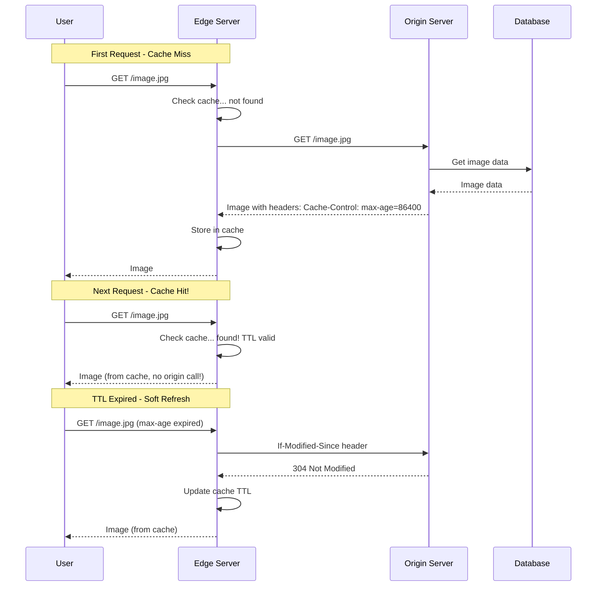
```mermaid
sequenceDiagram
    participant U as User
    participant E as Edge Server
    participant O as Origin Server
    participant D as Database

    Note over U,E: First Request - Cache Miss
    U->>E: GET /image.jpg
    E->>E: Check cache... not found
    E->>O: GET /image.jpg
    O->>D: Get image data
    D-->>O: Image data
    O-->>E: Image with headers: Cache-Control: max-age=86400
    E->>E: Store in cache
    E-->>U: Image

    Note over U,E: Next Request - Cache Hit!
    U->>E: GET /image.jpg
    E->>E: Check cache... found! TTL valid
    E-->>U: Image (from cache, no origin call!)

    Note over U,E: TTL Expired - Soft Refresh
    U->>E: GET /image.jpg (max-age expired)
    E->>O: If-Modified-Since header
    O-->>E: 304 Not Modified
    E->>E: Update cache TTL
    E-->>U: Image (from cache)
```

### CDN Providers

```yaml
CDN_Providers:
  Cloudflare:
    Pricing: "Free tier, paid plans $20-1000+/month"
    Features: "DDoS protection, WAF, serverless"
    Network: "300+ cities worldwide"

  AWS_CloudFront:
    Pricing: "Pay-as-you-go, ~$0.02/GB for first TB"
    Features: "Integration with AWS services, Lambda@Edge"
    Network: "600+ edge locations"

  Fastly:
    Pricing: "Pay-as-you-go, ~$0.02/GB"
    Features: "Real-time cache purging, VCL"
    Network: "100+ POPs"

  Akamai:
    Pricing: "Enterprise (expensive)"
    Features: "Largest network, media optimization"
    Network: "365,000+ servers in 135+ countries"

  Google_Cloud_CDN:
    Pricing: "Pay-as-you-go, integrated with GCP"
    Features: "Global anycast, HTTPS support"
    Network: "200+ edge locations"
```

### CDN Configuration Example

```yaml
# Cloudflare Page Rule for Caching
# URL: example.com/static/*
# Settings:
#   Cache Level: Cache Everything
#   Browser Cache TTL: 1 year
#   Edge Cache TTL: 1 month

# AWS CloudFront Distribution
Distribution:
  Origins:
    - Id: my-origin
      DomainName: myorigin.example.com
      OriginPath: /static

  DefaultCacheBehavior:
    TargetOriginId: my-origin
    ViewerProtocolPolicy: redirect-to-https
    AllowedMethods: [GET, HEAD]
    CachedMethods: [GET, HEAD]

    CachePolicyId: managed-caching-optimized
    # Managed policy includes:
    # - Query strings excluded from cache key
    # - Headers: None
    # - Min TTL: 0
    # - Max TTL: 31536000 (1 year)
    # - Default TTL: 86400 (1 day)

  PriceClass: PriceClass_All  # Use all edge locations

# NGINX CDN Configuration
server {
    listen 80;
    server_name cdn.example.com;

    location /static/ {
        proxy_pass http://origin_server;
        proxy_cache my_cache;
        proxy_cache_valid 200 1y;  # Cache successful responses for 1 year
        proxy_cache_use_stale error timeout;
        add_header X-Cache-Status $upstream_cache_status;
    }
}
```

### What to Cache on CDN

```yaml
CDN_Cache_Targets:
  Static_Assets:
    Images: "jpg, png, gif, webp, svg - cache 1 month to 1 year"
    CSS: "Stylesheets - cache 1 month to 1 year"
    JavaScript: "Scripts - cache 1 month to 1 year"
    Fonts: "woff, woff2 - cache 1 year (immutable)"

  API_Responses:
    Public_Data: "GET /api/public/* - cache 1-5 minutes"
    User_Specific: "NOT cached (privacy)"
    Personalized: "Use edge computing (Lambda@Edge)"

  Dynamic_Content:
    Variations: "Cached by country, device, language"
    Personalization: "Personalized at edge"

  Do_Not_Cache:
    Authenticated_Responses: "Contains user data"
    POST_PUT_DELETE: "Modifies data"
    Real_Time_Data: "Stock prices, live scores"
    Personalized_Content: "User-specific dashboards"
```

---

## Server-Side Type 2: Application-Level Caching

Application-level caching stores data directly within or alongside your application code.

### Types of Application Caches

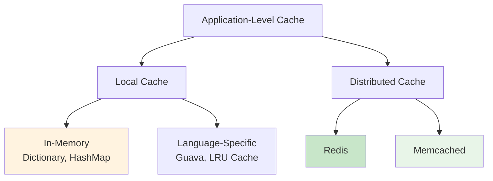
```mermaid
graph TB
    A[Application-Level Cache] --> L[Local Cache]
    A --> D[Distributed Cache]

    L --> LI[In-Memory<br/>Dictionary, HashMap]
    L --> LG[Language-Specific<br/>Guava, LRU Cache]

    D --> R[Redis]
    D --> M[Memcached]

    style R fill:#c8e6c9
    style M fill:#e8f5e8
    style LI fill:#fff3e0
```

### Local In-Memory Cache

```yaml
Local_Cache_Characteristics:
  Speed: "Fastest (no network call)"
  Scope: "Single application instance"
  Sharing: "Not shared across instances"
  Persistence: "Lost on restart"

  Use_Cases:
    - "Application configuration"
    - "Frequently accessed lookups"
    - "Computed values"

  Example_Tools:
    Python: "functools.lru_cache, cachetools"
    Java: "Guava Cache, Caffeine"
    Go: "groupcache, golang.org/x/sync/singleflight"
    Node.js: "node-cache, lru-cache"
```

**In-Memory Cache Examples**:

```python
# Python: functools.lru_cache
from functools import lru_cache
import time

@lru_cache(maxsize=128)
def expensive_computation(n):
    """Cache expensive function results"""
    print(f"Computing {n}...")
    time.sleep(1)  # Simulate expensive work
    return n * n

# First call - slow (computes)
result1 = expensive_computation(10)  # Prints "Computing 10...", waits 1s
print(f"Result: {result1}")

# Second call - fast (cached)
result2 = expensive_computation(10)  # Instant, returns cached result
print(f"Result: {result2}")

# Different argument - slow
result3 = expensive_computation(20)  # Prints "Computing 20...", waits 1s


# Python: cachetools with TTL
from cachetools import TTLCache

user_cache = TTLCache(maxsize=1000, ttl=300)  # 5 minute TTL

def get_user(user_id):
    if user_id in user_cache:
        return user_cache[user_id]

    user = database.query("SELECT * FROM users WHERE id = ?", user_id)
    if user:
        user_cache[user_id] = user
    return user
```

```java
// Java: Guava Cache with max size and TTL
import com.google.common.cache.*;

public class DataCache {
    private LoadingCache<String, DataObject> cache;

    public DataCache() {
        this.cache = CacheBuilder.newBuilder()
            .maximumSize(10_000)           // Max 10,000 entries
            .expireAfterWrite(10, TimeUnit.MINUTES)  // TTL: 10 minutes
            .recordStats()                  // Track hit/miss statistics
            .build(new CacheLoader<String, DataObject>() {
                @Override
                public DataObject load(String key) {
                    return fetchFromDatabase(key);  // Load on miss
                }
            });
    }

    public DataObject get(String key) {
        return cache.getUnchecked(key);
    }
}


// Java: Caffeine (modern Guava alternative)
import com.github.benmanes.caffeine.cache.*;

Cache<String, DataObject> cache = Caffeine.newBuilder()
    .maximumSize(10_000)
    .expireAfterWrite(10, TimeUnit.MINUTES)
    .recordStats()
    .build();

DataObject data = cache.get(key, k -> fetchFromDatabase(k));
```

### Distributed Cache (Redis & Memcached)

```yaml
Distributed_Cache_Characteristics:
  Speed: "Fast (1-5ms, in-memory)"
  Scope: "Shared across all instances"
  Sharing: "All application servers see same cache"
  Persistence: "Survives restarts (with persistence config)"
  High_Availability: "Cluster mode with replication"

  Use_Cases:
    - "Session storage"
    - "Database query cache"
    - "API response cache"
    - "Rate limiting counters"
    - "Leaderboards and counters"
```

**Redis vs Memcached Comparison**:

```yaml
Redis_vs_Memcached:
  Redis:
    Data_Structures: "Strings, Hash, List, Set, Sorted Set, Stream, HyperLogLog"
    Persistence: "RDB snapshots, AOF log"
    Clustering: "Native cluster support"
    Performance: "100,000+ ops/sec"
    Memory: "Efficient (compressed data types)"
    Use_Cases: "Sessions, queues, pub/sub, leaderboards"

  Memcached:
    Data_Structures: "Simple key-value only"
    Persistence: "None (pure memory)"
    Clustering: "Client-side sharding"
    Performance: "1,000,000+ ops/sec"
    Memory: "Simple slab allocator"
    Use_Cases: "Simple caching, no persistence needed"

  Decision_Guide:
    Use_Redis_When:
      - "Need complex data structures"
      - "Need data persistence"
      - "Need pub/sub messaging"
      - "Need sorted sets (leaderboards)"
      - "Need Lua scripting"

    Use_Memcached_When:
      - "Simple key-value caching"
      - "Maximum throughput needed"
      - "No persistence needed"
      - "Horizontal scaling with client sharding"
      - "Cost optimization (slightly lighter weight)"
```

**Redis Implementation Example**:

```python
import redis
from typing import Optional, Any

class RedisCache:
    def __init__(self, host='localhost', port=6379, db=0):
        self.redis = redis.Redis(
            host=host,
            port=port,
            db=db,
            decode_responses=True,
            socket_connect_timeout=5,
            socket_timeout=5
        )

    def get(self, key: str) -> Optional[Any]:
        """Get value from cache"""
        return self.redis.get(key)

    def set(self, key: str, value: Any, ttl: int = 3600) -> bool:
        """Set value in cache with TTL"""
        # Serialize complex types
        import json
        serialized = json.dumps(value)
        return self.redis.setex(key, ttl, serialized)

    def delete(self, key: str) -> int:
        """Delete key from cache"""
        return self.redis.delete(key)

    def exists(self, key: str) -> bool:
        """Check if key exists"""
        return self.redis.exists(key) > 0

    def get_or_set(self, key: str, fetch_fn, ttl: int = 3600) -> Any:
        """Get from cache or set using fetch function"""
        value = self.get(key)
        if value is not None:
            return value

        value = fetch_fn()
        self.set(key, value, ttl)
        return value

    # Cache database query results
    def cache_query(self, query: str, ttl: int = 300):
        """Decorator to cache query results"""
        def decorator(func):
            def wrapper(*args, **kwargs):
                cache_key = f"query:{hash(query)}:{args}:{kwargs}"
                result = self.get(cache_key)
                if result is not None:
                    return result

                result = func(*args, **kwargs)
                self.set(cache_key, result, ttl)
                return result
            return wrapper
        return decorator


# Usage
cache = RedisCache()

# Simple cache
cache.set("user:123", {"name": "Alice", "email": "alice@example.com"}, ttl=3600)
user = cache.get("user:123")

# Cache expensive operations
@cache.cache_query(ttl=60)
def get_product_stats(product_id):
    return database.query(f"""
        SELECT COUNT(*) as views,
               SUM(sales) as revenue
        FROM product_metrics
        WHERE product_id = {product_id}
    """)
```

**Memcached Implementation Example**:

```python
import pylibmc

class MemcachedCache:
    def __init__(self, servers=['127.0.0.1:11211']):
        self.client = pylibmc.Client(
            servers,
            binary=True,
            behaviors={
                "tcp_nodelay": True,
                "ketama": True,
            }
        )

    def get(self, key: str) -> bytes:
        return self.client.get(key)

    def set(self, key: str, value: bytes, ttl: int = 3600) -> bool:
        return self.client.set(key, value, time=ttl)

    def delete(self, key: str) -> bool:
        return self.client.delete(key)


# Usage
cache = MemcachedCache()

# Simple string caching (Memcached only stores bytes)
cache.set("page:home", b"<html>...</html>", ttl=300)
html = cache.get("page:home")

# Note: Memcached is simpler, no complex data types
```

### Application Cache Architecture

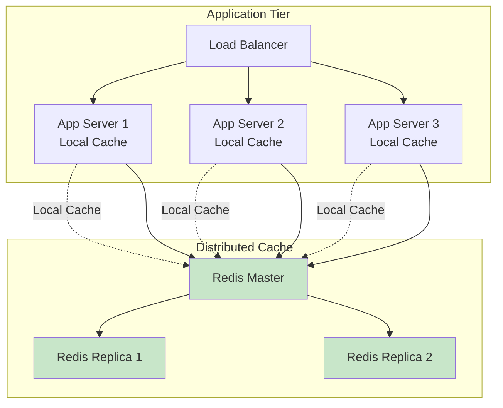
```mermaid
graph TB
    subgraph "Application Tier"
        LB[Load Balancer]

        A1[App Server 1<br/>Local Cache]
        A2[App Server 2<br/>Local Cache]
        A3[App Server 3<br/>Local Cache]
    end

    subgraph "Distributed Cache"
        R1[Redis Master]
        R2[Redis Replica 1]
        R3[Redis Replica 2]
    end

    R1 --> R2
    R1 --> R3

    LB --> A1
    LB --> A2
    LB --> A3

    A1 -.->|Local Cache| R1
    A2 -.->|Local Cache| R1
    A3 -.->|Local Cache| R1

    A1 --> R1
    A2 --> R1
    A3 --> R1

    style R1 fill:#c8e6c9
    style R2 fill:#c8e6c9
    style R3 fill:#c8e6c9
```

---

## Server-Side Type 3: Database Caching

Databases have sophisticated internal caching mechanisms to speed up data access.

### Database Cache Types

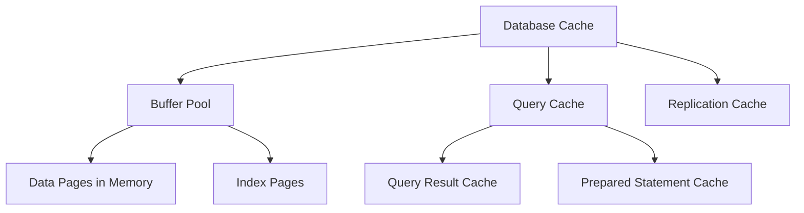
```mermaid
graph TB
    A[Database Cache] --> B[Buffer Pool]
    A --> C[Query Cache]
    A --> D[Replication Cache]

    B --> B1[Data Pages in Memory]
    B --> B2[Index Pages]

    C --> C1[Query Result Cache]
    C --> C2[Prepared Statement Cache]
```

### MySQL/PostgreSQL Buffer Pool

```yaml
Database_Buffer_Pool:
  What: "In-memory area for caching data and indexes"
  Why: "Disk I/O is 1000x slower than memory"

  MySQL_InnoDB:
    Configuration: "innodb_buffer_pool_size"
    Default: "128MB (too small for production!)"
    Recommended: "70-80% of RAM for dedicated DB"

    Contents:
      - "Data pages (actual table data)"
      - "Index pages (B-tree indexes)"
      - "Change buffer (pending writes)"
      - "Lock structures"
      - "Adaptive hash index"

  PostgreSQL:
    Configuration: "shared_buffers"
    Default: "128MB"
    Recommended: "25% of RAM (different from OS cache)"

    Effective_Cache_Size:
      Setting: "effective_cache_size"
      Purpose: "Planner estimate for available memory"
      Recommended: "75% of RAM"

  Cache_Hit_Ratio:
    Formula: "(cache_hits / (cache_hits + cache_misses)) * 100"
    Target: "> 95% for OLTP workloads"
    Monitor: "SHOW ENGINE INNODB STATUS (MySQL)"
```

**Database Cache Configuration**:

```sql
-- MySQL InnoDB Configuration
-- /etc/mysql/mysql.conf.d/mysqld.cnf

[mysqld]
# Buffer pool size - MOST IMPORTANT setting
innodb_buffer_pool_size = 16G  # 70-80% of RAM for dedicated DB

# How many threads to use for flushing
innodb_buffer_pool_instances = 8  # One per GB of buffer pool

# Flush method (Linux only)
innodb_flush_method = O_DIRECT

# Log file size
innodb_log_file_size = 1G
innodb_log_files_in_group = 2

# Flush policy (balance durability vs performance)
innodb_flush_log_at_trx_commit = 1  # Full durability (safer)
# innodb_flush_log_at_trx_commit = 2  # Better performance, risk of 1s data loss

-- Monitor buffer pool stats
SHOW ENGINE INNODB STATUS;

-- Check buffer pool hit ratio
SELECT
    (Innodb_buffer_pool_read_requests - Innodb_buffer_pool_reads)
    / Innodb_buffer_pool_read_requests * 100 as hit_ratio
FROM information_schema.INNODB_BUFFER_POOL_STATS;
```

```sql
-- PostgreSQL Configuration
-- postgresql.conf

# Shared buffers - 25% of RAM
shared_buffers = 4GB

# Effective cache size - 75% of RAM
effective_cache_size = 12GB

# Work memory - per operation
work_mem = 64MB  # For sorting, hashing

# Maintenance work memory
maintenance_work_mem = 1GB

# Checkpoint settings
checkpoint_completion_target = 0.9
wal_buffers = 64MB

-- Monitor cache hits
SELECT
    heap_blks_hit,
    heap_blks_read,
    (heap_blks_hit::float / NULLIF(heap_blks_hit + heap_blks_read, 0)) * 100 as hit_ratio
FROM pg_statio_user_tables
WHERE relname = 'my_table';
```

### Query Result Cache

```yaml
Query_Cache_Characteristics:
  What: "Stores complete results of SELECT queries"
  When_Used: "Identical query executed again"
  Requirements: "Same query (including whitespace and comments!)"

  MySQL_Query_Cache:
    Deprecated: "Removed in MySQL 8.0"
    Reason: "Lock contention, limited use cases"
    Alternative: "Application-level caching (Redis)"

  PostgreSQL:
    Built-in: "No (removed in v12)"
    Alternative: "pgpool-II or application cache"

  Application_Implementation:
    Pattern: "Cache common SELECT queries in Redis"
    Key: "Hash of normalized SQL query"
    TTL: "60-300 seconds for dynamic data"
    Example: "SELECT * FROM products WHERE category = 'electronics'"
```

**Application-Level Query Caching**:

```python
class ProductRepository:
    def __init__(self, db, cache):
        self.db = db
        self.cache = cache

    def get_products_by_category(self, category_id, limit=50):
        """Get products with query caching"""
        # Create normalized cache key
        cache_key = f"products:category:{category_id}:limit:{limit}"

        # Try cache first
        cached = self.cache.get(cache_key)
        if cached:
            return cached

        # Cache miss - query database
        query = """
            SELECT p.*, c.name as category_name
            FROM products p
            JOIN categories c ON p.category_id = c.id
            WHERE p.category_id = %s
            ORDER BY p.created_at DESC
            LIMIT %s
        """
        products = self.db.query(query, category_id, limit)

        # Store in cache (5 minutes TTL)
        self.cache.set(cache_key, products, ttl=300)

        return products

    def invalidate_category_cache(self, category_id):
        """Invalidate cache when products change"""
        pattern = f"products:category:{category_id}:*"
        # Redis SCAN to find and delete matching keys
        for key in self.cache.scan(pattern):
            self.cache.delete(key)
```

### Database Cache Architecture

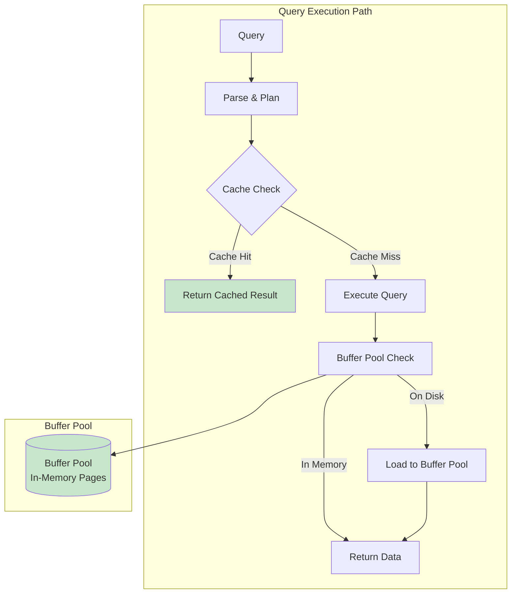
```mermaid
graph TB
    subgraph "Query Execution Path"
        Q[Query] --> P[Parse & Plan]
        P --> C{Cache Check}

        C -->|Cache Hit| R[Return Cached Result]
        C -->|Cache Miss| E[Execute Query]

        E --> B[Buffer Pool Check]
        B -->|In Memory| D[Return Data]
        B -->|On Disk| I[Load to Buffer Pool]
        I --> D
    end

    subgraph "Buffer Pool"
        B --> BP[(Buffer Pool<br/>In-Memory Pages)]
    end

    style BP fill:#c8e6c9
    style R fill:#c8e6c9
```

---

## Cache Eviction Policies: Making Room for New Data

When a cache is full and new data needs to be added, an existing item must be removed. The policy that decides which item to remove is the **eviction policy**.

### Common Eviction Policies

```yaml
Eviction_Policies:
  LRU:
    Full_Name: "Least Recently Used"
    Definition: "Remove item not accessed for longest time"
    Assumption: "Recently used items more likely to be used again"

  LFU:
    Full_Name: "Least Frequently Used"
    Definition: "Remove item accessed fewest times"
    Assumption: "Frequently accessed items are more valuable"

  FIFO:
    Full_Name: "First In, First Out"
    Definition: "Remove oldest item regardless of usage"
    Assumption: "Old items less relevant"

  TTL:
    Full_Name: "Time To Live"
    Definition: "Remove items after fixed time"
    Assumption: "Data expires based on freshness"

  Random:
    Definition: "Remove random item"
    Assumption: "When access pattern is uniform"
```

### Eviction Policy Visualization

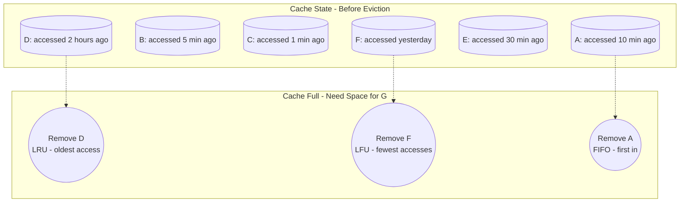
```mermaid
graph TB
    subgraph "Cache State - Before Eviction"
        C1[(A: accessed 10 min ago)]
        C2[(B: accessed 5 min ago)]
        C3[(C: accessed 1 min ago)]
        C4[(D: accessed 2 hours ago)]
        C5[(E: accessed 30 min ago)]
        C6[(F: accessed yesterday)]
    end

    subgraph "Cache Full - Need Space for G"
        E1((Remove D<br/>LRU - oldest access))

        E2((Remove F<br/>LFU - fewest accesses))

        E3((Remove A<br/>FIFO - first in))
    end

    C6 -.-> E2
    C4 -.-> E1
    C1 -.-> E3
```

### Policy Comparison

```yaml
Policy_Comparison:
  LRU:
    Best_For: "Most real-world access patterns"
    Pros: "Simple, efficient, works well with temporal locality"
    Cons: "Can be tricked by sequential scans"
    Memory_Overhead: "O(1) update with linked hashmap"
    Example: "Web page caching, session storage"

  LFU:
    Best_For: "Stable access patterns with clear hotspots"
    Pros: "Keeps truly popular items"
    Cons: "Cold start problem, skews toward old items"
    Memory_Overhead: "Must track access counts"
    Example: "Trending items, popular content"

  FIFO:
    Best_For: "Sequential data access, simple implementations"
    Pros: "Zero computation, just queue management"
    Cons: "Ignores access frequency"
    Memory_Overhead: "Queue only"
    Example: "Simple caching, buffering"

  TTL:
    Best_For: "Data with natural expiration"
    Pros: "Simple, automatic freshness"
    Cons: "May evict valid data too early"
    Memory_Overhead: "Timestamp per entry"
    Example: "Session tokens, rate limit windows"
```

### Implementing LRU Cache

```python
from collections import OrderedDict

class LRUCache:
    """Least Recently Used Cache implementation"""

    def __init__(self, capacity: int):
        if capacity < 1:
            raise ValueError("Capacity must be positive")
        self.capacity = capacity
        self.cache = OrderedDict()

    def get(self, key):
        """Get item, moving it to end (most recently used)"""
        if key not in self.cache:
            return None

        # Move to end (most recently used)
        self.cache.move_to_end(key)
        return self.cache[key]

    def put(self, key, value):
        """Put item, evicting LRU if necessary"""
        if key in self.cache:
            # Update existing, move to end
            self.cache.move_to_end(key)

        self.cache[key] = value

        # Evict LRU (first item) if over capacity
        if len(self.cache) > self.capacity:
            self.cache.popitem(last=False)

    def __contains__(self, key):
        return key in self.cache

    def __len__(self):
        return len(self.cache)


# Usage
cache = LRUCache(3)  # Capacity of 3

cache.put("a", 1)  # a: 1
cache.put("b", 2)  # a: 1, b: 2
cache.put("c", 3)  # a: 1, b: 2, c: 3

cache.get("a")     # Access a, moves to end

cache.put("d", 4)  # Evicts b (LRU), a: 1, c: 3, d: 4

print(cache.get("b"))  # None - was evicted!
```

### LRU vs LFU in Practice

```python
# Simulating different access patterns

class CacheSimulator:
    def simulate_lru(self, requests, capacity):
        cache = []
        hits = 0

        for item in requests:
            if item in cache:
                hits += 1
                # Move to end (most recently used)
                cache.remove(item)
                cache.append(item)
            else:
                if len(cache) >= capacity:
                    cache.pop(0)  # Remove first (least recently used)
                cache.append(item)

        return hits / len(requests)

    def simulate_lfu(self, requests, capacity):
        cache = {}  # {item: (value, frequency, timestamp)}
        hits = 0

        for i, item in enumerate(requests):
            if item in cache:
                hits += 1
                value, freq, _ = cache[item]
                cache[item] = (value, freq + 1, i)
            else:
                if len(cache) >= capacity:
                    # Find item with lowest frequency
                    lfu_item = min(cache.items(),
                                   key=lambda x: (x[1][1], x[1][2]))
                    del cache[lfu_item[0]]
                cache[item] = (f"value_{item}", 1, i)

        return hits / len(requests)


# Access pattern: "ABCABCABD"
# LRU vs LFU behavior is different!
#
# LRU: Favored temporal locality
# LFU: Favored frequency
```

---

## Cache Invalidation: Keeping Caches Fresh

Cache invalidation is often called the "hardest problem in computer science." When underlying data changes, cached copies must be updated or removed.

### Invalidation Strategies

```yaml
Invalidation_Strategies:
  Write_Through:
    Description: "Write to cache and database simultaneously"
    Consistency: "Always consistent"
    Performance: "Writes are slower"
    Use_Case: "Critical data that must not be lost"

  Write_Behind:
    Description: "Write to cache, async to database"
    Consistency: "Eventually consistent"
    Performance: "Fast writes"
    Risk: "Data loss if cache fails"
    Use_Case: "High-write workloads"

  TTL:
    Description: "Items automatically expire"
    Consistency: "Eventual (within TTL)"
    Performance: "Simple, automatic"
    Risk: "Stale data within TTL"
    Use_Case: "Data with natural staleness"

  Active_Invalidation:
    Description: "Explicitly invalidate when data changes"
    Consistency: "Immediate"
    Complexity: "Complex to implement"
    Risk: "Easy to miss cases"
    Use_Case: "When TTL is not acceptable"
```

### Write-Through Cache

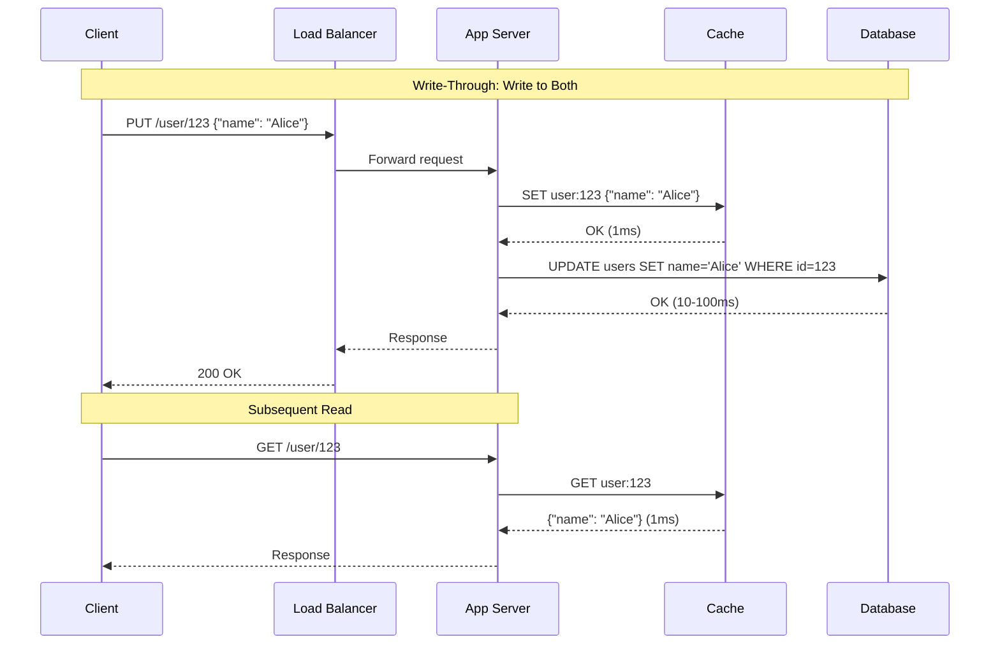
```mermaid
sequenceDiagram
    participant C as Client
    participant L as Load Balancer
    participant A as App Server
    participant Ca as Cache
    participant D as Database

    Note over C,D: Write-Through: Write to Both
    C->>L: PUT /user/123 {"name": "Alice"}
    L->>A: Forward request
    A->>Ca: SET user:123 {"name": "Alice"}
    Ca-->>A: OK (1ms)
    A->>D: UPDATE users SET name='Alice' WHERE id=123
    D-->>A: OK (10-100ms)
    A-->>L: Response
    L-->>C: 200 OK

    Note over C,A: Subsequent Read
    C->>A: GET /user/123
    A->>Ca: GET user:123
    Ca-->>A: {"name": "Alice"} (1ms)
    A-->>C: Response
```

**Implementation**:

```python
class WriteThroughCache:
    def __init__(self, cache, db):
        self.cache = cache
        self.db = db

    def write(self, key, value):
        """Write to both cache and database"""
        # Write to cache
        self.cache.set(key, value)

        # Write to database
        self.db.update(key, value)

        return value

    def read(self, key):
        """Read from cache first, fallback to database"""
        value = self.cache.get(key)

        if value is not None:
            return value

        # Cache miss - read from DB
        value = self.db.get(key)

        if value is not None:
            # Populate cache for next time
            self.cache.set(key, value)

        return value
```

### Write-Behind Cache (Write-Back)

```mermaid
sequenceDiagram
    participant C as Client
    participant A as App Server
    participant Ca as Cache
    participant Q as Write Queue
    participant D as Database

    Note over C,D: Write-Behind: Fast Async Writes
    C->>A: PUT /user/123 {"name": "Alice"}
    A->>Ca: SET user:123 {"name": "Alice"}
    Ca-->>A: OK (1ms)
    A-->>C: 200 OK (fast response!)

    Note over Ca,D: Background Sync
    Ca->>Q: Queue: UPDATE users SET name='Alice'
    Q->>D: Batch execute pending writes
    D-->>Q: OK

    rect rgb(255, 200, 200)
        Note over Ca,D: Risk: If cache fails before sync...
        Lost_Writes: "Some writes may be lost"
    end
```

**Implementation**:

```python
import queue
import threading
from collections import deque

class WriteBehindCache:
    def __init__(self, cache, db, batch_size=100, flush_interval=1):
        self.cache = cache
        self.db = db
        self.write_queue = queue.Queue()
        self.running = True

        # Background writer thread
        self.writer_thread = threading.Thread(
            target=self._background_writer,
            daemon=True
        )
        self.writer_thread.start()

    def write(self, key, value):
        """Write to cache immediately, queue for DB"""
        # Write to cache
        self.cache.set(key, value)

        # Queue for async database write
        self.write_queue.put(('upsert', key, value))

    def delete(self, key):
        """Delete from cache, queue for DB"""
        self.cache.delete(key)
        self.write_queue.put(('delete', key, None))

    def _background_writer(self):
        """Background process to write batches to database"""
        batch = []
        timer = 0

        while self.running:
            try:
                # Wait for items or timeout
                item = self.write_queue.get(timeout=0.1)
                batch.append(item)

                # Flush when batch is full or timer expires
                if len(batch) >= 100 or timer >= 1:
                    self._flush_batch(batch)
                    batch = []
                    timer = 0
                else:
                    timer += 0.1
            except queue.Empty:
                if batch:
                    self._flush_batch(batch)
                    batch = []
                    timer = 0

    def _flush_batch(self, batch):
        """Execute batch of writes to database"""
        if not batch:
            return

        try:
            self.db.batch_write(batch)
        except Exception as e:
            # Log error, could implement retry
            print(f"Batch write failed: {e}")
            # Re-queue failed items
            for item in batch:
                self.write_queue.put(item)
```

### TTL-Based Expiration

```python
from cachetools import TTLCache
import time

class TTLPolicy:
    """Time-based expiration for cached items"""

    def __init__(self):
        # Configurable TTLs per data type
        self.ttl_config = {
            'user': 3600,        # 1 hour
            'product': 300,      # 5 minutes
            'category': 900,     # 15 minutes
            'inventory': 60,     # 1 minute (changes frequently)
            'static_config': 86400  # 1 day
        }

        # Cache with TTL
        self.cache = TTLCache(maxsize=10000, ttl=300)  # Default 5 min

    def get_ttl(self, data_type):
        """Get TTL for specific data type"""
        return self.ttl_config.get(data_type, 300)

    def get(self, key, data_type='default'):
        """Get with type-specific TTL"""
        ttl = self.get_ttl(data_type)

        # Create type-specific cache if needed
        cache_key = f"{data_type}:{key}"
        return self.cache.get(cache_key)

    def set(self, key, value, data_type):
        """Set with type-specific TTL"""
        ttl = self.get_ttl(data_type)
        cache_key = f"{data_type}:{key}"
        self.cache[cache_key] = value
```

### Active Invalidation

```python
class ActiveInvalidation:
    """Explicit cache invalidation when data changes"""

    def __init__(self, cache):
        self.cache = cache
        # Track dependencies: data -> [dependent cache keys]
        self.dependencies = {}  # inverted index

    def set_with_dependencies(self, key, value, depends_on, ttl=3600):
        """Set cache value and track dependencies"""
        self.cache.set(key, value, ttl)

        # Register dependencies
        for dependency in depends_on:
            if dependency not in self.dependencies:
                self.dependencies[dependency] = set()
            self.dependencies[dependency].add(key)

    def invalidate(self, key):
        """Invalidate a key and all items that depend on it"""
        # Invalidate the key itself
        self.cache.delete(key)

        # Invalidate all dependent keys
        if key in self.dependencies:
            for dependent_key in self.dependencies[key]:
                self.cache.delete(dependent_key)
                # Also invalidate dependencies of dependents
                self._cascade_invalidate(dependent_key)
            del self.dependencies[key]

    def _cascade_invalidate(self, key):
        """Handle cascading invalidation"""
        if key in self.dependencies:
            for dependent_key in self.dependencies[key]:
                self.cache.delete(dependent_key)
                self._cascade_invalidate(dependent_key)


# Usage Example
invalidation = ActiveInvalidation(redis_cache)

# When user updates their profile
user_id = 123

# Invalidate all cached data depending on user 123
invalidation.invalidate(f"user:{user_id}")
invalidation.invalidate(f"user:{user_id}:profile")
invalidation.invalidate(f"users:list")  # All users list
```

### Invalidation Strategy Comparison

| Strategy | Consistency | Write Latency | Implementation | Data Loss Risk | Best For |
|----------|-------------|---------------|----------------|----------------|----------|
| **Write-Through** | Immediate | High (double write) | Medium | None | Critical data, banking |
| **Write-Behind** | Eventual | Very low (async) | Complex | Yes (cache failure) | High-write workloads |
| **TTL** | Eventual | Low | Simple | Stale data | Semi-static data |
| **Active** | Immediate | Medium | Very Complex | None | Low-latency consistency |

---

## Cache Design Patterns

### Cache-Aside (Lazy Loading)

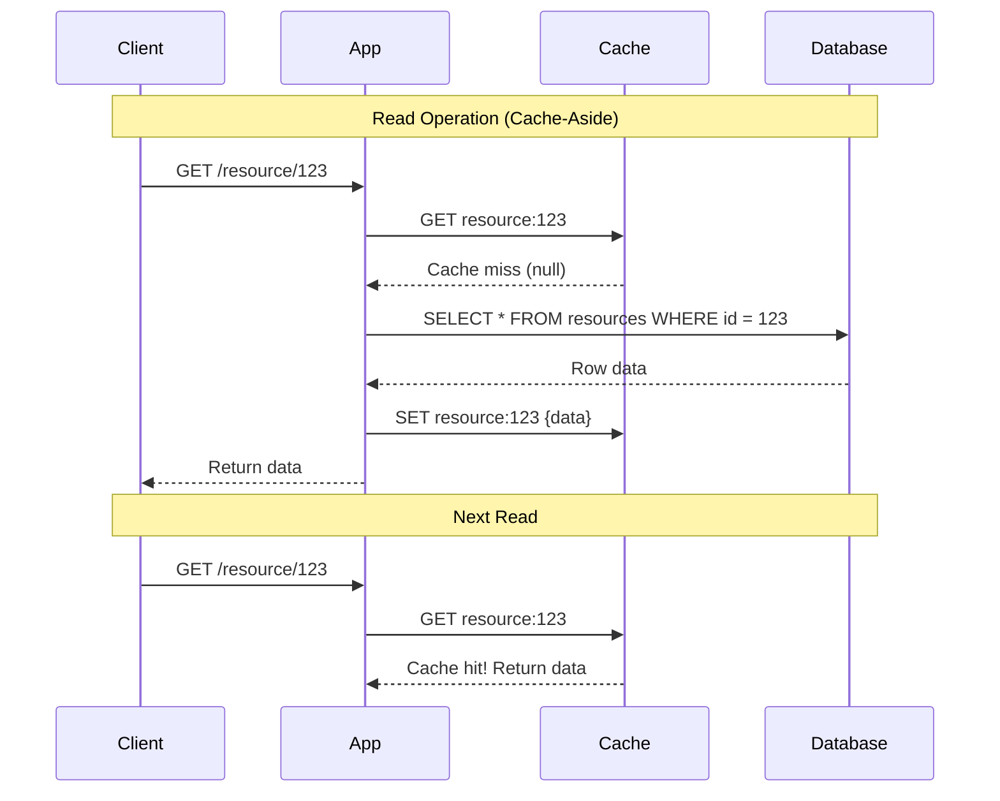
```mermaid
sequenceDiagram
    participant C as Client
    participant A as App
    participant Ca as Cache
    participant D as Database

    Note over C,D: Read Operation (Cache-Aside)
    C->>A: GET /resource/123
    A->>Ca: GET resource:123
    Ca-->>A: Cache miss (null)
    A->>D: SELECT * FROM resources WHERE id = 123
    D-->>A: Row data
    A->>Ca: SET resource:123 {data}
    A-->>C: Return data

    Note over C,D: Next Read
    C->>A: GET /resource/123
    A->>Ca: GET resource:123
    Ca-->>A: Cache hit! Return data
```

```python
class CacheAside:
    """Cache-Aside Pattern - Application manages cache"""

    def __init__(self, cache, db):
        self.cache = cache
        self.db = db

    def get(self, key):
        """Get from cache, fallback to database"""
        # Step 1: Try cache
        value = self.cache.get(key)
        if value is not None:
            return value

        # Step 2: Cache miss - get from database
        value = self.db.query(key)

        # Step 3: Populate cache
        if value is not None:
            self.cache.set(key, value)

        return value

    def set(self, key, value):
        """Write to database, invalidate cache"""
        # Step 1: Write to database
        self.db.write(key, value)

        # Step 2: Update or invalidate cache
        self.cache.set(key, value)

    def delete(self, key):
        """Delete from database and cache"""
        self.db.delete(key)
        self.cache.delete(key)

    def update(self, key, value):
        """Update - must invalidate to prevent stale reads"""
        self.db.update(key, value)
        self.cache.delete(key)  # MUST invalidate!
```

### Read-Through Cache

```python
class ReadThroughCache:
    """Read-Through Pattern - Cache loads itself"""

    def __init__(self, cache, db_loader):
        self.cache = cache
        self.db_loader = db_loader  # Function to load from DB

    def get(self, key):
        """Get from cache, cache loads on miss"""
        value = self.cache.get(key)

        if value is None:
            # Cache loads from database
            value = self.db_loader(key)
            if value is not None:
                self.cache.set(key, value)

        return value


# Usage
def load_user_from_db(user_id):
    return database.query("SELECT * FROM users WHERE id = ?", user_id)

cache = ReadThroughCache(redis, load_user_from_db)

# Single call - cache handles DB lookup on miss
user = cache.get(123)
```

### Refresh-Ahead Pattern

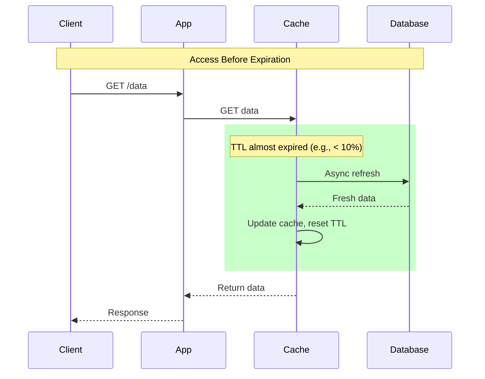
```mermaid
sequenceDiagram
    participant C as Client
    participant A as App
    participant Ca as Cache
    participant D as Database

    Note over C,D: Access Before Expiration
    C->>A: GET /data
    A->>Ca: GET data

    rect rgb(200, 255, 200)
        Note over Ca: TTL almost expired (e.g., < 10%)
        Ca->>D: Async refresh
        D-->>Ca: Fresh data
        Ca->>Ca: Update cache, reset TTL
    end

    Ca-->>A: Return data
    A-->>C: Response
```

```python
class RefreshAheadCache:
    """Refresh-Ahead - Proactively refresh expiring items"""

    def __init__(self, cache, db_loader, refresh_threshold=0.1):
        """
        refresh_threshold: Refresh when TTL is < 10% remaining
        """
        self.cache = cache
        self.db_loader = db_loader
        self.refresh_threshold = refresh_threshold

    def get(self, key):
        """Get with refresh-ahead logic"""
        # Get item and its TTL info
        item = self.cache.get(key, include_ttl=True)

        if item is None:
            # Cache miss - load synchronously
            value = self.db_loader(key)
            if value:
                self.cache.set(key, value)
            return value

        value, remaining_ttl = item
        total_ttl = self.cache.get_ttl(key)

        # Check if we should refresh ahead
        if remaining_ttl < total_ttl * self.refresh_threshold:
            # Trigger async refresh
            self._trigger_async_refresh(key)

        return value

    def _trigger_async_refresh(self, key):
        """Refresh cache in background"""
        import threading
        thread = threading.Thread(
            target=self._refresh_key,
            args=(key,)
        )
        thread.daemon = True
        thread.start()

    def _refresh_key(self, key):
        """Background refresh"""
        value = self.db_loader(key)
        if value:
            self.cache.set(key, value)
```

---

## The Thundering Herd Problem

When a popular cached item expires, all requests that were waiting for it might try to regenerate it simultaneously, overwhelming your backend.

### The Problem Illustrated

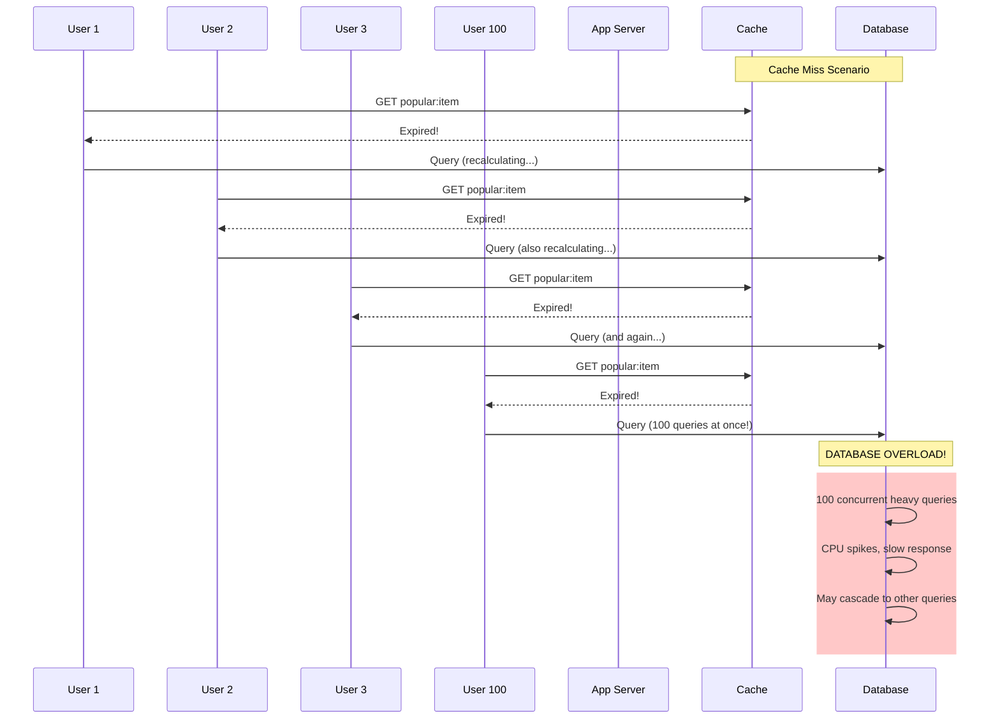
```mermaid
sequenceDiagram
    participant U1 as User 1
    participant U2 as User 2
    participant U3 as User 3
    participant U100 as User 100
    participant A as App Server
    participant Ca as Cache
    participant D as Database

    Note over Ca,D: Cache Miss Scenario

    U1->>Ca: GET popular:item
    Ca-->>U1: Expired!
    U1->>D: Query (recalculating...)

    U2->>Ca: GET popular:item
    Ca-->>U2: Expired!
    U2->>D: Query (also recalculating...)

    U3->>Ca: GET popular:item
    Ca-->>U3: Expired!
    U3->>D: Query (and again...)

    U100->>Ca: GET popular:item
    Ca-->>U100: Expired!
    U100->>D: Query (100 queries at once!)

    Note over D: DATABASE OVERLOAD!

    rect rgb(255, 200, 200)
        D->>D: 100 concurrent heavy queries
        D->>D: CPU spikes, slow response
        D->>D: May cascade to other queries
    end
```

### Solutions to Thundering Herd

```yaml
Thundering_Herd_Solutions:
  Single_Flight:
    Description: "Only one request recalculates, others wait for result"
    Implementation: "Use singleflight library or pattern"
    Benefit: "100 requests become 1"

  Probabilistic_Early_Expiration:
    Description: "Add jitter to TTL so items expire at different times"
    Implementation: "TTL = base + random(0, base * 0.1)"
    Benefit: "Expiration spread over time window"

  Staggered_TTL:
    Description: "Different items have different TTLs"
    Implementation: "Assign TTL based on item characteristics"
    Benefit: "Items don't all expire together"

  Background_Refresh:
    Description: "Refresh cache slightly before expiration"
    Implementation: "Refresh-Ahead pattern"
    Benefit: "Cache never expires from user perspective"

  Request_Coalescing:
    Description: "Batch similar requests"
    Implementation: "Wait for small window, batch requests"
    Benefit: "Multiple requests handled by single DB query"
```

### Single Flight Implementation

```python
from threading import Lock
from concurrent.futures import ThreadPoolExecutor

class SingleFlight:
    """Single Flight Pattern - deduplicate concurrent requests"""

    def __init__(self):
        self.in_flight = {}  # key -> (future, lock)
        self.lock = Lock()

    def execute(self, key, fetch_fn):
        """Execute fetch_fn, deduplicating concurrent requests"""
        with self.lock:
            if key in self.in_flight:
                # Another request is already fetching
                future = self.in_flight[key]
            else:
                # We're the first request for this key
                future = self.in_flight[key] = ThreadPoolExecutor().submit(fetch_fn)
                # Clean up when done
                future.add_done_callback(lambda f: self._remove(key))

        # Wait for the result (all concurrent requests block here)
        return future.result()

    def _remove(self, key):
        """Remove completed request from in-flight map"""
        with self.lock:
            if key in self.in_flight:
                del self.in_flight[key]


# Usage with caching
class CacheWithSingleFlight:
    def __init__(self, cache, single_flight):
        self.cache = cache
        self.single_flight = single_flight

    def get(self, key, fetch_fn):
        """Get from cache with single-flight deduplication"""

        # Try cache first
        cached = self.cache.get(key)
        if cached is not None:
            return cached

        # Cache miss - use single flight to prevent thundering herd
        return self.single_flight.execute(key, lambda: self._fetch_and_cache(key, fetch_fn))

    def _fetch_and_cache(self, key, fetch_fn):
        """Fetch from source and cache the result"""
        # Fetch from database/API
        result = fetch_fn()

        # Cache the result
        self.cache.set(key, result)

        return result


# Redis single-flight (using Lua script for atomicity)
SINGLE_FLIGHT_LUA = """
local key = KEYS[1]
local lock_key = key .. ":lock"

-- Try to acquire lock
local lock = redis.call('SETNX', lock_key, 1)
if lock == 1 then
    -- We have the lock, proceed
    redis.call('EXPIRE', lock_key, 10)  # 10 second lock timeout
    return 0  0 means we have the lock
else
    -- Someone else has the lock, wait
    return 1  1 means someone else is working
end
"""
```

### Probabilistic Early Expiration

```python
import random
import time

class ProbabilisticTTL:
    """Add jitter to prevent synchronized expiration"""

    def __init__(self, base_ttl, jitter_percent=0.1):
        """
        base_ttl: Expected TTL (e.g., 3600 seconds)
        jitter_percent: Random range as percent of base (e.g., 0.1 = 10%)
        """
        self.base_ttl = base_ttl
        self.jitter_range = base_ttl * jitter_percent

    def get_ttl(self):
        """Get TTL with random jitter"""
        # Varies between base and base + range
        return int(self.base_ttl + random.uniform(0, self.jitter_range))

    def get_ttl_range(self):
        """Get the valid TTL range"""
        return self.base_ttl, self.base_ttl + self.jitter_range


# Usage
ttl_policy = ProbabilisticTTL(base_ttl=3600, jitter_percent=0.1)

# Different items get different TTLs
for i in range(10):
    ttl = ttl_policy.get_ttl()
    print(f"Item {i}: TTL = {ttl} seconds")

# Output (example):
# Item 0: TTL = 3823 seconds
# Item 1: TTL = 3654 seconds
# Item 2: TTL = 3789 seconds
# ...
# Items expire spread over ~10 minutes instead of all at once
```

---

## Real-World Case Studies

### Case Study 1: Facebook - Multi-Level Caching Architecture

Facebook serves billions of requests using a sophisticated multi-tier caching architecture.

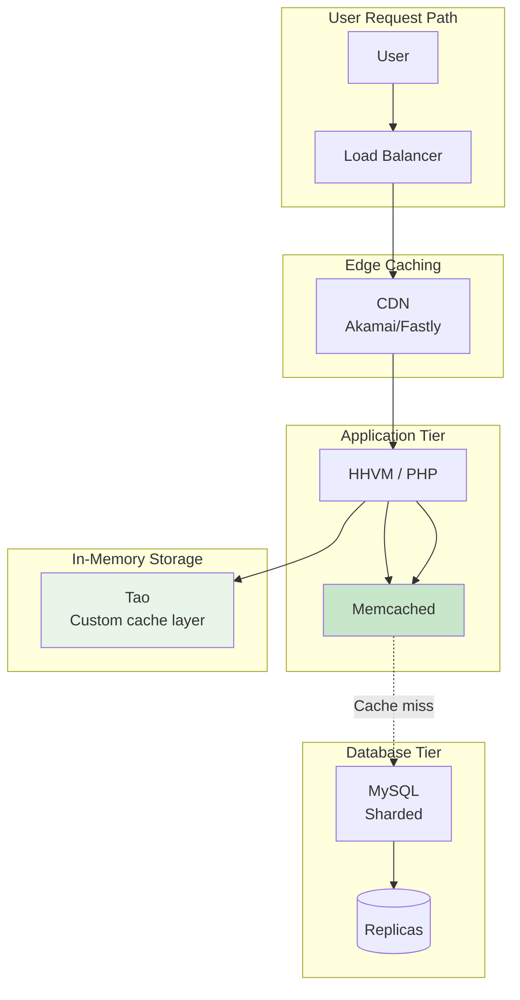
```mermaid
graph TB
    subgraph "User Request Path"
        U[User] --> LB[Load Balancer]
    end

    subgraph "Edge Caching"
        LB --> CD[CDN<br/>Akamai/Fastly]
    end

    subgraph "Application Tier"
        CD --> H[HHVM / PHP]
        H --> M[Memcached<br/>Thousands of nodes]
    end

    subgraph "Database Tier"
        H --> M[Memcached]
        M -.->|Cache miss| M2[MySQL<br/>Sharded]
        M2 --> R[(Replicas)]
    end

    subgraph "In-Memory Storage"
        H --> T[Tao<br/>Custom cache layer]
    end

    style M fill:#c8e6c9
    style T fill:#e8f5e8
```

**Facebook's Caching Strategy**:

```yaml
Facebook_Caching:
  Architecture:
    Web_Servers: "HHVM (PHP compiled to machine code)"
    Cache_Layer: "Memcached (thousands of nodes)"
    Custom_Layer: "Tao (social graph cache)"
    Database: "MySQL sharded across data centers"

  Cache_Tiers:
    L1_CDN: "Static assets, shared content"
    L2_L1_Memcached: "Query results, object cache"
    L3_Tao: "Social graph (friends, likes, feeds)"
    L4_MySQL: "Buffer pool, replication cache"

  Key_Innovations:
    Memcached_Pool: "30+ TB of cache across 800+ servers"
    Ta0: "Social graph cache with automatic fanout"
    Mcrouter: "Client-side routing for memcached cluster"
    Flashcache: "SSD-based cache between memory and disk"

  Scale_Numbers:
    Photos: "300+ million new photos per day"
    Queries_Per_Second: "Billions of cache operations"
    Cache_Hit_Rate: "> 99% for read operations"
    Data_Cached: "Terabytes of social graph data"
```

### Case Study 2: Netflix - Cache Everything

Netflix uses aggressive caching at every layer for their streaming platform.

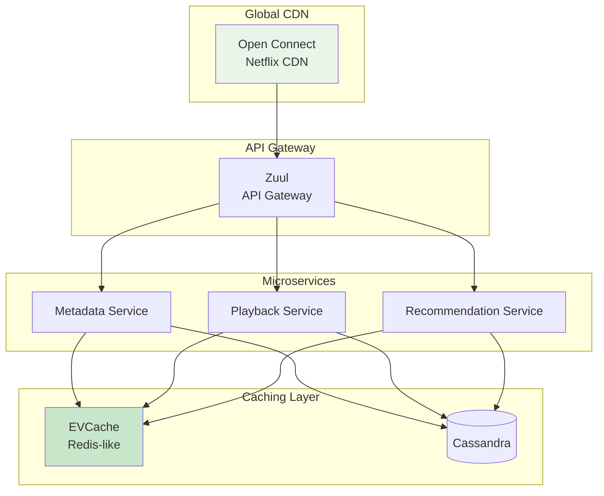
```mermaid
graph TB
    subgraph "Global CDN"
        O[Open Connect<br/>Netflix CDN]
    end

    subgraph "API Gateway"
        O --> Z[Zuul<br/>API Gateway]
    end

    subgraph "Microservices"
        Z --> MS1[Metadata Service]
        Z --> MS2[Playback Service]
        Z --> MS3[Recommendation Service]
    end

    subgraph "Caching Layer"
        MS1 --> EV[EVCache<br/>Redis-like]
        MS2 --> EV
        MS3 --> EV

        MS1 --> R[(Cassandra)]
        MS2 --> R
        MS3 --> R
    end

    style EV fill:#c8e6c9
    style O fill:#e8f5e8
```

**Netflix's Caching Strategy**:

```yaml
Netflix_Caching:
  Philosophy: "Cache everything, cache everywhere"

  CDN_Open_Connect:
    - "Custom CDN built on Open Connect Appliances"
    - "Stores popular content at ISPs worldwide"
    - "Edge servers cache video chunks"
    - "Hit rate: > 95% for video content"

  API_Gateway_Zuul:
    - "Route requests, authenticate"
    - "Rate limiting with Redis"
    - "Request/response caching"

  Microservice_Caching:
    EVCache:
      - "Redis + Memcached hybrid"
      - "Stores: User sessions, viewing history, metadata"
      - "Multi-region replication"
      - "99.9% cache hit rate"

  Key_Insights:
    - "Cache invalidation is hard → use TTL instead"
    - "Evict stale data automatically"
    - "Focus on high cache hit ratio"

  Scale:
    Streaming: "125 million+ subscribers"
    Videos: "Millions of titles"
    Requests: "Billions per day"
    Data_Cached: "Petabytes of video + metadata"
```

### Case Study 3: Amazon - DynamoDB Accelerator (DAX)

Amazon built DAX to provide microsecond read performance for DynamoDB.

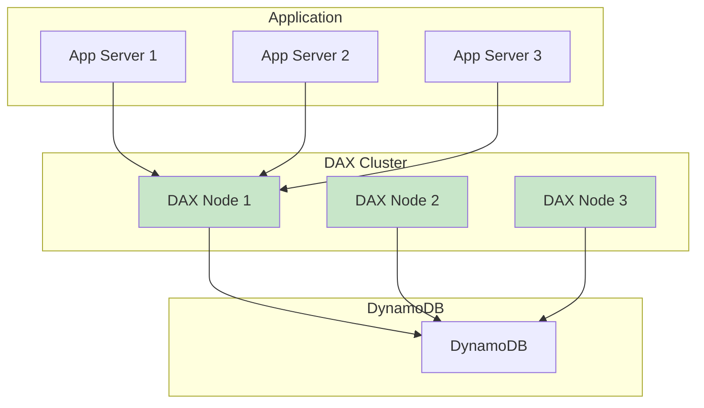
```mermaid
graph TB
    subgraph "Application"
        A1[App Server 1]
        A2[App Server 2]
        A3[App Server 3]
    end

    subgraph "DAX Cluster"
        D1[DAX Node 1]
        D2[DAX Node 2]
        D3[DAX Node 3]
    end

    subgraph "DynamoDB"
        D1 --> DDB[DynamoDB]
        D2 --> DDB
        D3 --> DDB
    end

    A1 --> D1
    A2 --> D1
    A3 --> D1

    style D1 fill:#c8e6c9
    style D2 fill:#c8e6c9
    style D3 fill:#c8e6c9
```

**Amazon DAX**:

```yaml
DAX_Characteristics:
  What: "In-memory cache for DynamoDB"

  Performance:
    Read_Latency: "Microseconds (vs 10-20ms for DynamoDB)"
    Throughput: "10x faster reads"

  Architecture:
    Fully_Managed: "No cache management"
    Compatible: "Drop-in replacement for DynamoDB API"
    HA: "Multi-AZ with automatic failover"

  How_It_Works:
    - "Sits between application and DynamoDB"
    - "Caches read results (GetItem, Query, Scan)"
    - "Cache hit: return immediately"
    - "Cache miss: read from DynamoDB, cache result"

  Use_Case: "Read-heavy workloads with microsecond requirements"

  Example_Impact:
    Without_DAX: "10ms average read latency"
    With_DAX: "0.5ms average read latency"
    Improvement: "20x faster reads"

  Limitations:
    - "Write-through not supported (eventual consistency)"
    - "TTL-based eviction"
    - "Not a general-purpose cache"
```

---

## Key Takeaways

### Remember This

- **Caching stores frequently accessed data in fast storage** to avoid expensive operations
- **Multi-level caching is essential**: CDN → Application Cache → Database Cache
- **Cache location matters**: Client-side (browser) vs. Server-side (Redis, CDN)
- **LRU is the most common eviction policy** (works well for most access patterns)
- **Cache invalidation is the hardest problem**: Choose TTL, Write-Through, or Active Invalidation
- **The Thundering Herd problem** occurs when popular cached items expire simultaneously
- **Always start simple**: Cache-Aside pattern with TTL
- **Measure your hit rate**: > 90% is typically good, > 99% is excellent

### Common Mistakes to Avoid

```yaml
Cache_Mistakes:
  No_Cache_Plan:
    Mistake: "Adding cache without strategy"
    Fix: "Define what to cache, TTL, invalidation strategy"

  Caching_Too_Much:
    Mistake: "Caching everything including rarely accessed data"
    Fix: "Cache the 80/20 - popular items only"

  Ignoring_Invalidation:
    Mistake: "Setting cache and forgetting about stale data"
    Fix: "Plan invalidation before implementation"

  Cache_Poisoning:
    Mistake: "Caching corrupted or error responses"
    Fix: "Don't cache error responses, use negative caching carefully"

  Cold_Start_Problem:
    Mistake: "Cache empty at startup causes DB overload"
    Fix: "Pre-warm cache, use graceful startup"

  Ignoring_Metrics:
    Mistake: "Deploying cache without monitoring"
    Fix: "Track hit rate, latency, memory usage, evictions"

  Stale_Data:
    Mistake: "Users seeing old content after updates"
    Fix: "Implement proper invalidation strategy"

  Hot_Keys:
    Mistake: "One very popular key causes overload"
    Fix: "Sharding, replication, request coalescing"
```

### Best Practices

```yaml
Caching_Best_Practices:
  Design:
    - "Start with cache-aside pattern"
    - "Use TTL for automatic expiration"
    - "Separate cache infrastructure from application"
    - "Plan for cache misses"

  Data_Selection:
    - "Cache reads more than writes"
    - "Cache expensive computations"
    - "Cache stable reference data"
    - "Avoid caching user-specific mutable data"

  Performance:
    - "Monitor cache hit ratio (target > 90%)"
    - "Set appropriate TTLs per data type"
    - "Use compression for large cached items"
    - "Batch cache operations when possible"

  Reliability:
    - "Circuit breaker pattern for cache failures"
    - "Graceful degradation when cache unavailable"
    - "Auto-scaling for cache clusters"
    - "Backup cache for disaster recovery"

  Security:
    - "Never cache sensitive user data on shared caches"
    - "Encrypt cache if containing sensitive data"
    - "Access controls on cache infrastructure"
    - "Audit cache access patterns"
```

### Quick Reference: Caching Decision Tree

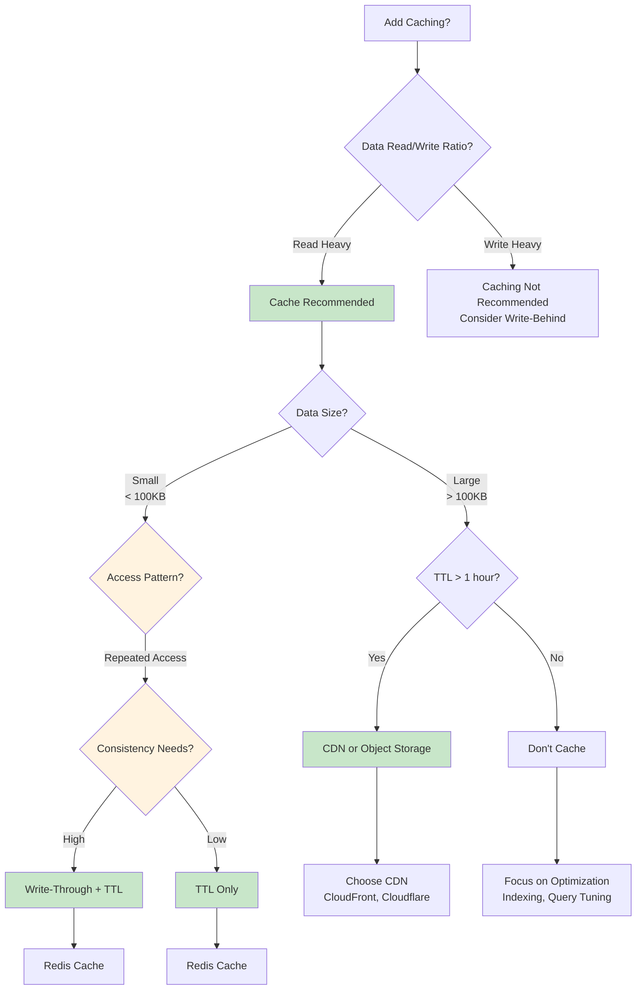
```mermaid
graph TB
    A[Add Caching?] --> B{Data Read/Write Ratio?}

    B -->|Read Heavy| C[Cache Recommended]
    B -->|Write Heavy| D[Caching Not Recommended<br/>Consider Write-Behind]

    C --> E{Data Size?}
    E -->|Small<br/>< 100KB| F{Access Pattern?}
    E -->|Large<br/>> 100KB| G{TTL > 1 hour?}

    F -->|Repeated Access| H{Consistency Needs?}

    G -->|Yes| I[CDN or Object Storage]
    G -->|No| J[Don't Cache]

    H -->|High| K[Write-Through + TTL]
    H -->|Low| L[TTL Only]

    I --> M[Choose CDN<br/>CloudFront, Cloudflare]
    J --> N[Focus on Optimization<br/>Indexing, Query Tuning]

    K --> O[Redis Cache]
    L --> P[Redis Cache]

    style C fill:#c8e6c9
    style F fill:#fff3e0
    style H fill:#fff3e0
    style K fill:#c8e6c9
    style L fill:#c8e6c9
    style I fill:#c8e6c9
```

### Architecture Evolution Path

```mermaid
graph LR
    A[No Cache<br/>Direct DB] --> B[Application Cache<br/>Local Memory]
    B --> C[Distributed Cache<br/>Redis]
    C --> D[Multi-Tier Cache<br/>CDN + Redis + DB]
    D --> E[Edge Computing<br/>Personalized at Edge]

    A --> A1["10K req/s<br/>DB at 80%"]
    B --> B1["15K req/s<br/>DB at 60%"]
    C --> C1["50K req/s<br/>DB at 20%"]
    D --> D1["100K req/s<br/>DB at 5%"]
    E --> E1["1M req/s<br/>Global scale"]

    style A fill:#ffcdd2
    style B fill:#fff9c4
    style C fill:#c8e6c9
    style D fill:#c8e6c9
    style E fill:#c8e6c9
```

**Path to Scale**:
1. **Start**: No cache, optimize queries first
2. **Growth**: Add application-level local cache
3. **Scale**: Introduce distributed cache (Redis)
4. **Global**: Add CDN for static assets
5. **Enterprise**: Multi-tier caching at all layers

---

<div align="center">

[⏮ Previous: Episode 6](../06-load-balancing/) | [Course Home](../../) | [⏭ Next: Episode 8](../08-coming-soon/)

</div>
