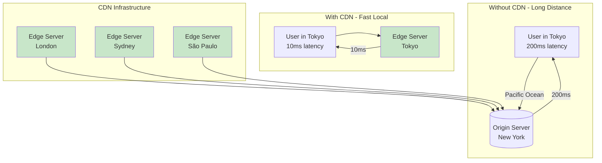
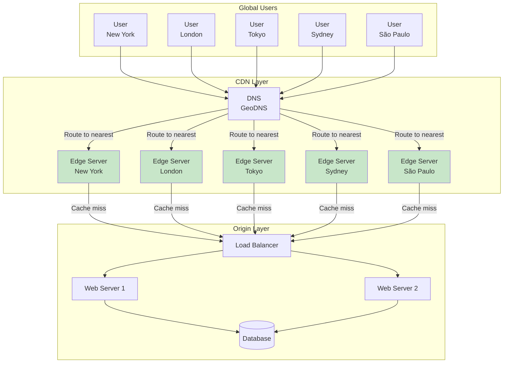
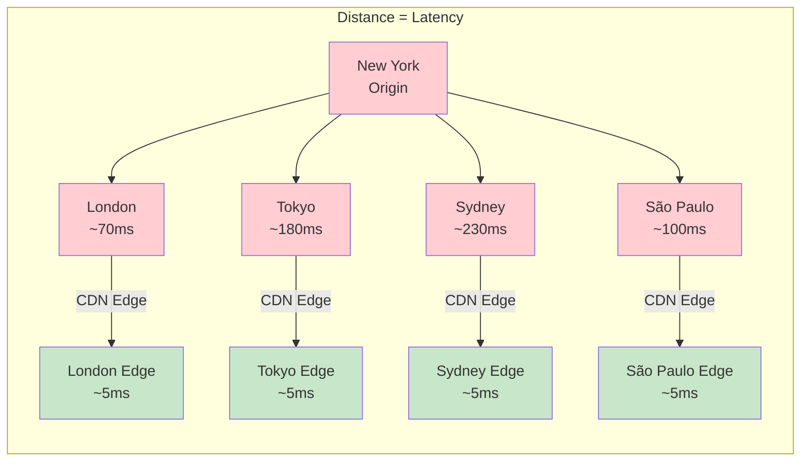
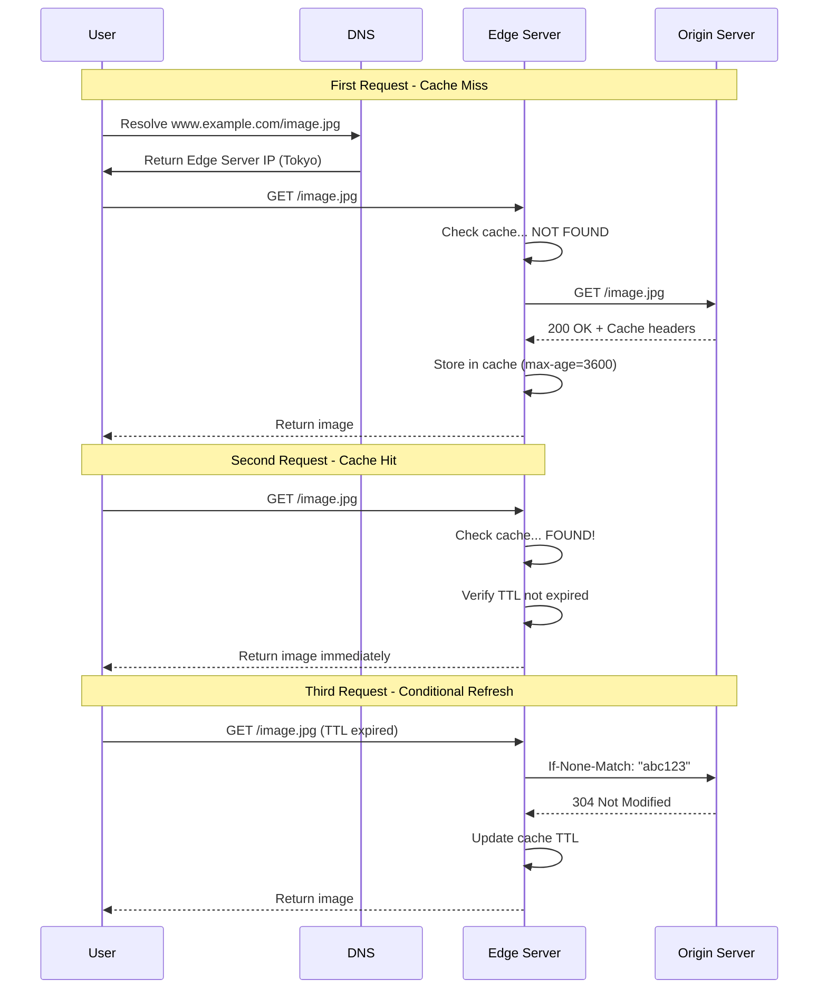
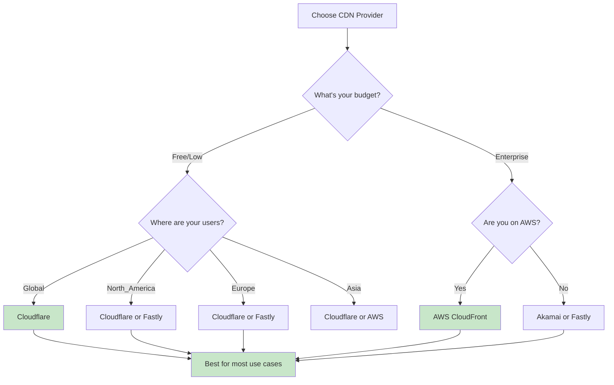
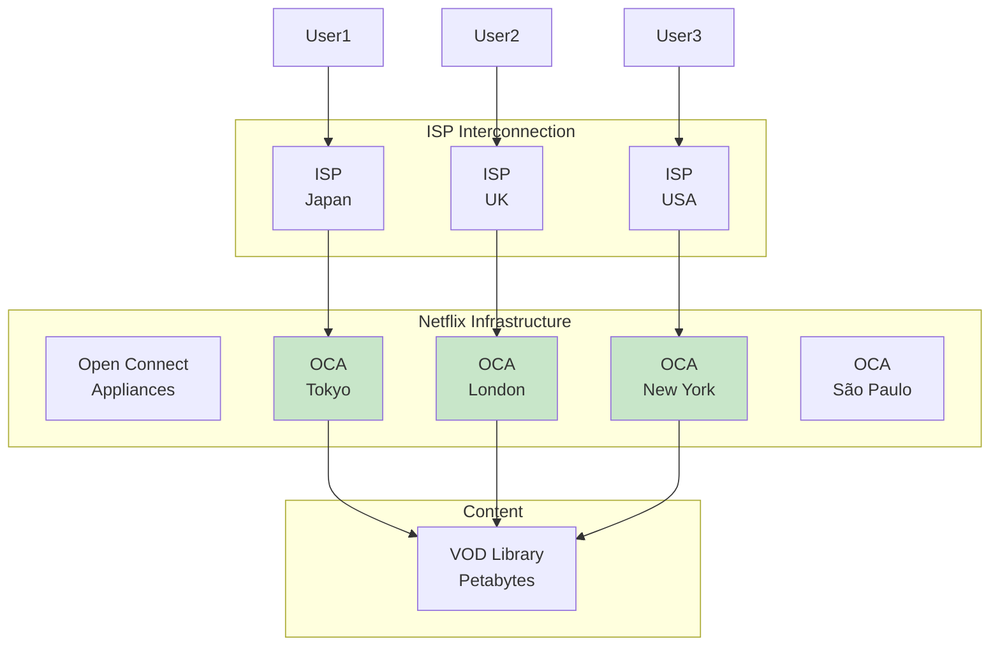
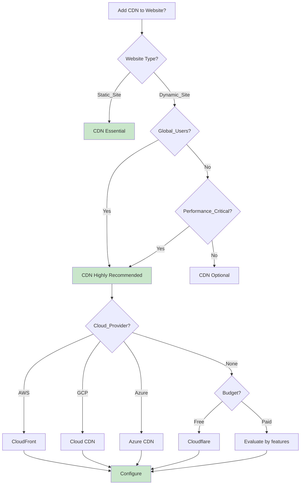
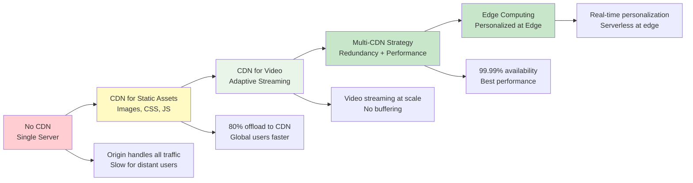

# Episode 8: CDNs Explained - Bringing Your Content Closer & Faster

[](http://youtube.com/@ThatNotesGuy)

## What is a CDN? The Core Concept

### Core Definition

A **Content Delivery Network (CDN)** is a geographically distributed network of proxy servers (called Edge Servers or Points of Presence - PoPs) that cache content closer to end-users.

The primary goal is to deliver web content with **high availability** and **high performance (low latency)**.



### The Library Analogy

```yaml
CDN_Analogy:
  Without_CDN:
    Scenario: "Single central library for entire city"
    User_Travel: "Across entire city for every book"
    Problem: "Long lines, slow service, overcrowding"

  With_CDN:
    Scenario: "One central library + many neighborhood branches"
    User_Travel: "Walk to local branch library"
    Benefit: "Fast service, distributed load, available copies"

  Technology_Equivalent:
    Central_Library: "Origin server (your web server)"
    Neighborhood_Branch: "CDN Edge Server / Point of Presence"
    Book: "Your website content (images, CSS, JS)"
    Librarian: "CDN edge server logic"
```

### CDN Architecture Overview



---

## Why Do We Need CDNs? The Problem of Distance

### Latency by Distance

```yaml
Latency_Examples:
  Origin_Server: "New York, USA"

  User_Locations:
    New_York: "10-20ms (local)"
    Los_Angeles: "60-80ms (cross-country)"
    London: "70-90ms (transatlantic)"
    Tokyo: "150-200ms (transpacific)"
    Sydney: "200-250ms (global)"

  Perceived_Impact:
    100ms: "Feels instantaneous"
    500ms: "Noticeable delay"
    1s: "User gets impatient"
    3s: "40% of users abandon"

  Business_Impact:
    1s_delay: "~7% conversion loss"
    100ms_delay: "~1% sales loss (Amazon)"
    Page_load_3s: "40% higher bounce rate"
```

### The Physical Reality



### The User Experience Impact

```yaml
User_Experience_Impact:
  Page_Load_Components:
    DNS_Lookup: "20-100ms"
    TCP_Connection: "30-60ms"
    SSL_Handshake: "50-100ms"
    First_Byte: "50-200ms (distance-dependent)"
    Content_Download: "Variable (file size / bandwidth)"

  Without_CDN:
    Tokyo_User_Image_Load: |
      DNS: 20ms
      TCP: 80ms
      SSL: 80ms
      First_Byte: 150ms
      Download: 50ms
      Total: ~380ms per asset

  With_CDN:
    Tokyo_User_Image_Load: |
      CDN Edge in Tokyo
      DNS: 5ms
      TCP: 5ms
      First_Byte: 2ms
      Download: 50ms
      Total: ~62ms per asset

  Improvement: "6x faster page loads"
```

---

## How CDNs Work: Edge Caching Explained

### The CDN Workflow



### Cache Hit vs Cache Miss Flow

```yaml
Cache_Flow_Decision:
  User_Request: "GET /static/image.jpg"

  Edge_Server_Check:
    Question_1: "Is item in cache?"
    No --> "Cache Miss - Fetch from origin"
    Yes --> Question_2: "Is TTL valid?"

    If_TTL_Valid:
      Action: "Return cached content (Cache HIT)"
      Latency: "~1-5ms"

    If_TTL_Expired:
      Action: "Conditional request to origin"
      Request: "If-None-Match or If-Modified-Since"
      Response_304: "Update TTL, return cache"
      Response_200: "Replace cache, return new content"

  Origin_Server_Response:
    Headers: |
      HTTP/1.1 200 OK
      Content-Type: image/jpeg
      Cache-Control: public, max-age=3600
      ETag: "abc123"
      Vary: Accept-Encoding
```

### Time to Live (TTL) Mechanics

```yaml
TTL_Behavior:
  Definition: "Time duration a cached item remains valid"

  TTL_Expired:
    State: "Cache entry is stale"
    Behavior: |
      Next request triggers revalidation
      May serve stale content briefly (stale-while-revalidate)

  TTL_Not_Expired:
    State: "Cache entry is fresh"
    Behavior: |
      Serve immediately without origin contact
      No network latency penalty

  Typical_TTLs:
    Images: "1 month to 1 year (immutable)"
    CSS_JS: "1 month to 1 year (versioned)"
    HTML: "1 minute to 1 hour (frequently changes)"
    API_Responses: "1-60 seconds (personalized)"
```

---

## Core Benefits of Using a CDN

### 1. Improved Website Load Times (Reduced Latency)

```yaml
Performance_Benefits:
  Geographic_Advantage:
    Users_Served: "From nearest edge server"
    Latency_Reduction: "50-90% reduction"
    Example: "Tokyo user: 180ms → 5ms"

  Concurrent_Requests:
    Browser_Limit: "6-8 connections per domain"
    CDN_Advantage: "Multiple domains, parallel downloads"
    Page_Load: "30-50% faster"

  Static_Assets:
    Images: "Optimized delivery, compression"
    Video: "Adaptive bitrate streaming"
    Files: "Chunked transfer encoding"
```

### 2. Reduced Bandwidth Costs

```yaml
Cost_Savings:
  Origin_Bandwidth:
    Without_CDN: "100% of traffic to origin"
    With_CDN: "5-20% of traffic to origin (static assets)"
    Savings: "80-95% reduction"

  Pricing_Model:
    CDN: "$0.02-0.10 per GB ( egress)"
    Origin: "$0.08-0.20 per GB (cloud bandwidth)"
    Savings: "50-80% on bandwidth bills"

  Example_Calculation:
    Monthly_Traffic: "10 TB"
    Without_CDN: "$800 (at $0.08/GB)"
    With_CDN: "$200 (at $0.02/GB)"
    Annual_Savings: "$7,200"
```

### 3. Increased Availability & Redundancy

```yaml
Availability_Benefits:
  Origin_Failure:
    Scenario: "Origin server goes down"
    Without_CDN: "100% site unavailable"
    With_CDN: "CDN serves cached content"

  Traffic_Spikes:
    Scenario: "10x normal traffic (viral content)"
    Without_CDN: "Origin overwhelmed, site crashes"
    With_CDN: "CDN absorbs traffic, serves from cache"

  Always_Online:
    Feature: "Some CDNs serve stale content if origin down"
    Trade_Off: "Slightly stale data vs complete outage"

  Redundancy:
    Single_Point_Failure: "Eliminated"
    Geographic_Failure: "Other regions unaffected"
```

### 4. Improved Website Security

```yaml
Security_Benefits:
  DDoS_Protection:
    Volume_Attacks: "CDN absorbs Tbps of traffic"
    Network_Layer: "Distributed protection"
    Mitigation: "Automatic detection and filtering"

  Web_Application_Firewall:
    OWASP_Top_10: "SQL injection, XSS, CSRF"
    Bot_Protection: "Challenge suspicious traffic"
    Rule_Updates: "Managed by CDN provider"

  SSL_TLS:
    Free_SSL: "Let's Encrypt integration"
    Modern_Protocols: "TLS 1.3 support"
    Certificate_Management: "Automated rotation"

  Edge_Security:
    Rate_Limiting: "Prevent brute force"
    IP_Reputation: "Block malicious actors"
    Geo_Blocking: "Restrict by country"
```

### 5. Better Scalability

```yaml
Scalability_Benefits:
  Offload_Origin:
    Static_Assets: "80-90% offloaded to CDN"
    Dynamic_Requests: "10-20% for origin"
    Result: "Origin handles less traffic"

  Traffic_Handling:
    CDN_Capacity: "Tbps per provider"
    Automatic_Scaling: "No capacity planning needed"
    Burst_Handling: "Viral content supported"

  Global_Scale:
    New_Regions: "Automatic CDN presence"
    User_Growth: "No infrastructure changes"
    Peak_Events: "Black Friday, product launches"
```

## What Content Should You Cache on a CDN?

### Ideal Candidates for CDN Caching

```yaml
Static_Assets:
  Images:
    Formats: "JPEG, PNG, GIF, WebP, AVIF"
    Size: "1KB to 10MB per image"
    TTL: "1 month to 1 year"
    Cache_Busting: "Hash or version in filename"

  Videos:
    Formats: "MP4, WebM, HLS, DASH"
    Size: "100KB to several GB"
    Streaming: "Adaptive bitrate delivery"
    TTL: "1 year (immutable)"

  CSS_JavaScript:
    Formats: ".css, .js, .min.js, .map"
    Size: "1KB to several MB"
    Versioning: "File names with hashes"
    TTL: "1 month to 1 year"

  Fonts:
    Formats: "WOFF2, WOFF, TTF"
    Variation: "Regular, Bold, Italic"
    TTL: "1 year (immutable)"

  Documents:
    Formats: "PDF, DOCX, ZIP"
    Downloadable: "Static files"
    TTL: "1 month to 1 year"
```

### Dynamic Content Caching

```yaml
Dynamic_Content:
  Cacheable_With_Care:
    API_Responses: |
      - GET /api/products (TTL: 60s)
      - GET /api/categories (TTL: 5m)
      - NOT /api/cart/* (personalized)

    HTML_Fragments: |
      - Header (same for all users)
      - Footer
      - Sidebar widgets
      - Product listings

    Server_Side_Includes:
      Edge_Side_Includes_ESI: |
        <esi:include src="/header.html"/>
        <esi:include src="/product-list"/>
        <esi:include src="/footer.html"/>

  Not_Cacheable:
    - POST, PUT, DELETE responses
    - Authenticated user-specific data
    - Real-time data (stock prices, scores)
    - Form submissions
    - API responses with user data
```

### Content Type Decision Tree

```mermaid
graph TB
    A[New Content] --> B{Is it personalized?}

    B -->|Yes| C[Do not cache on CDN]
    B -->|No| D{How often does it change?}

    D -->|Never (Immutable)| E[Cache: 1 year]
    D -->|Rarely (Weekly+)| F[Cache: 1 day to 1 week]
    D -->|Frequently (Hourly)| G[Cache: 5-60 minutes]
    D -->|Constantly (Real-time)| H[Do not cache]

    E --> I[Static Assets<br/>Images, CSS, JS, Fonts]
    F --> J[Versioned Releases<br/>App updates, Assets]
    G --> K[Semi-Dynamic<br/>API responses, HTML fragments]
    H --> L[Dynamic API<br/>User data, Real-time]

    style C fill:#ffcdd2
    style H fill:#ffcdd2
    style I fill:#c8e6c9
    style J fill:#c8e6c9
    style K fill:#fff3e0
```

---

## Cache Control & Invalidation Strategies

### HTTP Cache-Control Headers

```yaml
Cache_Control_Headers:
  max_age:
    Description: "How long to cache in seconds"
    Example: "max-age=3600 (1 hour)"
    Behavior: "Serve from cache until expired"

  s_maxage:
    Description: "Max age for shared caches (CDN)"
    Example: "s-maxage=86400 (1 day)"
    Behavior: "Overrides max-age for CDN"

  public_vs_private:
    Public: "Can be cached by any proxy"
    Private: "Only browser cache, not CDN"
    Use_Case: "Public for static, Private for user data"

  no_cache:
    Description: "Must revalidate before serving"
    Behavior: "Check with origin, serve fresh if changed"
    Use_Case: "Freshness important, reduce origin requests"

  no_store:
    Description: "Do not cache at all"
    Behavior: "Every request goes to origin"
    Use_Case: "Sensitive data, real-time content"

  must_revalidate:
    Description: "Must check freshness when expired"
    Behavior: "No serving stale content"
    Use_Case: "Data must be current"
```

### Cache Header Examples

```http
-- Static Image (1 year cache)
HTTP/1.1 200 OK
Content-Type: image/jpeg
Cache-Control: public, max-age=31536000, immutable
ETag: "abc123def456"
Last-Modified: Wed, 12 Jan 2023 00:00:00 GMT

-- CSS File (1 month, revalidate)
HTTP/1.1 200 OK
Content-Type: text/css
Cache-Control: public, max-age=2592000
ETag: "xyz789"
Vary: Accept-Encoding

-- HTML Page (5 minutes)
HTTP/1.1 200 OK
Content-Type: text/html
Cache-Control: public, max-age=300
ETag: "html123"

-- User Data (never cache)
HTTP/1.1 200 OK
Content-Type: application/json
Cache-Control: no-store, private

-- API Response (60 seconds)
HTTP/1.1 200 OK
Content-Type: application/json
Cache-Control: public, max-age=60
ETag: "api456"
```

### Conditional Requests (ETags)

```yaml
ETag_Mechanism:
  Purpose: "Validate content without full download"

  Flow:
    Step_1: "First request - Origin sends ETag"
    Step_2: "Edge stores content + ETag"
    Step_3: "User requests same content"
    Step_4: "Edge sends: If-None-Match: ETag"
    Step_5: "Origin compares ETags"
    Step_6: "If same: 304 Not Modified (no body)"
    Step_6: "If different: 200 OK + full content"

  Bandwidth_Saving:
    Full_Response: "500KB image"
    304_Response: "200 bytes"
    Savings: "99.96%"
```

### Cache Invalidation Methods

```yaml
Invalidation_Strategies:
  1_Purging:
    Description: "Manually remove specific content"
    Methods: |
      - Dashboard purge button
      - API call to purge
      - URL pattern matching
    Use_Case: "Urgent bug fix, security update"

  2_Versioning:
    Description: "Change filename on update"
    Example: "style.css → style-v2.css"
    Behavior: "New file = new cache entry"
    Use_Case: "Front-end releases"

  3_TTL_Expiration:
    Description: "Let cache expire naturally"
    Behavior: "Fresh content after TTL"
    Use_Case: "Non-urgent updates"

  4_Cache_Tags:
    Description: "Tag related content, purge by tag"
    Example: "Purge all /products/* pages"
    Use_Case: "Category updates, batch changes"

  5_Stale_While_Revalidate:
    Description: "Serve stale, fetch fresh in background"
    Header: "Stale-while-revalidate=86400"
    Behavior: "Fast response, eventual consistency"
    Use_Case: "Balance freshness and speed"
```

### Invalidation Implementation

```python
# CDN Cache Purging Examples

# CloudFlare API Purge
import requests

class CloudFlarePurge:
    def __init__(self, api_token, zone_id):
        self.api_token = api_token
        self.zone_id = zone_id
        self.base_url = "https://api.cloudflare.com/client/v4"

    def purge_files(self, file_urls):
        """Purge specific files from cache"""
        headers = {
            "Authorization": f"Bearer {self.api_token}",
            "Content-Type": "application/json"
        }
        data = {"files": file_urls}
        response = requests.post(
            f"{self.base_url}/zones/{self.zone_id}/purge_cache",
            json=data,
            headers=headers
        )
        return response.json()

    def purge_everything(self):
        """Purge entire cache (use carefully!)"""
        headers = {
            "Authorization": f"Bearer {self.api_token}",
            "Content-Type": "application/json"
        }
        data = {"purge_everything": True}
        response = requests.post(
            f"{self.base_url}/zones/{self.zone_id}/purge_cache",
            json=data,
            headers=headers
        )
        return response.json()


# AWS CloudFront Invalidation
import boto3

class CloudFrontInvalidation:
    def __init__(self):
        self.cloudfront = boto3.client('cloudfront')

    def create_invalidation(self, distribution_id, paths):
        """Create cache invalidation for paths"""
        response = self.cloudfront.create_invalidation(
            DistributionId=distribution_id,
            InvalidationBatch={
                'Paths': {
                    'Quantity': len(paths),
                    'Items': [f"/{p}" for p in paths]
                },
                'CallerReference': f"invalidate-{int(time.time())}"
            }
        )
        return response['Invalidation']['Id']


# Usage - Purge on content update
cdn_purge = CloudFlarePurge(token, zone_id)
cdn_purge.purge_files([
    "/images/hero-banner.jpg",
    "/css/main.css",
    "/js/app.js"
])
```

---

## Choosing a CDN Provider

### Popular CDN Providers

```yaml
CDN_Providers:
  Cloudflare:
    Pricing: "Free tier, $20-2000+/month"
    Network: "300+ cities worldwide"
    Features: |
      - DDoS protection
      - WAF included
      - Free SSL
      - Workers (edge compute)
    Best_For: "Startups, blogs, small business"

  AWS_CloudFront:
    Pricing: "Pay-as-you-go, ~$0.02/GB"
    Network: "600+ edge locations"
    Features: |
      - Deep AWS integration
      - Lambda@Edge
      - Real-time logs
    Best_For: "AWS users, enterprise"

  Akamai:
    Pricing: "Enterprise (expensive)"
    Network: "365,000+ servers"
    Features: |
      - Largest network
      - Media optimization
      - Enterprise security
    Best_For: "Large enterprises, media"

  Fastly:
    Pricing: "Pay-as-you-go, ~$0.02/GB"
    Network: "100+ POPs"
    Features: |
      - Real-time cache purging
      - VCL (Varnish Config)
      - Edge compute
    Best_For: "Developers, high-performance"

  Google_Cloud_CDN:
    Pricing: "Pay-as-you-go"
    Network: "200+ edge locations"
    Features: |
      - GCP integration
      - Anycast IP
      - Cloud Armor security
    Best_For: "GCP users"
```

### CDN Comparison Table

| Provider | Free Tier | Price/GB | Global POPs | Key Feature |
|----------|-----------|----------|-------------|-------------|
| **Cloudflare** | Yes (unlimited) | $0 | 300+ | Security included |
| **AWS CloudFront** | No | $0.02 | 600+ | AWS integration |
| **Akamai** | No | Custom | 365K+ | Enterprise scale |
| **Fastly** | $50 credit | $0.02 | 100+ | Real-time purging |
| **Google Cloud CDN** | No | $0.02 | 200+ | GCP ecosystem |

### Selection Criteria

```yaml
Selection_Criteria:
  Performance:
    - "Network size and coverage"
    - "Average latency to your users"
    - "Cache hit ratio"
    - "Streaming optimization"

  Features:
    - "Static vs dynamic caching"
    - "Edge compute capabilities"
    - "Security features"
    - "Analytics and monitoring"
    - "API and automation"

  Pricing:
    - "Data transfer costs"
    - "Request pricing"
    - "HTTP/HTTPS differentiation"
    - "Free tier limits"
    - "Commitment discounts"

  Integration:
    - "Your cloud provider"
    - "Existing infrastructure"
    - "CMS/plugin support"
    - "Migration complexity"

  Support:
    - "SLA guarantee"
    - "Support channel quality"
    - "Documentation quality"
    - "Community size"
```

### Decision Framework



---

## CDN Configuration Examples

### Cloudflare Configuration

```yaml
# Cloudflare Page Rules for Caching
Page_Rules:
  - URL: "example.com/static/*"
    Settings:
      Cache_Level: "Cache Everything"
      Browser_Cache_TTL: "1 year"
      Edge_Cache_TTL: "1 month"

  - URL: "example.com/api/*"
    Settings:
      Cache_Level: "Bypass"
      Always_Online: "On"

  - URL: "example.com/images/*"
    Settings:
      Cache_Level: "Cache Everything"
      Resize_Images: "On"
      Polish: "Auto"

  - URL: "example.com/*"
    Settings:
      SSL: "Flexible"
      Always_Use_HTTPS: "On"

# Cloudflare Workers (Edge Compute)
javascript
addEventListener('fetch', event => {
  event.respondWith(handleRequest(event.request));
});

async function handleRequest(request) {
  const response = await fetch(request);
  // Modify response at edge
  return new Response(response.body, {
    headers: {
      'X-Custom-Header': 'from-edge'
    }
  });
}
```

### AWS CloudFront Configuration

```yaml
# CloudFront Distribution Configuration
AWSTemplateFormatVersion: '2010-09-09'
Resources:
  MyDistribution:
    Type: AWS::CloudFront::Distribution
    Properties:
      DistributionConfig:
        Origins:
          - Id: MyOrigin
            DomainName: myorigin.example.com
            S3OriginConfig:
              OriginAccessIdentity: ''
            CustomOriginConfig:
              HTTPPort: 80
              OriginProtocolPolicy: http-only

        Enabled: true
        Comment: 'My CDN Distribution'
        DefaultRootObject: index.html

        DefaultCacheBehavior:
          TargetOriginId: MyOrigin
          ViewerProtocolPolicy: redirect-to-https
          AllowedMethods: [GET, HEAD]
          CachedMethods: [GET, HEAD]
          Compress: true

          CachePolicyId: !Ref MyCachePolicy
          OriginRequestPolicyId: !Ref MyOriginRequestPolicy
          ResponseHeadersPolicyId: !Ref MyResponseHeadersPolicy

        PriceClass: PriceClass_All

        Restrictions:
          GeoRestriction:
            RestrictionType: blacklist
            Locations: [CN, RU]

  MyCachePolicy:
    Type: AWS::CloudFront::CachePolicy
    Properties:
      CachePolicyConfig:
        Name: 'MyCachePolicy'
        DefaultTTL: 86400  # 1 day
        MaxTTL: 31536000   # 1 year
        MinTTL: 0
        ParametersInCacheKeyAndForwardedToOrigin:
          CookiesConfig:
            CookieBehavior: none
          HeadersConfig:
            HeaderBehavior: none
          QueryStringsConfig:
            QueryStringBehavior: none
          EnableAcceptEncodingBrotli: true
          EnableAcceptEncodingGzip: true
```

### NGINX as Origin with CDN

```nginx
# Origin server configuration for CDN
server {
    listen 80;
    server_name origin.example.com;

    # Serve static assets with long cache
    location /static/ {
        alias /var/www/static/;
        expires 1y;
        add_header Cache-Control "public, immutable";
        add_header X-Served-From "origin";
    }

    # API endpoints - not cached by CDN
    location /api/ {
        proxy_pass http://localhost:3000;
        proxy_set_header Host $host;
        proxy_set_header X-Real-IP $remote_addr;
        proxy_set_header X-Forwarded-For $proxy_add_x_forwarded_for;
        proxy_set_header X-Forwarded-Proto $scheme;

        # Tell CDN not to cache
        proxy_hide_header Cache-Control;
        add_header Cache-Control "no-store, private";
    }

    # Health check endpoint for CDN
    location /health {
        return 200 'OK';
        add_header Content-Type text/plain;
    }

    # CORS headers for CDN
    location ~* \.(js|css|png|jpg|jpeg|gif|ico|svg|woff|woff2)$ {
        expires 1y;
        add_header Access-Control-Allow-Origin "*";
        add_header Cache-Control "public";
    }
}
```

---

## Real-World Case Studies

### Case Study 1: Netflix Open Connect

Netflix built their own CDN called **Open Connect** to deliver streaming video to 230+ million subscribers.



**Netflix Open Connect Architecture**:

```yaml
Netflix_OC_Architecture:
  Why_Custom_CDN:
    Problem: "Commercial CDNs couldn't scale or cost-effectively handle video"
    Solution: "Build own CDN optimized for video streaming"
    Scale: "100+ Gbps per appliance, thousands of locations"

  Open_Connect_Appliances_OCA:
    Hardware: "Custom server with SSD storage"
    Capacity: "100+ Gbps per server"
    Placement: "Inside ISP data centers (free peering)"
    Network: "Direct connection to ISPs"

  How_It_Works:
    1: "Video encoded into multiple qualities"
    2: "Files stored on OCA appliances"
    3: "Users routed to nearest OCA"
    4: "Adaptive bitrate streaming (ABR)"
    5: "Netflix controls entire delivery"

  Scale_Numbers:
    Subscribers: "230+ million globally"
    Bandwidth: "15% of global internet traffic"
    Storage: "Petabytes of video data"
    Devices: "Thousands of device types"

  Key_Innovations:
    ISP_Peering: "Free connection, mutual benefit"
    OpenConnect_CDN: "Optimized for video, not general web"
    Global_Distribution: "One OCA per major ISP"
```

### Case Study 2: Facebook's CDN (FBNet)

Facebook built their own CDN to handle the massive scale of photo and video delivery.

```yaml
Facebook_CDN:
  Problem: "Photos and videos were killing external CDNs"
  Solution: "FBNet - custom global CDN"

  Architecture:
    Points_of_Presence: "200+ locations worldwide"
    Storage: "Exabytes of cached content"
    Efficiency: "Each photo cached ~4x (reduce origin load)"

  Key_Components:
    Cache_Servers: "Custom hardware, high-density storage"
    Network: "Terragraph, backbone fiber"
    Software: "Cache tuning, load balancing"

  Performance:
    Photo_Delivery: "< 100ms globally"
    Video_Streaming: "Adaptive bitrate, instant start"
    Cache_Hit_Rate: "> 95% for photos"

  Innovations:
    Proxygen: "HTTP/3, QUIC optimization"
    Flash: "SSD caching layer"
    Zstandard: "Compression algorithm (open source)"
```

### Case Study 3: Twitch's CDN Architecture

Twitch uses a multi-CDN strategy for reliable live streaming.

```yaml
Twitch_CDN:
  Why_Multi_CDN: "Redundancy, performance, cost optimization"

  CDN_Providers:
    - "Amazon CloudFront"
    - "Akamai"
    - "Limelight"
    - "DigitalOcean"

  Multi_CDN_Strategy:
    Traffic_Split: "60% primary, 20% secondary, 20% tertiary"
    Failover: "Automatic if CDN has issues"
    Latency_Based: "Route to fastest for each user"

  Key_Technologies:
    ingest: "Custom transcoding pipeline"
    Edge: "Global distribution"
    ABR: "Adaptive bitrate streaming"

  Scale_Numbers:
    Concurrent_Viewers: "Millions per stream"
    Data_Rate: "1-10 Mbps per viewer"
    Peak_Traffic: "Tbps during events"
```

---

## CDN Best Practices

### Performance Best Practices

```yaml
CDN_Performance:
  Cache_Everything_Possible:
    Action: "Cache all static assets at longest TTL possible"
    Benefit: "Maximize cache hit rate"
    TTL: "1 year for versioned content"

  Use_Long_Cache_With_Versioning:
    Pattern: "style.a1b2c3.css instead of style.css"
    Benefit: "Cache forever, instant update on change"
    Tool: "Build tools for content hashing"

  Enable_Compression:
    Gzip: "Reduce size by 60-80% for text"
    Brotli: "Better than gzip (20% smaller)"
    Cloudflare: "Brotli automatically enabled"

  Optimize_Images:
    Format: "WebP, AVIF (40-60% smaller)"
    Lazy_Loading: "Load images as user scrolls"
    Responsive: "Serve appropriate size for device"

  HTTP_2:
    Multiplexing: "Parallel requests over single connection"
    Header_Compression: "HPACK"
    Server_Push: "Preload critical assets"

  HTTP_3_QUIC:
    Faster_Handshake: "0-RTT connection"
    No_Head_of_Line_Blocking: "Parallel streams"
    Better_Packet_Loss: "Streams independent"
```

### Security Best Practices

```yaml
CDN_Security:
  HTTPS_Everywhere:
    Action: "Force HTTPS, use TLS 1.3"
    Cert_Management: "Let's Encrypt (free, automatic)"
    HSTS: "Strict-Transport-Security header"

  DDoS_Protection:
    Enable_Protection: "Always on"
    Rate_Limiting: "Block abusive requests"
    Geo_Blocking: "Block high-risk countries"

  WAF_Rules:
    Default_Deny: "Block all, allow specific"
    OWASP_Rules: "SQLi, XSS, CSRF protection"
    Custom_Rules: "Application-specific"

  Access_Control:
    Origin_Shield: "Hide origin IP"
    Token_Auth: "Signed URLs for private content"
    Hotlink_Protection: "Prevent unauthorized embedding"

  Security_Headers:
    X_Content_Type_Options: "nosniff"
    X_Frame_Options: "DENY"
    CSP: "Content-Security-Policy"
    Referrer_Policy: "strict-origin-when-cross-origin"
```

### Cost Optimization

```yaml
CDN_Cost_Optimization:
  Cache_Longer:
    Action: "Increase TTL where possible"
    Impact: "Fewer origin fetches, lower costs"

  Compress_Everything:
    Action: "Enable gzip/Brotli"
    Impact: "50-70% bandwidth reduction"

  Optimize_Images:
    Action: "WebP, responsive images"
    Impact: "40-60% image size reduction"

  Reduce_Requests:
    Action: "Bundle CSS/JS, sprite images"
    Impact: "Fewer requests, lower costs"

  Tiered_Caching:
    Action: "Multi-tier CDN (edge + mid-tier)"
    Impact: "Higher hit rates, lower origin load"

  Request_Coalescing:
    Action: "Deduplicate concurrent requests"
    Impact: "Fewer origin requests"

  Monitoring:
    Action: "Track cache hit ratio"
    Target: "> 95% for static assets"
    Optimization: "Adjust TTL, fix missing cache headers"
```

---

## Key Takeaways

### Remember This

- **CDNs are distributed networks of edge servers** that cache content closer to users
- **Distance causes latency** - CDN edge servers eliminate this problem
- **Cache hits are fast** (< 5ms), cache misses require origin fetch
- **Static assets are ideal candidates**: images, videos, CSS, JS, fonts
- **Cache control headers** determine how long content is cached
- **Invalidation strategies**: purging, versioning, TTL expiration
- **CDN benefits**: Performance, availability, security, cost savings
- **Popular providers**: Cloudflare (free/small), CloudFront (AWS), Akamai (enterprise)
- **Real-world examples**: Netflix Open Connect, Facebook FBNet

### Common Mistakes to Avoid

```yaml
CDN_Mistakes:
  Caching_Personalized_Content:
    Mistake: "Caching user-specific data"
    Fix: "Use Cache-Control: private or no-store"

  TTL_Too_Short:
    Mistake: "Short TTLs cause origin overload"
    Fix: "Use long TTLs with versioning"

  Missing_Cache_Headers:
    Mistake: "No Cache-Control headers"
    Fix: "Always set caching headers"

  Not_Using_CDN_For_Video:
    Mistake: "Self-hosting video files"
    Fix: "Use CDN or video-specific CDN"

  Forgetting_SSL:
    Mistake: "HTTP-only delivery"
    Fix: "Enable HTTPS, HSTS"

  Not_Monitoring:
    Mistake: "Deploy and forget"
    Fix: "Track hit rate, latency, costs"

  Origin_Exposed:
    Mistake: "Origin IP known to attackers"
    Fix: "Use origin shield, hide IP"

  Over_Purging:
    Mistake: "Purging entire cache frequently"
    Fix: "Use versioning, selective purge"
```

### Best Practices Checklist

```yaml
CDN_Checklist:
  Performance:
    - [ ] Cache static assets with 1-year TTL
    - [ ] Use versioned filenames
    - [ ] Enable compression (Brotli)
    - [ ] Optimize images (WebP)
    - [ ] Enable HTTP/3 (QUIC)

  Security:
    - [ ] Force HTTPS everywhere
    - [ ] Enable DDoS protection
    - [ ] Configure WAF rules
    - [ ] Set security headers
    - [ ] Hide origin server

  Operations:
    - [ ] Monitor cache hit ratio (> 95%)
    - [ ] Track origin bandwidth costs
    - [ ] Set up alerts
    - [ ] Document purge procedures
    - [ ] Test failover scenarios

  Cost:
    - [ ] Analyze traffic patterns
    - [ ] Enable tiered caching
    - [ ] Compress all content
    - [ ] Reduce request count
    - [ ] Review pricing tiers
```

### Quick Reference: CDN Decision Tree



### Architecture Evolution Path



---

<div align="center">

[⏮ Previous: Episode 7](../07-caching/) | [Course Home](../../) | [⏭ Next: Episode 9](../09-coming-soon/)

</div>