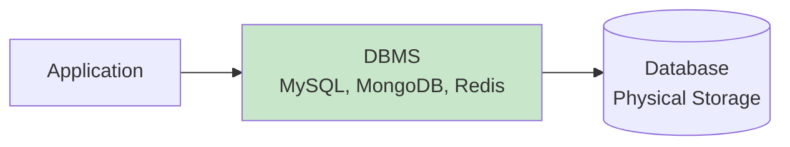
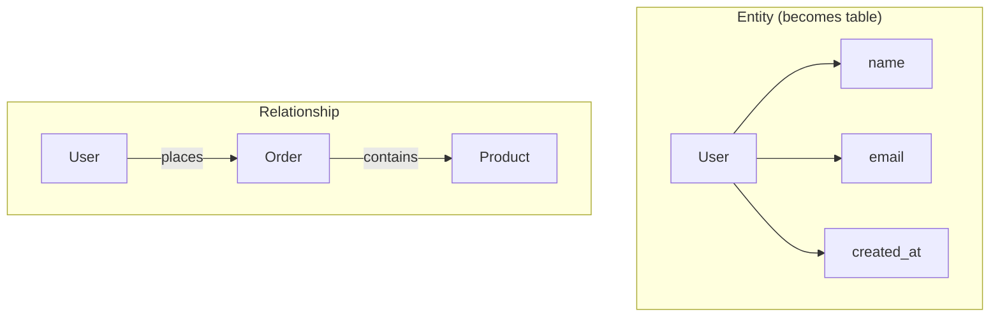
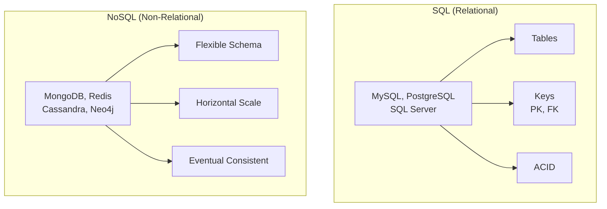
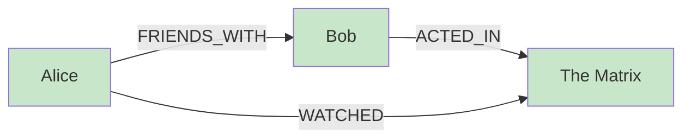
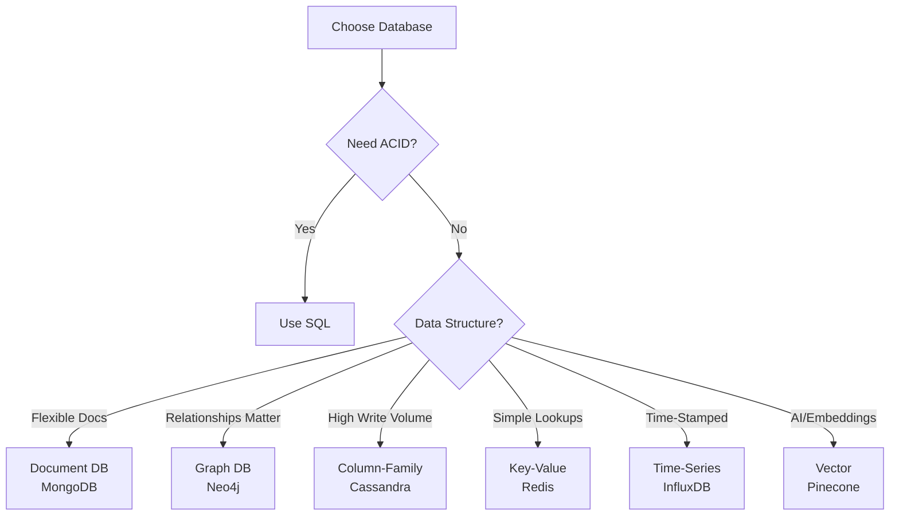
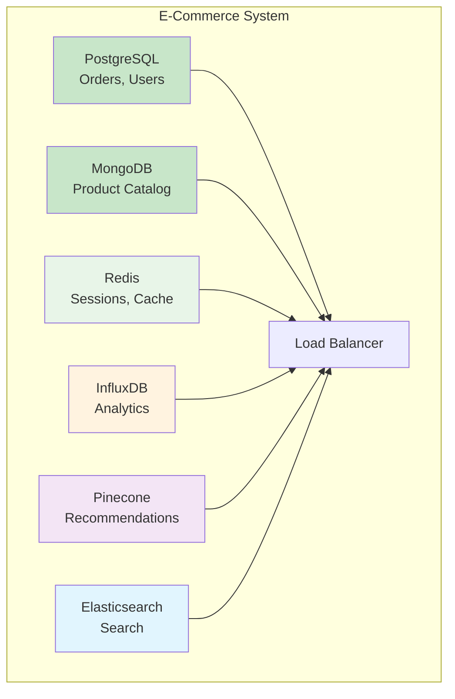

# Episode 9: The Ultimate Guide to Databases - From SQL to NoSQL

[](http://youtube.com/@ThatNotesGuy)

---

## What is a Database?

### Core Definition

A **database** is an organized collection of structured data stored electronically.

A **DBMS (Database Management System)** is the software that manages interactions with the database.



### The Library Analogy

```yaml
Database_Analogy:
  Database: "A massive, organized library"
  DBMS: "The team of librarians"
  Tables: "Sectioned book shelves"
  Query: "Your request to the librarian"
  Result: "The book you receive"
```

---

## Database Design Fundamentals

### Building Blocks



```yaml
Design_Concepts:
  Entity: "Real-world object (User, Product, Order)"
  Attribute: "Property of entity (name, email, price)"
  Relationship: "Connection between entities"

  Example:
    Entities: "User, Product, Order"
    User_Attributes: "user_id, name, email"
    Product_Attributes: "product_id, name, price"
    Order_Relationship: "User places Order, Order contains Products"
```

---

## The Two Worlds: SQL vs. NoSQL



### Key Differences

| Aspect | SQL | NoSQL |
|--------|-----|-------|
| **Data Model** | Tables with strict schema | Flexible (docs, key-value, graphs) |
| **Scalability** | Vertical (scale up) | Horizontal (scale out) |
| **Query Language** | SQL | Varies by type |
| **Consistency** | Strong (ACID) | Eventual (BASE) |
| **Best For** | Transactions, integrity | Scale, flexibility, unstructured data |

---

## Deep Dive: Relational Databases (SQL)

### How SQL Works

Data is stored in **tables** with rows and columns, connected via **keys**.

```sql
-- Authors Table
CREATE TABLE authors (
    author_id INT PRIMARY KEY,
    author_name VARCHAR(100)
);

-- Books Table with Foreign Key
CREATE TABLE books (
    book_id INT PRIMARY KEY,
    title VARCHAR(200),
    author_id INT FOREIGN KEY REFERENCES authors(author_id)
);
```

### ACID Compliance

```yaml
ACID_Properties:
  Atomicity: "All-or-nothing transactions"
  Consistency: "Database always in valid state"
  Isolation: "Transactions don't interfere"
  Durability: "Committed data is permanent"

  Example_Bank_Transfer:
    Without_ACID: "Withdraw succeeds, deposit fails → money lost"
    With_ACID: "Both succeed or both fail"
```

### Popular SQL Databases

```yaml
SQL_Databases:
  PostgreSQL: "Feature-rich, open-source, highly extensible"
  MySQL: "Popular for web apps (LAMP stack)"
  SQL_Server: "Microsoft's enterprise database"
  Oracle: "Enterprise-grade, expensive"

  Use_Cases:
    - Financial transactions
    - User management systems
    - Inventory management
    - Any application requiring data integrity
```

---

## NoSQL Type 1: Key-Value Stores

### Concept

Simplest NoSQL model: data as key-value pairs.

```yaml
KV_Store:
  Structure: "Key → Value (like a dictionary)"
  Example:
    key: "user:123:session"
    value: '{"user_id": 123, "cart": ["item1", "item2"]}'

  Operations:
    GET key: "Retrieve value"
    SET key value: "Store value"
    DEL key: "Delete value"
```

### Use Cases & Examples

```yaml
Use_Cases:
  Caching: "Store frequent DB queries"
  Sessions: "User login sessions"
  Config: "Application settings"
  Leaderboards: "Score storage"

Popular_Examples:
  Redis: "In-memory, feature-rich"
  DynamoDB: "AWS managed, serverless option"
```

---

## NoSQL Type 2: Document Databases

### Concept

Data stored as JSON-like documents with flexible structure.

```json
{
  "_id": "user123",
  "username": "Harsh",
  "email": "harsh@example.com",
  "interests": ["System Design", "Databases"],
  "address": {
    "city": "Mumbai",
    "country": "India"
  }
}
```

### Use Cases & Examples

```yaml
Use_Cases:
  User_Profiles: "Varying attributes per user"
  Product_Catalogs: "Different products have different specs"
  Content_CMS: "Articles with varying structures"

Popular_Examples:
  MongoDB: "Most popular document DB"
  CouchDB: "JSON-based, eventually consistent"
```

### Advantage: No JOINs Needed

```yaml
Document_Advantage:
  SQL_Approach: |
    SELECT * FROM users u
    JOIN orders o ON u.id = o.user_id
    WHERE u.id = 123

  Document_Approach: |
    db.users.findOne({ _id: "user123" })
    // All data in one place, no join needed
```

---

## NoSQL Type 3: Column-Family Stores

### Concept

Stores data by columns rather than rows. Optimized for massive datasets.

```yaml
Column_Family_Structure:
  Row_Key: "user123"

  Column_Families:
    Profile: "name, email, created_at"
    Activity: "last_login, pages_visited"
    Settings: "theme, notifications"

  Advantage: "Read specific columns without loading entire row"
```

### Use Cases & Examples

```yaml
Use_Cases:
  Big_Data_Analytics: "Aggregate queries across millions of rows"
  Time_Series: "IoT sensor readings"
  Logging: "High-volume event streams"

Popular_Examples:
  Cassandra: "Designed for high write throughput"
  Bigtable: "Google's internal, now cloud service"
  HBase: "Hadoop integration"
```

---

## NoSQL Type 4: Graph Databases

### Concept

Data as nodes with relationships (edges) between them.



### Use Cases & Examples

```yaml
Use_Cases:
  Social_Networks: "Find friends-of-friends"
  Recommendation: "People who X also Y"
  Fraud_Detection: "Suspicious relationship patterns"
  Knowledge_Graphs: "Connected information"

Popular_Examples:
  Neo4j: "Most popular graph DB"
  Amazon_Neptune: "Managed graph service"
```

### Query Example (Cypher)

```cypher
-- Find friends who watched the same movie
MATCH (user:User {name: 'Alice'})-[:FRIENDS_WITH]->(friend)-[:WATCHED]->(movie)
RETURN friend, movie
```

---

## Emerging NoSQL Types

### Time-Series Databases

```yaml
Purpose: "Optimized for timestamped data"

Structure:
  timestamp: "2025-10-21T10:00:00Z"
  sensor_id: "temp_001"
  temperature: 22.5

Use_Cases:
  - IoT sensor data
  - DevOps monitoring
  - Stock tickers
  - Application metrics

Examples:
  InfluxDB: "Popular for observability"
  TimescaleDB: "PostgreSQL for time-series"
  Prometheus: "Kubernetes monitoring"
```

### Vector Databases

```yaml
Purpose: "Store embeddings for AI/ML similarity search"

Structure:
  id: "user123"
  embedding: [0.1, -0.3, 0.5, ...]
  metadata: {"query": "system design"}

Use_Cases:
  - Semantic search
  - Recommendation engines
  - AI chatbots
  - Image similarity

Examples:
  Pinecone: "Managed vector DB"
  Weaviate: "Open-source"
  Milvus: "Linux Foundation project"
```

---

## NewSQL: Best of Both Worlds

```yaml
NewSQL_Concept:
  What: "Relational + Distributed"
  Promise: "ACID guarantees + horizontal scaling"

Popular_Examples:
  CockroachDB: "PostgreSQL-compatible, distributed"
  YugabyteDB: "PostgreSQL API, cloud-native"
  TiDB: "MySQL compatible, HTAP"

Use_Cases:
  - Cloud-native apps needing SQL
  - Global applications (multi-region)
  - SaaS platforms at scale
```

---

## SQL vs. NoSQL: Decision Guide



### Quick Reference

| Need | Database | Example |
|------|----------|---------|
| Transactions, integrity | SQL | PostgreSQL |
| Flexible schema, fast dev | Document | MongoDB |
| Caching, sessions | Key-Value | Redis |
| Massive scale, writes | Column-Family | Cassandra |
| Social, recommendations | Graph | Neo4j |
| IoT, metrics | Time-Series | InfluxDB |
| AI similarity search | Vector | Pinecone |
| SQL + Scale | NewSQL | CockroachDB |

---

## Polyglot Persistence

Modern applications use multiple databases for different purposes.



### Example Stack

```yaml
Modern_Stack:
  PostgreSQL: "User accounts, orders, transactions"
  MongoDB: "Product catalog with varying attributes"
  Redis: "Shopping cart, user sessions"
  InfluxDB: "Track user behavior, site metrics"
  Pinecone: "AI-powered product recommendations"
  Elasticsearch: "Product search functionality"
```

---

## Key Takeaways

### Remember This

- **SQL databases** = Structure, ACID, relational integrity
- **NoSQL databases** = Flexibility, scale, varied data models
- **Four core NoSQL types**: Key-Value, Document, Column-Family, Graph
- **Two emerging types**: Time-Series (IoT/metrics), Vector (AI/ML)
- **NewSQL** = SQL + horizontal scaling
- **Polyglot persistence** = Use multiple databases for different needs
- **Choose based on data model, scalability needs, and consistency requirements**

### Common Mistakes to Avoid

```yaml
Database_Mistakes:
  Wrong_Tool: "Using SQL for everything or NoSQL for structured data"
  Premature_Optimization: "Choosing complex DB before knowing scale"
  Ignoring_Scaling: "Not planning for growth"
  Missing_Backups: "No backup strategy"
  Over_Indexing: "Too many indexes slow writes"
```

### Best Practices

```yaml
Database_Best_Practices:
  - "Start simple, evolve as needed"
  - "Profile queries before optimizing"
  - "Use indexes wisely"
  - "Implement proper backups"
  - "Monitor performance metrics"
  - "Consider read replicas for scale"
```

---

<div align="center">

[⏮ Previous: Episode 8](../08-cdns/) | [Course Home](../../) | [⏭ Next: Episode 10](../10-coming-soon/)

</div>