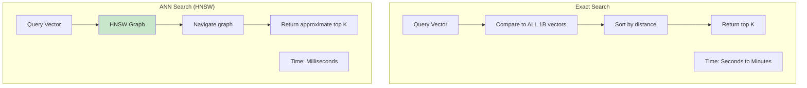

# Episode 10: Vector Databases - Powering the AI Revolution

[](http://youtube.com/@ThatNotesGuy)

## What are Vector Embeddings?

### Core Concept

**Vector embeddings** are numerical representations of data (text, images, audio) generated by AI models that capture meaning and semantic relationships.

```mermaid
graph TB
    subgraph "Embedding Generation"
        T[Text: "System design tips"] --> M[Embedding Model<br/>e.g., OpenAI Ada]
        I[Image: "Cat photo"] --> M
        A[Audio: "Podcast clip"] --> M
    end

    subgraph "Vector Space"
        V1[V1: [0.12, -0.45, 0.78, ...]] --> S[Vector Space<br/>Dimensional Space]
        V2[V2: [0.15, -0.42, 0.75, ...]] --> S
        V3[V3: [-0.89, 0.23, 0.11, ...]] --> S
    end

    M --> V1
    M --> V2
    M --> V3

    S -->|Similarity Search| N[Nearest Neighbors]
```

### What Makes a Good Embedding?

```yaml
Embedding_Properties:
  Dimensionality: "1536 dimensions (OpenAI), 768 (BERT), 4096 (GPT-4)"
  Semantic_Capture: "Similar meanings → similar vectors"
  Distance_Measures: "Cosine, Euclidean, Dot Product"

  Example:
    "cat" → [0.9, -0.1, 0.3, ...]
    "dog" → [0.85, -0.15, 0.28, ...]  # Similar!
    "car" → [-0.5, 0.8, -0.2, ...]    # Different!
```

### Embedding Generation Models

```yaml
Model_Types:
  Text_Embeddings:
    OpenAI_Ada: "1536 dims, general purpose"
    Cohere_Embed: "1024 dims, multilingual"
    HuggingFace_BGE: "768 dims, open source"
    SentenceTransformers: "Various, local inference"

  Multimodal:
    CLIP: "Text + Image embeddings"
    BLIP: "Image understanding"
    Whisper: "Audio to text vectors"

  Domain_Specific:
    BioBERT: "Biological texts"
    CodeBERT: "Source code"
    LegalBERT: "Legal documents"
```

---

## Vector Databases vs Traditional Databases

### Key Differences

| Aspect | Traditional DB | Vector DB |
|--------|---------------|-----------|
| **Data Type** | Structured rows/columns | High-dim vectors |
| **Query** | Exact match (WHERE) | Similarity search (ANN) |
| **Index** | B-tree, Hash | HNSW, IVF, PQ |
| **Speed** | ms for exact match | ms for billion-scale ANN |
| **Metadata** | First-class | Filtered post-search |

### Why Traditional DBs Don't Work

```yaml
Traditional_DB_Limitations:
  Exact_Match_Only: "LIKE '%query%' or equality checks"
  Keyword_Based: "Can't find semantic meaning"
  Scale_Issues: "Brute force ANN is O(n) - too slow"
  No_Distance_Metrics: "No built-in cosine/euclidean"

  Example_Problem: |
    Query: "Find movies like 'Inception'"
    SQL: "SELECT * FROM movies WHERE title LIKE '%Inception%'"
    Result: "Only returns Inception itself!"
    Vector: "Returns: Interstellar, Tenet, Memento..."
```

---

## Approximate Nearest Neighbor (ANN) Search

### The Core Algorithm

ANN finds "close enough" neighbors much faster than exact search.



### Popular Index Algorithms

```yaml
ANN_Algorithms:
  HNSW:
    Full_Name: "Hierarchical Navigable Small World"
    Speed: "Fastest for online queries"
    Memory: "Higher memory usage"
    Best_For: "Real-time search, < 100M vectors"

  IVF:
    Full_Name: "Inverted File Index"
    Speed: "Fast build, fast query"
    Memory: "Moderate"
    Best_For: "Batch processing, cold starts"

  PQ:
    Full_Name: "Product Quantization"
    Speed: "Compressed storage"
    Memory: "Very low (80% smaller)"
    Best_For: "Large datasets, memory constraints"
```

---

## Core Use Cases

### 1. Semantic Search

```yaml
Semantic_Search:
  Problem: "Keyword search misses context"
  Solution: "Embed queries and documents, find similar vectors"

  Example:
    Query: "financial advice for retirement"
    Keyword_Search: "Matches 'retirement' articles only"
    Vector_Search: "Matches: investing, 401k, savings, pension..."
```

### 2. Retrieval Augmented Generation (RAG)


```yaml
RAG_Workflow:
  1: "Chunk documents into passages"
  2: "Generate embeddings for each chunk"
  3: "Store in vector database"
  4: "On query: retrieve similar chunks"
  5: "Send to LLM as context"
  6: "Generate accurate, grounded response"

  Benefits:
    - "Up-to-date knowledge"
    - "Source citation"
    - "Reduced hallucinations"
    - "No fine-tuning needed"
```

### 3. Recommendations

```yaml
Recommendation_Engines:
  User_Based: "Find users with similar embeddings"
  Item_Based: "Find items similar to user preferences"

  Example_Ecommerce:
    User viewed: "Running shoes"
    Vector_Search: "Find similar items"
    Results: "Socks, shorts, fitness tracker..."
```

---

## Popular Vector Databases

```yaml
Vector_DB_Comparison:
  Pinecone:
    Type: "Managed cloud service"
    Pricing: "Pay per query/storage"
    Pros: "Fully managed, easy scaling"
    Cons: "Vendor lock-in, no local option"

  Weaviate:
    Type: "Open source + cloud"
    Pros: "GraphQL, modules, multimodal"
    Cons: "Self-hosted complex"

  Milvus:
    Type: "Open source"
    Pros: "High scale, many languages"
    Cons: "Operationally complex"

  Qdrant:
    Type: "Open source + cloud"
    Pros: "Rust-based, fast, simple API"
    Cons: "Younger ecosystem"

  Chroma:
    Type: "Lightweight, Python-native"
    Pros: "Easy to start, embeddings included"
    Cons: "Not for production scale"
```

### Quick Reference Table

| Database | Type | Open Source | Best For |
|----------|------|-------------|----------|
| **Pinecone** | Cloud | No | Easy scaling, managed |
| **Weaviate** | Cloud + OSS | Yes | Multimodal, graph |
| **Milvus** | Cloud + OSS | Yes | High scale, flexibility |
| **Qdrant** | Cloud + OSS | Yes | Performance, simplicity |
| **Chroma** | Local | Yes | Prototyping, RAG |

---

## Implementing Vector Search

### Basic Operations

```python
import chromadb

# Create collection with HNSW index
client = chromadb.Client()
collection = client.create_collection(
    name="documents",
    embedding_function=embeddings,
    metadata={"hnsw:space": "cosine"}
)

# Add documents
collection.add(
    documents=[
        "System design involves scalable architecture",
        "Load balancers distribute traffic across servers",
        "Caching reduces database load and latency"
    ],
    ids=["doc1", "doc2", "doc3"]
)

# Search for similar documents
results = collection.query(
    query_texts=["How to improve performance?"],
    n_results=3
)
```

### Hybrid Search (Vector + Metadata)

```yaml
Hybrid_Search:
  Concept: "Filter by metadata, then rank by vector similarity"

  Example_Ecommerce:
    Query: "Find similar products"
    Metadata_Filter: "category = 'electronics', price < 1000"
    Vector_Rank: "Most similar within filters"

  Benefits: "Precision + Semantic relevance"
```

---

## Performance Optimization

### Index Tuning

```yaml
Performance_Factors:
  Index_Type:
    HNSW_m: "Higher = better recall, more memory"
    HNSW_efConstruction: "Build quality vs time"

  Quantization:
    Binary: "1 bit per dimension (32x smaller)"
    Scalar: "8-bit int (4x smaller)"

  Batch_Operations:
    Bulk_Insert: "Faster than individual inserts"
```

---

## Key Takeaways

### Remember This

- **Vector embeddings** = numerical representations of meaning
- **ANN search** = find similar vectors, not exact matches
- **HNSW** = fastest index for online vector search
- **RAG** = most common vector DB use case (LLM context)
- **Embeddings matter** = model choice affects quality
- **Hybrid search** = metadata filters + vector similarity

### Common Mistakes to Avoid

```yaml
Vector_DB_Mistakes:
  Wrong_Chunk_Size: "Too small = lost context, too large = noise"
  No_Metadata: "Can't filter or rank effectively"
  Wrong_Distance: "Using Euclidean when cosine is better"
  Ignoring_Quantization: "Unnecessary memory cost"
  No_Evaluation: "Not measuring retrieval quality"
```

---

## Quick Reference Decision Tree

```yaml
Vector_DB_Decision_Tree:
  Small_Scale:
    < 1M vectors → Try: Chroma, Qdrant local

  Production:
    1M - 1B vectors → Try: Pinecone, Weaviate, Milvus

  Enterprise:
    > 1B vectors → Milvus distributed, Pinecone at scale
```

---

<div align="center">

[⏮ Previous: Episode 9](../09-databases/) | [Course Home](../../) | [⏭ Next: Episode 11](../11-keys-in-dbms/)

</div>
