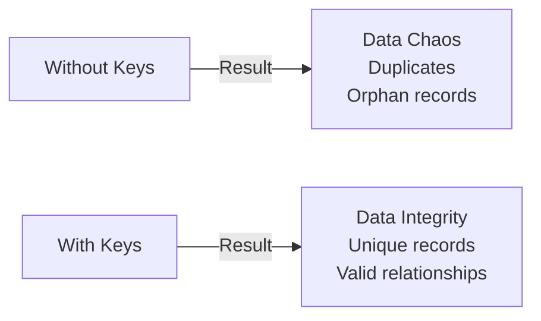
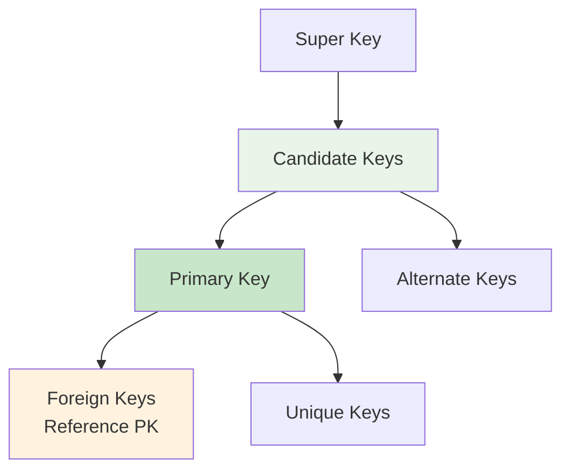
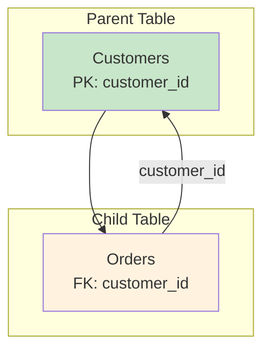
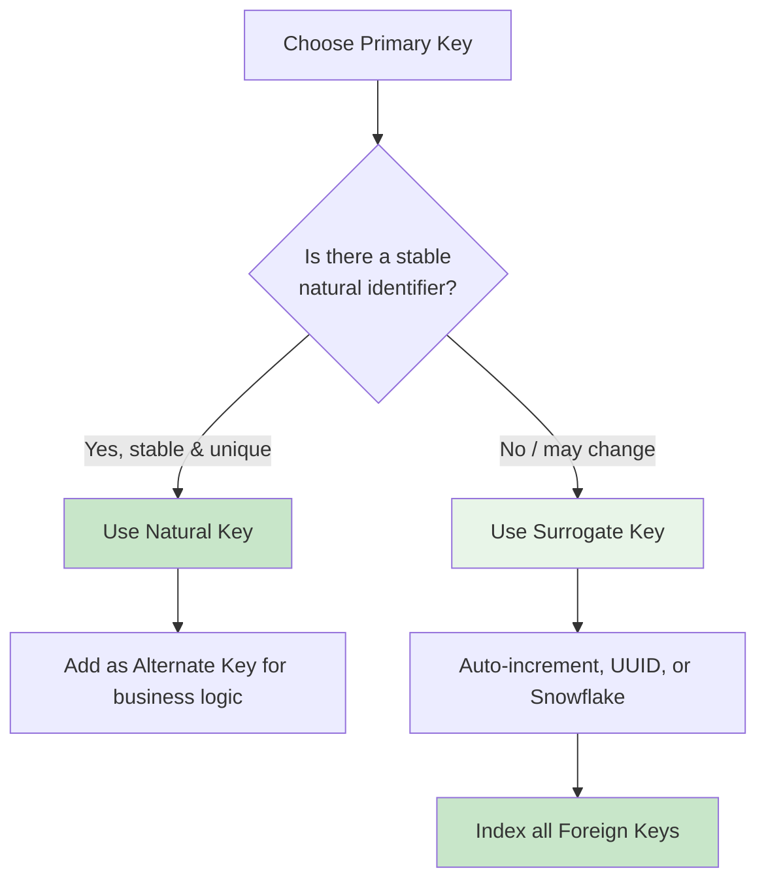

# Episode 11: Keys in DBMS - The Foundation of Data Integrity

[](http://youtube.com/@ThatNotesGuy)

## Why Keys Matter

### Core Definition

A **key** is an attribute or set of attributes that uniquely identifies a row in a table.



### Keys Prevent Data Chaos

```yaml
Problem_Without_Keys:
  Issue: "Duplicate records, ambiguous lookups"
  Example: "Two customers named John Smith - which is which?"
  Result: "Data corruption, failed queries, system bugs"

Solution_With_Keys:
  Fix: "Unique identifiers per record"
  Example: "CustomerID: 1001 vs 1002"
  Result: "Precise lookups, reliable operations"
```

---

## Key Types Overview



---

## Super Key: The Broadest Identifier

### Definition

A **Super Key** is any set of columns that can uniquely identify rows. It may include redundant columns.

```yaml
Super_Key_Example:
  Table: "Students"
  Columns: [StudentID, Name, Email, Phone]

  Valid_Super_Keys:
    - StudentID (minimal)
    - StudentID + Name (redundant)
    - StudentID + Email + Phone (very redundant)
    - Email (if unique)
    - Name + Phone (if unique combo)

  Rule: "Any combination that guarantees uniqueness"
```

---

## Candidate Key: The Minimal Set

### Definition

A **Candidate Key** is a minimal Super Key — remove any column and uniqueness breaks.

```yaml
Candidate_Key_Properties:
  Uniqueness: "Values must be unique"
  Minimality: "Cannot remove any attribute"
  Non_Null: "Typically cannot be null"

Example_Students_Table:
  StudentID: "Unique identifier ✓"
  Roll_No: "Unique identifier ✓"
  Email: "Unique identifier ✓"

  Candidate_Keys: "{StudentID}", "{Roll_No}", "{Email}"
```

### Candidate Key vs Super Key

| Aspect | Super Key | Candidate Key |
|--------|-----------|---------------|
| Minimality | Not required | Required |
| Redundancy | May include extra columns | No extra columns |
| Purpose | Conceptual starting point | PK selection source |

---

## Primary Key: The Chosen Identifier

### Definition

The **Primary Key (PK)** is the one Candidate Key selected to uniquely identify every row.

```sql
-- Primary Key Example
CREATE TABLE Customers (
    customer_id INT PRIMARY KEY,
    name VARCHAR(100),
    email VARCHAR(255)
);
```

### Primary Key Rules

```yaml
PK_Rules:
  Uniqueness: "No duplicate values allowed"
  Non_Null: "Cannot contain NULL values"
  Quantity: "Only ONE per table"
  Indexing: "Automatically indexed by DBMS"

  Violation_Behavior: "Database rejects the insert/update"
```

### Why Primary Keys Matter

```yaml
PK_Importance:
  Entity_Integrity: "Each row is a distinct entity"
  Relationships: "Foreign Keys reference the PK"
  Performance: "Index enables fast lookups"
  Data_Quality: "Prevents duplicate records"
```

---

## Unique Key vs Primary Key

### Key Comparison

| Aspect | Primary Key | Unique Key |
|--------|-------------|------------|
| **Uniqueness** | Required | Required |
| **Null Values** | NOT allowed | Typically allows ONE null |
| **Quantity** | One per table | Multiple per table |
| **Purpose** | Main identifier | Secondary unique constraint |
| **Indexing** | Auto-indexed | Auto-indexed |

```sql
-- Unique Key Example
CREATE TABLE Users (
    user_id INT PRIMARY KEY,
    username VARCHAR(50) UNIQUE,  -- Must be unique, but can be NULL
    email VARCHAR(255) UNIQUE     -- Another unique constraint
);
```

### When to Use Unique Key

```yaml
Use_Cases:
  Email_Addresses: "Each email unique, but NULL initially OK"
  Usernames: "Unique for display, may change"
  Phone_Numbers: "Secondary contact method"
```

---

## Alternate Key: The Backup Identifier

### Definition

An **Alternate Key** is any Candidate Key not chosen as the Primary Key.

```yaml
Alternate_Key_Example:
  Table: Employees
  Candidate_Keys: [EmployeeID, Email, SSN]
  Selected_PK: EmployeeID
  Alternate_Keys: [Email, SSN]

  Purpose: "Backup uniqueness if PK access fails"
```

---

## Foreign Key: The Relationship Architect

### Definition

A **Foreign Key (FK)** is a column in one table referencing the Primary Key in another.



```sql
-- Foreign Key Example
CREATE TABLE Orders (
    order_id INT PRIMARY KEY,
    customer_id INT,
    order_date DATE,
    FOREIGN KEY (customer_id) REFERENCES Customers(customer_id)
);
```

### Foreign Key Properties

```yaml
FK_Characteristics:
  Uniqueness: "NOT required (can have duplicates)"
  Nulls: "Allowed if relationship is optional"
  Quantity: "Multiple per table allowed"
  Purpose: "Enforce referential integrity"

  Example: "One customer has many orders (FK repeats)"
```

### Referential Integrity

```yaml
Integrity_Rules:
  Insert_Restriction: "Cannot add order for non-existent customer"
  Delete_Restriction: "Cannot delete customer with existing orders"
  Update_Restriction: "Cannot change customer_id if orders exist"

  Solution: "CASCADE delete or NULLify on parent deletion"
```

---

## Composite Key: Uniqueness by Combination

### Definition

A **Composite Key** combines two or more columns to form a unique identifier.

```sql
-- Composite Key Example
CREATE TABLE Enrollments (
    student_id INT,
    course_id INT,
    enrollment_date DATE,
    PRIMARY KEY (student_id, course_id)
);
```

```yaml
Composite_Key_Scenario:
  Problem: "Neither StudentID nor CourseID is unique alone"
  Solution: "Combination (StudentID + CourseID) IS unique"
  Use_Case: "Many-to-many junction tables"
```

---

## Surrogate vs Natural Keys

### Natural Key

A key from real-world business data.

```yaml
Natural_Key_Examples:
  SSN: "Social Security Number"
  ISBN: "Book identifier"
  Email: "User's email address"
  VIN: "Vehicle Identification Number"

  Pros: "Meaningful, no extra column needed"
  Cons: "May change, may not be unique"
```

### Surrogate Key

A system-generated artificial identifier.

```yaml
Surrogate_Key_Examples:
  Auto_Increment: "1, 2, 3, 4..."
  UUID: "550e8400-e29b-41d4-a716-446655440000"
  ULID: "01ARYZ6S41TVGZ1XJ3QJ3QJ3Q"

  Pros: "Stable, never changes, guaranteed unique"
  Cons: "No business meaning, extra column"
```

### Comparison

| Aspect | Natural Key | Surrogate Key |
|--------|-------------|---------------|
| **Source** | Business data | System generated |
| **Stability** | May change | Never changes |
| **Meaning** | Semantic | None |
| **Storage** | Often larger | Smaller (INT/UUID) |
| **Use When** | Stable, meaningful data | Volatile data |

```sql
-- Best Practice: Use Both
CREATE TABLE Users (
    user_id INT PRIMARY KEY,        -- Surrogate Key (stable)
    email VARCHAR(255) UNIQUE,      -- Natural Key (business logic)
    name VARCHAR(100)
);
```

---

## Performance and Indexing

### Indexing Keys

```yaml
Indexing_Rules:
  Primary_Key: "Automatically indexed by DBMS"
  Foreign_Key: "MUST manually index for performance"
  Unique_Key: "Automatically indexed"

  Performance_Impact:
    Indexed_FK: "JOINs complete in milliseconds"
    Non_Indexed_FK: "JOINs degrade to minutes on large data"
```

### Why Index Foreign Keys

```yaml
JOIN_Performance:
  Without_Index: "Full table scan (O(n) per row)"
  With_Index: "Index lookup (O(log n))"
  Impact: "10x-100x faster queries on large tables"
```

---

## Modern Keys: Distributed Systems

### Problem with Auto-Increment

```yaml
Auto_Increment_Issues:
  Centralized: "Single source for IDs creates bottleneck"
  Not_Distributed: "Cannot generate IDs across multiple nodes"
  Security: "Predictable IDs reveal business metrics"
```

### UUID (Version 4)

```yaml
UUID_Problems:
  Uniqueness: "Globally unique ✓"
  Randomness: "128 bits, non-sequential"
  Index_Impact: "Fragmentation, page splits, storage bloat"
  Performance: "Writes slow down due to index churn"
```

### Snowflake ID (Twitter)

```yaml
Snowflake_Structure:
  Total: "64 bits"
  Timestamp: "41 bits (69 years)"
  Worker_ID: "10 bits (1024 workers)"
  Sequence: "12 bits (4096 IDs/ms/worker)"

  Benefits:
    - Time-sortable (chronological)
    - Distributed generation
    - Compact (8 bytes vs 16 for UUID)
```

### ULID (Universally Unique Lexicographically Sortable)

```yaml
ULID_Structure:
  Total: "128 bits (26 chars)"
  Timestamp: "48 bits (Unix time)"
  Randomness: "80 bits"

  Benefits:
    - Lexicographically sortable
    - Time-ordered inserts
    - Good for distributed systems
```

### Comparison

| Key Type | Size | Sortable | Distributed | Use Case |
|----------|------|----------|-------------|----------|
| Auto-Increment | 4 bytes | Yes | No | Single server |
| UUID v4 | 16 bytes | No | Yes | General uniqueness |
| Snowflake | 8 bytes | Yes | Yes | Distributed systems |
| ULID | 16 bytes | Yes | Yes | Distributed systems |

---

## Temporal Keys (Advanced)

### Concept

Temporal keys track when data was valid and when it was recorded.

```sql
-- PostgreSQL Temporal Table Example
CREATE TABLE accounts (
    account_id BIGINT PRIMARY KEY,
    balance DECIMAL(10,2),
    valid_from TIMESTAMPTZ,
    valid_to TIMESTAMPTZ,
    PERIOD FOR valid_time (valid_from, valid_to)
);
```

### Time Dimensions

```yaml
Temporal_Types:
  Valid_Time: "When the fact was true in reality"
  Transaction_Time: "When the fact was recorded"

  Use_Case: "Financial auditing, healthcare records, compliance"
```

---

## Key Selection Strategy

### Decision Framework



### Best Practices

```yaml
Key_Best_Practices:
  Stability: "Choose keys that rarely or never change"
  Simplicity: "Prefer single-column keys when possible"
  Indexing: "Always index Foreign Keys"
  Documentation: "Document key choices and rationale"
  Consistency: "Use same key type across related tables"
```

---

## Quick Reference Table

| Key Type | Unique | Nulls | Per Table | Purpose |
|----------|--------|-------|-----------|---------|
| **Super Key** | Yes | Allowed | Many | Any unique set |
| **Candidate Key** | Yes | No | Many | Minimal unique set |
| **Primary Key** | Yes | No | One | Main identifier |
| **Unique Key** | Yes | One | Many | Secondary constraint |
| **Foreign Key** | No | Allowed | Many | Link tables |
| **Alternate Key** | Yes | No | Many | Backup identifiers |

---

## Key Takeaways

### Remember This

- **Primary Keys** = Unique, non-null, one per table, auto-indexed
- **Unique Keys** = Unique, allow one null, multiple per table
- **Foreign Keys** = Link tables, enforce referential integrity, MUST be indexed
- **Candidate Keys** = Minimal unique sets; one becomes PK
- **Surrogate Keys** = System-generated (auto-increment, UUID), stable
- **Natural Keys** = From business data, meaningful but may change
- **Distributed keys** (Snowflake, ULID) = Time-sortable for scale
- **Index Foreign Keys** = Prevents JOIN performance degradation

### Common Mistakes to Avoid

```yaml
Key_Mistakes:
  No_Primary_Key: "Every table needs a PK"
  Nullable_PK: "Violates entity integrity"
  Missing_FK_Index: "Slow JOINs on large tables"
  Changing_PKs: "Breaks foreign key references"
  Using_Natural_Keys: "When data is volatile"
  UUID_v4_Indexes: "Consider ULID/Snowflake instead"
```

### Anti-Patterns

```yaml
Anti_Patterns:
  Natural_PK_For_Volatile_Data: "Email changes? Don't use as PK"
  Composite_PK_Excess: "Too many columns = complex joins"
  No_Documentation: "Future developers confused"
  Forgetting_Cascades: "Orphan records on delete"
```

---

<div align="center">

[⏮ Previous: Episode 9](../09-databases/) | [Course Home](../../) | [⏭ Next: Episode 11](../11-coming-soon/)

</div>