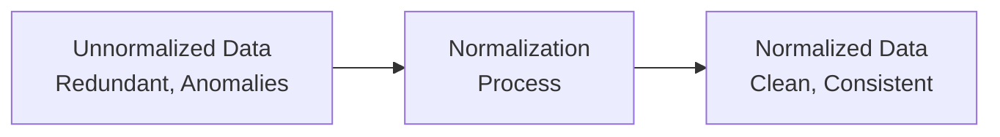
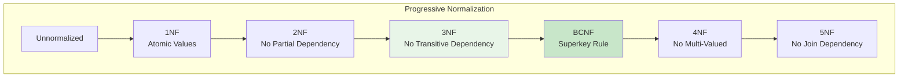
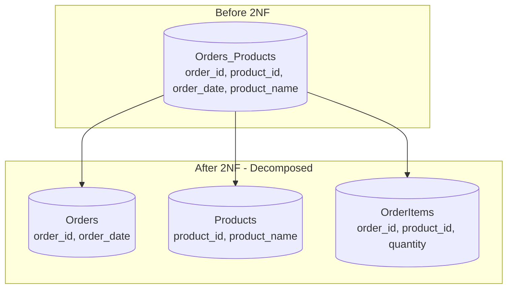
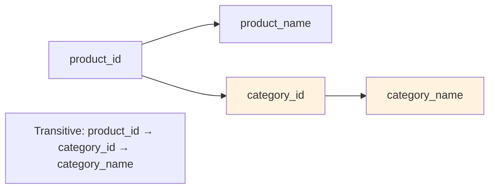
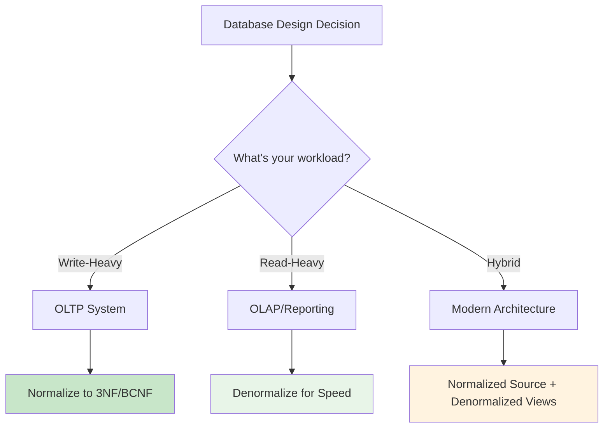
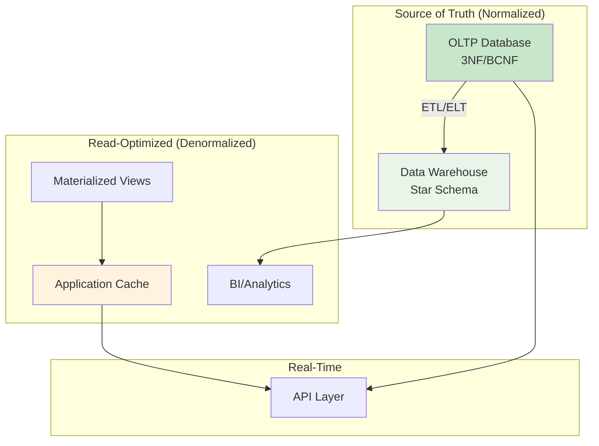

# Episode 12: Database Design Mastery - Normalization vs Denormalization

[](http://youtube.com/@ThatNotesGuy)

## Normalization: The Quest for Data Integrity

### Core Definition

**Normalization** is a systematic approach to organizing data in a database to eliminate redundancy and prevent inconsistencies.



### The Problems Normalization Solves

```yaml
Data_Anomalies:
  Insertion_Anomaly: |
    "Cannot add new data without including other unrelated data"
    Example: "Can't add a new supplier without adding a product"

  Update_Anomaly: |
    "Inconsistency when modifying data in multiple places"
    Example: "Updating customer address in one order but not others"

  Deletion_Anomaly: |
    "Unintended loss of data when deleting a record"
    Example: "Deleting last product from supplier removes supplier info"

  Impact: "Data corruption, inconsistent queries, maintenance nightmares"
```

### Why Normalization Matters

```yaml
Normalization_Benefits:
  Data_Integrity: "Each piece of data stored exactly once"
  Storage_Efficiency: "No redundant copies"
  Maintainability: "Changes made in one place"
  Consistency: "No conflicting versions of data"

  Example_Banking:
    Without: "Account holder address stored on every transaction"
    With: "Address stored once, referenced by transactions"
    Impact: "Update address once, all transactions see new address"
```

---

## Normal Forms: The Hierarchy



---

## First Normal Form (1NF)

### The Foundation: Atomicity

**1NF Requirements:**
1. Every cell contains only one value (atomicity)
2. No repeating groups
3. Every record is unique

```sql
-- VIOLATES 1NF: Multi-valued column
CREATE TABLE Orders_Bad (
    order_id INT,
    customer_name VARCHAR(100),
    products VARCHAR(500)  -- "Laptop, Mouse, Keyboard" - NOT ATOMIC!
);

-- COMPLIES WITH 1NF: Separate rows
CREATE TABLE OrderItems (
    order_id INT,
    product VARCHAR(100),  -- One product per row
    PRIMARY KEY (order_id, product)
);
```

### 1NF Transformation Example

```yaml
Before_1NF:
  Customer_ID: 1
  Products: "Laptop, Mouse, Keyboard"

After_1NF:
  Customer_ID: 1, Product: "Laptop"
  Customer_ID: 1, Product: "Mouse"
  Customer_ID: 1, Product: "Keyboard"
```

---

## Second Normal Form (2NF)

### Eliminating Partial Dependency

**2NF Requirements:**
1. Must be in 1NF
2. All non-key attributes must depend on the **entire** primary key

### Partial Dependency Example

```sql
-- VIOLATES 2NF: Partial dependency
CREATE TABLE OrderProducts_Bad (
    order_id INT,
    product_id INT,
    order_date DATE,           -- Depends ONLY on order_id
    product_name VARCHAR(100), -- Depends ONLY on product_id
    quantity INT,
    PRIMARY KEY (order_id, product_id)
);

-- COMPLIES WITH 2NF: Separate tables
CREATE TABLE Orders (
    order_id INT PRIMARY KEY,
    order_date DATE,
    customer_id INT
);

CREATE TABLE Products (
    product_id INT PRIMARY KEY,
    product_name VARCHAR(100),
    price DECIMAL(10,2)
);

CREATE TABLE OrderItems (
    order_id INT,
    product_id INT,
    quantity INT,
    PRIMARY KEY (order_id, product_id)
);
```



---

## Third Normal Form (3NF)

### Eliminating Transitive Dependency

**3NF Requirements:**
1. Must be in 2NF
2. No transitive dependencies (non-key attributes can't depend on other non-key attributes)

### Transitive Dependency Example

```sql
-- VIOLATES 3NF: Transitive dependency
CREATE TABLE Products_Bad (
    product_id INT PRIMARY KEY,
    product_name VARCHAR(100),
    category_id INT,
    category_name VARCHAR(50),  -- Depends on category_id, NOT product_id
    price DECIMAL(10,2)
);

-- COMPLIES WITH 3NF: Separate tables
CREATE TABLE Categories (
    category_id INT PRIMARY KEY,
    category_name VARCHAR(50)
);

CREATE TABLE Products (
    product_id INT PRIMARY KEY,
    product_name VARCHAR(100),
    category_id INT,
    price DECIMAL(10,2),
    FOREIGN KEY (category_id) REFERENCES Categories(category_id)
);
```

### Dependency Chain



---

## Boyce-Codd Normal Form (BCNF)

### The Stricter 3.5NF

**BCNF Requirements:**
1. Must be in 3NF
2. For every functional dependency (X → Y), X must be a **superkey**

### BCNF Violation Example

```yaml
University_Scenario:
  Table: Course_Schedule
  Candidate_Keys: (StudentID, Course)

  Problem:
    Course → Instructor
    Course is NOT a superkey (multiple students per course)
    Violates BCNF!

  Solution:
    CREATE TABLE StudentCourses (
        student_id INT,
        course_id INT,
        PRIMARY KEY (student_id, course_id)
    );

    CREATE TABLE CourseInstructors (
        course_id INT PRIMARY KEY,
        instructor_name VARCHAR(100)
    );
```

### When BCNF Matters

```yaml
BCNF_Use_Cases:
  - Complex multi-key relationships
  - Systems with overlapping candidate keys
  - Academic/administrative databases
  - When 3NF allows non-superkey determinants

  Most_Applications: |
    "3NF is sufficient - BCNF is for edge cases"
```

---

## Advanced Normal Forms: 4NF and 5NF

### Fourth Normal Form (4NF)

**4NF eliminates multi-valued dependencies.**

```yaml
Multi_Valued_Dependency:
  Example: "A teacher teaches multiple subjects at multiple locations"
  Problem: "Subject and location are independent facts stored together"
  Solution: "Separate into teacher_subjects and teacher_locations tables"

  Violation: |
    Teacher_Teaches
    Teacher: "John"
    Subjects: "Math, Science"
    Locations: "Room 101, Room 102"

  Fix:
    Teacher_Subjects: (Teacher, Subject)
    Teacher_Locations: (Teacher, Location)
```

### Fifth Normal Form (5NF)

**5NF eliminates join dependencies (very rare).**

```yaml
Fifth_Normal_Form:
  Concept: "Table cannot be decomposed into smaller tables without redundancy"
  When_Needed: "Highly interrelated, multidimensional data"
  Practical_Use: "Extremely rare in practice"
```

---

## Normalization Summary Table

| Normal Form | Eliminates | Key Concept |
|-------------|------------|-------------|
| **1NF** | Repeating groups | Atomic values |
| **2NF** | Partial dependency | Full key dependency |
| **3NF** | Transitive dependency | Non-key → non-key relationships |
| **BCNF** | Non-superkey determinants | Every determinant is a key |
| **4NF** | Multi-valued dependencies | Independent fact groups |
| **5NF** | Join dependencies | Lossless decomposition |

---

## Denormalization: The Trade-Off Reversal

### Core Definition

**Denormalization** is the deliberate introduction of redundancy to improve read performance.

```yaml
Denormalization_Philosophy:
  Goal: "Optimize read performance"
  Method: "Combine tables, add redundant columns"
  Trade_Off: "Writes become slower, data consistency risk"
  Use_Case: "Read-heavy workloads: reporting, analytics, dashboards"

  Analogy: |
    Normalized: "Store each book location once in a catalog"
    Denormalized: "Also write location on every book checkout record"
```

### Why Denormalize?

```yaml
Denormalization_Reasons:
  Query_Speed: "No joins = faster queries"
  Simplification: "Simpler queries for developers"
  Aggregation: "Pre-computed totals and counts"
  Reporting: "Fast data for BI tools"
  Caching: "Materialized views as cached results"

  Example_Impact: |
    Normalized Query: "SELECT * FROM Customers c JOIN Orders o ON c.id = o.customer_id WHERE c.city = 'NYC'"
    Denormalized Query: "SELECT * FROM Orders WHERE city = 'NYC'"
    Speed_Improvement: "10x-100x faster on large datasets"
```

---

## Denormalization Techniques

### 1. Redundant Columns

```sql
-- Add customer_name directly to Orders table
CREATE TABLE Orders_Denormalized (
    order_id INT PRIMARY KEY,
    customer_id INT,
    customer_name VARCHAR(100),  -- REDUNDANT: From Customers table
    customer_city VARCHAR(50),   -- REDUNDANT: From Customers table
    order_date DATE,
    total_amount DECIMAL(10,2)
);

-- Query no longer needs JOIN
SELECT customer_name, total_amount
FROM Orders_Denormalized
WHERE customer_city = 'NYC';
```

### 2. Derived Columns

```sql
-- Add pre-computed totals
CREATE TABLE OrderItems_Denormalized (
    order_id INT,
    product_id INT,
    quantity INT,
    unit_price DECIMAL(10,2),
    line_total DECIMAL(10,2)  -- DERIVED: quantity * unit_price
);
```

### 3. Table Splitting

```yaml
Splitting_Types:
  Horizontal:
    What: "Split rows into separate tables"
    Example: "Orders_US, Orders_EU"
    Use: "Regional queries, data isolation"

  Vertical:
    What: "Split columns into separate tables"
    Example: "Customers_Basic, Customers_Details"
    Use: "Frequently vs rarely accessed columns"
```

### 4. Materialized Views

```sql
-- Create materialized view for reporting
CREATE MATERIALIZED VIEW monthly_sales AS
SELECT
    DATE_TRUNC('month', order_date) as month,
    customer_id,
    COUNT(*) as order_count,
    SUM(total_amount) as revenue
FROM Orders
GROUP BY DATE_TRUNC('month', order_date), customer_id;

-- Refresh periodically
REFRESH MATERIALIZED VIEW monthly_sales;
```

### 5. Aggregate Tables

```yaml
Pre_Computed_Aggregates:
  Daily_Sales_Summary:
    date DATE PRIMARY KEY
    total_orders INT
    total_revenue DECIMAL(15,2)
    avg_order_value DECIMAL(10,2)

  Benefits:
    - "Report queries run instantly"
    - "No complex GROUP BY needed"
    - "Trade-off: slightly stale data"
```

---

## Comparison: Normalization vs Denormalization

| Aspect | Normalization | Denormalization |
|--------|---------------|-----------------|
| **Data Integrity** | High (no redundancy) | Risk of inconsistency |
| **Storage** | Efficient (no duplicates) | Wastes space |
| **Read Performance** | Slower (joins required) | Faster (no joins) |
| **Write Performance** | Faster (single table) | Slower (multiple updates) |
| **Query Complexity** | Higher (joins needed) | Simpler |
| **Maintenance** | Easier changes | Harder (sync redundancy) |
| **Use Case** | OLTP (Transactions) | OLAP (Analytics) |

---

## When to Choose Which



### Decision Framework

```yaml
Choose_Normalization_When:
  - Data integrity is critical (banking, inventory)
  - Frequent inserts/updates/deletes
  - Complex relationships must be enforced
  - Storage efficiency matters

Choose_Denormalization_When:
  - Read-heavy workloads (analytics, dashboards)
  - Query performance is paramount
  - Stale data is acceptable
  - Reporting on historical data

Modern_Hybrid_Approach:
  - Normalized "source of truth" database
  - Denormalized data warehouse for analytics
  - Materialized views for common queries
  - Cache layer for hot data
```

---

## Modern Architecture: The Hybrid Approach



### Hybrid Architecture Patterns

```yaml
Modern_Patterns:
  CQRS:
    Command: "Write to normalized DB"
    Query: "Read from denormalized replica"

  Data_Lakehouse:
    Raw: "Landing zone for raw data"
    Silver: "Cleaned, validated data"
    Gold: "Aggregated, denormalized analytics"

  CDC_Streams:
    Source: "Normalized database"
    Stream: "Change data capture"
    Target: "Denormalized views/cache"
```

---

## Key Takeaways

### Remember This

- **Normalization** = Data integrity, write efficiency, storage savings
- **Denormalization** = Read speed, query simplicity, storage cost
- **1NF** = Atomic values, no repeating groups
- **2NF** = No partial dependency (full key required)
- **3NF** = No transitive dependency
- **BCNF** = Every determinant is a superkey
- **3NF/BCNF** = Target for OLTP systems
- **Denormalization** = Target for OLAP/analytics
- **Modern systems** = Hybrid approach (normalized source + denormalized views)

### Common Mistakes to Avoid

```yaml
Normalization_Mistakes:
  - "Stopping before 1NF (non-atomic values)"
  - "Missing partial dependencies with composite keys"
  - "Ignoring transitive dependencies in 3NF"

Denormalization_Mistakes:
  - "Denormalizing without measuring performance impact"
  - "Forgetting to update redundant data"
  - "Using denormalization for transactional systems"

  Golden_Rule: |
    "Normalize by default, denormalize by measurement"
```

### Best Practices

```yaml
Database_Design_Best_Practices:
  1: "Start with normalized design (3NF minimum)"
  2: "Profile queries to identify performance bottlenecks"
  3: "Only denormalize proven slow queries"
  4: "Use materialized views for aggregation"
  5: "Implement hybrid architecture for scale"
  6: "Monitor both read and write performance"
  7: "Document denormalization decisions"
```

---

<div align="center">

[⏮ Previous: Episode 11](../11-keys-in-dbms/) | [Course Home](../../) | [⏭ Next: Episode 13](../13-coming-soon/)

</div>
