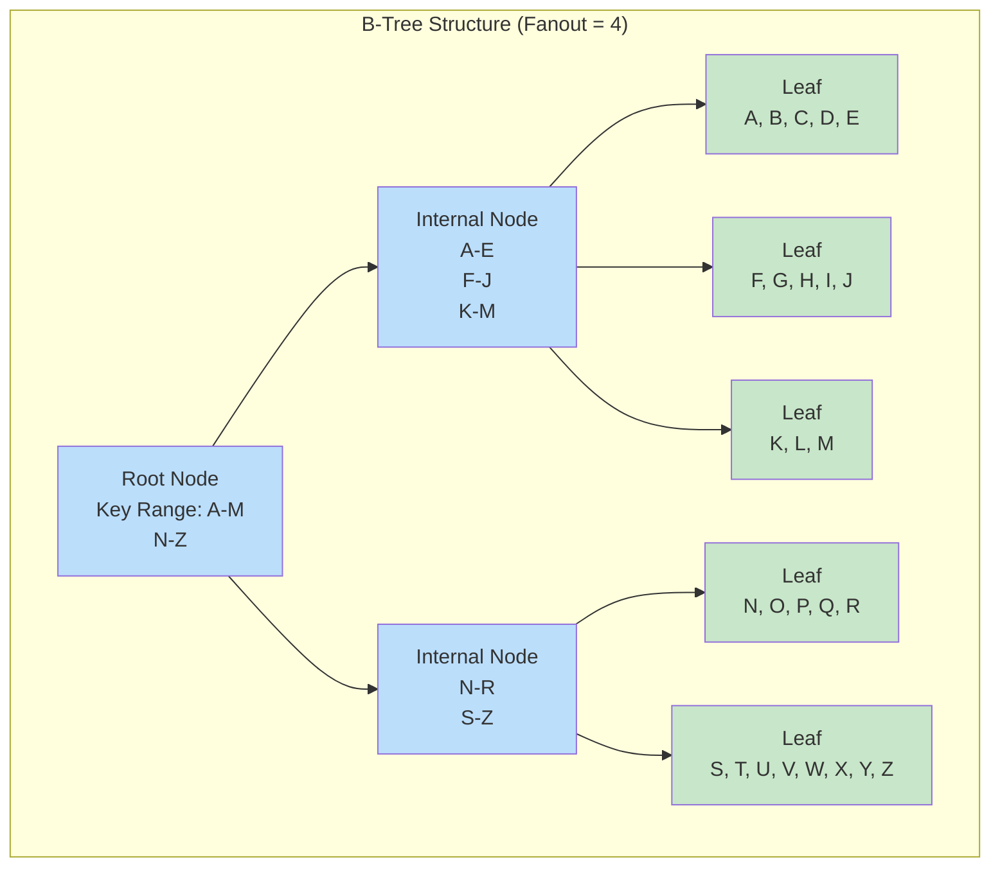

# Episode 13: Database Indexing Mastery

[](http://youtube.com/@ThatNotesGuy)

## What You'll Learn

- What database indexes are and why they are critical for performance
- B-Tree and B+Tree data structures that power most database indexes
- The difference between clustered and non-clustered indexes
- How composite indexes work and the leftmost prefix rule
- What covering indexes are and when to use them
- Different index types: Hash, Bitmap, Full-Text, and PostgreSQL-specific indexes
- How to read and interpret execution plans with EXPLAIN
- Index maintenance: fragmentation, VACUUM, and fill factors
- Best practices for index design and avoiding common anti-patterns

---

## Introduction to Indexing

### What is a Database Index?

A database index is a data structure that improves the speed of data retrieval operations on a database table at the cost of additional storage space and slower writes.

```mermaid
graph TB
    subgraph "Without Index - Full Table Scan"
        A[Query: WHERE email = 'user@example.com'] --> B[(Full Table Scan<br/>1M rows)]
        B --> C[Check each row]
        C --> D[Find match at row 500,000]
    end

    subgraph "With Index - Fast Lookup"
        E[Query: WHERE email = 'user@example.com'] --> F[(Index<br/>B-Tree)]
        F --> G[Navigate tree]
        G --> H[Direct access to row]
        H --> I[O(log n) instead of O(n)]
    end

    style A fill:#ffcdd2
    style E fill:#c8e6c9
    style D fill:#ffcdd2
    style I fill:#c8e6c9
```

### The Book Index Analogy

Think of a database index like the index at the back of a textbook:

```yaml
Book_Index_Analogy:
  Without_Index: "Read every page to find all mentions of 'database'"
  With_Index: "Check index, find page numbers, jump directly to relevant pages"

  Trade_offs:
    Space: "Index takes extra pages (5-20% of book)"
    Write_Speed: "Adding new terms requires index update"
    Read_Speed: "Finding information is 100x faster"

  Database_Translation:
    Book: "Database table"
    Index_at_back: "Secondary index"
    Page_number: "Row pointer/primary key"
    Topics_A-Z: "Index ordering (B-Tree sorted order)"
```

### The Cost of Indexes

```yaml
Index_Costs:
  Storage_Overhead:
    description: "Indexes consume additional disk space"
    typical_overhead: "20-30% of table size per index"
    example: "1GB table with 3 indexes = ~1.6GB total"

  Write_Overhead:
    description: "Every INSERT/UPDATE/DELETE must also update indexes"
    impact: "Writes become 2-10x slower with multiple indexes"
    trade_off: "Speed up reads, slow down writes"

  Maintenance:
    description: "Indexes require periodic maintenance"
    tasks: "Rebuilding, defragmentation, statistics updates"
    cost: "CPU and I/O overhead during maintenance windows"

  Index_Selection_Guideline:
    - "Add indexes that speed up frequent queries"
    - "Remove unused or redundant indexes"
    - "Monitor write performance impact"
    - "Balance read speed vs write overhead"
```

---

## B-Tree: The Foundation

### B-Tree Structure

A B-Tree is a self-balancing tree data structure that maintains sorted data and allows efficient search, sequential access, insertions, and deletions.



### Key B-Tree Properties

```yaml
B_Tree_Properties:
  Balanced:
    meaning: "All leaf nodes are at the same depth"
    benefit: "Consistent search performance"
    guarantee: "O(log n) for all operations"

  Nodes:
    definition: "Internal containers holding sorted keys"
    capacity: "Typically 100-1000 keys per node"
    fanout: "Number of children per node"

  Fanout_Concept:
    definition: "Number of pointers/children from each node"
    typical_ratio: "Fanout of 100 means 100 children per node"
    impact: "Higher fanout = shallower tree = fewer disk reads"
    calculation: "1M rows with fanout 100 = depth of 3"

  Self_Balancing:
    mechanism: "Split and merge operations on insert/delete"
    benefit: "Tree stays balanced automatically"
    cost: "Additional I/O during modifications"
```

### B+Tree: The Database Standard

B+Tree is the dominant index structure used by virtually all relational databases.

```mermaid
graph TB
    subgraph "B+Tree Structure"
        Root[Root<br/>30 | 60 | 90] --> L1_1[10 | 20 | 30]
        Root --> L1_2[40 | 50 | 60]
        Root --> L1_3[70 | 80 | 90]
        Root --> L1_4[100 | 110 | 120]

        L1_1 --> Data1[(10:Row1)]
        L1_1 --> Data2[(15:Row2)]
        L1_1 --> Data3[(25:Row3)]

        L1_2 --> Data4[(42:Row4)]
        L1_2 --> Data5[(48:Row5)]
        L1_2 --> Data6[(55:Row6)]

        L1_3 --> Data7[(75:Row7)]
        L1_3 --> Data8[(85:Row8)]
        L1_3 --> Data9[(95:Row9)]

        L1_4 --> Data10[(105:Row10)]
        L1_4 --> Data11[(115:Row11)]
        L1_4 --> Data12[(125:Row12)]

        Link[Leaf Nodes Linked<br/>Sequential Scan] --> Data1
        Data1 -.-> Data2
        Data2 -.-> Data3
        Data3 -.-> Data4
        Data4 -.-> Data5
    end

    style Root fill:#bbdefb
    style L1_1 fill:#bbdefb
    style L1_2 fill:#bbdefb
    style L1_3 fill:#bbdefb
    style L1_4 fill:#bbdefb
```

```yaml
B+Tree_Vs_BTree:
  Data_Storage:
    BTree: "Data can be stored in any node (internal or leaf)"
    BPlusTree: "Data stored ONLY in leaf nodes"

  Leaf_Links:
    BTree: "No leaf-to-leaf links"
    BPlusTree: "Leaves linked for fast sequential scan"

  Advantages:
    More_Keys_Per_Node: "Only leaves hold data = more index entries"
    Range_Queries: "Leaf links enable efficient range scans"
    Fanout: "Higher fanout = shallower tree"

  Why_Databases_Use_B+Tree:
    - Optimized for disk-based storage
    - Efficient for both point queries and range scans
    - All leaf nodes at same depth
    - Sequential access via leaf links
```

### How B+Tree Search Works

```sql
-- B+Tree search for value '42'
-- Step 1: Start at root, find correct child pointer (40 < 42 < 50)
-- Step 2: Navigate to internal node (40 | 50 | 60)
-- Step 3: Find correct leaf (42 found at position 2)
-- Step 4: Return row pointer to data block

-- This is O(log n) where n = number of rows
-- With 1M rows and fanout 100: ~3 disk reads max
```

---

## Clustered vs Non-Clustered Indexes

### Clustered Index

The clustered index determines the physical order of data in a table. There can be only ONE clustered index per table.

```sql
-- Creating a clustered index (Primary Key creates one automatically)
CREATE TABLE Orders (
    order_id INT PRIMARY KEY,        -- Clustered index by default
    customer_id INT,
    order_date DATE,
    total_amount DECIMAL(10,2)
);

-- Data is physically stored in order of order_id
-- 1000, 1001, 1002, 1003, 1004, ...
```

```yaml
Clustered_Index_Characteristics:
  Physical_Ordering:
    meaning: "Table data is sorted by index key"
    benefit: "No separate lookup needed for data"

  One_Per_Table: "Only one clustered index possible"
  Primary_Key: "Usually the clustered index"

  When_Data_Access_Leaf:
    search: "Navigate B+Tree to leaf"
    result: "Leaf contains actual row data"
    benefit: "1 I/O instead of 2 (index + data)"
```

### Non-Clustered Index

A non-clustered index is a separate structure that contains index values with pointers to the actual data rows.

```sql
-- Creating a non-clustered index
CREATE TABLE Orders (
    order_id INT PRIMARY KEY,
    customer_id INT,
    order_date DATE,
    total_amount DECIMAL(10,2)
);

-- This creates a non-clustered index on customer_id
CREATE INDEX idx_orders_customer ON Orders(customer_id);

-- Index structure:
-- customer_id value -> pointer to row with that customer_id
```

```yaml
Non_Clustered_Index_Characteristics:
  Separate_Structure: "Index stored separately from table data"
  Pointers: "Leaf nodes contain row pointers (RID or primary key)"
  Multiple_Indexes: "Table can have many non-clustered indexes"

  Two_Lookup_Process:
    Step_1: "Search index to find pointer"
    Step_2: "Use pointer to fetch actual row"
    cost: "2+ I/O operations"
```

### Comparison Table

| Aspect | Clustered Index | Non-Clustered Index |
|--------|-----------------|---------------------|
| **Per Table** | Only 1 | Many allowed |
| **Data Location** | Data is the index | Separate structure |
| **Speed** | Faster (no lookup needed) | Slower (may need table access) |
| **Storage** | Table data itself | Additional storage |
| **Best For** | Primary key, range queries | Foreign keys, frequent filters |
| **Example** | `PRIMARY KEY (id)` | `CREATE INDEX idx ON table(col)` |

```mermaid
graph TB
    subgraph "Clustered Index Flow"
        A[Search for ID=42] --> B[Navigate B+Tree]
        B --> C[Leaf contains ROW DATA]
        C --> D[Return row - DONE]
        D --> E[1 I/O operation]
    end

    subgraph "Non-Clustered Index Flow"
        F[Search for customer_id=100] --> G[Navigate B+Tree]
        G --> H[Leaf contains POINTER]
        H --> I[Follow pointer to table]
        I --> J[Fetch actual row]
        J --> K[Return row - DONE]
        K --> L[2+ I/O operations]
    end

    style C fill:#c8e6c9
    style H fill:#fff3e0
    style I fill:#fff3e0
    style J fill:#fff3e0
```



---

## Composite Indexes

### Multiple Columns in One Index

A composite index is an index on two or more columns.

```sql
-- Creating a composite index
CREATE INDEX idx_orders_composite ON Orders(customer_id, order_date, status);

-- This index can be used for:
-- 1. customer_id only
-- 2. customer_id + order_date
-- 3. customer_id + order_date + status
-- But NOT for order_date alone!
```

### The Leftmost Prefix Rule

The most critical concept for composite indexes: queries can only use the index if they include the leftmost columns.

```yaml
Composite_Index_Example:
  Index: CREATE INDEX idx ON table(a, b, c)

  Effective_Queries:
    WHERE a = 1: "YES - uses leftmost column"
    WHERE a = 1 AND b = 2: "YES - uses two leftmost"
    WHERE a = 1 AND b = 2 AND c = 3: "YES - uses all three"
    WHERE b = 2: "NO - missing leftmost (a)"
    WHERE c = 3: "NO - missing leftmost (a, b)"

  Phone_Book_Analogy:
    index: "(LastName, FirstName)"
    find "John Smith": "YES - can search by last name first"
    find "John": "NO - need last name first"
    find "Smith": "NO - need full leftmost prefix"
```

### Column Order Matters

The order of columns in a composite index significantly impacts performance.

```sql
-- Option 1: (status, created_at) - Better for this query pattern
CREATE INDEX idx_orders_status_date ON Orders(status, created_at);

-- Queries that work:
-- WHERE status = 'pending'
-- WHERE status = 'pending' AND created_at > '2024-01-01'
-- WHERE status = 'pending' AND created_at BETWEEN '2024-01-01' AND '2024-12-31'

-- Option 2: (created_at, status) - Better for different patterns
CREATE INDEX idx_orders_date_status ON Orders(created_at, status);

-- Queries that work:
-- WHERE created_at > '2024-01-01'
-- WHERE created_at > '2024-01-01' AND status = 'pending'
```

```yaml
Column_Order_Guidelines:
  Equality_First: "Put columns with equality (=) first"
  Range_Last: "Put columns with range predicates last"
  Selectivity: "Higher selectivity columns first"

  Example_Analysis:
    Query: "WHERE status = 'pending' AND created_at > '2024-01-01'"
    Bad_Order: "(created_at, status) - range first"
    Good_Order: "(status, created_at) - equality first"

    Why: "Index can seek to all 'pending' rows, then scan range"
```

---

## Covering Indexes

### Query Satisfied Entirely from Index

A covering index contains all columns needed by a query, eliminating the need to access the table data.

```sql
-- Regular index - needs table lookup
SELECT customer_id, order_date, total_amount
FROM Orders
WHERE customer_id = 100;

-- Without covering index:
-- 1. Search index for customer_id=100
-- 2. For each match, fetch row from table
-- 3. Return requested columns

-- Covering index - NO table lookup needed
CREATE INDEX idx_orders_covering ON Orders(customer_id, order_date, total_amount);

-- With covering index:
-- 1. Search index
-- 2. All needed columns are in index
-- 3. Return data directly from index
```

### INCLUDES Clause (PostgreSQL, SQL Server)

Add non-key columns to extend index coverage without affecting index structure.

```sql
-- PostgreSQL: Using INCLUDE for covering index
CREATE INDEX idx_orders_covering_include
ON Orders(customer_id, order_date)
INCLUDE (total_amount, shipping_address);

-- This index can cover:
SELECT customer_id, order_date, total_amount
FROM Orders
WHERE customer_id = 100 AND order_date > '2024-01-01';

-- And also:
SELECT customer_id, order_date, total_amount, shipping_address
FROM Orders
WHERE customer_id = 100;
```

```yaml
Covering_Index_Benefits:
  Performance:
    - Eliminates table I/O (Index Only Scan)
    - Reduces cache pressure
    - Faster query execution

  Trade_offs:
    - Larger index size
    - More maintenance on writes
    - Use for frequent read queries only

  When_To_Use:
    - Frequently executed queries
    - Queries where table is accessed by index anyway
    - High-performance critical paths
```

---

## Index Types Deep Dive

### Hash Indexes

Hash indexes provide O(1) lookup for equality predicates but cannot handle range queries.

```sql
-- PostgreSQL hash index (rarely used directly)
CREATE INDEX idx_users_email_hash ON Users USING HASH(email);

-- Best for: WHERE email = 'user@example.com'
-- NOT for: WHERE email LIKE '%@gmail.com'
-- NOT for: WHERE email > 'a'
```

```yaml
Hash_Index_Characteristics:
  Strengths:
    Equality_Speed: "O(1) lookup - extremely fast"
    Memory_Based: "Often used for in-memory databases"
    Simple_Comparison: "Hash function maps value to bucket"

  Weaknesses:
    No_Range_Support: "Cannot do >, <, BETWEEN queries"
    No_Prefix_Search: "Cannot do LIKE 'abc%'"
    Collisions: "Multiple values may hash to same bucket"
    Ordering: "No sorted order support"

  Use_Cases:
    - Cache key lookups
    - Exact match queries
    - In-memory databases (Redis, Memcached)
```

### Bitmap Indexes

Bitmap indexes use bit arrays for low-cardinality columns. Common in data warehousing.

```sql
-- Bitmap index syntax (Oracle, PostgreSQL enterprise)
CREATE INDEX idx_orders_status_bitmap ON Orders(status) WITH (bitmap = true);
```

```yaml
Bitmap_Index_Characteristics:
  Low_Cardinality: "Few distinct values (status, gender, region)"
  Data_Warehousing: "Optimized for OLAP workloads"

  Advantages:
    Efficient_AND_OR: "Bit operations are extremely fast"
    Storage: "Very compact for low-cardinality"
    Composite_Bitmaps: "Easy to combine multiple indexes"

  Disadvantages:
    Write_Penalty: "Bad for high-concurrency OLTP"
    Locking: "Row-level locks not supported"
    High_Cardinality: "Worse than B-Tree for unique values"

  Best_For: "Data warehousing, analytics, reporting"
```

### Full-Text Indexes

Full-text indexes enable efficient text search with ranking and relevance.

```sql
-- PostgreSQL Full-Text Search
CREATE TABLE Articles (
    id SERIAL PRIMARY KEY,
    title TEXT,
    content TEXT
);

-- Create tsvector column
ALTER TABLE Articles ADD COLUMN search_vector tsvector;

-- Populate with content
UPDATE Articles
SET search_vector = to_tsvector('english', title || ' ' || content);

-- Create GIN index for fast searching
CREATE INDEX idx_articles_search ON Articles USING GIN(search_vector);

-- Search queries
SELECT title, ts_rank(search_vector, query) as rank
FROM Articles, to_tsquery('database & indexing') query
WHERE search_vector @@ query
ORDER BY rank DESC;
```

```yaml
Full_Text_Index_Types:
  Inverted_Index:
    structure: "Word -> List of document/position pairs"
    benefit: "Fast word search and relevance"

  Use_Cases:
    - Document search
    - Blog/post search
    - Content management systems
    - E-commerce product search
```

### PostgreSQL-Specific Index Types

```sql
-- GiST (Generalized Search Tree) - Spatial data
CREATE TABLE Locations (
    id SERIAL PRIMARY KEY,
    name VARCHAR(100),
    position GEOGRAPHY(POINT, 4326)
);

CREATE INDEX idx_locations_gist ON Locations USING GiST(position);

-- SP-GiST (Space-Partitioned GiST) - Unstructured data
-- Good for k-d trees, quad trees

-- GIN (Generalized Inverted Index) - Arrays, JSON, full-text
CREATE INDEX idx_products_tags ON Products USING GIN(tags);

-- BRIN (Block Range Index) - Very large, naturally ordered data
CREATE TABLE SensorData (
    id SERIAL PRIMARY KEY,
    reading_value NUMERIC,
    recorded_at TIMESTAMP
);

CREATE INDEX idx_sensordata_brin ON SensorData
USING BRIN(recorded_at);
```

```yaml
PostgreSQL_Index_Types:
  GiST:
    Best_For: "Geometric/spatial data, nearest neighbor"
    Use_Case: "PostGIS, geographic queries"

  SP_GiST:
    Best_For: "Partitioned data, quad-trees"
    Use_Case: "IP addresses, sparse data"

  GIN:
    Best_For: "Arrays, JSON, full-text search"
    Use_Case: "Product tags, document search"
    Note: "Writes slower than B-Tree"

  BRIN:
    Best_For: "Very large tables with natural ordering"
    Use_Case: "Time-series data, logs, sensor data"
    Advantage: "Tiny storage (only a few MB)"
    Limitation: "Data must be physically ordered"
```

---

## Functional Indexes

### Index on Expressions

Index the result of a function or expression instead of the raw column.

```sql
-- Case-insensitive search without functional index
-- This does NOT use an index on email column
SELECT * FROM Users WHERE LOWER(email) = 'john@example.com';

-- Functional index for case-insensitive search
CREATE INDEX idx_users_email_lower ON Users((LOWER(email)));

-- Now this query uses the index!
SELECT * FROM Users WHERE LOWER(email) = 'john@example.com';

-- More examples
CREATE INDEX idx_orders_year ON Orders(EXTRACT(YEAR FROM order_date));
CREATE INDEX idx_products_price_range ON Products((price * 1.1));  -- 10% markup
```

### Partial Indexes (Filtered Indexes)

Index only a subset of rows based on a condition.

```sql
-- Partial index for only active users
CREATE INDEX idx_users_active_email ON Users(email) WHERE is_active = TRUE;

-- Used for: SELECT * FROM Users WHERE email = 'x' AND is_active = TRUE
-- Not used for: SELECT * FROM Users WHERE email = 'x' AND is_active = FALSE

-- Partial index for high-value orders
CREATE INDEX idx_orders_high_value ON Orders(customer_id)
WHERE total_amount > 10000;

-- Index only recent data
CREATE INDEX idx_orders_2024 ON Orders(order_date)
WHERE order_date >= '2024-01-01';
```

```yaml
Functional_Index_Benefits:
  Reduced_Size: "Index only subset of data"
  Faster_Writes: "Fewer entries to maintain"
  Query_Speed: "Targeted queries are much faster"

  Common_Use_Cases:
    - Case-insensitive search
    - Date-based filtering
    - Status-based filtering
    - Computed value lookups

  Partial_Index_Benefits:
    Smaller: "Index less data"
    Faster: "Fewer rows to search"
    Targeted: "Optimize specific query patterns"
```

---

## Reading Execution Plans

### The EXPLAIN Command

Use EXPLAIN to understand how the database executes your queries.

```sql
-- Basic EXPLAIN
EXPLAIN SELECT * FROM Orders WHERE customer_id = 100;

-- With actual timing (PostgreSQL)
EXPLAIN (ANALYZE, BUFFERS, FORMAT TEXT)
SELECT * FROM Orders WHERE customer_id = 100;

-- MySQL
EXPLAIN SELECT * FROM Orders WHERE customer_id = 100;
```

```yaml
EXPLAIN_Output_Types:
  Seq_Scan: "Full table scan - O(n)"
    when_bad: "Scanning all rows for small result"
    when_ok: "Table is small, or query returns most rows"

  Index_Scan: "Index used, then table access"
    benefit: "Only reads matching rows"
    cost: "Index lookup + table fetch"

  Index_Only_Scan: "All data from index - NO table access"
    benefit: "Fastest - no table I/O"
    requires: "Covering index"

  Bitmap_Index_Scan: "Bitmap combines multiple indexes"
    use_case: "Multiple AND conditions"
```

### Understanding Cost

```sql
-- PostgreSQL cost output
EXPLAIN SELECT * FROM Orders WHERE customer_id = 100;

-- Output:
-- Index Scan using idx_orders_customer on Orders
-- (cost=0.43..8.45 rows=1 width=100)
-- Index Cond: (customer_id = 100)
```

```yaml
Cost_Interpretation:
  PostgreSQL_Cost:
    Format: "startup_cost..total_cost"
    startup_cost: "Cost to first row"
    total_cost: "Cost to all rows"
    Units: "Arbitrary, relative to sequential page read"

  Cost_Factors:
    I/O_Cost: "Disk reads (most significant)"
    CPU_Cost: "Row processing, comparisons"
    Memory: "Work mem for operations"

  Identifying_Problems:
    High_Cost: "Query needs optimization"
    Seq_Scan: "Index may be missing"
    Many_Rows: "Index selectivity issue"
```

### Identifying Missing Indexes

```sql
-- Look for sequential scans on large tables
EXPLAIN (ANALYZE)
SELECT * FROM Orders WHERE order_date BETWEEN '2024-01-01' AND '2024-12-31';

-- If output shows Seq Scan on large table:
-- "Seq Scan on Orders (cost=0.00..15324.52 rows=1 width=..."
--           ^^^^^^^^ This is a warning sign!

-- Solution: Add index
CREATE INDEX idx_orders_date ON Orders(order_date);
```

```yaml
Missing_Index_Warnings:
  Seq_Scan_On_Large_Table: "Should use index"
  High_Estimated_Rows: "Statistics may be stale"
  High_Relative_Cost: "Query is expensive"

  Fix_Strategies:
    1: "Add index on WHERE column"
    2: "Check query uses leftmost prefix"
    3: "Update statistics (ANALYZE)"
    4: "Consider composite index"
```

---

## Index Maintenance

### Fragmentation

Fragmentation occurs when data modifications cause the index to become inefficient.

```yaml
Fragmentation_Types:
  Internal:
    meaning: "Empty space within index pages"
    cause: "Deletes leave gaps"
    impact: "Wasted storage, more I/O"

  External:
    meaning: "Index entries out of logical order"
    cause: "Random inserts/updates"
    impact: "Random I/O instead of sequential"
```

### VACUUM and FILLFACTOR (PostgreSQL)

```sql
-- FILLFACTOR: Percentage of page to fill initially
-- Lower = less fragmentation, more storage
-- Higher = denser storage, more fragmentation

-- Index with lower fillfactor (good for updates)
CREATE INDEX idx_orders_customer ON Orders(customer_id)
WITH (fillfactor = 70);

-- Table with fillfactor for updates
CREATE TABLE Orders (
    order_id INT PRIMARY KEY,
    customer_id INT,
    status VARCHAR(20),
    total_amount DECIMAL(10,2)
) WITH (fillfactor = 70);

-- Regular VACUUM (reclaims space, keeps index usable)
VACUUM Orders;
VACUUM INDEX idx_orders_customer;

-- VACUUM FULL (rebuilds table, more aggressive)
VACUUM FULL Orders;

-- AUTOVACUUM (automatic maintenance)
-- PostgreSQL automatically runs VACUUM based on:
-- DML activity threshold
-- Transaction ID wraparound prevention
```

```yaml
VACUUM_Operations:
  Standard_VACUUM:
    what: "Marks dead tuples as reusable"
    non_blocking: "Reads allowed during operation"
    reclaim: "Space available for new data"

  VACUUM_FULL:
    what: "Physically reclaims all space"
    blocking: "Table locked during operation"
    reclaim: "Maximum space reclamation"

  Fill_Factor_Impact:
    High_90: "Dense pages, more updates = fragmentation"
    Low_70: "Sparse pages, updates fit without split"
    Trade_Off: "Storage vs update performance"

  Best_Practices:
    - Enable autovacuum
    - Monitor index size growth
    - Rebuild heavily fragmented indexes
    - Set appropriate fillfactor for workload
```

### REORGANIZE vs REBUILD

```sql
-- SQL Server: REORGANIZE (online, light)
ALTER INDEX idx_orders_customer ON Orders REORGANIZE;

-- SQL Server: REBUILD (offline, thorough)
ALTER INDEX idx_orders_customer ON Orders REBUILD;

-- MySQL: OPTIMIZE TABLE
OPTIMIZE TABLE Orders;

-- Oracle: Rebuild index
ALTER INDEX idx_orders_customer REBUILD;
```

```yaml
Maintenance_Operations:
  REORGANIZE:
    online: "Yes - no table lock"
    speed: "Slower but continuous"
    space: "Minimal extra space"
    use_for: "Light maintenance, regular scheduling"

  REBUILD:
    online: "Usually no - depends on database"
    speed: "Faster but blocks"
    space: "Requires 2x space"
    use_for: "Heavy fragmentation, major cleanup"
```

---

## Index Design Best Practices

### Selectivity Metrics

Selectivity = number of distinct values / total rows. Higher selectivity = better index.

```sql
-- Check column selectivity
SELECT
    column_name,
    COUNT(DISTINCT column_name) as distinct_values,
    COUNT(*) as total_rows,
    ROUND(COUNT(DISTINCT column_name)::numeric / COUNT(*) * 100, 2) as selectivity_pct
FROM table_name
GROUP BY column_name;
```

```yaml
Selectivity_Guidelines:
  Excellent: "> 95% - very selective"
  Good: "80-95% - most rows are unique"
  Moderate: "20-80% - some duplication"
  Poor: "< 20% - low cardinality"

  Index_Thresholds:
    Good_Candidate: "> 10-20% selectivity"
    Consider_Index: "Column in WHERE/JOIN clauses"
    Avoid_Index: "< 1% - too few distinct values"

  Examples:
    email: "100% - each user unique - GREAT index"
    status: "5 values, 10M rows - 0.00005% - POOR index"
    gender: "2 values - ALWAYS poor index"
```

### Index Order: Ascending vs Descending

```sql
-- Default ascending order works for most cases
CREATE INDEX idx_orders_date ON Orders(order_date ASC);

-- Descending for common DESC queries
CREATE INDEX idx_products_price ON Products(price DESC);

-- Composite with mixed order
CREATE INDEX idx_orders_composite ON Orders(status ASC, created_at DESC);

-- Cover common sort patterns
CREATE INDEX idx_articles ON Articles(published_at DESC)
INCLUDE (title, summary);
```

```yaml
Index_Ordering:
  ASC_vs_DESC:
    B+Tree_Behavior: "Both directions work efficiently"
    Index_Only_Scan: "Order must match query"

  Best_Practices:
    - Match index order to query sort order
    - ASC is default (works for both directions)
    - DESC useful for ORDER BY col DESC queries

  Composite_Ordering:
    Common_Pattern: "(status ASC, created_at DESC)"
    Reason: "Status is filtered (=), date is sorted"
```

### Index Width Impact

```yaml
Wide_Index_Issues:
  Storage: "More bytes per entry = larger index"
  I/O: "Fewer entries per page = more reads"
  Memory: "Fewer entries in cache"

  Reducing_Width:
    Use_Smaller_Types: "INT instead of BIGINT if possible"
    Include_Only_Needed: "Don't index unused columns"
    Filtered_Indexes: "Partial indexes are narrower"

  Example_Impact:
    BIGINT primary key index: "8 bytes per row"
    SMALLINT index: "2 bytes per row"
    10M row table: "60MB vs 240MB"
```

### Avoiding Redundant Indexes

```sql
-- These two indexes may overlap:
CREATE INDEX idx_a ON table(a);
CREATE INDEX idx_a_b ON table(a, b);

-- The composite index covers queries on (a) AND (a, b)
-- The single-column index is redundant!

-- Safe to drop: idx_a
-- Queries using idx_a can use idx_a_b

-- But be careful - different orderings are NOT redundant:
CREATE INDEX idx_a_b ON table(a, b);
CREATE INDEX idx_b ON table(b);  -- NOT redundant!
-- This cannot use idx_a_b (leftmost prefix rule)
```

```yaml
Redundant_Index_Detection:
  Check_For:
    - Same columns, same order
    - Prefix of composite index
    - Duplicate unique indexes

  Monitor_Usage:
    PostgreSQL: "pg_stat_user_indexes"
    MySQL: "performance_schema"
    SQL Server: "sys.dm_db_index_usage_stats"

  Commands:
    -- PostgreSQL: Find unused indexes
    SELECT indexrelname FROM pg_stat_user_indexes
    WHERE idx_scan = 0 AND idx_tup_read = 0;
```

### Monitoring Index Usage

```sql
-- PostgreSQL: Check index usage statistics
SELECT
    relname AS table_name,
    indexrelname AS index_name,
    idx_scan,
    idx_tup_read,
    idx_tup_fetch
FROM pg_stat_user_indexes
WHERE idx_scan = 0
ORDER BY pg_relation_size(indexrelid) DESC;

-- PostgreSQL: Index size monitoring
SELECT
    indexname,
    pg_size_pretty(pg_relation_size(indexrelid)) AS size
FROM pg_stat_user_indexes
ORDER BY pg_relation_size(indexrelid) DESC;

-- MySQL: Index statistics
SHOW INDEX FROM table_name;
```

---

## Index Anti-Patterns

### Anti-Pattern 1: Indexing Everything

```yaml
Don't:
  - Index every column
  - Index columns never used in queries
  - Create indexes without analysis

Consequences:
  - Wasted storage (20-30% per index)
  - Slow INSERT/UPDATE/DELETE operations
  - Increased maintenance overhead
  - Larger backups, longer restore times
```

### Anti-Pattern 2: Indexing Low-Selectivity Columns

```sql
-- BAD: Indexing low-selectivity columns
CREATE INDEX idx_orders_status ON Orders(status);
-- Only 5 statuses for millions of rows
-- < 0.1% selectivity - INDEX SCAN may be worse than SEQ SCAN

-- BETTER: Composite index with selective column
CREATE INDEX idx_orders_status_date
ON Orders(status, customer_id, order_date);
-- Can still find specific status quickly
-- Then narrow down by other columns
```

### Anti-Pattern 3: Chained Foreign Keys Without Indexes

```sql
-- Every foreign key should be indexed!
-- These slow down JOINs and referential integrity checks

-- BAD: Unindexed foreign keys
CREATE TABLE OrderItems (
    order_id INT REFERENCES Orders(order_id),  -- No index!
    product_id INT REFERENCES Products(product_id)  -- No index!
);

-- GOOD: Index foreign keys
CREATE TABLE OrderItems (
    order_id INT REFERENCES Orders(order_id),
    product_id INT REFERENCES Products(product_id),
    PRIMARY KEY (order_id, product_id)
);

-- And ensure parent side is indexed too
-- (Primary keys are indexed by default)
```

### Anti-Pattern 4: Over-Indexing High-Write Tables

```yaml
Trade_Off_Analysis:
  Read_Heavy_Table:
    strategy: "More indexes OK"
    rationale: "Reads > writes, optimize reads"
    example: "100 reads/sec, 5 writes/sec"

  Write_Heavy_Table:
    strategy: "Fewer indexes better"
    rationale: "Each write updates all indexes"
    example: "5 reads/sec, 100 writes/sec"

  Solution:
    - Index only what queries actually need
    - Use fewer indexes on high-write tables
    - Consider covering indexes to reduce need for multiple
```

### Anti-Pattern 5: Ignoring Index Statistics

```sql
-- Always update statistics after data changes
-- Stale statistics = bad query plans

-- PostgreSQL
ANALYZE Orders;

-- After bulk insert/update/delete
VACUUM ANALYZE Orders;

-- Check if statistics are current
SELECT
    relname,
    last_analyze,
    last_autoanalyze
FROM pg_stat_user_tables
WHERE relname = 'Orders';
```

---

## Key Takeaways

### Remember This

- **Indexes speed up reads, slow down writes** - Every index has a cost
- **B+Tree is the standard** - Used by virtually all relational databases
- **Leftmost prefix rule** - Composite indexes only work from the left
- **Clustered vs non-clustered** - Clustered index stores data; non-clustered stores pointers
- **Covering indexes eliminate table lookups** - Include all queried columns
- **Higher selectivity is better** - Avoid indexing columns with few unique values
- **Monitor and maintain indexes** - Fragmentation and stale statistics hurt performance
- **EXPLAIN is your friend** - Always verify index usage with execution plans
- **One index per foreign key** - Always index foreign key columns
- **Less is often more** - Fewer, targeted indexes often beat many indexes

### Common Mistakes to Avoid

```yaml
Indexing_Mistakes:
  - "Indexing every column 'just in case'"
  - "Creating indexes that queries never use"
  - "Forgetting to update statistics after bulk operations"
  - "Not considering the leftmost prefix rule for composites"
  - "Using hash indexes for range queries"
  - "Indexing low-cardinality columns (status, gender)"
  - "Creating duplicate or redundant indexes"
  - "Ignoring sequential scans in EXPLAIN output"

  Write_Performance_Mistakes:
    - "Too many indexes on high-write tables"
    - "Not considering index maintenance overhead"
    - "Using high fillfactor on frequently updated tables"

  Best_Practice_Reminders:
    - "Measure selectivity before creating indexes"
    - "Use partial indexes when appropriate"
    - "Monitor pg_stat_user_indexes for unused indexes"
    - "Drop indexes that are never scanned"
```

---

<div align="center">

[Previous: Episode 12](../12-normalization-denormalization/) | [Course Home](../../) | [Next: Episode 14](../14-advanced-topics/)

</div>
