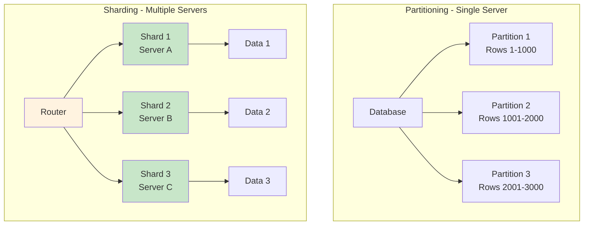
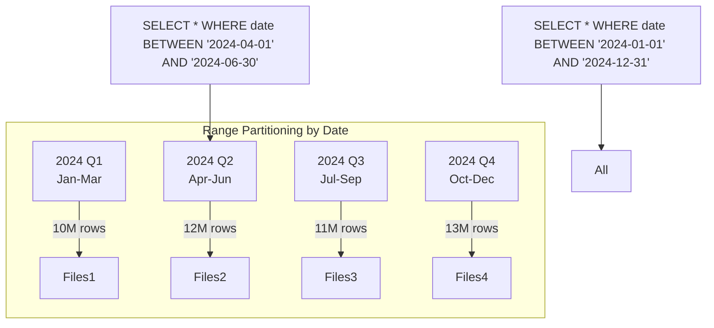
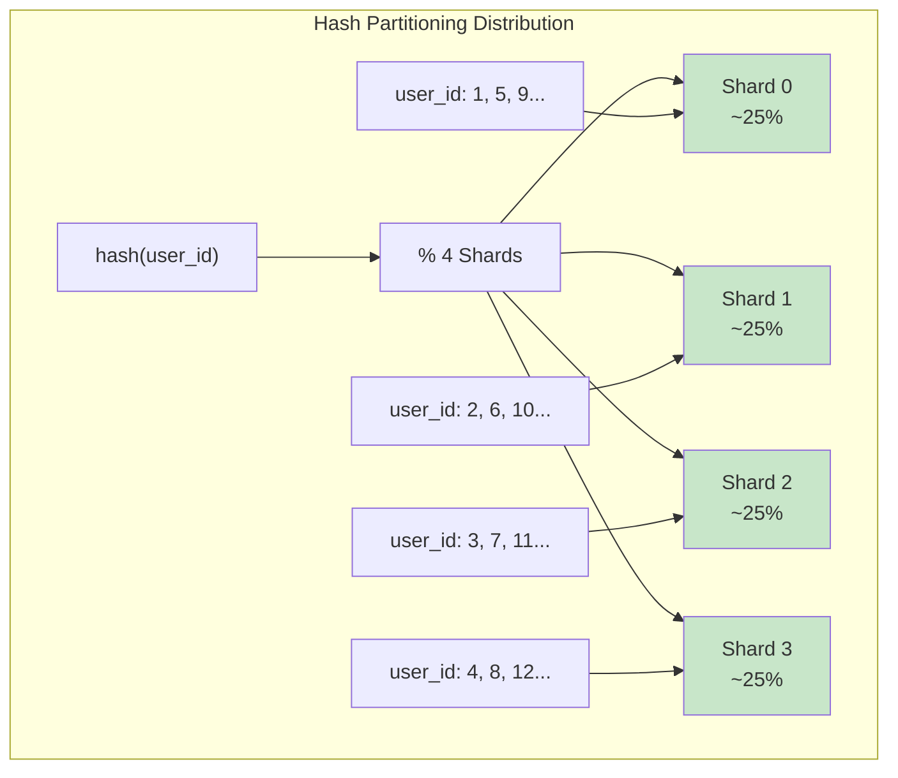
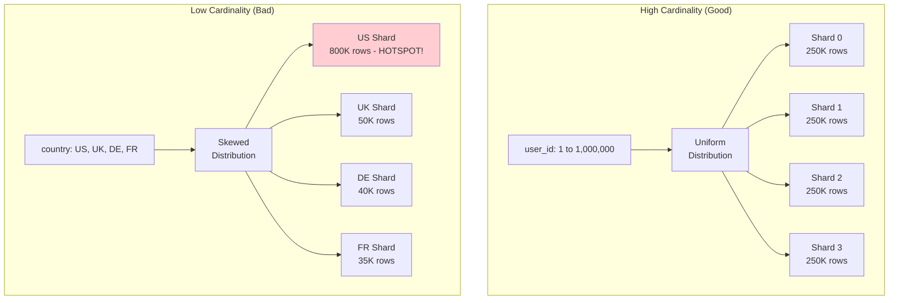
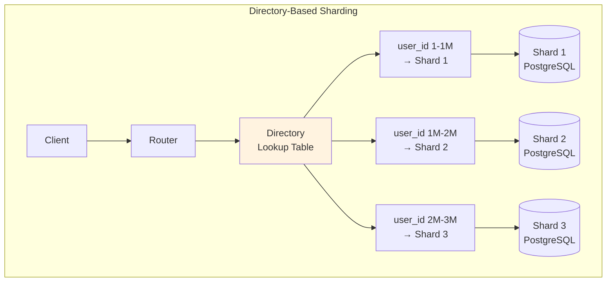
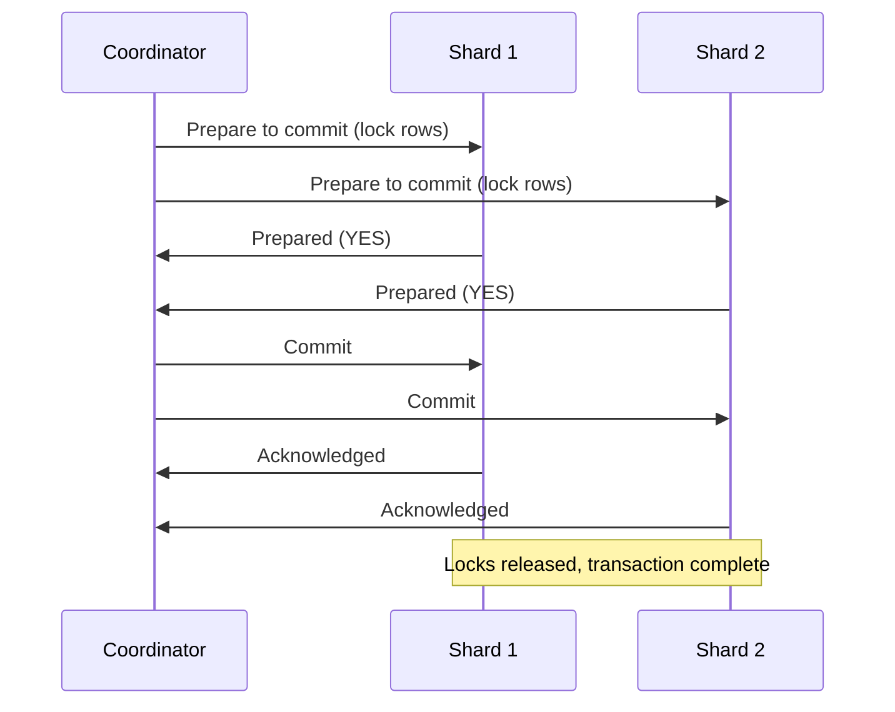
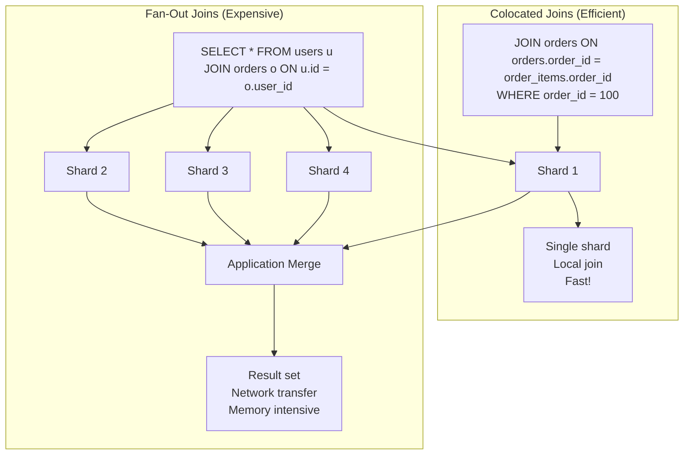
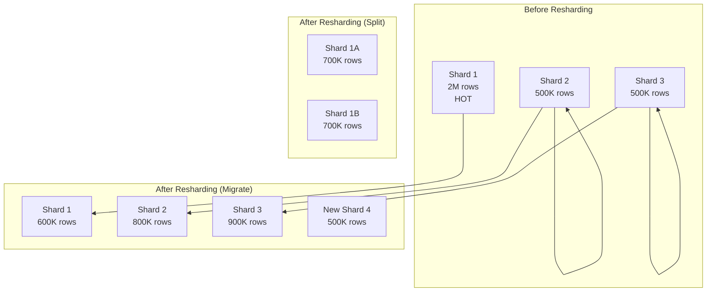
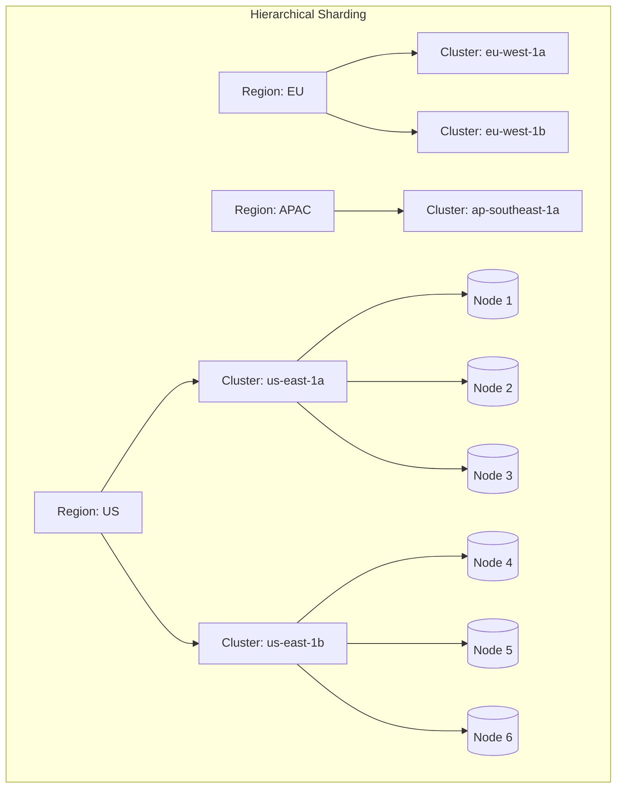
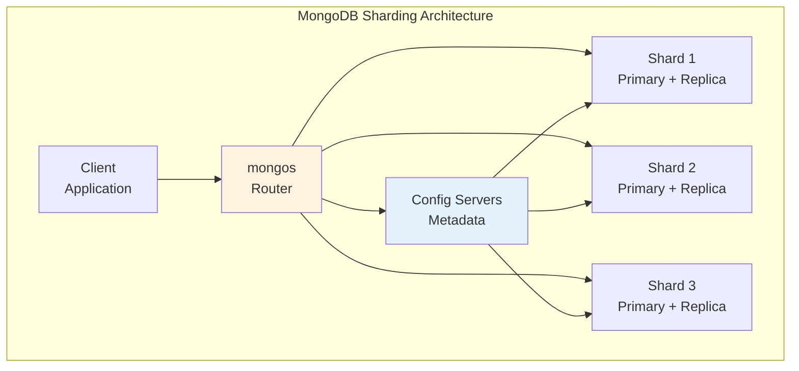

# Episode 14: Sharding & Partitioning

[](http://youtube.com/@ThatNotesGuy)

## What You'll Learn

- The critical distinction between partitioning and sharding
- Types of partitions: Range, List, Hash, and Composite
- How to select optimal shard keys (cardinality, uniformity, query alignment)
- Directory-based sharding and lookup strategies
- Cross-shard operations: transactions, joins, and aggregations
- Resharding strategies and zero-downtime migrations
- Real-world sharding patterns from Vitess, CockroachDB, and MongoDB

---

## Sharding vs Partitioning: The Distinction

### Core Definitions

**Partitioning** is the process of splitting data within a **single server or cluster**. The data remains in the same database instance, just organized into smaller, more manageable segments.

**Sharding** extends partitioning by distributing data **across multiple servers or nodes**. Each shard operates as an independent database, with the application coordinating across them.



### Shared-Nothing Architecture

True sharding implements a shared-nothing architecture where each node operates independently:

```yaml
Shared_Nothing_Principles:
  Storage: "Each shard has its own disk, memory, and CPU"
  Processing: "Queries execute locally on each shard"
  Coordination: "Minimal - nodes don't share resources"
  Scaling: "Add nodes without upgrading existing ones"

  Advantages:
    - "Linear scalability (10 nodes = 10x throughput)"
    - "No single point of contention"
    - "Fault isolation (one shard down = partial data only)"
    - "Geographic distribution possible"

  Trade_Offs:
    - "Cross-shard operations are expensive"
    - "Schema changes require coordination"
    - "Resharding is complex"
```

### When Sharding Becomes Necessary

```yaml
Sharding_Triggers:
  Data_Volume:
    Single_Server_Limit: "1-10 TB depending on workload"
    Symptoms: "Slow queries, long backup times, recovery challenges"
    Action: "Shard when approaching 50-80% of single server capacity"

  Throughput:
    Connection_Limits: "Databases have max connections"
    Lock_Contention: "Multiple writers blocking each other"
    Action: "Shard to distribute write load across nodes"

  Latency:
    Geographic_Requirements: "Users in multiple regions"
    Action: "Shard geographically to reduce latency"

  Cost:
    Vertical_Scaling: "Expensive at high end (16TB SSD = $X000/month)"
    Horizontal_Scaling: "Cheaper commodity servers"
    Action: "Shard when horizontal is more cost-effective"
```

---

## Types of Partitions/Shards

### Range Partitioning

Range partitioning divides data into consecutive ranges based on a key value. This is the most intuitive approach and works well when data naturally falls into ordered ranges.

```yaml
Range_Partitioning:
  How_It_Works:
    Key_Type: "Sequential values (dates, numeric IDs, timestamps)"
    Partition_Def: "Ranges don't overlap and cover all possible values"

  Example_Date_Partitions:
    Orders_2024_Q1: "2024-01-01 to 2024-03-31"
    Orders_2024_Q2: "2024-04-01 to 2024-06-30"
    Orders_2024_Q3: "2024-07-01 to 2024-09-30"
    Orders_2024_Q4: "2024-10-01 to 2024-12-31"

  Advantages:
    - "Excellent for time-series data"
    - "Easy to archive old partitions"
    - "Range queries by partition key are fast"
    - "Hotspot prevention (time-based access patterns)"

  Trade_Offs:
    - "Uneven distribution if data isn't uniform"
    - "Range queries not using partition key = scatter-gather"
    - "New partitions needed for new ranges"
```

```sql
-- Range Partitioning Example in PostgreSQL
CREATE TABLE orders (
    order_id BIGINT PRIMARY KEY,
    customer_id BIGINT,
    order_date DATE NOT NULL,
    total_amount DECIMAL(10,2)
) PARTITION BY RANGE (order_date);

CREATE TABLE orders_2024_q1 PARTITION OF orders
    FOR VALUES FROM ('2024-01-01') TO ('2024-04-01');

CREATE TABLE orders_2024_q2 PARTITION OF orders
    FOR VALUES FROM ('2024-04-01') TO ('2024-07-01');

CREATE TABLE orders_2024_q3 PARTITION OF orders
    FOR VALUES FROM ('2024-07-01') TO ('2024-10-01');

CREATE TABLE orders_2024_q4 PARTITION OF orders
    FOR VALUES FROM ('2024-10-01') TO ('2025-01-01');
```



### List Partitioning

List partitioning maps rows to partitions based on discrete values in the partition key. This works well when you have natural groupings like geographic regions or product categories.

```yaml
List_Partitioning:
  How_It_Works:
    Key_Type: "Discrete, categorical values"
    Partition_Def: "Each partition contains specific values"

  Example_Geographic:
    US_West: "CA, OR, WA, NV, AZ"
    US_East: "NY, NJ, CT, MA, FL"
    US_Midwest: "IL, OH, MI, IN, WI"
    US_South: "TX, GA, NC, VA, TN"

  Advantages:
    - "Direct mapping of business logic to storage"
    - "Easy to understand and manage"
    - "Good for geographic distribution"
    - "Data locality for region-specific queries"

  Trade_Offs:
    - "New partitions needed for new categories"
    - "Some partitions may be larger than others"
    - "Adding new values requires partition maintenance"
```

```sql
-- List Partitioning Example
CREATE TABLE customers (
    customer_id BIGINT PRIMARY KEY,
    name VARCHAR(100),
    state CHAR(2),
    email VARCHAR(255)
) PARTITION BY LIST (state);

CREATE TABLE customers_us_west PARTITION OF customers
    FOR VALUES IN ('CA', 'OR', 'WA', 'NV', 'AZ');

CREATE TABLE customers_us_east PARTITION OF customers
    FOR VALUES IN ('NY', 'NJ', 'CT', 'MA', 'FL');

CREATE TABLE customers_us_midwest PARTITION OF customers
    FOR VALUES IN ('IL', 'OH', 'MI', 'IN', 'WI');

CREATE TABLE customers_us_south PARTITION OF customers
    FOR VALUES IN ('TX', 'GA', 'NC', 'VA', 'TN');
```

### Hash Partitioning

Hash partitioning uses a hash function on the partition key to determine which shard a row belongs to. This ensures uniform distribution but sacrifices range query efficiency.

```yaml
Hash_Partitioning:
  How_It_Works:
    Function: "hash(key) mod num_shards"
    Distribution: "Uniform across partitions"

  Example:
    user_id: 12345
    hash(12345) = 0x7d3a
    num_shards = 4
    shard = 0x7d3a mod 4 = 2

  Advantages:
    - "Excellent load balancing"
    - "Works for any key type"
    - "No hotspots from skewed data"
    - "Simple to add new shards (with resharding)"

  Trade_Offs:
    - "No range queries by partition key"
    - "Adding shards requires data movement"
    - "Less intuitive than range/list"
```

```sql
-- Hash Partitioning Example in MySQL
CREATE TABLE users (
    user_id BIGINT PRIMARY KEY,
    username VARCHAR(50),
    email VARCHAR(255),
    created_at TIMESTAMP
) PARTITION BY HASH(user_id) PARTITIONS 8;

-- Equivalent in application-level sharding
-- shard = hash(user_id) % number_of_shards
```



### Composite Partitioning

Composite partitioning combines multiple partitioning strategies hierarchically. This provides flexibility for complex access patterns.

```yaml
Composite_Partitioning_Types:
  Range_Hash:
    Outer: "Range partitioning"
    Inner: "Hash partitioning within each range"
    Use_Case: "Time-based with user distribution"

    Example:
      Orders by Quarter (Range)
        Q1_Shard1: "hash(user_id) % 4 = 0"
        Q1_Shard2: "hash(user_id) % 4 = 1"
        Q1_Shard3: "hash(user_id) % 4 = 2"
        Q1_Shard4: "hash(user_id) % 4 = 3"

  Range_List:
    Outer: "Range partitioning"
    Inner: "List partitioning within each range"
    Use_Case: "Time-based with geographic sub-division"

    Example:
      Events by Year (Range)
        2024_US: "US states list"
        2024_EU: "EU countries list"
        2024_APAC: "APAC countries list"
```

```sql
-- Composite Partitioning Example (Range-Hash)
CREATE TABLE events (
    event_id BIGINT PRIMARY KEY,
    user_id BIGINT,
    event_type VARCHAR(50),
    event_date DATE NOT NULL,
    metadata JSONB
) PARTITION BY RANGE (event_date)
  SUBPARTITION BY HASH (user_id) SUBPARTITIONS 4;

-- Yearly partitions with user-hashed subpartitions
CREATE TABLE events_2024 PARTITION OF events
    FOR VALUES FROM ('2024-01-01') TO ('2025-01-01')
    (SUBPARTITION TEMPLATE (SUBPARTITION BY HASH(user_id)));

CREATE TABLE events_2023 PARTITION OF events
    FOR VALUES FROM ('2023-01-01') TO ('2024-01-01')
    (SUBPARTITION TEMPLATE (SUBPARTITION BY HASH(user_id)));
```

---

## Shard Key Selection

### Cardinality

Cardinality refers to the number of unique values in a potential shard key. High cardinality is essential for effective sharding.

```yaml
Cardinality_Requirements:
  Minimum: "At least as many unique values as planned shards"
  Ideal: "Order of magnitude more unique values than shards"

  High_Cardinality_Examples:
    user_id: "Millions to billions of unique users"
    order_id: "Every order has unique ID"
    email: "Each user has unique email"
    uuid: "Practically unlimited"

  Low_Cardinality_Problem:
    country_code: "Only ~250 values globally"
    status: "5-10 values (pending, shipped, delivered...)"
    year: "One partition per year"

    Problem: "If country_code = 'US' has 80% of data,
              US shard becomes a hotspot"
```



### Uniformity

Data and access patterns must be uniformly distributed to avoid hot shards and ensure balanced resource utilization.

```yaml
Uniformity_Considerations:
  Data_Distribution:
    Check: "Is data evenly spread across key values?"
    Problem: "Most active users have IDs in certain range"

  Access_Distribution:
    Check: "Are reads/writes evenly distributed?"
    Problem: "Popular users generate more traffic"

  Time_Based_Skew:
    Check: "Newer data accessed more frequently?"
    Problem: "Latest quarter's data is hot"

  Mitigation_Strategies:
    - "Choose keys that distribute both data AND access"
    - "Use composite keys to add randomness"
    - "Monitor shard sizes and adjust"
```

### Query Alignment

The best shard key allows queries to target a single shard. Cross-shard queries require scatter-gather operations that are slower and more complex.

```yaml
Query_Alignment_Types:
  Perfect_Alignment:
    Query: "Always hits one shard"
    Example: "SELECT * WHERE user_id = X"
    Result: "Same performance as non-sharded database"

  Partial_Alignment:
    Query: "Hits multiple shards, but bounded"
    Example: "SELECT * WHERE region = 'US-WEST' AND date > '2024-01-01'"
    Result: "N shards accessed instead of all"

  No_Alignment:
    Query: "Requires all shards"
    Example: "SELECT COUNT(*) FROM users (no shard key filter)"
    Result: "Full scatter-gather, slowest pattern"

  Worst_Case:
    Query: "Application-side join across shards"
    Result: "N queries + N results to merge in app"
```

```mermaid
graph LR
    subgraph "Query Alignment Scenarios"
        A[Query: SELECT * WHERE user_id = ?] --> B[1 Shard<br/>Perfect]
        C[Query: SELECT * WHERE region = ?] --> D[2-4 Shards<br/>Partial]
        E[Query: SELECT AVG(score) FROM results] --> F[All Shards<br/>Scatter-Gather]
        G[Query: JOIN orders ON users.user_id] --> H[2 Shard Sets<br/>Cross-Shard Join]
    end

    style B fill:#c8e6c9
    style D fill:#fff3e0
    style F fill:#ffcdd2
    style H fill:#ffcdd2
```

### Composite Shard Keys

Composite keys combine multiple columns to achieve better distribution and query alignment.

```yaml
Composite_Key_Design:
  Order_Matters: "First component is most significant"
  Pattern: "(primary_dimension, secondary_dimension)"

  Design_Examples:
    User_Data:
      Good: "(user_id)"
      Better: "(tenant_id, user_id)"  -- Multi-tenant

    Ecommerce:
      Good: "(order_id)"
      Better: "(region, order_id)"  -- Geographic queries

    Time_Series:
      Good: "(timestamp)"
      Better: "(date, customer_id)"  -- Date range + customer

  Trade_Offs:
    "+ Better query alignment for composite queries"
    "- Narrower query patterns may hit more shards"
    "- More complex resharding"
```

---

## Directory-Based Sharding

### Lookup Table Approach

Directory-based sharding uses a separate table or service to map shard keys to physical shard locations.

```yaml
Directory_Based_Sharding:
  Concept: "Lookup table mapping keys to shards"
  Structure: "shard_key → shard_location"

  Example_Lookup_Table:
    user_id_ranges:
      1-1000000: "shard-us-east-1"
      1000001-2000000: "shard-us-east-2"
      2000001-3000000: "shard-us-west-1"

    sharded_tables:
      users: "shard-us-east-1"
      orders: "shard-us-east-2"

  Advantages:
    - "Flexible shard assignment"
    - "Can change shard locations without resharding data"
    - "Single point to manage mappings"
    - "Easy to implement for simple cases"

  Trade_Offs:
    - "Lookup overhead on every query"
    - "Directory is single point of failure"
    - "Directory must be highly available"
    - "Cache directory for performance"
```



```sql
-- Example directory table
CREATE TABLE shard_directory (
    table_name VARCHAR(100),
    shard_key_min BIGINT,
    shard_key_max BIGINT,
    shard_host VARCHAR(255),
    shard_port INT,
    shard_database VARCHAR(100),
    PRIMARY KEY (table_name, shard_key_min)
);

-- Query routing function
CREATE FUNCTION get_shard_location(
    p_table_name VARCHAR,
    p_shard_key BIGINT
) RETURNS VARCHAR AS $$
BEGIN
    RETURN (
        SELECT shard_host || ':' || shard_port
        FROM shard_directory
        WHERE table_name = p_table_name
        AND shard_key >= shard_key_min
        AND shard_key <= shard_key_max
    );
END;
$$ LANGUAGE plpgsql;
```

---

## Cross-Shard Operations

### Distributed Transactions

When a transaction spans multiple shards, you need distributed transaction coordination.

```yaml
Two_Phase_Commit_2PC:
  Phases:
    Prepare:
      Coordinator: "Can you commit?"
      Each_Participant: "Yes (lock resources) or No (abort)"
    Commit:
      Coordinator: "Commit now"
      Each_Participant: "Acknowledge"

  Workflow:
    1. "Coordinator asks all participants to prepare"
    2. "All say YES → Coordinator sends commit"
    3. "Any says NO → Coordinator sends abort"
    4. "Participants acknowledge and release locks"

  Blocking_Risk:
    Problem: "If coordinator fails after prepare,
              participants hold locks indefinitely"
    Solution: "Timeouts, backups, or three-phase commit"
```



```yaml
2PC_Example_Transfer:
  Scenario: "Transfer $100 from User A (Shard 1) to User B (Shard 2)"

  Steps:
    1. "Begin distributed transaction"
    2. "Prepare Shard 1: Debit $100 from User A"
    3. "Prepare Shard 2: Credit $100 to User B"
    4. "If both prepare successful → Commit both"
    5. "If any fail → Rollback both"

  Performance:
    Latency: "2-4 round trips minimum"
    Throughput: "Significantly lower than local transactions"

  Alternative: "Saga Pattern (eventual consistency)"
```

### Cross-Shard Joins

Joining data across shards requires either data colocation or scatter-gather operations.

```yaml
Join_Strategies:
  Data_Colocation:
    Technique: "Shard same on both tables"
    Example: "Orders and OrderItems both by order_id"
    Result: "Join executes on single shard"

    Implementation:
      - "Same partition key for related tables"
      - "Both tables on same shard for that key"
      - "Transparent to application"

  Fan_Out_Queries:
    Technique: "Query all shards, merge results"
    Example: "Get all orders with customer info"
    Result: "Application merges joined data"

    Steps:
      1. "Query each shard for relevant data"
      2. "Transfer all results to application"
      3. "Application performs join"
      4. "Return merged result"

    Performance:
      - "Network: Transfer all data to client"
      - "Memory: Must hold all results"
      - "Latency: Wait for slowest shard"
```



### Cross-Shard Aggregations

Aggregations across shards require distributed query processing.

```yaml
Aggregation_Strategies:
  MapReduce_Style:
    Phase_1_Map: "Each shard computes partial aggregate"
    Phase_2_Reduce: "Coordinator merges partial results"

  Example_SUM:
    Shard_1: "SELECT SUM(amount) FROM orders WHERE status='paid'"
    Shard_2: "SELECT SUM(amount) FROM orders WHERE status='paid'"
    Coordinator: "SUM(shard_1_result, shard_2_result)"

  Example_COUNT_DISTINCT:
    Shard_1: "SELECT COUNT(DISTINCT user_id) FROM orders"
    Shard_2: "SELECT COUNT(DISTINCT user_id) FROM orders"
    Problem: "Same user appears on multiple shards"
    Solution: "Merge all user_ids, then distinct count"

  Performance_Considerations:
    - "Each shard must scan relevant data"
    - "Network transfer of partial results"
    - "Some operations (percentiles) require all data"
```

---

## Resharding

### When to Reshard

```yaml
Resharding_Triggers:
  Growth:
    Current_Size: "Approaching 80% of single shard capacity"
    Projection: "Will exceed in 6-12 months"
    Action: "Split shards or add new shards"

  Hotspots:
    Symptom: "One shard at 90% CPU, others at 20%"
    Cause: "Skewed access pattern"
    Action: "Redistribute data from hot shard"

  Capacity_Planning:
    New_Region: "Adding geographic shards"
    New_Tenant: "Multi-tenant with growing customers"
    Action: "Pre-emptive resharding"

  Imbalance:
    Metric: "Largest shard 2x larger than average"
    Cause: "Hash collision or skewed data"
    Action: "Rebalance to equalize"
```

### Resharding Strategies

```yaml
Split_Approach:
  How: "Divide one shard into two"
  Process:
    1. "Create new empty shard"
    2. "Move subset of data to new shard"
    3. "Update routing layer"
    4. "Delete old data from source shard"

  Example:
    Shard_1: "user_id 1-1000000"
    Split_Into:
      Shard_1A: "user_id 1-500000"
      Shard_1B: "user_id 500001-1000000"

  Pros: "No new servers needed, just split storage"

Migrate_Approach:
  How: "Move data between existing shards"
  Process:
    1. "Add new shard"
    2. "Copy relevant data from old shards"
    3. "Verify data consistency"
    4. "Update routing, mark old data stale"
    5. "Garbage collect old data"

  Pros: "Flexible redistribution"
```



### Zero-Downtime Resharding

```yaml
Zero_Downtime_Strategy:
  Dual_Write_Period:
    Phase_1: "Write to both old and new locations"
    Phase_2: "Backfill historical data to new location"
    Phase_3: "Verify consistency"
    Phase_4: "Cut over reads to new location"
    Phase_5: "Stop writes to old location"

  Blue_Green_Deployment:
    Blue: "Current shards"
    Green: "New shard configuration"
    Process:
      1. "Set up green configuration"
      2. "Replicate data blue → green"
      3. "Switch routing to green"
      4. "Roll back if issues"
      5. "Decommission blue"

  Double_Write_Risks:
    - "Network partition during write"
    - "Application crash between writes"
    - "Need idempotent operations"
```

```yaml
Resharding_Checklist:
  Before:
    - "Backup all data"
    - "Test migration on staging"
    - "Calculate new shard boundaries"
    - "Update monitoring alerts"

  During:
    - "Monitor latency and error rates"
    - "Have rollback plan ready"
    - "Throttle migration speed if needed"
    - "Verify data counts match"

  After:
    - "Remove old shard storage"
    - "Update documentation"
    - "Verify query performance"
    - "Clean up temporary migration tables"
```

---

## Common Sharding Patterns

### Functional Sharding

```yaml
Functional_Sharding:
  Concept: "Shard by access pattern, not just key"
  Patterns:

  Read_Vs_Write_Separation:
    Read_Replica: "Shards for heavy read workloads"
    Write_Master: "Shards optimized for writes"
    Use_Case: "Analytics vs transactional"

  Data_Sensitivity:
    PII_Shard: "Personally identifiable information"
    Public_Shard: "Non-sensitive data"
    Compliance: "GDPR, HIPAA requirements"

  Temporal_Separation:
    Hot_Shard: "Recent, frequently accessed data"
    Cold_Shard: "Historical, rarely accessed data"
    Archive: "Very old, compliance storage"
```

### Hierarchical Sharding

```yaml
Hierarchical_Sharding:
  Concept: "Multi-level sharding for global systems"
  Levels:
    Region: "US, EU, APAC (3-6 regions)"
    Cluster: "Availability zone within region (2-4 clusters)"
    Node: "Physical/virtual machine (N nodes per cluster)"

  Example_Netflix_Style:
    Region: "US-East, US-West, EU, APAC"
      Cluster_1: "AZ-1, 3 nodes"
      Cluster_2: "AZ-2, 3 nodes"
        Node: "PostgreSQL/MySQL instance"

  Benefits:
    - "Data sovereignty compliance"
    - "Reduced latency for local users"
    - "Isolated regional failures"
    - "Independent scaling per region"
```



---

## Sharding Platforms

### Vitess (YouTube, MySQL)

```yaml
Vitess_Overview:
  Purpose: "MySQL sharding middleware"
  Origin: "YouTube scale (billions of rows)"
  Language: "Go"

  Core_Concepts:
    VSchema: "Virtual schema describing sharding rules"
    VIndex: "Shard key routing algorithm"
    VTGate: "Query router (handles client connections)"
    VTTablet: "Proxy between VTGate and MySQL"

  Sharding_Philosophy:
    - "Application doesn't know about shards"
    - "Transparent routing via VTGate"
    - "Online schema changes"
    - "Automated resharding"
```

```yaml
Vitess_Configuration:
  VSchema_Example:
    orders:
      column_vindexes:
        - column: order_id
          name: hash
      table: orders

  VIndex_Types:
    hash: "hash(key) % 64"
    unicode_loose_md5: "Hash for text"
    range: "Range-based routing"

  Resharding_Workflow:
    1. "Begin - start resharding job"
    2. "Copy - duplicate source to target"
    3. "Catchup - sync ongoing changes"
    4. "Switch - point reads/writes to new shards"
```

### CockroachDB

```yaml
CockroachDB_Overview:
  Purpose: "Distributed SQL database"
  Design: "Automatic sharding from day one"
  Compatibility: "PostgreSQL wire protocol"

  Automatic_Sharding:
    Range_Splits: "Automatic when data grows"
    Default_Range: "~64MB of data or 512MB keys"
    Load_Based: "Split busy ranges"

  Data_Locality:
    Leaseholder: "Node with read/write authority"
    Replicas: "3x by default for durability"
    Placement: "Can specify constraints"

  Scaling:
    Add_Node: "Data automatically rebalanced"
    Remove_Node: "Data safely migrated"
    Zero_Downtime: "Always available during changes"
```

### MongoDB

```yaml
MongoDB_Overview:
  Purpose: "Document database with sharding"
  Architecture:
    Config_Servers: "Store cluster metadata"
    Shard_Servers: "Store actual data"
    Mongos: "Query router"

  Shard_Key_Selection_Impact:
    Good_Key: "Even distribution, efficient queries"
    Bad_Key: "Hotspots, uneven chunks"

  Chunk_Management:
    Default_Chunk_Size: "64MB"
    Split: "Divide oversized chunk"
    Migrate: "Move chunk to different shard"
    Balancer: "Automatic redistribution"

  Commands:
    sh.shardCollection: "Enable sharding for collection"
    sh.shardStatus: "View shard distribution"
    sh.addShard: "Add new shard to cluster"
```



---

## Comparison: Partitioning Strategies

| Aspect | Range | List | Hash | Composite |
|--------|-------|------|------|-----------|
| **Best For** | Time-series, sequential data | Categorical, geographic | Uniformly distributed data | Complex access patterns |
| **Query Efficiency** | Great for range queries | Great for equality on key | Uniform, no range support | Depends on pattern |
| **Hotspot Risk** | Medium (if data skewed) | Medium (if categories uneven) | Low | Varies |
| **Add Partitions** | Easy (new date range) | Easy (new category) | Hard (requires resharding) | Complex |
| **Data Distribution** | Can be uneven | Can be uneven | Uniform | Hierarchical |
| **Use Case Example** | Orders by date | Users by state | Users by ID | Orders by date, user |

---

## Key Takeaways

### Remember This

- **Partitioning** splits data within one server; **sharding** distributes across multiple servers
- **Shard key selection** is the most important decision - get it wrong and everything suffers
- **High cardinality** is essential - low cardinality keys cause hotspots and uneven distribution
- **Query alignment** should target single shards - scatter-gather is expensive and slow
- **Resharding is hard** - choose your shard key carefully and plan for growth upfront
- **No free lunch** - sharding adds complexity; only shard when you need to
- **Cross-shard operations** (joins, transactions) are expensive - design to minimize them
- **Directory-based sharding** provides flexibility but introduces a potential single point of failure

### Common Mistakes to Avoid

```yaml
Common_Mistakes:
  1: "Choosing low cardinality keys (country, status, year) leading to hotspots"
  2: "Not testing access patterns - production data differs from sample data"
  3: "Assuming sharding solves all problems - it adds complexity"
  4: "Missing index on shard key - forces full cluster scans"
  5: "Not planning for cross-shard queries - they become very expensive"
  6: "Forgetting about schema changes - rolling out changes across all shards"
  7: "No backup/rescue plan for individual shards - failure means data loss"
  8: "Premature sharding - most apps don't need it until 10M+ records"
  9: "Ignoring rebalancing - shards will drift out of balance over time"
  10: "Treating shards as independent - consistency across shards matters"

  Golden_Rule: |
    "Don't shard until you must, but when you must,
     choose your key carefully and test thoroughly"
```

---

<div align="center">

[Previous: Episode 13](../13-indexing/) | [Course Home](../../) | [Next: Episode 15](../15-coming-soon/)

</div>
