# Episode 15: Distributed Systems - Database Replication and Leader Election Explained

[](http://youtube.com/@ThatNotesGuy)

---

## What You'll Learn

```yaml
Learning_Objectives:
  - "Understand database replication: Master-Slave patterns and data flow mechanisms"
  - "Master the concepts of synchronous vs asynchronous replication trade-offs"
  - "Learn practical MySQL/MariaDB replication setup with GTIDs"
  - "Explore multi-master replication and conflict resolution strategies"
  - "Deep dive into leader election: Bully, Ring, Raft, and Paxos algorithms"
  - "Implement distributed locking with leases, heartbeats, and TTL"
  - "Understand split-brain problem and its prevention mechanisms"
  - "Apply scaling patterns: Sharding as a solution to single-leader bottlenecks"
```

---

## Introduction: Replication and Election Foundation

### Database Replication: The Core Concept

**Database Replication** is the process of copying and maintaining database objects across multiple database instances to achieve redundancy, high availability, and improved read performance.

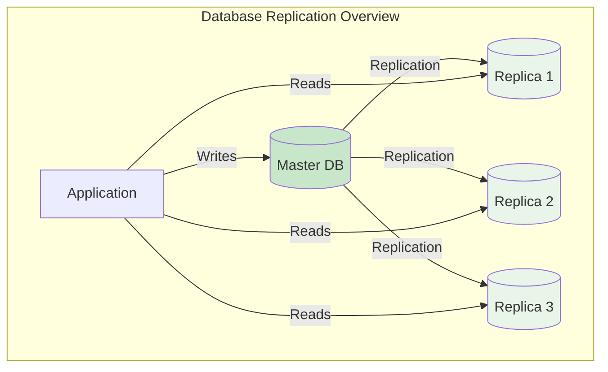

### Why Replication Matters

```yaml
Replication_Purpose:
  High_Availability: "Survive hardware failures without downtime"
  Read_Scalability: "Handle 10x-100x more read queries"
  Disaster_Recovery: "Geographic redundancy for data safety"
  Load_Distribution: "Offload reads from primary database"
  Maintenance_Windows: "Perform upgrades without service interruption"
```

### Leader Election: Why We Need a Boss

**Leader Election** is the process of selecting a single coordinator from a group of distributed nodes to make decisions, coordinate actions, and maintain consistency.

```yaml
Leader_Election_Purpose:
  Uniqueness: "Ensure exactly one leader at any time"
  Liveness: "Eventual election when leader fails"
  Consistency: "Single point of decision-making"
  Coordination: "Prevent conflicting operations"

  Use_Cases:
    - "Replicated databases (Raft/Paxos groups)"
    - "Task coordination in distributed systems"
    - "Configuration management"
    - "Service discovery leadership"
```

### High Availability vs Fault Tolerance vs Coordination

```yaml
Distinctions:
  High_Availability:
    Definition: "System continues operating despite failures"
    Approach: "Redundant components, failover mechanisms"
    Example: "Load balancer routes around failed server"

  Fault_Tolerance:
    Definition: "System continues correctly despite component failures"
    Approach: "Redundancy, error detection, recovery"
    Example: "RAID disk array continues working with failed disk"

  Coordination:
    Definition: "Multiple components work together coherently"
    Approach: "Leader election, consensus protocols"
    Example: "Distributed transaction commit across services"

  Relationship: "Coordination enables HA, both achieve fault tolerance"
```

### Visual Concepts: The Flow

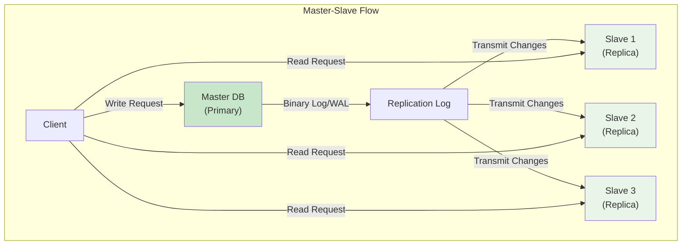

---

## Master-Slave Replication: The Core Pattern

### Single Master, Multiple Slaves

The fundamental pattern where **one node handles all writes** and **multiple nodes handle reads**.

```yaml
Master_Slave_Architecture:
  Master_Responsibilities:
    - "Handle all write operations (INSERT, UPDATE, DELETE)"
    - "Record changes in binary log / WAL"
    - "Acknowledge commits to clients"
    - "No reads (can be configured for reads)"

  Slave_Responsibilities:
    - "Connect to master and read replication stream"
    - "Apply changes locally"
    - "Handle all read operations"
    - "Report status to master"

  Benefits:
    - "Read scalability: Add slaves for read-heavy workloads"
    - "High availability: Promote slave if master fails"
    - "Geographic distribution: Slaves in different regions"
```

### The Read-to-Write Ratio Optimization

Most applications have **10:1 to 1000:1 read-to-write ratios**. Master-slave replication is specifically designed for this common pattern.

```yaml
Scaling_Pattern:
  Single_Master_Bottleneck: "Writes must go through one node"
  Read_Scalability: "Add slaves horizontally for reads"

  Example_Workload:
    Writes: "100 per second"
    Reads: "10,000 per second"
    Configuration: "1 Master + 9 Slaves"
    Result: "100% write capacity, 900% read capacity"
```

### Architecture Diagram

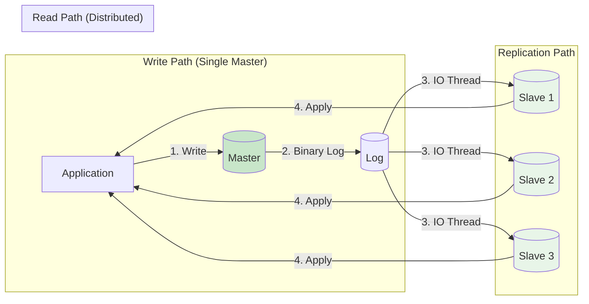

---

## Replication Mechanics: How Data Flows

### Binary Logs vs Write-Ahead Log

Different databases use different mechanisms for recording changes:

```yaml
Replication_Logs:
  Binary_Logs_MySQL_MariaDB:
    Format: "Statement-based, Row-based, or Mixed"
    Contents: "All statements that modify database"
    Position_Based: "File name + byte offset"
    GTID_Based: "Transaction identifiers"

  WAL_PostgreSQL:
    Format: "Write-Ahead Log"
    Contents: "Physical page changes"
    Segment_Based: "16MB WAL segments"
    LSN_Based: "Log Sequence Numbers"

  Key_Difference:
    MySQL: "Logical changes (statements or rows)"
    PostgreSQL: "Physical block-level changes"
```

### Statement-Based vs Row-Based vs Mixed Logging

```yaml
Logging_Modes:
  Statement_Based:
    Pros: "Compact log size, replicates exact SQL"
    Cons: "Non-deterministic functions may fail"
    Example: "NOW(), RAND(), UUID()"

  Row_Based:
    Pros: "Guaranteed consistency, no non-deterministic issues"
    Cons: "Large log size for bulk operations"
    Example: "Full row images logged"

  Mixed:
    Behavior: "Statement-based by default, switches to row when needed"
    Use_Case: "Best of both worlds for most applications"
```

### Pull-Based Replication Model

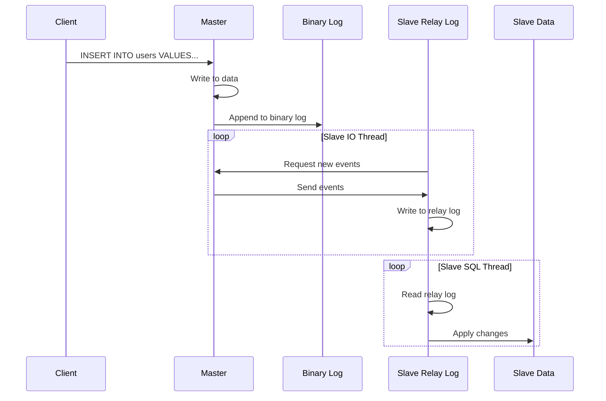

### Global Transaction IDs (GTIDs)

GTIDs provide a unique, continuous identifier for each transaction, simplifying replication management.

```yaml
GTID_Format:
  Structure: "Source_ID:Transaction_ID"
  Example: "3E11FA47-71CA-11E1-9E33-C80AA9429562:12345"

  Benefits:
    - "No need to track file positions"
    - "Consistent replication after failover"
    - "Easier slave promotion"
    - "Automatic integration tracking"

  Commands:
    CHANGE_MASTER_TO: "Automatically finds correct position"
    START_SLAVE: "Begins replication from GTID position"
```

---

## Replication Benefits

### High Availability and Disaster Recovery

```yaml
HA_DR_Benefits:
  Automatic_Failover: "Slave promoted to master on failure"
  Geographic_Distribution: "Data centers across regions"
  Point_in_Time_Recovery: "Replay logs to any point"
  RPO_RTO_Goals: "Configurable recovery objectives"

  Example_Scenario:
    Master: "US-East (primary)"
    Slave1: "US-West (failover target)"
    Slave2: "EU-West (disaster recovery)"
    RPO: "< 1 second (synchronous)"
    RTO: "< 1 minute (automatic failover)"
```

### Read Scalability

```yaml
Read_Scaling:
  Horizontal_Read_Scaling: "Add slaves for linear read capacity"
  Read_Latency_Improvement: "Geographic proximity to users"
  Read_Isolation: "Heavy queries don't affect master"

  Load_Distribution:
    Reads: "80-90% to slaves"
    Writes: "100% to master"
    Result: "10x read capacity improvement"
```

### Data Security and Analytics Isolation

```yaml
Security_Use_Case:
  Backup_Slaves: "Snapshot without locking master"
  Staging_Environment: "Test on production data"
  Audit_Queries: "Run heavy reports without production impact"

  Analytics_Isolation:
    Resource_Isolation: "Analytics don't compete with OLTP"
    Data_Science_Workloads: "Machine learning on replica"
    Reporting: "Business intelligence without performance impact"
```

### Cascading Replication

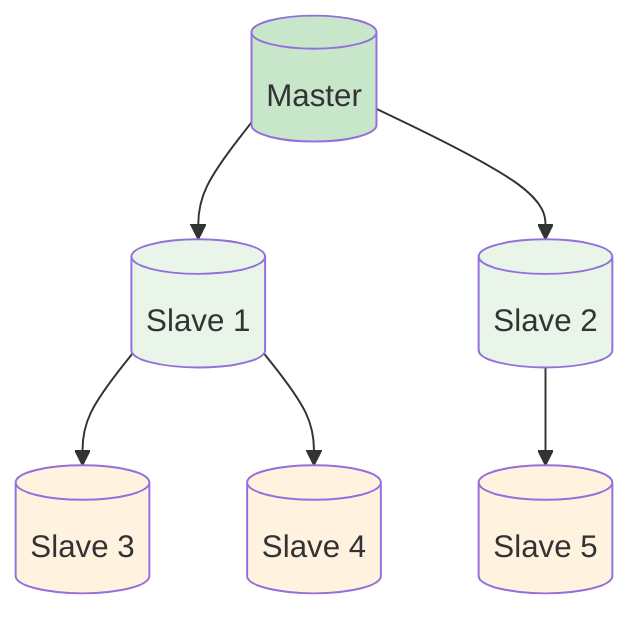

```yaml
Cascading_Benefits:
  Reduces_Master_Load: "Intermediate slaves handle replication"
  Geographic_Tiers: "Regional slaves serve local replicas"
  Scale_Replication: "Chain many slaves without master overhead"

  Trade_Offs:
    Lag_Accumulation: "Each hop adds latency"
    Complexity: "Harder to trace data flow"
```

---

## Replication Consistency Trade-offs

### Synchronous vs Asynchronous vs Semi-Synchronous

| Aspect | Synchronous | Asynchronous | Semi-Synchronous |
|--------|-------------|--------------|------------------|
| **Latency** | High (waits for slaves) | Low (immediate return) | Medium |
| **Consistency** | Strong (all replicas have data) | Eventual (may lag) | Strong on acknowledge |
| **Durability** | Maximum (guaranteed replication) | Risk (unreplicated data loss) | Balanced |
| **Complexity** | Simple | Simple | Moderate |
| **Use Case** | Financial, critical data | Web apps, social media | Balanced requirements |

### Synchronous Replication

```yaml
Synchronous_Behavior:
  Process: "Master waits for at least one slave to acknowledge"
  Flow:
    1. "Client sends transaction"
    2. "Master writes and fsyncs to binary log"
    3. "Master sends to slave(s)"
    4. "Master waits for ACK"
    5. "Master commits and responds to client"

  Example_Command:
    -- MySQL with semisync
    SET GLOBAL rpl_semi_sync_master_enabled = 1;
```

### Asynchronous Replication

```yaml
Asynchronous_Behavior:
  Process: "Master commits immediately, replicates in background"
  Flow:
    1. "Client sends transaction"
    2. "Master writes, commits, responds"
    3. "Replication happens asynchronously"

  Risk_Analysis:
    Data_Loss_Probability: "Master crashes before replication"
    Acceptable_Lag: "Seconds to minutes"
    Use_Case: "Web applications, content management"
```

### Semi-Synchronous Replication

```yaml
Semi_Synchronous:
  Definition: "Hybrid approach - waits for some, not all"
  Configuration: "Wait for N slaves before commit"

  Modes:
    Master_Waits: "At least one slave received"
    Master_Waits_And_Applied: "At least one slave applied"
    Wait_For_Timeout: "Falls back to async if timeout"

  Trade_Off:
    Better_Than_Async: "Guarantee at least one replica"
    Worse_Than_Full_Sync: "Not all replicas have data"
```

### Choosing the Right Consistency Model

```yaml
Decision_Framework:
  Financial_Systems: "Synchronous - zero data loss tolerance"
  E-Commerce: "Semi-synchronous - balance of speed and safety"
  Social_Media: "Asynchronous - eventual consistency acceptable"
  IoT_Telemetry: "Asynchronous - latest value matters most"
  Healthcare: "Synchronous - regulatory compliance"

  Questions_To_Ask:
    1. "How much data loss is acceptable?"
    2. "What are the latency requirements?"
    3. "What consistency guarantees are required?"
```

---

## Setting Up MariaDB/MySQL Replication

### Master Configuration

```ini
# /etc/mysql/mariadb.conf.d/50-server.cnf
[mysqld]
server-id = 1
log-bin = /var/log/mysql/mysql-bin
binlog-format = mixed
sync-binlog = 1
bind-address = 0.0.0.0

# Optional: GTID support
gtid-mode = on
enforce-gtid-consistency = on
log-slave-updates = on
```

### Slave Configuration

```ini
# /etc/mysql/mariadb.conf.d/50-server.cnf
[mysqld]
server-id = 2
log-bin = /var/log/mysql/mysql-bin
read-only = ON
relay-log = /var/log/mysql/mysql-relay-bin

# Optional: GTID support
gtid-mode = on
enforce-gtid-consistency = on
log-slave-updates = on
```

### Creating Replication User

```sql
-- On Master: Create dedicated replication user
CREATE USER 'replication_user'@'%' IDENTIFIED BY 'strong_password_here';
GRANT REPLICATION SLAVE, REPLICATION CLIENT ON *.* TO 'replication_user'@'%';
FLUSH PRIVILEGES;

-- Verify user
SELECT user, host FROM mysql.user WHERE user = 'replication_user';
```

### Setting Up Replication with GTIDs

```sql
-- On Slave: Configure replication
CHANGE MASTER TO
    MASTER_HOST = 'master.example.com',
    MASTER_USER = 'replication_user',
    MASTER_PASSWORD = 'strong_password_here',
    MASTER_PORT = 3306,
    MASTER_USE_GTID = current_pos;

-- Start replication
START SLAVE;

-- Check status
SHOW SLAVE STATUS\G
```

### Verifying Replication Status

```sql
-- On Master: Check binary log position
SHOW MASTER STATUS;
-- Output: File, Position, Binlog_Do_DB, Binlog_Ignore_DB, Executed_Gtid_Set

-- On Slave: Check replication health
SHOW SLAVE STATUS\G
-- Key fields: Slave_IO_Running, Slave_SQL_Running, Seconds_Behind_Master

-- On Slave: Check GTID position
SHOW GLOBAL VARIABLES LIKE 'gtid%';
```

---

## Replication Challenges and Alternative Models

### Limitations of Single Master

```yaml
Master_Bottlenecks:
  Write_Scaling: "Cannot scale writes horizontally"
  Write_Latency: "Single point for all writes"
  Failover_Delay: "Manual or semi-automatic promotion"
  Write_Amplification: "Every write replicated to all slaves"

  Example_Problem:
    Load: "10,000 writes/second"
    Single_Master: "Hits capacity at 2,000 writes/second"
    Need: "Multiple write-capable nodes"
```

### Multi-Master Replication

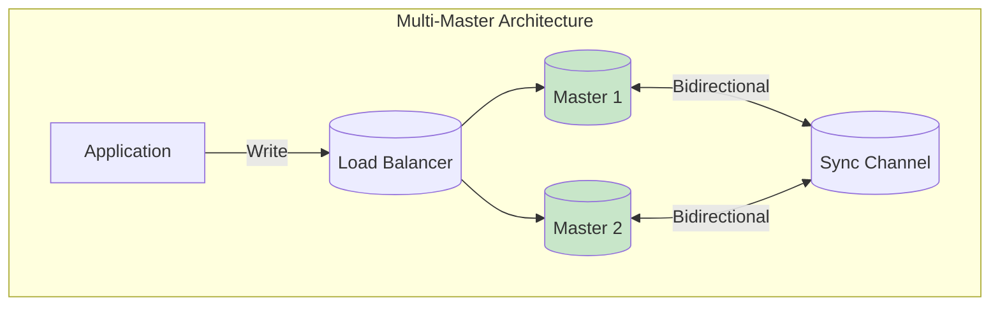

```yaml
Multi_Master_Definition:
  Concept: "Multiple masters can accept writes"
  Topology: "Active-Active configuration"
  Challenge: "Conflict resolution"

  Conflict_Types:
    Write_Write: "Same row updated on different masters"
    Delete_Update: "Delete on one, update on another"
    Auto_Increment: "Duplicate key conflicts"

  Resolution_Strategies:
    "Last writer wins (timestamp)"
    "Application-level resolution"
    "Conflict-free Replicated Data Types (CRDTs)"
```

### Circular Replication

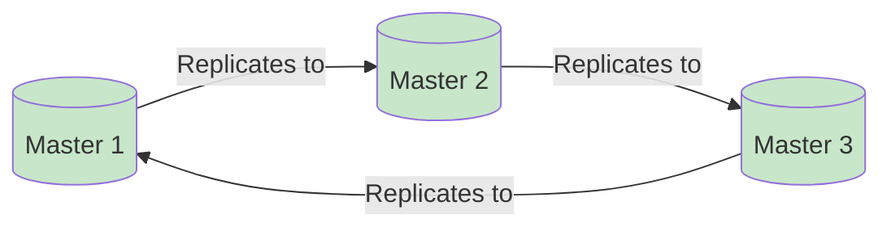

```yaml
Circular_Replication:
  Definition: "Chain of masters replicating in circle"
  Pros: "Each node is master and slave"
  Cons: "Lag accumulates, complex failover"

  Better_Alternative: "Star topology with dedicated sync layer"
```

---

## Leader Election: Why We Need a Boss

### The Coordination Problem

In a distributed system, multiple nodes must agree on a single leader to prevent conflicting operations.

```yaml
Election_Objectives:
  Uniqueness: "Exactly one leader at any time"
  Liveness: "New leader elected if current fails"
  Safety: "No two leaders simultaneously"
  Fairness: "Eventual election, no starvation"

  Problem_Statement:
    Without_Leader: "Split-brain, conflicting writes, data corruption"
    With_Leader: "Single decision point, consistent ordering"
```

### Split Brain: The Critical Danger

**Split Brain** occurs when a network partition causes multiple nodes to believe they are the leader, leading to data inconsistency.

```yaml
Split_Brain_Problem:
  Scenario: "Network partition splits cluster"
  Node_A: "Believes it's still leader"
  Node_B: "Elected new leader during partition"
  Result: "Two leaders accepting writes"
  Consequence: "Data divergence, corruption, inconsistency"

  Prevention:
    - "Quorum-based voting"
    - "Fencing tokens"
    - "Majority required for election"
```

### Use Cases for Leader Election

```yaml
Leader_Election_Applications:
  Database_Clusters:
    - "Primary election in replication groups"
    - "Coordinator for distributed transactions"

  Distributed_Locks:
    - "Lock holder for critical sections"
    - "Resource allocation coordinator"

  Service_Discovery:
    - "Leader for configuration updates"
    - "Health check coordinator"

  Job_Scheduling:
    - "Task queue processor election"
    - "Batch job coordinator"
```

---

## Leader Election Mechanisms: Distributed Locks and Leases

### External Consistency Services

```yaml
Consistency_Services:
  DynamoDB_Lock_Client:
    - "Acquires distributed locks using DynamoDB"
    - "Supports TTL and heartbeat"

  ZooKeeper:
    - "Ephemeral sequential znodes"
    - "Watch mechanism for lock release"

  etcd:
    - "Distributed key-value store"
    - "Revision-based concurrency"

  Consul:
    - "KV store with sessions"
    - "Lock acquisition API"
```

### Lease-Based Locking

```yaml
Lease_Concept:
  Definition: "Time-bound lock with automatic expiration"
  Mechanism: "Lock acquired for TTL, must renew before expiry"

  Process:
    1. "Node requests lock"
    2. "Lock granted with TTL (e.g., 30 seconds)"
    3. "Node performs work"
    4. "Node heartbeats to renew lease"
    5. "Lock released or expires"

  Benefits:
    - "Automatic release if holder crashes"
    - "No manual cleanup required"
    - "Simple failure handling"
```

### Heartbeat Mechanism

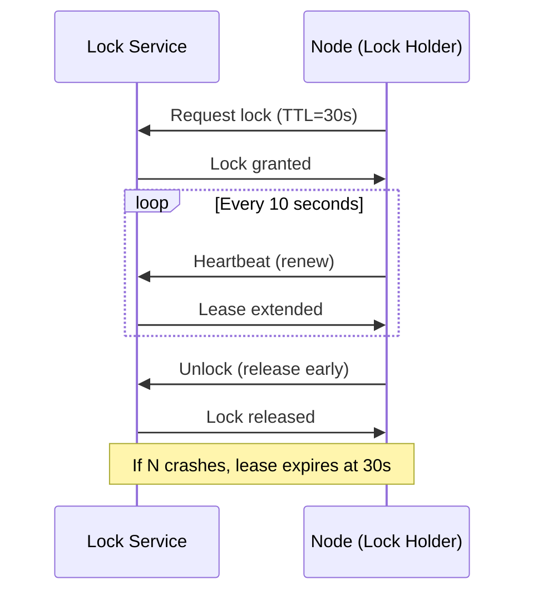

### Atomic Lock Acquisition

```yaml
Atomic_Operations:
  CAS_Compare_And_Swap: "Check value, swap if matches"
  etcd_Txn: "Atomic lock check and acquire"
  Redis_SETNX: "Set if not exists"

  Example_etcd:
    etcdctl txn --compare="CreateRevision('key') == 0" \
         --swap-success="Put('key', 'value')"

  Why_Atomic:
    Prevents: "Two nodes acquiring simultaneously"
    Ensures: "Only one successful lock holder"
```

### Google Chubby Lock Service

```yaml
Chubby_Overview:
  Purpose: "Coarse-grained lock service for distributed systems"
  Design: "Paxos-based consensus"
  Interface: "File system-like API"
  Clients: "Bigtable, MapReduce, search index"

  Key_Features:
    - "Ephemeral files for locks"
    - "Event notifications"
    - "Caching for read-heavy workloads"
    - "Strong consistency guarantees"
```

---

## Leader Election Algorithms: Bully vs Ring

### Bully Algorithm

The Bully algorithm uses node IDs to determine the leader - the highest ID node wins.

```yaml
Bully_Algorithm:
  Concept: "Highest ID node becomes leader"
  Trigger: "Election when leader fails"

  Process:
    1. "Node notices leader timeout"
    2. "Node sends ELECTION message to higher IDs"
    3. "If no response, node becomes leader"
    4. "If higher ID responds, that node takes over"

  Message_Flow:
    Node_4 notices leader down
    Node_4 -> Node_5: "Election"
    Node_5 -> Node_4: "Alive"
    Node_5 starts election process
    Node_5 -> Node_6: "Election"
    Node_6 -> Node_5: "Alive"
    Node_6 becomes leader
    Node_6 -> All: "Coordinator"
```

### Bully Algorithm Message Complexity

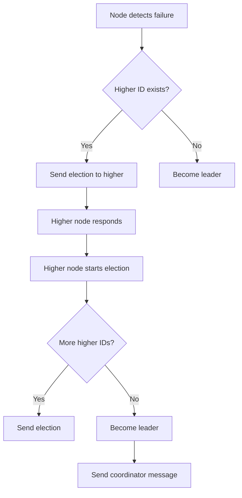

```yaml
Complexity_Analysis:
  Best_Case: "O(N)" - Immediate leader found
  Worst_Case: "O(N²)" - All nodes participate
  Messages: "N election messages + N coordinator messages"

  Trade_Off:
    Pro: "Simple to implement"
    Con: "High ID nodes do more work"
    Con: "Network traffic on failures"
```

### Ring Algorithm

The Ring algorithm organizes nodes in a logical ring for election.

```yaml
Ring_Algorithm:
  Concept: "Nodes arranged in logical ring topology"
  Election: "Messages circulate around ring"

  Process:
    1. "Node notices leader timeout"
    2. "Sends ELECTION with own ID to next node"
    3. "Each node adds own ID and forwards"
    4. "Full circle returns to initiator"
    5. "Highest ID node sends COORDINATOR message"

  Message_Count: "2(N-1)" - One full circle each way
```

### Ring Algorithm Message Flow

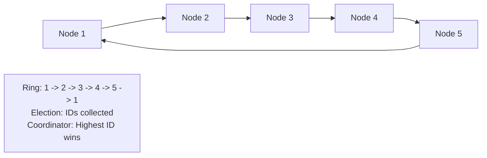

### Algorithm Comparison

| Aspect | Bully Algorithm | Ring Algorithm |
|--------|-----------------|----------------|
| **Message Complexity** | O(N²) worst case | 2(N-1) messages |
| **Overhead** | High during election | Constant overhead |
| **Implementation** | Simple | Moderate |
| **Failure Detection** | Timeout-based | Ring-based |
| **Scalability** | Limited | Better |
| **Best For** | Small clusters | Larger clusters |
| **Single Point** | Highest ID election | Ring completion |

---

## Consensus Algorithms: Raft and Paxos

### Raft: The Understandable Consensus

Raft is designed to be understandable by dividing the problem into leader election and log replication.

```yaml
Raft_States:
  Leader:
    - "Handles all client requests"
    - "Appends entries to log"
    - "Replicates to followers"
    - "Sends heartbeats"

  Follower:
    - "Replicates logs from leader"
    - "Responds to RPCs"
    - "Promotes to candidate on timeout"

  Candidate:
    - "Starting new election"
    - "Requests votes from peers"
    - "Becomes leader on majority"
```

### Raft Election Process

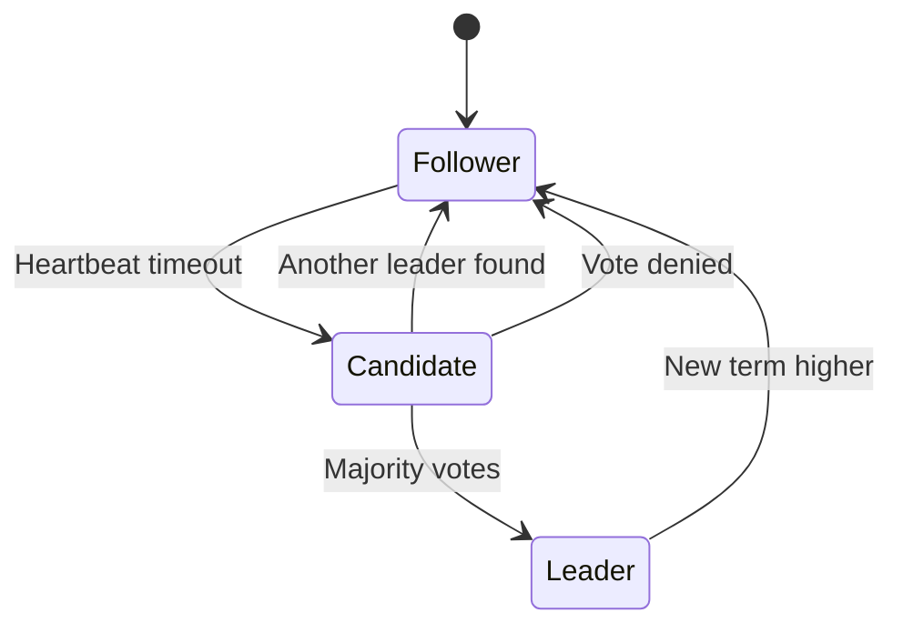

```yaml
Election_Steps:
  1. "Follower waits for election timeout (100-300ms)"
  2. "Follower becomes Candidate"
  3. "Candidate increments term and requests votes"
  4. "Peers vote if log is up to date"
  5. "Candidate with majority becomes Leader"
  6. "Leader sends heartbeats to prevent new elections"

  Terms_Epochs:
    Purpose: "Logical time for freshness"
    Format: "Integer counter"
    Rules: "Higher term wins, stale RPCs rejected"
```

### Raft Log Replication

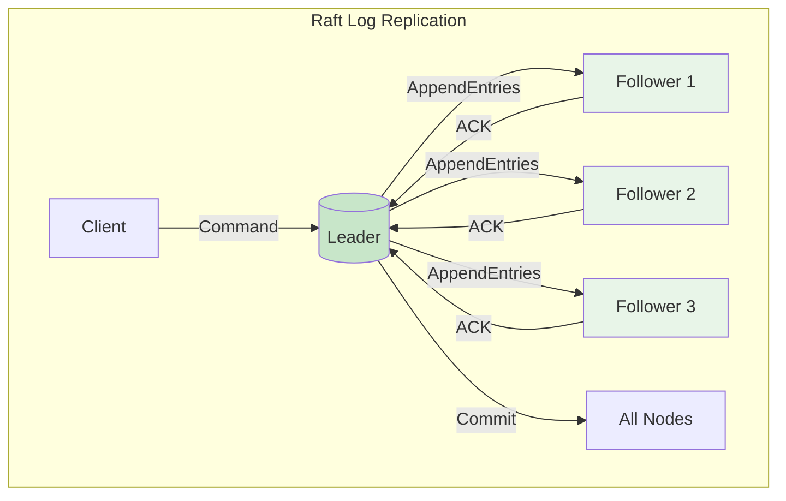

```yaml
Log_Replication:
  Process:
    1. "Client sends command to Leader"
    2. "Leader appends to uncommitted log"
    3. "Leader sends AppendEntries to followers"
    4. "Followers replicate and ACK"
    5. "Leader commits when majority acknowledge"
    6. "Leader notifies followers to commit"

  Safety_Property:
    - "Only committed entries applied to state machine"
    - "Logs never overwritten after commit"
    - "Leader elections choose most complete log"
```

### Paxos: The Foundation

```yaml
Paxos_Overview:
  Inventor: "Leslie Lamport (1989)"
  Purpose: "Consensus in unreliable networks"
  Complexity: "High (three-phase protocol)"
  Legacy: "Foundation for modern consensus"

  Two_Phases:
    Prepare:
      1. "Proposer sends prepare(N) to acceptors"
      2. "Acceptors promise not to accept lower N"
      3. "Acceptors return highest accepted value"

    Accept:
      1. "Proposer sends accept(N, value) with highest value"
      2. "Acceptors accept if N matches their promise"
      3. "Value is chosen when majority accept"

  Why_Paxos_Is_Hard:
    - "Non-intuitive phases"
    - "Many edge cases"
    - "Difficult to implement correctly"
```

### Raft vs Paxos Comparison

| Aspect | Raft | Paxos |
|--------|------|-------|
| **Understandability** | High (designed for clarity) | Low (complex) |
| **Structure** | Single integrated protocol | Family of protocols |
| **Leader Election** | Built-in | Requires separate protocol |
| **Log Replication** | Integral | Requires Paxos multi-decree |
| **Complexity** | Moderate | High |
| **Adoption** | etcd, Consul, TiKV | Google Chubby, Spanner |
| **Learning Curve** | Easier | Steeper |

### Real-World Consensus Implementations

```yaml
Production_Systems:
  etcd:
    Use: "Kubernetes cluster state"
    Consensus: "Raft"
    Features: "Watch, transactions, TTL"

  Consul:
    Use: "Service discovery, KV store"
    Consensus: "Raft"
    Features: "Health checks, DNS interface"

  Google_Spanner:
    Use: "Globally distributed SQL"
    Consensus: "Paxos"
    Features: "TrueTime, strong consistency across regions"

  Apache_Consul:
    Use: "Service mesh, configuration"
    Consensus: "Raft for server cluster"

  CockroachDB:
    Use: "Distributed SQL"
    Consensus: "Raft per range"
    Features: "Global distribution"
```

---

## Practical Tools: ZooKeeper, etcd, Consul

### Apache ZooKeeper

```yaml
ZooKeeper_Overview:
  Purpose: "Distributed coordination service"
  Protocol: "ZAB (ZooKeeper Atomic Broadcast)"
  Data_Model: "Hierarchical znodes"

  Key_Features:
    - "Ephemeral nodes (disappear on client disconnect)"
    - "Sequential nodes (ordered creation)"
    - "Watches (notifications on change)"
    - "ACLs (access control)"
```

### ZooKeeper Leader Election Implementation

```yaml
Ephemeral_Sequential_Znodes:
  Process:
    1. "Each candidate creates /election/guid-N_sequential node"
    2. "Watch previous sequential node"
    3. "If smallest, becomes leader"
    4. "If not smallest, watch predecessor and wait"

  Example_Path: "/election/server-0000000001"
  Leader_Path: Smallest sequential number

  Benefits:
    - "Automatic cleanup on session loss"
    - "No separate election algorithm"
    - "Simple and reliable"
```

### etcd: The Kubernetes Backbone

```yaml
etcd_Overview:
  Purpose: "Distributed key-value store"
  Consistency: "Strong (linearizable reads)"
  Consensus: "Raft protocol"
  Clients: "Go, Java, Python, REST"

  Key_Features:
    - "Watch for key changes"
    - "Transactions (compare-and-swap)"
    - "TTL on keys (leases)"
    - "Revision history"

  Kubernetes_Integration:
    API_Server: "Reads/writes all state to etcd"
    Watch: "Controllers respond to cluster changes"
    Config: "All cluster configuration stored in etcd"
```

### Consul: Service Discovery and Coordination

```yaml
Consul_Overview:
  Purpose: "Service discovery and configuration"
  Consensus: "Raft for server cluster"
  Data_Store: "Strongly consistent KV store"

  Key_Features:
    - "Service registry with health checks"
    - "KV store for configuration"
    - "Intentions (service mesh access control)"
    - "Multi-datacenter support"
```

### Cloud Primitives for Locking

```yaml
Cloud_Managed_Services:
  Azure_Blob_Leases:
    Resource: "Blob storage"
    Operation: "AcquireLease(leaseTime, proposedId)"
    Renew: "RenewLease"
    Release: "BreakLease"

  Google_Cloud_Object_Leases:
    Resource: "Cloud Storage object"
    Method: "Compose with holds"
    Use_Case: "Leader election for batch jobs"

  AWS_DynamoDB:
    Feature: "DynamoDB Lock Client"
    Mechanism: "Conditional writes with TTL"
    Use_Case: "Distributed locking for microservices"
```

### Real-World Usage Patterns

```yaml
Company_Case_Studies:
  Uber:
    ZooKeeper: "Leader election for geofence services"
    Purpose: "Coordination for dispatch system"

  HDFS:
    ZooKeeper: "NameNode high availability"
    Purpose: "Failover between active/standby NameNodes"

  Netflix:
    Curator: "ZooKeeper client library"
    Use: "Service discovery, leader election"

  LinkedIn:
    Helix: "Cluster management framework"
    Basis: "ZooKeeper for state management"
```

---

## Scaling the Leader: Sharding and Partitioning

### The Single Leader Bottleneck

```yaml
Leader_Scaling_Limits:
  Write_Capacity: "Single node capacity"
  Network_Bandwidth: "Replication traffic"
  Failover_Time: "Promote new leader"
  Geographic_Distribution: "Latency to remote regions"

  Example_Limits:
    Max_Writes: "10,000-50,000 TPS per master"
    Replication_Lag: "Increases with distance"
    Failover_RTO: "Seconds to minutes"
```

### Sharding: Data Partitioning Solution

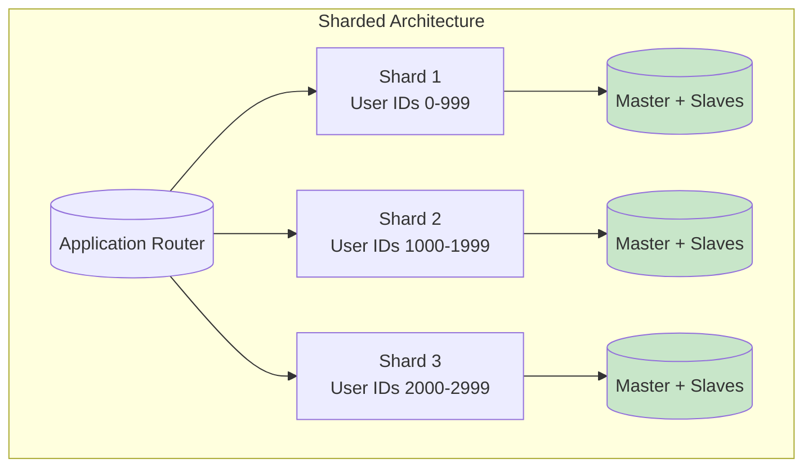

```yaml
Sharding_Benefits:
  Write_Scaling: "Distribute writes across shards"
  Data_Volume: "Each shard handles subset"
  Geographic: "Shards in different regions"
  Independent_Failover: "Each shard has own replicas"

  Shard_Key_Selection:
    User_ID: "Shards by user (recommended for user data)"
    Geography: "Shards by region"
    Time: "Shards by date range"
    Hash: "Uniform distribution"
```

### Multi-Tenant Sharding

```yaml
Tenant_Sharding:
  Pattern: "Each tenant on dedicated shard"
  Benefits: "Isolation, customization, scaling"
  Challenges: "Uneven tenant sizes"

  Examples:
    SaaS_Application: "Enterprise customers on dedicated instances"
    Database_as_Service: "Per-customer databases"
```

### Design Complexity Trade-offs

```yaml
Complexity_Analysis:
  Single_Shard: "Simple, single point of failure"
  Multi_Shard: "Complex, but scalable"

  New_Challenges:
    - "Cross-shard queries (scatter-gather)"
    - "Distributed transactions (2PC)"
    - "Shard rebalancing"
    - "Join across shards"

  Real_World_Examples:
    DynamoDB: "Automatic sharding by partition key"
    Google_Spanner: "Managed sharding with strong consistency"
    CockroachDB: "Distributed SQL with automatic sharding"
```

---

## Failure Scenarios: The Dual-Leader Problem

### Zero Leaders (Unavailability)

```yaml
Availability_Failure:
  Scenario: "All nodes partitioned from each other"
  Consequence: "No quorum, no leader, no writes"
  Cause: "Network partition or all nodes crashed"

  Prevention:
    - "Keep majority partition available"
    - "Raft: Need (N/2 + 1) nodes for quorum"
    - "Distribute nodes across fault domains"
```

### Two Leaders (Split Brain)

```yaml
Split_Brain_Problem:
  Scenario: "Partition creates two majority groups"
  Consequence: "Two leaders accepting writes"
  Result: "Data divergence, inconsistent state"

  Why_Happens:
    - "Network partition duration exceeds timeout"
    - "Incorrect quorum configuration"
    - "Clock skew causing different timeouts"

  Prevention:
    - "Quorum requires majority"
    - "Raft: Only one partition can have majority"
    - "Fencing: New leader invalidates old"
```

### The Difficulty of Failure Detection

```yaml
Failure_Detection_Challenge:
  Problem: "Cannot distinguish failed from slow"
  Network_Latency: "High latency vs node down"
  GC_Pauses: "Long garbage collection pauses"

  False_Positive:
    - "Node declared dead when just slow"
    - "Triggers unnecessary election"
    - "Disrupts ongoing operations"

  Timeout_Tuning:
    Trade_Off: "Short = fast failover, false positives"
    Trade_Off: "Long = fewer false positives, slow failover"
    Solution: "Adaptive timeouts, failure detectors"
```

### Idempotency as Defense

```yaml
Idempotency_Definition: "Same operation applied multiple times has same result"

  Defense_Mechanism:
    Duplicate_Detection: "Track operation IDs"
    Deduplication: "Reject duplicate requests"
    Idempotent_Keys: "Store result of previous execution"

  Practical_Implementation:
    Message_ID: "Unique identifier per operation"
    Idempotency_Key: "Client-supplied unique value"
    Storage: "Cache or database store processed keys"

  Example:
    Client: "POST /api/order (idempotency-key: abc123)"
    Server: "Check if abc123 processed, return cached result if yes"
```

### Redriving Work from Old Leader

```yaml
Safe_Recovery_Process:
  1. "New leader detects old leader still active"
  2. "New leader redrives pending operations"
  3. "Operations applied with unique IDs"
  4. "Old leader fences and stops"

  Fencing_Token:
    Purpose: "Prove leadership legitimacy"
    Mechanism: "Incrementing token number"
    Check: "Operations rejected if token lower"

  TLA_Plus:
    Use: "Formal verification of protocols"
    Benefit: "Mathematical proof of correctness"
    Tools: "TLA+ Toolbox, Apalache"
```

---

## Key Takeaways

### Remember This

```yaml
Core_Principles:
  - "Replication provides redundancy and read scalability - write to master, read from slaves"
  - "Synchronous replication guarantees consistency at the cost of latency; asynchronous provides speed with eventual consistency"
  - "Leader election ensures a single coordinator - essential for consistency in distributed systems"
  - "Split brain is the danger - use quorums, fencing tokens, and heartbeats to prevent dual leaders"
  - "Raft is designed for understandability - leader, follower, candidate states with heartbeats and terms"
  - "Consensus algorithms (Raft, Paxos) provide strong consistency but add latency and complexity"
  - "Sharding solves single-master write bottlenecks by partitioning data across multiple masters"
  - "Idempotency is critical - you cannot trust that duplicate messages won't arrive after failover"
  - "GTIDs simplify replication management by providing continuous transaction identifiers"
  - "ZooKeeper, etcd, and Consul are the building blocks for distributed coordination"
```

### Common Mistakes to Avoid

```yaml
Common_Errors:
  - "Using asynchronous replication for financial data - leads to data loss during failover"
  - "Setting replication timeouts too short - causes unnecessary elections during network blips"
  - "Not using GTIDs or proper position tracking - makes failover complex and error-prone"
  - "Assuming the leader is still leader after network partition - must verify with quorum"
  - "Forgetting to make operations idempotent - duplicate processing causes incorrect results"
  - "Single-master everywhere - cannot scale write-heavy workloads"
  - "Ignoring replication lag - reading stale data from slaves can cause user-visible bugs"
  - "Skipping fencing tokens - old leader might still accept writes during failover"
  - "Testing only happy path - partition failures and leader transitions are where bugs hide"
  - "Using local clocks for timeouts - clock skew causes unpredictable behavior"

  Golden_Rule: |
    "Design for failure - expect partitions, expect slow nodes, expect duplicates"
```

### Best Practices

```yaml
Production_Guidelines:
  1: "Use semi-synchronous replication for critical data"
  2: "Implement health checks with appropriate timeouts"
  3: "Make all operations idempotent"
  4: "Use consensus for any coordinated action"
  5: "Test failover scenarios regularly"
  6: "Monitor replication lag and leader stability"
  7: "Implement fencing tokens for leader handoff"
  8: "Design for cross-shard operations"
  9: "Choose consistency level based on business requirements"
  10: "Document recovery procedures"
```

---

<div align="center">

[Previous: Episode 14](../14-sharding-partitioning/) | [Course Home](../../) | [Next: Episode 16](../16-cap-theorem/)

</div>
