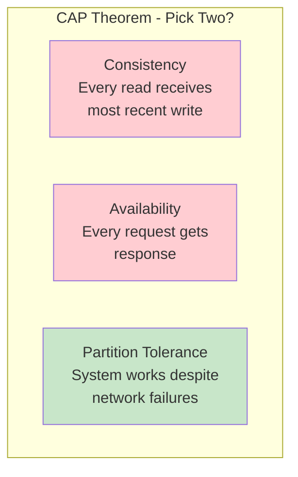
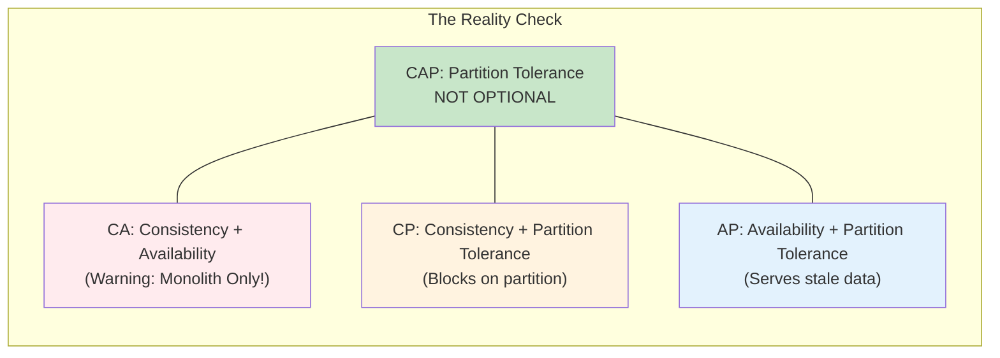
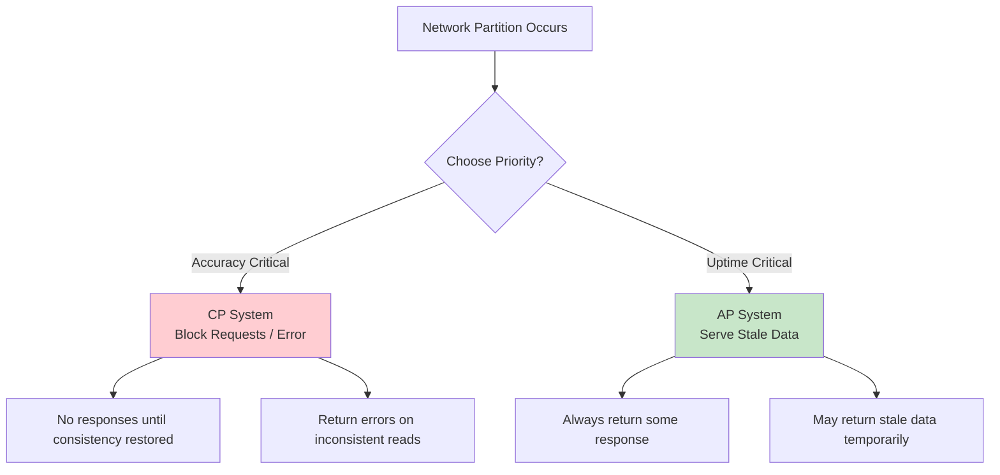
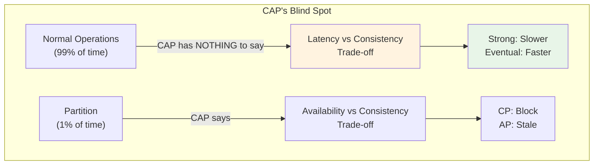
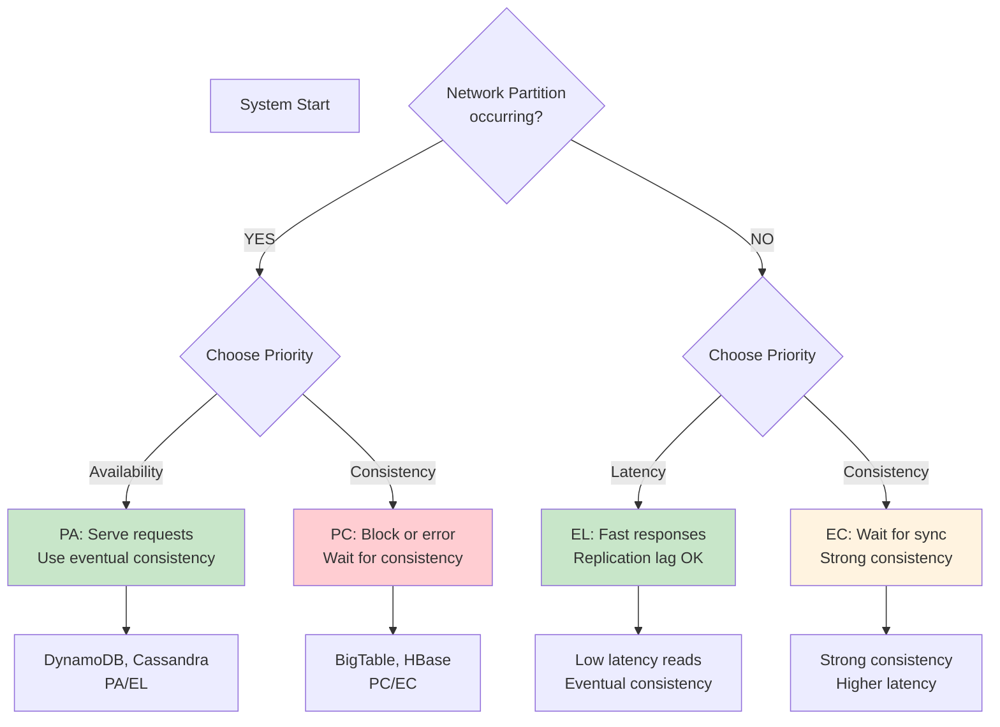
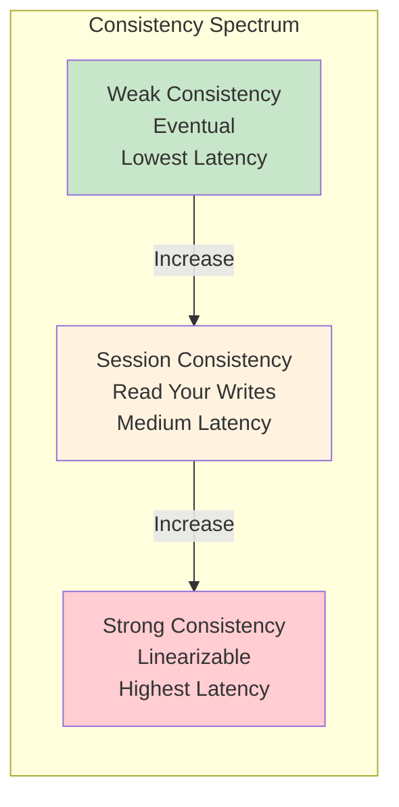

# Episode 16: CAP Theorem is Not Enough - The Truth About Distributed Systems

[](http://youtube.com/@ThatNotesGuy)

## What You'll Learn

- The real meaning of CAP theorem and why "Pick Two" is misleading
- Why CA systems do not actually exist in distributed computing
- The critical difference between CAP Consistency and ACID Consistency
- How to use the PACELC framework for real-world system design
- How to classify databases as PA/EL vs PC/EC
- Practical decision framework for choosing the right consistency model

---

## Introduction: The "Pick Two" Myth

### CAP Theorem Overview

The CAP theorem (Brewer's theorem) states that a distributed data store can only provide **two out of three** guarantees simultaneously:



### The Venn Diagram Reality



```yaml
The_Reality_Check:
  Problem: "The 'Pick Two' triangle is misleading"
  Reality:
    - "Partition Tolerance is NON-NEGOTIABLE in distributed systems"
    - "CA systems only exist in a perfect world (no network partitions)"
    - "In distributed computing, network partitions WILL happen"
  Conclusion: "You always have P. The real choice is: CP or AP?"
  CA_System_Note: |
    "CA = Single node database (monolith), not truly distributed"
```

### The Trap: CA Systems Don't Exist

```yaml
CA_Systems_Do_Not_Exist:
  Why: |
    "In any distributed system, network partitions will occur.
     They're not a matter of if, but when."
  CA_Only_Scenarios:
    - "Single node database (no distribution at all)"
    - "Perfect network that never fails (impossible in practice)"
  Truth: |
    "If you have multiple nodes and claim CA, you're lying to yourself"
  Visual_Note: "CA region should have a 'MONOLITH ONLY' warning stamp"
```

---

## Defining the Terms (Correctly)

### The Three CAP Properties

```mermaid
graph LR
    subgraph "CAP Definitions"
        C[CAP Consistency<br/>Linearizability<br/>Single Copy Serializability]
        A[CAP Availability<br/>Every request gets<br/>response (no error)]
        P[CAP Partition Tolerance<br/>System continues<br/>despite message loss]

        C --> |"During Partition"| Choice[Choose C or A]
        A --> Choice
        P --> Choice
    end
```

```yaml
CAP_Properties_Deep_Dive:
  C_Consistency:
    Meaning: "Linearizability - all clients see the same data at the same time"
    Behavior: "Operations appear to occur atomically at some point between call and response"
    Example: "If User A writes X=5, all subsequent reads return X=5 immediately"

  A_Availability:
    Meaning: "Every non-failing node returns a response"
    Caveat: "No guarantee the response contains the most recent data"
    Behavior: "The system is always responsive, but may return stale data"

  P_Partition_Tolerance:
    Meaning: "System continues operating despite network message loss"
    Reality: "This is the one property you CANNOT sacrifice"
    Behavior: "Divides the network into isolated islands"
```

### CAP Consistency vs ACID Consistency

```mermaid
graph TB
    subgraph "Two Types of Consistency"
        CAP[CAP/Linearizability<br/>Time-based<br/>"Everyone sees same data<br/>at same moment"]
        ACID[ACID Consistency<br/>Database rules<br/>"Foreign keys, constraints,<br/>valid states"]

        CAP --> |Different Meaning| ACID
    end
```

```yaml
Consistency_Comparison:
  CAP_Consistency:
    Also_Called: "Linearizability, Sequential Consistency"
    Focus: "Time - when does data appear consistent?"
    Guarantee: "All operations appear to happen at a single point in time"
    Scope: "Across all nodes simultaneously"
    Example: "User Balance = $1000. All reads anywhere in the world
              return $1000 after a successful write."

  ACID_Consistency:
    Also_Called: "Database Invariants"
    Focus: "Rules - what state is valid?"
    Guarantee: "Database rules are never violated"
    Scope: "Within a single transaction"
    Example: "Account balance never goes negative because of CHECK constraint."

  Key_Insight: |
    "You can have ACID consistency without being linearly consistent.
     A system can temporarily return stale data (not CAP consistent)
     while still enforcing all database constraints (ACID consistent)."
```

### Comparison Table

| Aspect | CAP Consistency (Linearizability) | ACID Consistency |
|--------|-----------------------------------|------------------|
| **Focus** | Time (when data is visible) | Rules (valid states) |
| **Scope** | All nodes simultaneously | Single transaction |
| **Guarantee** | Single point-in-time view | Database invariants |
| **Speed** | Slower (coordination) | Varies |
| **Example** | Everyone sees new balance at same time | Balance never goes negative |
| **Trade-off** | Latency vs Consistency | Flexibility vs Rules |

---

## CP vs AP Decision Matrix

### The Trade-off When Partition Occurs



### CP: Consistency Priority

```yaml
CP_Systems:
  Philosophy: "Accuracy over Availability"
  Behavior:
    - "During partition: Block reads/writes that might be inconsistent"
    - "Return errors or timeouts when consistency can't be guaranteed"
    - "Wait for partition to heal before proceeding"

  Real_World_Examples:
    Banking_ATM:
      Scenario: "Network partition between ATM and bank"
      Choice: "Error rather than wrong balance"
      User_Impact: "Transaction declined, not wrong money"
      Quote: "I'd rather deny access than give wrong data"

    Financial_Systems:
      Stock_Trading: "Canceled trade vs wrong trade"
      Healthcare: "No data vs wrong data"
      Inventory: "Out of stock vs overselling

  Characteristics:
    - High accuracy guaranteed
    - May become unavailable during issues
    - Slower writes (coordination required)
    - Strong consistency model
```

### AP: Availability Priority

```yaml
AP_Systems:
  Philosophy: "Availability over Strong Consistency"
  Behavior:
    - "During partition: Always return some response"
    - "Accept writes that replicate later"
    - "May return stale data temporarily"
    - "Conflict resolution happens after partition heals"

  Real_World_Examples:
    Amazon_Shopping_Cart:
      Scenario: "Items go out of stock during partition"
      Choice: "Allow order, handle stock issues later"
      User_Impact: "Smooth checkout experience"
      Quote: "Cart always works, even if imperfect"

    Social_Media_Likes:
      Scenario: "Like count slightly behind during high load"
      Choice: "Show approximate count immediately"
      User_Impact: "Instant feedback"
      Quote: "Stale like count is acceptable"

    DNS:
      Behavior: "Cached responses during partition"
      Quote: "Old IP is better than no IP"

  Characteristics:
    - High availability guaranteed
    - Eventual consistency model
    - Faster writes (no coordination)
    - May need conflict resolution
```

### Decision Framework

```yaml
CP_vs_AP_Decision:
  Choose_CP_When:
    - "Money is involved (financial accuracy is critical)"
    - "Health/safety data (wrong data causes harm)"
    - "Legal/regulatory requirements (audit trails)"
    - "Inventory management (can't oversell)"
    Use_Cases:
      - Banking systems
      - Medical records
      - Inventory tracking
      - Payment processing

  Choose_AP_When:
      - "User experience is paramount"
      - "Stale data is acceptable"
      - "High availability drives revenue"
      - "Eventual consistency is fine"
      Use_Cases:
        - Social media feeds
        - Shopping carts
        - Content delivery
        - Analytics dashboards

  Questions_to_Ask:
    1: "What happens if data is temporarily inconsistent?"
    2: "What happens if the system becomes unavailable?"
    3: "What's the cost of wrong data vs no data?"
    4: "How long can we tolerate inconsistency?"
```

---

## The Blind Spot of CAP

### What CAP Doesn't Tell You

```yaml
CAP_Missing_Information:
  Problem: "CAP only discusses failure scenarios"
  Reality:
    - "Partitions are relatively rare (maybe 1% of time)"
    - "99% of the time, your network is healthy"
    - "CAP says NOTHING about normal operations"
  Missing_Metric: "LATENCY"

  Critical_Question: |
    "When there's NO partition, how fast should your system be?
     CAP doesn't answer this!"
```

### The Latency Gap

```yaml
Latency_Trade_offs:
  When_No_Partition:
    Strong_Consistency: "Requires coordination = higher latency"
    Eventual_Consistency: "No coordination = lower latency"

  Example_Impact:
    DynamoDB_with_Strong_Consistency: "10-100ms read latency"
    DynamoDB_with_Eventual_Consistency: "1-10ms read latency"
    Cassandra: "1-5ms writes (tunable consistency)"
    Spanner: "10-100ms (TrueTime global consistency)"

  Real_Costs:
    User_Experience: "100ms delay = 1% conversion drop"
    Revenue: "Latency affects bottom line"
    Operations: "Every ms counts at scale"

  CAP_Quote: |
    "The CAP theorem makes no provision for performance or latency"
```



---

## Introducing PACELC

### The Full Picture

**PACELC** extends CAP to address the latency trade-off during normal operations.

```mermaid
graph TD
    Start[Distributed System] --> Check{Is there a<br/>Network Partition?}
    Check -->|YES (PAC)| Choice1[Trade-off:<br/>Availability vs Consistency]
    Check -->|NO (ELC)| Choice2[Trade-off:<br/>Latency vs Consistency]

    Choice1 --> |Choose A| PA[PA/EL: Availability<br/>during partition]
    Choice1 --> |Choose C| PC[PC/EC: Consistency<br/>during partition]

    Choice2 --> |Choose L| EL[EL: Lower Latency<br/>when consistent]
    Choice2 --> |Choose C| EC[EC: Strong Consistency<br/>when no partition]

    style PA fill:#c8e6c9
    style PC fill:#ffcdd2
    style EL fill:#c8e6c9
    style EC fill:#fff3e0
```

### PACELC Acronym Breakdown

```yaml
PACELC_Definition:
  PAC:
    If_Partition: "Choose between Availability (A) and Consistency (C)"
    Behavior: "Same as CAP, but explicitly states P is always assumed"

  ELC:
    Else_Latency: "When NO partition, trade-off between Latency (L) and Consistency (C)"
    Behavior: "The missing piece of CAP - what about normal operations?"

  Full_Form: |
    "If Partition, then Availability or Consistency;
     Else (no partition), Latency or Consistency"
```

### Real-World PACELC Examples

```yaml
Database_Classifications:
  PA_EL_Databases:
    Examples:
      - "DynamoDB (default)"
      - "Cassandra"
      - "Riak"
      - "ScyllaDB"

    During_Partition: "Prioritize Availability (keep taking orders)"
    Normal_Operation: "Prioritize Low Latency (fast response, eventual consistency)"
    Use_Cases:
      - "Shopping carts (always add items)"
      - "Social feeds (always show content)"
      - "Gaming leaderboards (eventual scores)"

  PC_EC_Databases:
    Examples:
      - "BigTable"
      - "HBase"
      - "VoltDB"
      - "Spanner"
      - "CockroachDB (default)"

    During_Partition: "Prioritize Consistency (refuse writes)"
    Normal_Operation: "Prioritize Strong Consistency (higher latency acceptable)"
    Use_Cases:
      - "Financial ledgers (never lose a cent)"
      - "Scientific data (accuracy matters)"
      - "Inventory counts (prevent overselling)"
```

### Visual: PACELC Decision Flow



---

## Database Classifications: PA/EL

### Availability-First Systems

```yaml
PA_EL_Behavior:
  During_Failure:
    Priority: "Availability (A)"
    Behavior: "Keep taking writes, serve reads from any replica"
    Example: "Amazon cart still works even if some DCs are unreachable"
    Trade_Off: "Might read stale data, resolve conflicts later"

  Normal_Operation:
    Priority: "Latency (L)"
    Behavior: "Fast reads/writes, minimize coordination"
    Example: "DynamoDB uses eventual consistency by default for speed"
    Trade_Off: "Replication lag means temporary inconsistency

  DynamoDB_Example:
    Default: "Eventual consistency (fast, cheap)"
    Option: "Strong consistency (slower, more expensive)"
    Partition_Behavior: "Always available, may return stale data"

  Cassandra_Example:
    tunable_consistency:
      Level_ONE: "One node response (fastest, least consistent)"
      Level_QUORUM: "Majority response (balanced)"
      Level_ALL: "All nodes respond (strongest, slowest)"
    Default: "QUORUM (balance of speed and consistency)"
```

### Use Cases for PA/EL

```yaml
PA_EL_Use_Cases:
  Shopping_Carts:
    Need: "Always add items, never lose a sale"
    Behavior: "Write to local node, replicate async"
    Risk: "Temporary item removal visible elsewhere"
    Acceptable: "Yes - fix with reconciliation later"

  Social_Media_Feeds:
    Need: "Instant feed updates"
    Behavior: "Read from cache/replica"
    Risk: "Slightly stale counts"
    Acceptable: "Yes - feeds refresh frequently anyway"

  Clickstream_Analytics:
    Need: "Never miss an event"
    Behavior: "Buffer and batch writes"
    Risk: "Delayed visibility"
    Acceptable: "Yes - analytics tolerate lag"

  Gaming_Sessions:
    Need: "Low latency gameplay"
    Behavior: "Local writes, async sync"
    Risk: "Briefly inconsistent state"
    Acceptable: "Yes - game logic tolerates"
```

---

## Database Classifications: PC/EC

### Consistency-First Systems

```yaml
PC_EC_Behavior:
  During_Failure:
    Priority: "Consistency (C)"
    Behavior: "Refuse writes, block reads until consistent"
    Example: "Bank ATM returns error, not wrong balance"
    Trade_Off: "System may become unavailable"

  Normal_Operation:
    Priority: "Consistency (C)"
    Behavior: "Wait for replication before confirming"
    Example: "Spanner uses TrueTime for global consistency"
    Trade_Off: "Higher latency for strong guarantees"

  BigTable_Example:
    Single_Master: "One primary handles all writes"
    Partition_Behavior: "Writes blocked if primary unreachable"
    Consistency: "Strong within single cluster"

  VoltDB_Example:
    ACID_Transactions: "Full serializable isolation"
    Partition_Behavior: "Transactions abort if partition detected"
    Speed: "In-memory, single-threaded per partition"

  CockroachDB_Example:
    Default_Strong: "Linearizable reads by default"
    Consistency_Level: "Serializable snapshots available"
    Trade_Off: "Some latency for global consistency"
```

### Use Cases for PC/EC

```yaml
PC_EC_Use_Cases:
  Financial_Transactions:
    Need: "Never lose or double-count money"
    Behavior: "Synchronous replication, two-phase commit"
    Risk: "Slower transactions, potential timeouts"
    Critical: "Accuracy > Speed"

  Medical_Records:
    Need: "Correct patient data always"
    Behavior: "Read-your-writes consistency guaranteed"
    Risk: "System may be temporarily unavailable"
    Critical: "Wrong data = harm"

  Inventory_Management:
    Need: "Accurate stock counts"
    Behavior: "Synchronous inventory updates"
    Risk: "Checkout delays during issues"
    Acceptable: "Prevent overselling at all costs"

  Order_Processing:
    Need: "Exactly-once delivery"
    Behavior: "Idempotent operations, strong ordering"
    Risk: "Complex coordination"
    Acceptable: "No lost or duplicate orders"
```

---

## Modern Hybrids: Tunable Consistency

### Systems with Adjustable Trade-offs

```yaml
Tunable_Consistency_Systems:
  Cosmos_DB:
    Consistency_Levels:
      - "Strong (highest latency, 100% consistency)"
      - "Bounded Staleness (configurable lag)"
      - "Session (your writes immediately visible to you)"
      - "Consistent Prefix (writes visible in order)"
      - "Eventual (lowest latency, eventual consistency)"
    API: "Choose consistency per request"

  Cassandra:
    Consistency_Level: "Tunable per query"
    WRITE_CONSISTENCY:
      - "ANY, ONE, QUORUM, ALL"
    READ_CONSISTENCY:
      - "ONE, QUORUM, ALL"
    Trade_off: "Higher consistency = slower requests"

  MongoDB:
    Default: "CP (single master architecture)"
    Read_Preferences:
      - "primary (strongest)"
      - "primaryPreferred"
      - "secondary"
      - "secondaryPreferred"
      - "nearest (lowest latency)"
    Write_Concern: "w:1 (default), w:majority (stronger)"
```

### Visual: Consistency Knob



```yaml
Consistency_Knob_Principles:
  Low_Setting:
    Meaning: "Eventual consistency, fast responses"
    Latency: "Minimal"
    Use_When: "Stale data is acceptable"

  High_Setting:
    Meaning: "Strong consistency, coordinated writes"
    Latency: "Higher"
    Use_When: "Accuracy is critical

  Trade_offs:
    Performance: "Stronger consistency = more coordination = slower"
    Availability: "Weaker consistency = more available during issues"
    Cost: "Strong consistency uses more resources"

  Decision_Guidance:
    Default_Weak: "Start with eventual, strengthen only if needed"
    Profile_Workloads: "Find which queries need stronger guarantees"
    Monitor_Latency: "Measure impact of consistency changes"
```

---

## Practical Takeaways for System Design

### The Three Rules

```yaml
System_Design_Rules:
  Rule_1:
    Statement: "Partition Tolerance is mandatory"
    Meaning: "You cannot avoid network partitions in distributed systems"
    Implication: "You must always choose between CP and AP"
    Quote: "The network is unreliable - design accordingly"

  Rule_2:
    Statement: "Know your business"
    Question: "Is wrong data worse than no data?"
    Answer_Money: "CP/EC - accuracy critical (banks, inventory)"
    Answer_Likes: "PA/EL - availability critical (social, carts)"
    Example: "Amazon cart = PA/EL, Bank transfer = PC/EC"

  Rule_3:
    Statement: "Latency is the hidden killer"
    Meaning: "PACELC helps you discuss performance during normal ops"
    Question: "How much latency can you tolerate for consistency?"
    Trade_off: "Strong consistency requires replication lag = latency"
```

### The PACELC Cheat Sheet

```yaml
Quick_Decision_Guide:
  Money_involved:
    Answer: "PC/EC (Strong consistency always)"
    Examples: "Banks, stock trading, payments"
    Databases: "Spanner, CockroachDB, VoltDB"

  Speed_is_product:
    Answer: "PA/EL (Low latency, eventual consistency)"
    Examples: "Social feeds, gaming, analytics"
    Databases: "DynamoDB (default), Cassandra, Riak"

  Global_distribution:
    Answer: "Expect Partitions"
    Reality: "Partitions are more likely across regions"
    Design: "Accept eventual consistency, optimize for latency"

  Hybrid_needs:
    Answer: "Tunable consistency"
    Examples: "Same database, different queries"
    Databases: "Cosmos DB, Cassandra, DynamoDB"
```

### Common Scenarios

```yaml
Scenario_Decisions:
  Scenario_1:
    System: "E-commerce checkout"
    Question: "Can we oversell during a partition?"
    Answer: "NO - use PC/EC for inventory"
    Database: "CockroachDB with strong consistency"

  Scenario_2:
    System: "Product catalog"
    Question: "Can we show stale prices briefly?"
    Answer: "YES - use PA/EL for speed"
    Database: "DynamoDB with eventual consistency"

  Scenario_3:
    System: "User profile updates"
    Question: "User sees their own change immediately?"
    Answer: "YES - session consistency is enough"
    Database: "Cosmos DB with session consistency"

  Scenario_4:
    System: "Analytics dashboard"
    Question: "Is real-time accuracy required?"
    Answer: "NO - eventual is fine, prioritize speed"
    Database: "Cassandra with QUORUM reads"
```

### Modern System Realities

```yaml
Realities:
  Reality_1: "Modern systems rarely stay in perfect sync"
  Meaning: "Replication lag is always present to some degree"

  Reality_2: "Latency budgets are critical"
  Meaning: "Every ms matters for user experience"

  Reality_3: "Different data has different requirements"
  Meaning: "Not all data needs strong consistency"

  Reality_4: "Tools make the choice for you"
  Meaning: "DynamoDB = PA/EL, BigTable = PC/EC"

  Action_Item: "Classify your production database"
  Questions:
    1: "What is your database's PACELC classification?"
    2: "Does it match your business requirements?"
    3: "Can you tune consistency where needed?"
    4: "Are you over-engineering consistency?"
```

---

## Key Takeaways

### Remember This

```yaml
Key_Memories:
  - "Partition Tolerance is mandatory in distributed systems"
  - "CAP says: During partition, choose C or A (not both)"
  - "PACELC adds: During normal ops, choose L or C"
  - "CAP Consistency = Linearizability (time-based)"
  - "ACID Consistency = Database rules (state-based)"
  - "CP: Error rather than wrong data (banking)"
  - "AP: Stale rather than unavailable (shopping carts)"
  - "CA systems don't exist in distributed computing"
  - "PACELC helps discuss performance during normal operations"
  - "Modern databases have tunable consistency levels"
```

### Common Mistakes to Avoid

```yaml
Common_Mistakes:
  Mistake_1: "Claiming CA for a distributed system"
    Why: "Network partitions will happen - P is not optional"
    Fix: "Accept you must choose CP or AP"

  Mistake_2: "Using strong consistency everywhere"
    Why: "Unnecessary latency for data that doesn't need it"
    Fix: "Profile data - use eventual for tolerant reads"

  Mistake_3: "Ignoring the ELC part of PACELC"
    Why: "Latency kills user experience 99% of the time"
    Fix: "Design for latency during normal operations"

  Mistake_4: "Assuming CAP is the final answer"
    Why: "CAP only covers partition scenarios"
    Fix: "Use PACELC for complete picture"

  Mistake_5: "Picking a database without understanding its classification"
    Why: "You might get unexpected behavior during failures"
    Fix: "Know your database: PA/EL or PC/EC?"
```

### Best Practices

```yaml
Design_Best_Practices:
  1: "Start with PACELC when designing distributed systems"
  2: "Classify your data: CP-critical vs AP-tolerant"
  3: "Use tunable consistency systems when unsure"
  4: "Measure latency impact of consistency choices"
  5: "Design for partitions - they will happen"
  6: "Accept eventual consistency for non-critical data"
  7: "Don't pay the consistency cost where not needed"
  8: "Monitor replication lag and consistency violations"
  9: "Document your consistency guarantees"
  10: "Test partition behavior in staging environments"
```

---

<div align="center">

[Previous Episode: Replication & Leader Election](../15-replication-leader-election/) | [Course Home](../../) | [Next Episode: OSI Model](../17-osi-model/)

</div>