# Episode 17: OSI Model

[](http://youtube.com/@ThatNotesGuy)

## What You'll Learn

- What the OSI Model is and why it matters for network communication
- The seven layers and their distinct responsibilities
- How data flows through the network stack (encapsulation & decapsulation)
- Key differences between Layer 2, 3, and 4 networking
- TCP vs UDP and when to use each protocol
- How real-world network requests traverse the OSI stack
- OSI vs TCP/IP model comparison and practical applications
- Troubleshooting strategies based on layer-by-layer analysis

---

## Introduction: The OSI Model

### Core Definition

The **OSI (Open Systems Interconnection) Model** is a conceptual framework that divides network communications into seven distinct abstraction layers. It standardizes how different computer systems communicate by defining a universal language for network operations.


### Understanding the Layer Split

```yaml
OSI_Model_Split:
  Upper_Layers_5_to_7:
    Focus: "Application issues and user interfaces"
    Character: "Software and data representation"
    Layers:
      - Layer 7: Application (User services, protocols)
      - Layer 6: Presentation (Formatting, encryption)
      - Layer 5: Session (Connection management)

  Lower_Layers_1_to_4:
    Focus: "Data transport and physical movement"
    Character: "Hardware and network infrastructure"
    Layers:
      - Layer 4: Transport (End-to-end delivery)
      - Layer 3: Network (Path selection, logical addressing)
      - Layer 2: Data Link (Physical addressing, local delivery)
      - Layer 1: Physical (Raw bit transmission)

  Key_Insight: |
    "Upper layers deal with user-facing functionality.
     Lower layers handle the mechanics of data delivery."
```

---

## The Seven Layers Overview

### Layer Visual Overview


### Mnemonics for Memorization

```yaml
Mnemonics:
  Top_Down:
    Phrase: "All People Seem To Need Data Processing"
    Meaning: "Application Presentation Session Transport Network Data Link Physical"

  Bottom_Up:
    Phrase: "Please Do Not Throw Sausage Pizza Away"
    Meaning: "Physical Data Link Network Transport Session Presentation Application"

  Hindi:
    Phrase: "Aj Se Test Nhi Dena Padega"
    Layers:
      - "Aj" = Application (Layer 7)
      - "Se" = Session (Layer 5)
      - "Test" = Transport (Layer 4)
      - "Nhi" = Network (Layer 3)
      - "Dena" = Data Link (Layer 2)
      - "Padega" = Physical (Layer 1)
    Note: "Presentation is implied between Session and Transport"
```

### Layer Summary Table

| Layer | Name | Function | PDU | Devices/Protocols |
|-------|------|----------|-----|-------------------|
| **7** | Application | Network services to user apps | Data | HTTP, DNS, SMTP |
| **6** | Presentation | Data formatting, encryption | Data | TLS, JPEG, ASCII |
| **5** | Session | Connection establishment | Data | NetBIOS, RPC |
| **4** | Transport | Reliable delivery | Segments | TCP, UDP |
| **3** | Network | Path determination | Packets | IP, Routers |
| **2** | Data Link | Physical addressing | Frames | MAC, Switches |
| **1** | Physical | Raw bit transmission | Bits | Cables, Hubs |

---

## Encapsulation & Decapsulation

### How Data Moves Through the Stack

When data is sent, it gets **wrapped** with headers at each layer (encapsulation). When received, headers are **stripped** in reverse order (decapsulation).

```yaml
Encapsulation_Process:
  Description: "Data moves DOWN through layers, getting wrapped with headers"

  Layer_7_to_5:
    PDU: "Data (or Message)"
    Action: "Application adds its own headers"

  Layer_4:
    PDU: "Segment (TCP) or Datagram (UDP)"
    Action: "Transport adds Port numbers"

  Layer_3:
    PDU: "Packet"
    Action: "Network adds IP addresses"

  Layer_2:
    PDU: "Frame"
    Action: "Data Link adds MAC addresses"

  Layer_1:
    PDU: "Bits"
    Action: "Physical converts to electrical/optical signals"

Decapsulation_Process:
  Description: "Data moves UP through layers, headers are removed"
  Action: "Each layer reads and removes its relevant header"
```

### Visual: The Russian Doll Analogy

```mermaid
graph LR
    subgraph "Encapsulation (Sending)"
        A["📝 Letter<br/>Your message"] --> B["✉️ Envelope<br/>Header: To/From"] --> C["📦 Box<br/>Header: Tracking #"] --> D["🚢 Container<br/>Header: Ship info"]
    end

    subgraph "Decapsulation (Receiving)"
        D --> E["🚢 Container<br/>Remove shipping header"] --> F["📦 Box<br/>Remove tracking header"] --> G["✉️ Envelope<br/>Remove address header"] --> H["📝 Letter<br/>Your message received"]
    end

    style A fill:#c8e6c9
    style H fill:#c8e6c9
```



### Protocol Data Units by Layer

```yaml
PDU_Chart:
  Layers_5_7:
    Name: "Data (or Message)"
    Content: "Application data, headers from layers 7-5"

  Layer_4:
    Name: "Segments"
    Content: "Transport header + Data"
    Example_TCP: "Source Port + Dest Port + Seq # + Data"
    Example_UDP: "Source Port + Dest Port + Length + Data"

  Layer_3:
    Name: "Packets"
    Content: "IP Header + Segment"
    Fields: "Source IP + Dest IP + Protocol + TTL"

  Layer_2:
    Name: "Frames"
    Content: "MAC Header + Packet + FCS"
    Fields: "Source MAC + Dest MAC + EtherType"

  Layer_1:
    Name: "Bits"
    Content: "Raw 0s and 1s"
    Transmission: "Electrical, optical, or radio signals"
```

---

## Layer 1: The Physical Layer

### Core Function

Transmits **raw bits** (0s and 1s) over a physical medium. This is the foundation - all network communication ultimately depends on Layer 1.

```yaml
Physical_Layer:
  Function: "Convert digital data to physical signals and vice versa"
  Transmission: "Bits travel as electrical pulses, light, or radio waves"

  Key_Components:
    Cables:
      - "Copper (Ethernet): RJ45 connectors, twisted pair"
      - "Fiber Optic: Light signals, long distance"
      - "Coaxial: Cable TV, older networks"

    Wireless:
      - "Wi-Fi: Radio frequencies (2.4GHz, 5GHz, 6GHz)"
      - "Bluetooth: Short-range radio"
      - "Cellular: 4G LTE, 5G"

    Devices:
      - "Hub: Multi-port repeater (dumb device)"
      - "Repeater: Amplifies signal for long distances"
      - "NIC (Network Interface Card): Computer's network adapter"
      - "Modem: Modulator/Demodulator for internet access"

  Troubleshooting:
    First_Question: "Is it plugged in?"
    Common_Issues:
      - "Bad or damaged cables"
      - "Loose connections"
      - "Wrong cable type (crossover vs straight-through)"
      - "Broken NIC pins"
      - "Distance limitations exceeded"

  Visual_Signals:
    Binary_Stream: "101101001110..."
    Diagram: "PC --[cable]--> Switch --[fiber]--> Router"
```

---

## Layer 2: The Data Link Layer

### Core Function

Handles **local network delivery** using physical addresses (MAC addresses). Data Link is responsible for moving data between devices on the same network segment.

```yaml
Data_Link_Layer:
  PDU: "Frame"
  Addressing: "MAC Addresses (48-bit, burned into NIC)"

  Key_Concepts:
    MAC_Address:
      Format: "XX:XX:XX:XX:XX:XX (hexadecimal)"
      Structure:
        - "First 24 bits: OUI (Organization Unique Identifier - manufacturer)"
        - "Last 24 bits: Device identifier (unique per device)"
      Example: "00:1A:2B:3C:4D:5E"

    Scope:
      - "Local Network (LAN) only"
      - "Cannot cross routers to different networks"

  Sublayers:
    LLC_Lower_Subnet_Convergence:
      Function: "Error control, flow control"
      Standard: "IEEE 802.2"

    MAC_Medium_Access_Control:
      Function: "Physical addressing, media access control"
      Standard: "IEEE 802.3 (Ethernet), 802.11 (Wi-Fi)"

  Devices:
    Switch:
      Function: "Reads MAC address, forwards frame to correct port"
      Intelligence: "Learns which MACs are on which ports"
      Operation: "Layer 2 device - uses MAC addresses only"

    Bridge:
      Function: "Connects two network segments"
      Use_Case: "Segment traffic between parts of a LAN"
```

### Switch Operation Visual


---

## Layer 3: The Network Layer

### Core Function

Handles **logical addressing** and **path determination**. This is where routers operate - they connect different networks and route packets across the internet.

```yaml
Network_Layer:
  PDU: "Packet"
  Addressing: "IP Addresses (Logical addressing)"

  Key_Functions:
    Logical_Addressing:
      - "IP Addresses identify devices globally"
      - "Not tied to hardware (unlike MAC)"
      - "Can change based on network location"

    Path_Determination_Routing:
      - "Routers examine destination IP"
      - "Consult routing tables"
      - "Forward packet toward destination"

    Connects_Different_Networks:
      - "Router = Gateway between networks"
      - "Traffic crosses networks = Layer 3 decision"

  Protocols:
    IPv4:
      Example: "192.168.1.10"
      Address_Space: "32-bit (~4.3 billion addresses)"

    IPv6:
      Example: "2001:0db8:85a3:0000:0000:8a2e:0370:7334"
      Address_Space: "128-bit (virtually unlimited)"

    ICMP:
      Purpose: "Error reporting, diagnostics"
      Tools: "ping, traceroute"

    IPSec:
      Purpose: "Secure IP communication"
      Use: "VPNs, secure tunnels"

  Devices:
    Router:
      Function: "Examines IP, consults routing table, forwards"
      Routing_Table: "Maps IP ranges to next-hop destinations"
```

### Router Operation Visual


---

## Critical Concept: Layer 2 vs Layer 3

### Comparison Matrix

| Aspect | Layer 2 (MAC) | Layer 3 (IP) |
|--------|---------------|--------------|
| **Type** | Physical address | Logical address |
| **Scope** | Local network only | Global/internet |
| **Persistence** | Permanent (burned into NIC) | Temporary (changes with network) |
| **Path** | Hop-to-hop | End-to-end |
| **Format** | 48-bit hex (AA:BB:CC:DD:EE:FF) | 32-bit decimal (192.168.1.1) or IPv6 |
| **Device** | Switch | Router |
| **Changes?** | Never on same device | Only changes at routers |

```yaml
Analogy_Comparison:
  Plane_Ticket_vs_Seat_Number:
    IP_Address: "Plane ticket - identifies YOU at destination"
    MAC_Address: "Seat number - identifies you on THIS flight only"

  GPS_Destination_vs_Next_Turn:
    IP_Address: "GPS destination address - stays the same"
    MAC_Address: "Next turn instruction - changes at every intersection"

  Postal_Mail:
    IP_Address: "Final destination (City, Zip code)"
    MAC_Address: "Current location being delivered"
```

### ARP: The Bridge Between Layers

```yaml
ARP_Address_Resolution_Protocol:
  Purpose: "Translate IP address to MAC address"
  When_Used: "When device knows destination IP but needs MAC"

  ARP_Process:
    1: "Device checks ARP cache (memory)"
    2: "If not found, broadcasts ARP Request"
    3: "All devices receive, only match responds"
    4: "Requester stores MAC in ARP cache"

  Example:
    Scenario: "PC (192.168.1.10) wants to send to Gateway (192.168.1.1)"
    ARP_Request: "Who has 192.168.1.1? Tell 192.168.1.10"
    ARP_Response: "192.168.1.1 is at AA:BB:CC:DD:EE:FF"

  Visual:
    PC -->|ARP Request (Broadcast)| ALL_DEVICES
    GATEWAY -->|ARP Response (Unicast)| PC
    PC -->|Now sends frame to MAC| GATEWAY
```

### How MAC Changes at Each Hop

```yaml
MAC_Address_Changing:
  Rule: "MAC addresses change at every router hop"

  Scenario:
    Source: "PC A (192.168.1.10, MAC: AAA)"
    Gateway_Router: "192.168.1.1, MAC: G1"
    ISP_Router: "203.0.113.1, MAC: I1"
    Destination_Server: "8.8.8.8, MAC: S1"

  Journey:
    PC_to_Gateway:
      Source_MAC: "AAA"
      Dest_MAC: "G1"
      Source_IP: "192.168.1.10"
      Dest_IP: "8.8.8.8"

    Gateway_to_ISP:
      Source_MAC: "G1"
      Dest_MAC: "I1"
      Source_IP: "192.168.1.10"
      Dest_IP: "8.8.8.8"
      IP_Addresses: "STAY THE SAME!"
      MAC_Addresses: "CHANGE!"

    ISP_to_Server:
      Source_MAC: "I1"
      Dest_MAC: "S1"
      Source_IP: "192.168.1.10"
      Dest_IP: "8.8.8.8"

  Key_Insight: |
    "IP addresses identify ENDPOINTS (don't change)
     MAC addresses identify CURRENT HOP (change at each router)"
```

---

## Layer 4: The Transport Layer

### Core Function

Provides **end-to-end communication services** for applications. This layer distinguishes between different network streams using ports, enabling multiple applications to use the network simultaneously.

```yaml
Transport_Layer:
  PDU: "Segment"
  Key_Concept: "Multiplexing and Demultiplexing"

  Multiplexing:
    - "Multiple applications send data on ONE network"
    - "Each app gets a unique port number"
    - "Example: Browser on 54321, Email on 25"

  Demultiplexing:
    - "Incoming data sorted by port"
    - "Data for port 80 goes to web server"
    - "Data for port 443 goes to secure web"

  Visual:
    Computer_With_Multiple_Apps:
      - "Chrome (Port: random_high)" --> |HTTP| Internet
      - "Spotify (Port: random_high)" --> |UDP| Internet
      - "Email Client (Port: 25)" --> |SMTP| Internet
      - "Web Server (Port: 80/443)" <-- || Internet
```

### Port Numbers

```yaml
Port_System:
  Range: "0 to 65535"

  Well_Known_Ports_0_1023:
    20: "FTP Data"
    21: "FTP Control"
    22: "SSH"
    23: "Telnet"
    25: "SMTP (Email)"
    53: "DNS"
    80: "HTTP (Web)"
    443: "HTTPS (Secure Web)"

  Registered_Ports_1024_49151:
    3306: "MySQL"
    5432: "PostgreSQL"
    6379: "Redis"
    8080: "HTTP Alternate"

  Dynamic_Private_Ports_49152_65535:
    - "Ephemeral ports for client connections"
    - "Source port when connecting outbound"
```

---

## TCP vs UDP

### TCP: Transmission Control Protocol

```yaml
TCP_Characteristics:
  Connection_Type: "Connection-oriented (3-way handshake)"
  Reliability: "Guaranteed delivery with acknowledgements"
  Order: "Packets arrive in order"
  Flow_Control: "Prevents sender from overwhelming receiver"
  Congestion_Control: "Adapts to network conditions"

  Three_Way_Handshake:
    1: "Client sends SYN"
    2: "Server responds SYN-ACK"
    3: "Client sends ACK"
    Result: "Connection established"

  Use_Cases:
    - "Web browsing (HTTP/HTTPS)"
    - "Email (SMTP, IMAP, POP3)"
    - "File transfers (FTP)"
    - "Database connections"
    - "Any application requiring reliability"

  Overhead: "Higher latency, more bandwidth for headers/acks"
```

### UDP: User Datagram Protocol

```yaml
UDP_Characteristics:
  Connection_Type: "Connectionless (fire and forget)"
  Reliability: "No guarantee of delivery"
  Order: "No ordering guarantees"
  Flow_Control: "None"
  Congestion_Control: "None"

  Use_Cases:
    - "Video streaming (YouTube, Netflix)"
    - "Online gaming"
    - "VoIP (Zoom, Discord)"
    - "DNS queries"
    - "Real-time applications"

  Advantages: "Lower latency, less overhead, faster transmission"
  Trade_Off: "May lose packets, may arrive out of order"
```

### Side-by-Side Comparison

| Feature | TCP | UDP |
|---------|-----|-----|
| **Connection** | Handshake required | None |
| **Reliability** | Guaranteed | Not guaranteed |
| **Ordering** | In-order delivery | Any order |
| **Speed** | Slower | Faster |
| **Header Size** | 20-60 bytes | 8 bytes |
| **Use Case** | Reliability critical | Speed critical |
| **Examples** | Web, Email, Files | Video, Gaming, VoIP |

```yaml
Protocol_Visual:
  TCP:
    Diagram: "[SYN] --> [SYN-ACK] --> [ACK] --> [Data] --> [ACK]"
    Note: "Connection established before data, acknowledgements confirm receipt"

  UDP:
    Diagram: "[Data] --> [Data] --> [Data] -->"
    Note: "Fire and forget, no connection, no acknowledgements"
```

---

## Layer 5: The Session Layer

### Core Function

**Establishes, maintains, and terminates connections** between applications. This layer manages the "conversation" between devices.

```yaml
Session_Layer:
  Function: "Session management"

  Key_Responsibilities:
    - "Establish connection (logical session)"
    - "Keep session alive (heartbeats/keepalives)"
    - "Terminate connection gracefully"
    - "Handle session restoration after failure"

  Communication_Modes:
    Simplex:
      Direction: "One way only"
      Example: "TV broadcast, Keyboard to computer"

    Half_Duplex:
      Direction: "Both ways, but one at a time"
      Example: "Walkie-Talkie, Discord push-to-talk"
      Analogy: "Single-lane bridge - one direction at a time"

    Full_Duplex:
      Direction: "Both ways simultaneously"
      Example: "Phone call, TCP connection"
      Analogy: "Two-way street - traffic both directions at once"

  Session_ID:
    Purpose: "Distinguish between multiple sessions"
    Use_Case: "Multiple browser tabs to same website"
    Example: "Session-A, Session-B, Session-C tags on data stream"

  Real_World_Example:
    - "Web session cookie maintains login state"
    - "Zoom meeting connection persists during call"
    - "Online game maintains session throughout match"
```

---

## Layer 6: The Presentation Layer

### Core Function

**Data formatting, translation, encryption, and compression**. This layer ensures data is in a usable format for the application.

```yaml
Presentation_Layer:
  Function: "Data translation and formatting"

  Key_Responsibilities:
    Translation:
      - "Convert between character sets (ASCII, EBCDIC)"
      - "Endianness (Big Endian vs Little Endian)"
      - "Data structure serialization"

    Formatting:
      - "JPEG (images)"
      - "GIF (images)"
      - "MPEG (video)"
      - "PNG (images)"

    Encryption:
      - "SSL/TLS encryption"
      - "Data confidentiality"
      - "HTTPS handshake at this layer"

    Compression:
      - "Reduce data size for transmission"
      - "GZIP, Deflate algorithms"
      - "Save bandwidth"

  Visual:
    Binary --> [Translation] --> Character_Bytes
    Character_Bytes --> [Compression] --> Smaller_Bytes
    Smaller_Bytes --> [Encryption] --> Encrypted_Bytes
    Encrypted_Bytes --> [Formatting] --> JPEG_Image
```

---

## Layer 7: The Application Layer

### Core Function

Provides **network services directly to user applications**. This is what users interact with - but importantly, the APPLICATION (like Chrome) is NOT Layer 7; the PROTOCOL (like HTTP) IS Layer 7.

```yaml
Application_Layer:
  Clarification: |
    "Chrome browser (software) ≠ Layer 7
     HTTP protocol (communication) = Layer 7"

  Key_Protocols:
    HTTP_HTTPS:
      Purpose: "Web browsing"
      Layer: "7 (Application)"
      Port: "80 (HTTP), 443 (HTTPS)"

    DNS:
      Purpose: "Domain name to IP resolution"
      Layer: "7 (Application)"
      Port: "53"

    SMTP_POP3_IMAP:
      Purpose: "Email sending and receiving"
      Layer: "7 (Application)"
      Port: "25 (SMTP), 110 (POP3), 143 (IMAP)"

    FTP:
      Purpose: "File transfer"
      Layer: "7 (Application)"
      Port: "21 (control), 20 (data)"

    SSH:
      Purpose: "Secure remote login"
      Layer: "7 (Application)"
      Port: "22"

  Visual:
    User_Apps:
      Chrome --> |uses| HTTP
      Gmail --> |uses| SMTP, IMAP
      FileZilla --> |uses| FTP
      Terminal --> |uses| SSH
```

---

## A Real-World Example: The Journey of a Click

### Scenario: You click a link to www.google.com

```yaml
Full_Journey:
  Description: "Step-by-step traversal through all 7 layers"

  Step_7_Application_Layer:
    Action: "Browser constructs HTTP GET request"
    Content: "GET /search?q=test HTTP/1.1"
    Protocol: "HTTP"

  Step_6_Presentation_Layer:
    Action: "HTTPS encryption (TLS handshake already done)"
    Content: "Data encrypted to secure format"
    Protocol: "TLS/SSL"

  Step_5_Session_Layer:
    Action: "Session marked with identifier"
    Content: "Session cookie attached"
    Purpose: "Maintain connection state"

  Step_4_Transport_Layer:
    Action: "TCP segmentation"
    Content: |
      Source Port: "Random (e.g., 54321)"
      Dest Port: "443 (HTTPS)"
      Sequence: "12345"
    Protocol: "TCP"

  Step_3_Network_Layer:
    Action: "IP packet creation"
    Content: |
      Source IP: "Your computer's IP"
      Dest IP: "Google's IP (142.250.185.206)"
      Protocol: "TCP (6)"
    Protocol: "IPv4/IPv6"

  Step_2_Data_Link_Layer:
    Action: "Ethernet frame creation"
    Content: |
      Source MAC: "Your computer's NIC MAC"
      Dest MAC: "Gateway router's MAC"
    Protocol: "Ethernet"

  Step_1_Physical_Layer:
    Action: "Convert to signals"
    Content: |
      Electrical: "1s and 0s on ethernet cable"
      Or Wireless: "Wi-Fi radio waves"
    Transmission: "Signals travel to gateway"

  Across_Network:
    - "Router receives, strips Ethernet frame"
    - "Reads IP, consults routing table"
    - "Sends to next hop (toward Google)"
    - "Process repeats at each router"

  At_Destination:
    - "Google server receives packet"
    - "Up the stack: IP → TCP → TLS → HTTP"
    - "Server processes request"
    - "Response follows reverse path back"
```

### Packet Journey Visual


---

## OSI vs TCP/IP Model

### Model Comparison

| Aspect | OSI Model | TCP/IP Model |
|--------|-----------|--------------|
| **Layers** | 7 | 4 (or 5) |
| **Origin** | ISO standard (1984) | Internet protocol suite |
| **Nature** | Theoretical/Reference model | Practical/Implementation model |
| **Development** | Designed first, then protocols | Protocols first, then model |
| **Flexibility** | Rigid 7-layer structure | More flexible |

```yaml
TCP_IP_Layer_Mapping:
  TCP_IP_4_Layer_Model:
    Application:
      Combines: "OSI Layers 5, 6, 7"
      Includes: "HTTP, DNS, SMTP, FTP"

    Transport:
      Matches: "OSI Layer 4"
      Includes: "TCP, UDP"

    Internet:
      Matches: "OSI Layer 3"
      Includes: "IP, ICMP"

    Network_Access:
      Combines: "OSI Layers 1, 2"
      Includes: "Ethernet, Wi-Fi, physical cables"

  TCP_IP_5_Layer_Model:
    Some_models_split_Application_into:
      - "Application Layer (7)"
      - "Presentation Layer (6)"
      - "Session Layer (5)"
    Plus:
      - "Transport (4)"
      - "Internet (3)"
      - "Network Access (1-2)"
```

### Why Use OSI When TCP/IP Is What We Actually Use?

```yaml
OSI_Utility:
  Troubleshooting:
    Benefit: "Granular diagnosis"
    Example: |
      "Is it a Layer 1 cable issue?
       Layer 2 MAC address problem?
       Layer 3 routing failure?
       Layer 4 port blocked?"

  Education:
    Benefit: "Clear separation of concerns"
    Example: |
      "Each layer has distinct function
       Easier to understand network concepts"

  Vendor_Neutral:
    Benefit: "Universal vocabulary"
    Example: |
      "Layer 4 load balancer = Transport layer
       Layer 7 load balancer = Application layer"

  Protocol_Design:
    Benefit: "Blueprints for new protocols"
    Example: |
      "Where does this function belong?
       Should it be Layer 4 or Layer 7?"
```

### Side-by-Side Comparison

| OSI Layer | TCP/IP Layer | Function | Examples |
|-----------|--------------|----------|----------|
| 7: Application | Application | Network services to apps | HTTP, DNS, SMTP |
| 6: Presentation | (Combined) | Formatting, encryption | TLS, JPEG |
| 5: Session | (Combined) | Connection management | NetBIOS |
| 4: Transport | Transport | End-to-end delivery | TCP, UDP |
| 3: Network | Internet | Logical addressing | IP, ICMP |
| 2: Data Link | Network Access | Physical addressing | MAC, Ethernet |
| 1: Physical | Network Access | Raw bit transmission | Cables, Wi-Fi |

---

## Key Takeaways

### Remember This

- **The OSI Model** = 7-layer conceptual framework for network communication
- **Encapsulation** = Data wrapped in headers as it moves DOWN the stack
- **Decapsulation** = Headers stripped as data moves UP the stack
- **PDUs** = Data (Layers 5-7), Segments (L4), Packets (L3), Frames (L2), Bits (L1)
- **Layer 2 (MAC)** = Physical, permanent, local scope, changes at every hop
- **Layer 3 (IP)** = Logical, temporary, global scope, stays with packet
- **Layer 4 (Ports)** = Identifies applications, enables multiplexing
- **TCP** = Reliable, ordered, connection-oriented (web, email)
- **UDP** = Fast, unreliable, connectionless (video, gaming)
- **Troubleshooting** = Always start at Layer 1 (is it plugged in?)

### Common Mistakes to Avoid

```yaml
Common_Mistakes:
  - "Confusing Layer 7 applications with Layer 7 protocols"
    Correction: "Chrome is NOT Layer 7; HTTP IS Layer 7"

  - "Thinking MAC addresses change your IP"
    Correction: "IP is global (L3), MAC is local (L2)"

  - "Skipping Layer 1 troubleshooting"
    Correction: "Start from bottom - no signal means nothing else matters"

  - "Using TCP when UDP would suffice"
    Correction: "Video streaming doesn't need reliability, it needs speed"

  - "Forgetting that MAC changes at each router hop"
    Correction: "IP stays same end-to-end, MAC changes hop-to-hop"

  - "Mixing up OSI layer numbers"
    Correction: "Use the mnemonic: Please Do Not Throw Sausage Pizza Away"

  Mnemonic_Tip: |
    "Practice with real examples:
     When you open a webpage, trace the packet through all 7 layers"
```

### Best Practices

```yaml
OSI_Best_Practices:
  1: "Memorize the 7 layers using a mnemonic"
  2: "Understand PDU changes at each layer"
  3: "Know the difference between Layer 2 and Layer 3 addressing"
  4: "Choose TCP for reliability, UDP for speed"
  5: "Troubleshoot from Layer 1 upward"
  6: "Use OSI terminology in technical discussions"
  7: "Practice packet analysis with Wireshark"
```

---

<div align="center">

[Previous Episode: Cap Theorem](../16-cap-theorem) | [Course Home](../../) | [Next Episode: TCP vs UDP](../18-tcp-udp/)

</div>
