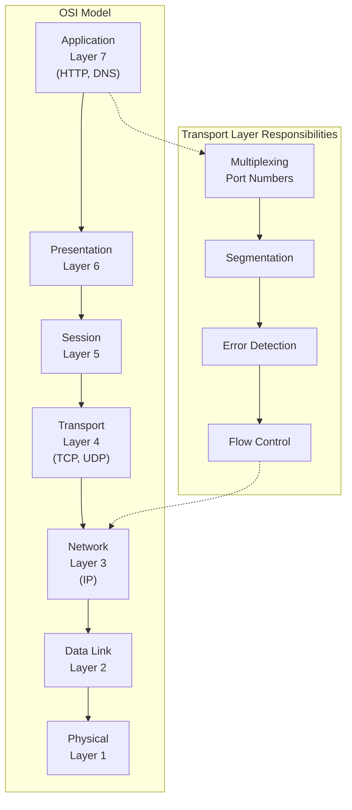
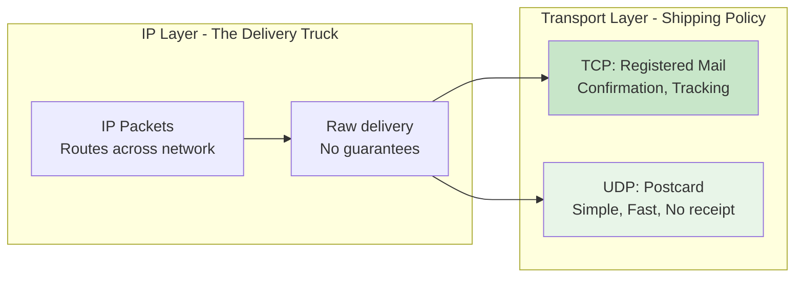
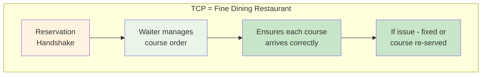
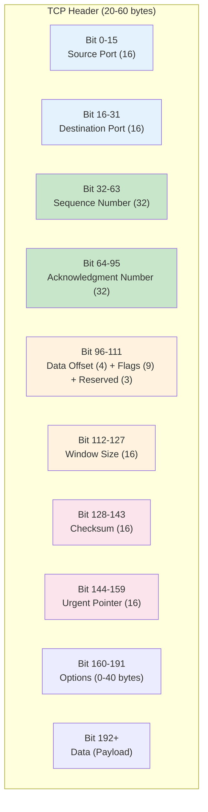
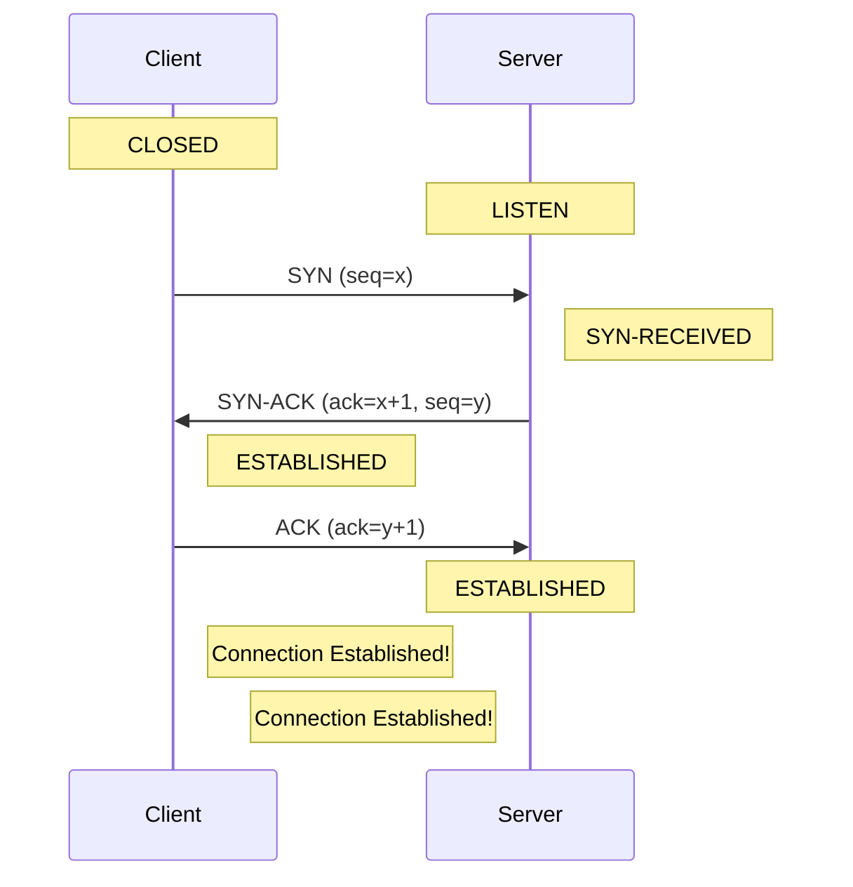
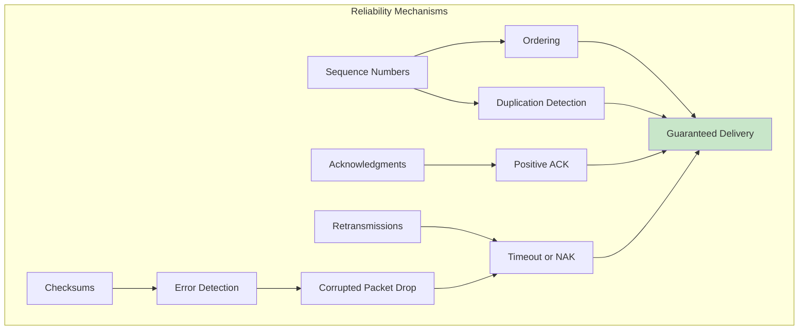
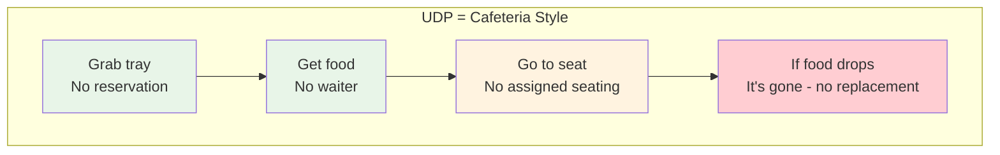
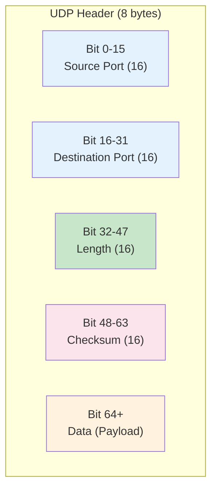
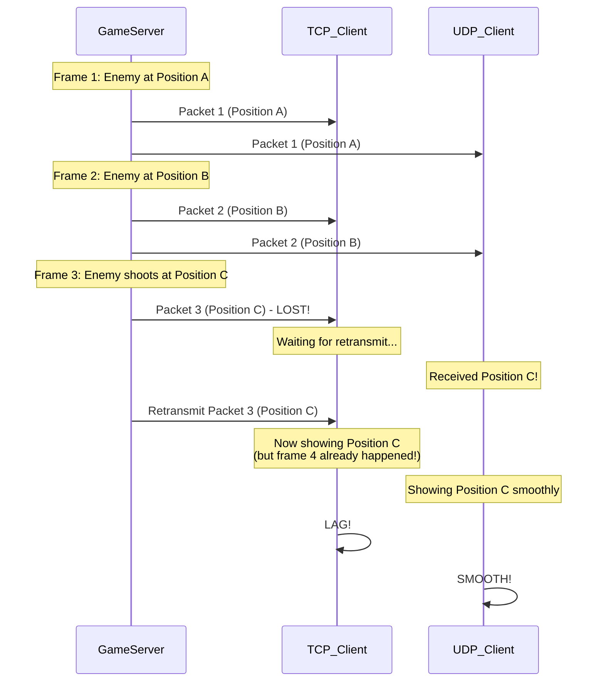

# Episode 18: TCP vs UDP

[](http://youtube.com/@ThatNotesGuy)

## What You'll Learn

- How TCP and UDP operate at the Transport Layer (Layer 4)
- The fundamental differences between connection-oriented and connectionless protocols
- TCP's reliability mechanisms: handshakes, sequencing, acknowledgments, and retransmissions
- UDP's minimalist design and why it excels in real-time scenarios
- The Head-of-Line Blocking problem and its impact on performance
- How QUIC and HTTP/3 leverage UDP for modern web performance
- Practical decision frameworks for choosing the right protocol

---

## Introduction: The Transport Layer Context

### Layer 4 in the OSI Model

Both TCP and UDP operate at Layer 4 (Transport Layer) of the OSI model, bridging the gap between the Application Layer (Layer 7) and the Network Layer (Layer 3/IP).



### The Multiplexing Role

Both protocols use **port numbers** to direct data to specific applications running on a host.

```yaml
Port_Multiplexing:
  Concept: "Multiple applications share one IP address"
  Mechanism: "Port numbers distinguish different services"

  Examples:
    Web_Server: "Port 80 (HTTP) or 443 (HTTPS)"
    DNS: "Port 53"
    SSH: "Port 22"
    Database: "Port 5432 (PostgreSQL), 3306 (MySQL)"

  Analogy: |
    "IP address = Building address"
    "Port number = Apartment number"
    "Packet = Mail piece addressed to specific apartment"
```

### The Shipping Analogy



```yaml
Shipping_Comparison:
  IP: "The delivery truck - gets packages from city A to city B"
  TCP: "The shipping policy - registered mail with tracking, signature required"
  UDP: "The shipping policy - postcards, cheap and fast, might get lost"
```

---

## TCP: Transmission Control Protocol

### Core Characteristics

TCP is a **connection-oriented**, **stateful** protocol that provides reliable, ordered, and error-checked delivery of data.

```yaml
TCP_Fundamentals:
  Connection_Oriented: "Requires logical connection before data transfer"
  Stateful: "Tracks state of communication session"
  Byte_Stream: "Data read as continuous stream, not discrete messages"
  Reliability: "Guaranteed delivery with acknowledgments and retransmissions"
  Ordering: "Packets reassembled in correct sequence"
  Flow_Control: "Prevents sender from overwhelming receiver"
  Congestion_Control: "Adapts to network conditions"
```

### The Restaurant Analogy



```yaml
TCP_Analogy:
  Restaurant: "Fine Dining Experience"
  Reservation: "Required before seating (3-way handshake)"
  Waiter: "Manages the order of courses (sequencing)"
  Courses_Served: "In order - appetizer, entree, dessert"
  If_Problem: "Waiter fixes it - re-cook, replace, apologize"
  Result: "Guaranteed satisfaction, but takes time"

  UDP_Comparison: |
    Cafeteria: "Grab tray, get food, go. No waiter.
    If roll drops on floor - it's gone. No replacement."
```

---

## The TCP Header & Overhead

### Header Structure

The TCP header is **variable in size**, ranging from **20 to 60 bytes** depending on options.

```yaml
TCP_Header_Details:
  Minimum_Size: "20 bytes (no options)"
  Maximum_Size: "60 bytes (with options)"
  Common_Fields: "20 bytes, most connections use this"

  Key_Header_Fields:
    Source_Port: "16 bits - Sender's port number"
    Destination_Port: "16 bits - Receiver's port number"
    Sequence_Number: "32 bits - Byte position in stream"
    Acknowledgment_Number: "32 bits - Next expected byte"
    Data_Offset: "4 bits - Header length"
    Flags: "9 bits - SYN, ACK, FIN, RST, etc."
    Window_Size: "16 bits - Receive buffer size"
    Checksum: "16 bits - Error detection"
    Urgent_Pointer: "16 bits - Priority data marker"

  Options: "Up to 40 bytes (MSS, SACK, Window Scale, etc.)"
```

### TCP Header Diagram



### Overhead Comparison

```yaml
TCP_vs_UDP_Overhead:
  TCP_Header: "20-60 bytes per packet"
  UDP_Header: "8 bytes per packet"
  Typical_Data_Payload: "1460 bytes (MTU 1500 - IP 20 - TCP 20)"

  TCP_Overhead_Percentage:
    Minimum: "20/1480 = 1.35% (with 1460 data)"
    Typical: "40/1500 = 2.67% (with MSS 1460, no options)"
    With_Options: "60/1500 = 4%"

  UDP_Overhead_Percentage:
    Always: "8/1468 = 0.54%"

  Conclusion: |
    "TCP has 3-8x more header overhead than UDP"
    "For small packets, TCP overhead can be 20%+"
```

---

## The 3-Way Handshake

### Connection Establishment

Before any data flows, TCP requires a 3-way handshake to establish the connection.



### Handshake Details

```yaml
Three_Way_Handshake:
  Step_1_SYN:
    Meaning: "Synchronize Sequence Numbers"
    Action: "Client sends initial sequence number (ISN = x)"
    Flag: "SYN = 1"
    Payload: "No data (just header)"

  Step_2_SYN_ACK:
    Meaning: "Server acknowledges and synchronizes back"
    Action: "Server sends its ISN (y) and ACKs client's ISN (x+1)"
    Flags: "SYN = 1, ACK = 1"
    Payload: "No data"

  Step_3_ACK:
    Meaning: "Client acknowledges server's ISN"
    Action: "Client sends ACK (y+1), can include payload"
    Flag: "ACK = 1"
    Payload: "First data can be sent!"

  Total_Latency: "1.5 round trips before first data"
```

### Why This Matters

```yaml
Handshake_Cost:
  Latency_Impact: "Minimum 1 RTT before any data transfer"
  Real_World:
    Same_Datacenter: "~0.1-0.5ms"
    Cross_Continent: "~50-150ms"
    Global: "~150-300ms"

  Optimization:
    TCP_Fast_Open: "Send data in SYN packet (requires crypto cookie)"
    TLS: "Adds 1-2 more round trips (TLS handshake)"
    Total_With_TLS: "2.5-3.5 RTTs before data!"
```

---

## TCP Reliability Mechanisms

### How TCP Ensures Reliability



```yaml
TCP_Reliability_Techniques:
  1_Sequence_Numbers:
    Purpose: "Track byte position in stream"
    Function: "Reorder packets, detect gaps"
    Range: "32 bits (4 billion bytes)"

  2_Acknowledgments:
    Purpose: "Confirm receipt of data"
    Types:
      Cumulative: "ACKs all bytes up to N"
      Selective: "ACKs specific ranges (SACK)"
    Timeout: "If no ACK, retransmit"

  3_Retransmission:
    Trigger: "Timeout or Triple Duplicate ACK"
    Algorithm: "Adaptive timeout based on RTT"
    Exponential_Backoff: "Increase timeout on repeated failures"

  4_Flow_Control:
    Purpose: "Prevent receiver buffer overflow"
    Mechanism: "Window Size field in header"
    Sender_Limit: "Cannot send more than receiver can buffer"

  5_Congestion_Control:
    Purpose: "Prevent network congestion collapse"
    Algorithms:
      Slow_Start: "Exponential growth"
      Congestion_Avoidance: "Linear growth"
      Fast_Retransmit: "On 3 duplicate ACKs"
      Fast_Recovery: "After fast retransmit"
```

### Visual: Packet Loss and Recovery

```mermaid
graph LR
    subgraph "Timeline"
        P1["Packet 1<br/>Seq: 1000<br/>Len: 100"] --> P2["Packet 2<br/>Seq: 1100<br/>Len: 100"]
        P2 --> P3["Packet 3<br/>Seq: 1200<br/>Len: 100"]
        P3 --> P4["Packet 4<br/>Seq: 1300<br/>Len: 100"]
    end

    style P1 fill:#c8e6c9
    style P2 fill:#f44336
    style P3 fill:#f44336
    style P4 fill:#fff3e0

    subgraph "Recovery"
        R1["Timeout detected"] --> R2["Retransmit Packet 2"]
        R2 --> R3["ACK received<br/>Continue"]
    end

    Note over P2: Lost in network
    Note over P3: Held at receiver<br/>waiting for Packet 2
    Note over P4: Held at receiver<br/>waiting for Packet 2
```

---

## UDP: User Datagram Protocol

### Core Characteristics

UDP is a **connectionless**, **stateless** protocol that provides minimal overhead for data delivery.

```yaml
UDP_Fundamentals:
  Connectionless: "No handshake required, just send"
  Datagram_Oriented: "Preserves message boundaries (not byte stream)"
  Stateless: "Server doesn't track client connection state"
  Low_Overhead: "8-byte fixed header"
  No_Guarantees: "No delivery confirmation, no ordering"
  Best_Effort: "May deliver duplicate packets, out of order"

  When_to_Use:
    - Real-time applications (gaming, VoIP, video)
    - Broadcasting/Multicasting
    - DNS queries
    - Simple request-response where loss is acceptable
```

### The Cafeteria Analogy



```yaml
UDP_Analogy:
  Cafeteria: "Fast, self-service, no guarantees"
  No_Reservation: "Just show up and eat (no handshake)"
  No_Waiter: "Get your own food (no state tracking)"
  Get_Food: "Each item separate (datagram, not stream)"
  If_Drops: "Roll on floor = gone (lost packet)"
  No_Complaint: "Just grab another (no retransmit)"
  Result: "Fast and efficient, but stuff can go wrong"

  TCP_Comparison: |
    Fine Dining: "Waiter manages everything, guaranteed
    satisfaction, but more overhead and time"
```

---

## The UDP Header & Efficiency

### Header Structure

The UDP header is **fixed at 8 bytes**, making it extremely efficient.



```yaml
UDP_Header_Fields:
  Source_Port: "16 bits - Sender's port (optional, 0 if unused)"
  Destination_Port: "16 bits - Required, tells where to deliver"
  Length: "16 bits - Total length (header + data), min 8 bytes"
  Checksum: "16 bits - Optional in IPv4, required in IPv6"

  Key_Differences_from_TCP:
    No_Sequence_Number: "Out-of-order delivery allowed"
    No_Acknowledgment: "No delivery confirmation"
    No_Flow_Control: "Sender might overwhelm receiver"
    No_Congestion_Control: "No network adaptation"
```

### Side-by-Side Comparison

```yaml
Header_Size_Comparison:
  TCP: "20-60 bytes (variable)"
  UDP: "8 bytes (fixed)"

  Example_Packet_64_bytes:
    TCP_Overhead: "20/64 = 31%"
    UDP_Overhead: "8/64 = 12.5%"

  Example_Packet_512_bytes:
    TCP_Overhead: "20/512 = 3.9%"
    UDP_Overhead: "8/512 = 1.5%"

  Example_Packet_1460 bytes:
    TCP_Overhead: "20/1460 = 1.4%"
    UDP_Overhead: "8/1460 = 0.5%"

  Conclusion: |
    "UDP has 3x less overhead than TCP"
    "For small packets, UDP is dramatically more efficient"
```

---

## The Head-of-Line Blocking Problem

### What is Head-of-Line Blocking?

In TCP, if the first packet (Head of Line) is lost, all subsequent packets must wait, even if they arrived correctly.

```mermaid
graph LR
    subgraph "Train Analogy"
        C1["Engine<br/>Packet 1<br/>LOST!"] --> C2["Car 1<br/>Packet 2<br/>ARRIVED"]
        C2 --> C3["Car 2<br/>Packet 3<br/>ARRIVED"]
        C3 --> C4["Car 3<br/>Packet 4<br/>ARRIVED"]
    end

    style C1 fill:#f44336
    style C2 fill:#fff3e0
    style C3 fill:#fff3e0
    style C4 fill:#fff3e0

    Note over C1: Front of train stuck<br/>All cars blocked!
```

```yaml
Head_of_Line_Blocking:
  Problem: "Sequencing requirement blocks subsequent packets"
  Example:
    Packet_1: "Lost in network"
    Packet_2: "Received but waits"
    Packet_3: "Received but waits"
    Packet_4: "Received but waits"

  Impact:
    Jitter: "Variable delay in packet arrival"
    Buffering: "Application must wait or drop frames"
    Real_Time: "Catastrophic for gaming/voice/video"

  Root_Cause: "Single ordered byte stream in TCP"
```

### TCP vs UDP: Visual Comparison

```mermaid
graph TB
    subgraph "TCP - Ordered Delivery"
        T1["P1<br/>Lost"] --> T2["P2<br/>Waiting"]
        T2 --> T3["P3<br/>Waiting"]
        T3 --> T4["P4<br/>Waiting"]
        T4 --> T5["P1 Retransmitted"]
        T5 --> T6["P2 Delivered"]
        T6 --> T7["P3 Delivered"]
    end

    subgraph "UDP - Unordered Delivery"
        U1["P1<br/>Lost"] --> U2["P2<br/>Delivered immediately"]
        U2 --> U3["P3<br/>Delivered immediately"]
        U3 --> U4["P4<br/>Delivered immediately"]
    end

    style T5 fill:#fff3e0
    style T6 fill:#c8e6c9
    style T7 fill:#c8e6c9
    style U2 fill:#c8e6c9
    style U3 fill:#c8e6c9
    style U4 fill:#c8e6c9
```



```yaml
Blocking_Impact:
  TCP_Behavior:
    Lost_Packet: "Causes delay for ALL subsequent packets"
    Latency_Impact: "1 RTT minimum for retransmit"
    Jitter: "High and unpredictable"

  UDP_Behavior:
    Lost_Packet: "Other packets delivered anyway"
    Latency_Impact: "Only affects lost packet"
    Jitter: "Lower for real-time apps"

  Real_World_Example:
    Video_Call_TCP: "One lost frame = entire video freezes"
    Video_Call_UDP: "One lost frame = minor glitch, continues"
```

---

## Real-Time Applications: Gaming & VoIP

### Why UDP Wins for Real-Time

```yaml
Real_Time_Requirements:
  Latency_Sensitivity: "Milliseconds matter"
  Tolerance: "Retransmit too slow to be useful"
  Order_Preference: "New data better than old retransmit"
  Loss_Acceptance: "Occasional packet loss is OK"

  Gaming:
    Example: "Shooter game, enemy moves"
    Input: "Current position matters"
    Old_Data: "Retransmitted old position = useless"
    Strategy: "Drop corrupt packet, send new"

  VoIP:
    Example: "Phone conversation"
    Audio: "200ms delay noticeable, 300ms annoying"
    Strategy: "Decode what you have, interpolate"
    Silence: "Better than choppy audio"
```

### UDP in Practice

```yaml
UDP_Use_Cases:
  Gaming:
    Protocol: "UDP-based (sometimes QUIC)"
    Example: "Valve's Source engine, Epic games"
    Behavior: "Position updates every 10-20ms"
    Loss: "Drop old positions, send new ones"

  Video_Streaming:
    Protocol: "UDP or QUIC"
    Example: "RTP over UDP, WebRTC"
    Behavior: "Decode available frames"
    Loss: "Minor visual artifact, continue"

  DNS:
    Protocol: "UDP (port 53)"
    Behavior: "Single query, single response"
    Loss: "Client retries, fast timeout"

  SNMP:
    Protocol: "UDP (ports 161/162)"
    Behavior: "Simple network management"
    Loss: "Manager retries polling"
```

### Visual: Gameplay Comparison



---

## The Future: QUIC and HTTP/3

### HTTP Evolution

```mermaid
graph TB
    subgraph "HTTP/1.1 - TCP"
        H1["HTTP/1.1"] --> T1["TCP"]
        T1 --> IP1["IP"]
        Note over H1: "Head-of-Line blocking<br/>Multiple connections"
    end

    subgraph "HTTP/2 - TCP (Single Connection)"
        H2["HTTP/2"] --> T2["TCP"]
        T2 --> IP2["IP"]
        Note over H2: "Multiplexing but<br/>still HoL blocking"
    end

    subgraph "HTTP/3 - QUIC on UDP"
        H3["HTTP/3"] --> Q["QUIC"]
        Q --> U["UDP"]
        U --> IP3["IP"]
        Note over H3: "No HoL blocking<br/>Connection migration"
    end

    style H3 fill:#c8e6c9
```

### QUIC Protocol

```yaml
QUIC_Overview:
  Full_Name: "Quick UDP Internet Connections"
  RFC: "RFC 9000 (2021)"
  Layer: "Transport Layer protocol on top of UDP"
  Creator: "Google (originally), now IETF standard"

  Key_Innovations:
    Reliability_in_User_Space: "TCP-like reliability on UDP"
    No_Head_of_Line_Blocking: "Per-stream flow control"
    Connection_Migration: "WiFi to 5G without reconnect"
    Zero_RTT: "Instant data on reconnect"
    Built_in_TLS_1.3: "Encryption required by default"

  Performance_Benefits:
    Connection_Establishment: "0-1 RTT vs TCP+TLS 2-3 RTT"
    HoL_Blocking: "Eliminated at transport layer"
    Network_Changes: "Survives IP/port changes"
```

### Layered Architecture Comparison

```yaml
Protocol_Stack_Comparison:
  HTTP_2_Stack:
    Layer_7: "HTTP/2"
    Layer_4: "TCP"
    Layer_3: "IP"
    Layer_2: "Ethernet"

    Problems:
      - TCP HoL blocking affects all streams
      - TLS handshake adds latency
      - Packet loss blocks entire connection

  HTTP_3_Stack:
    Layer_7: "HTTP/3"
    Layer_4: "QUIC"
    Layer_4: "UDP"
    Layer_3: "IP"

    Solutions:
      - Per-stream reliability (no HoL blocking)
      - TLS 1.3 integrated (less latency)
      - Loss recovery per stream
      - Connection migration
```

### UDP Eating the World

```yaml
Modern_UDP_Adoption:
  HTTP_3:
    Usage: "30%+ of web traffic (growing fast)"
    Browser_Support: "Chrome, Firefox, Safari, Edge"
    Benefit: "Mobile users, unreliable networks"

  WebRTC:
    Usage: "Video conferencing, real-time communication"
    Protocol: "RTP/RTCP over UDP"
    Features: "Peer-to-peer, NAT traversal"

  DNS_over_QUIC:
    Usage: "Faster, more secure DNS"
    Benefit: "Same advantages as DoH but lower latency"

  Games:
    Usage: "Most competitive multiplayer games"
    Protocol: "UDP or QUIC-based solutions"

  Why_UDP: |
    "UDP provides the flexibility to implement
    custom reliability, flow control, and
    congestion control in user space"
```

---

## Decision Framework: Summary

### TCP vs UDP Quick Reference

| Aspect | TCP | UDP |
|--------|-----|-----|
| **Connection** | Connection-oriented (3-way handshake) | Connectionless (no handshake) |
| **Reliability** | Guaranteed delivery with ACKs | Best effort, no guarantees |
| **Ordering** | Guaranteed in-order delivery | No ordering (may arrive out of order) |
| **State** | Stateful (tracks connection) | Stateless (no connection tracking) |
| **Header** | 20-60 bytes | 8 bytes (fixed) |
| **Overhead** | High (retransmissions, acknowledgments) | Low |
| **Latency** | Higher (handshake + reliability) | Lower (minimal processing) |
| **Congestion Control** | Yes (adaptive) | No |
| **Flow Control** | Yes (sliding window) | No |
| **Broadcast/Multicast** | No (point-to-point only) | Yes |
| **Head-of-Line Blocking** | Yes (single stream) | No (independent datagrams) |

### When to Use Each

```yaml
Choose_TCP_When:
  Reliability: "Data MUST arrive completely and correctly"
  Examples:
    - Web pages (HTTP)
    - Email (SMTP, IMAP)
    - File transfer (FTP, SFTP)
    - Database connections
    - APIs where accuracy > speed
  Scenarios:
    - Financial transactions
    - Document downloads
    - Database replication
    - Configuration sync

Choose_UDP_When:
  Latency: "Speed more important than completeness"
  Examples:
    - Real-time gaming
    - VoIP calls
    - Video streaming
    - DNS queries
    - IoT sensor data
  Scenarios:
    - Live audio/video
    - Competitive gaming
    - Broadcast/multicast
    - Simple query-response
```

### Decision Matrix

```yaml
Decision_Matrix:
  Real_Time_Gaming: "UDP - low latency critical"
  Video_Call: "UDP or QUIC - smooth experience"
  Web_Browsing: "TCP (HTTP) - need all content"
  Email: "TCP (IMAP/SMTP) - need all messages"
  File_Download: "TCP (HTTP/FTP) - need complete file"
  DNS_Lookup: "UDP - fast, retry on failure"
  IoT_Sensors: "UDP - frequent small packets"
  Database_Replication: "TCP - consistency critical"
  Live_Video_Streaming: "UDP - continuous flow"
  API_Integration: "TCP - request-response accuracy"
```

### The Modern Approach

```yaml
Hybrid_Approach:
  Observation: |
    "The best of both worlds is now possible"
  Examples:
    HTTP_3_QUIC: "Reliability on UDP for web"
    WebRTC: "UDP-based with reliability layer"
    gRPC: "HTTP/2 for reliability, QUIC option"
    QUIC_DNS: "Fast DNS with reliability"

  Trade_Off_Never_Changes: |
    "You ALWAYS choose between:
    - Accuracy (TCP-style reliability)
    - Latency (UDP-style speed)

    Modern protocols just let you make
    this trade-off at the right granularity"
```

---

## Key Takeaways

### Remember This

- **Transport Layer Role**: TCP and UDP sit at Layer 4, bridging Application (Layer 7) and Network (Layer 3/IP), using ports to multiplex connections to applications
- **TCP = Reliable**: Connection-oriented, stateful, ordered byte stream with acknowledgments, retransmissions, and flow/congestion control
- **UDP = Fast**: Connectionless, stateless, fire-and-forget datagrams with minimal 8-byte overhead
- **3-Way Handshake Cost**: TCP requires SYN, SYN-ACK, ACK before data flows, adding 1 RTT latency before first byte
- **Head-of-Line Blocking**: TCP's ordered delivery means lost Packet 1 blocks Packets 2, 3, 4 even if they arrived
- **Real-Time Tolerance**: Gaming and VoIP prefer UDP because retransmitting old data is worse than losing it
- **QUIC/HTTP/3 Revolution**: Builds TCP-like reliability on UDP, solving HoL blocking while maintaining UDP performance
- **Protocol Choice**: TCP for reliability (web, email, files), UDP for latency (gaming, streaming, DNS)

### Common Mistakes to Avoid

```yaml
Common_Mistakes:
  1_UDP_for_Wrong_Reasons:
    Mistake: "Using UDP thinking it's 'faster' always"
    Reality: "Over LAN or reliable networks, difference minimal"
    Correct: "Match protocol to application requirements"

  2_Implementing_Your_Own_Reliability:
    Mistake: "Building TCP-like features on UDP"
    Reality: "Reinventing the wheel, easy to get wrong"
    Correct: "Use QUIC or existing libraries"

  3_Ignoring_Latency_Costs:
    Mistake: "Using TCP for real-time applications"
    Reality: "HoL blocking and retransmit delays hurt UX"
    Correct: "Use UDP or QUIC for gaming/VoIP"

  4_Forgetting_Connection_Overhead:
    Mistake: "Creating many short TCP connections"
    Reality: "Each connection needs handshake (2-3 RTT)"
    Correct: "Use connection pooling, HTTP keep-alive, or QUIC"

  5_Small_Packet_Overhead:
    Mistake: "Many small packets on TCP"
    Reality: "20-byte header on 20-byte data = 50% overhead"
    Correct: "Batch small writes, use larger packets"

  6_Not_Using_TCP_Fast_Open:
    Mistake: "Paying full handshake cost on every request"
    Reality: "TFO can send data in SYN (with crypto)"
    Correct: "Enable TCP Fast Open where supported"

  7_UDP_Is_Not_Simple_Drop_In:
    Mistake: "Thinking UDP requires no code changes"
    Reality: "Need to handle reordering, loss detection, etc."
    Correct: "Consider QUIC for reliability without TCP costs"
```

### Best Practices

```yaml
Protocol_Selection_Best_Practices:
  1: "Default to TCP (HTTP) for web and general traffic"
  2: "Use UDP for real-time where milliseconds matter"
  3: "Consider QUIC/HTTP/3 for mobile users"
  4: "Profile before optimizing - protocol rarely the bottleneck"
  5: "Use connection pooling to amortize handshake cost"
  6: "Batch writes to reduce per-packet overhead"
  7: "Monitor RTT and packet loss for congestion"
  8: "For new apps, evaluate HTTP/3 for performance gains"
```

---

<div align="center">

[Previous Episode: OSI Model](../17-osi-model) | [Course Home](../../) | [Next Episode: REST vs gRPC](../19-rest-grpc/)

</div>
