# Episode 19: REST vs gRPC

[](http://youtube.com/@ThatNotesGuy)

## What You'll Learn

- What RPC (Remote Procedure Call) is and how it enables distributed communication
- The definition and constraints of REST as an architectural style
- The Richardson Maturity Model and HATEOAS principles
- What gRPC is and why Google open-sourced it in 2015
- Protocol Buffers (Protobuf) as a binary serialization format
- HTTP/2 vs HTTP/1.1 and the performance implications
- The four types of gRPC: Unary, Server Streaming, Client Streaming, Bidirectional
- When to choose REST vs gRPC based on your use case
- Load balancing complexities with both approaches
- Real-world code examples for both paradigms

---

## Practical Tutorials

Hands-on code examples you can run locally:

| Tutorial | Description | Run Time |
|----------|-------------|----------|
| [REST Tutorial](./practical/rest-tutorial/) | Simple Express.js REST API | ~10 min |
| [gRPC Tutorial](./practical/grpc-tutorial/) | gRPC with Protocol Buffers | ~15 min |

```bash
# REST - Quick start
cd practical/rest-tutorial
npm install
npm start          # Terminal 1
node client.js     # Terminal 2

# gRPC - Quick start
cd practical/grpc-tutorial
npm install
npm run server     # Terminal 1
npm run client     # Terminal 2
```

---

## Introduction: The Problem of Distributed Systems

### What is a Distributed System?

A **distributed system** is a collection of independent computers (called nodes) that communicate with each other over a network. Each node operates its own memory and runs its own operating system, but they work together to achieve a common goal.

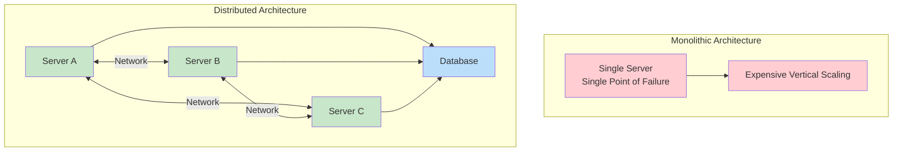

### The Communication Challenge

When you have multiple services (like a Payment Gateway service needing to talk to a Database service), they must communicate by relaying messages over the network.

```yaml
The_Problem:
  Monolith:
    description: "Single application, everything in one codebase"
    pros: ["Simple to develop", "Easy debugging", "ACID transactions"]
    cons: ["Single point of failure", "Expensive vertical scaling only", "Tight coupling"]

  Distributed:
    description: "Multiple independent services communicating over network"
    pros: ["Horizontal scaling", "Fault-tolerant", "Technology flexibility"]
    cons: ["Network complexity", "Distributed transactions", "Latency overhead"]

  Goal: "Service A talks to Service B efficiently without understanding network details"
```

### The Solution: Protocol Abstraction

We need a way for services to communicate as if they were calling local functions, abstracting away the network complexity.

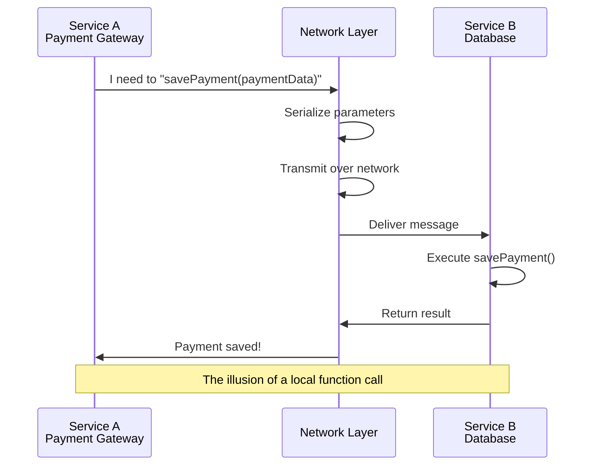

---

## RPC: Remote Procedure Call

### Core Definition

**RPC (Remote Procedure Call)** is a protocol that enables a program to request a service from a program located on another computer in a network, without the programmer needing to explicitly code for the details of the network interaction.

```yaml
RPC_Concept:
  The_Illusion: "Looks exactly like a local function call to the developer"
  Reality: "Executes on a remote machine, results sent back over network"

  Developer_Experience:
    Local_Call: "result = calculateTax(orderAmount)"
    RPC_Call: "result = taxService.calculateTax(orderAmount)"
    Difference: "None in code - both look like function invocations"
```

### How RPC Works

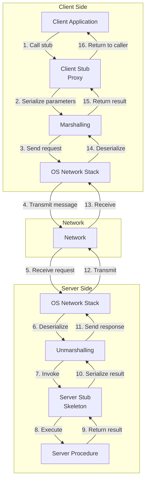

### The Pizza Analogy

Think of RPC like ordering pizza:

```yaml
Pizza_Analogy:
  Client: "You (hungry person)"
  Client_Stub: "Phone menu - easy to use interface"
  Parameters: "Your order - 'Large pepperoni, extra cheese'"
  Network: "Phone lines/internet delivering your order"
  Server_Stub: "Restaurant kitchen - prepares food"
  Server_Procedure: "Pizza chef - actually cooks"
  Response: "Delivered hot pizza"

  Key_Insight: "You don't talk to the chef directly - the system handles it"
```

---

## REST: Representational State Transfer

### Origin and Definition

**REST (Representational State Transfer)** is an architectural style for designing networked applications. It was introduced by Roy Fielding in his 2000 doctoral dissertation at UC Irvine. REST is NOT a protocol - it is a set of architectural constraints.

```yaml
REST_Foundations:
  Creator: "Roy Fielding - Co-author of HTTP 1.1 specification"
  Year: "2000 (Dissertation)"
  Type: "Architectural Style, NOT a protocol"
  Transport: "Typically HTTP 1.1, but can use others"

  Key_Paper: "Architectural Styles and the Design of Network-based Software Architectures"
```

### The Six REST Constraints

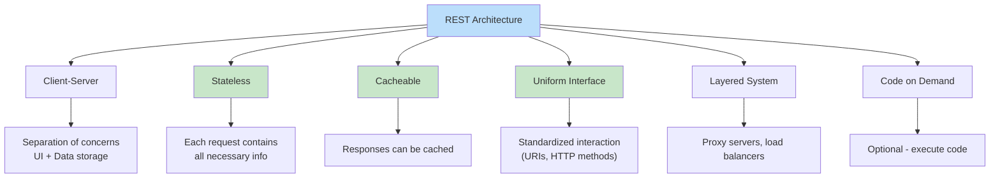

```yaml
REST_Constraints:
  Stateless:
    description: "Server stores NO session information between requests"
    implication: "Every request must contain ALL information needed to process it"
    example: "Auth token must be sent with every request"

  Cacheable:
    description: "Responses can define themselves as cacheable or not"
    implication: "Reduce server load, improve performance"
    example: "Cache-Control headers, ETag"

  Uniform_Interface:
    description: "Standardized way of communicating (HTTP 1.1)"
    resources: "Everything is a RESOURCE identified by URI"
    representation: "Resources have multiple representations (JSON, XML)"
```

### Everything is a Resource

In REST, everything is treated as a resource - a conceptual entity that can be accessed or manipulated.

```yaml
Resource_Examples:
  User_Resource:
    URI: "/users/123"
    Representations: "JSON, XML"
    Actions: "GET, POST, PUT, DELETE"

  Order_Resource:
    URI: "/orders/456"
    Actions: "GET to retrieve, DELETE to cancel"

  Product_Catalog:
    URI: "/products"
    Actions: "GET list, POST new product"
```

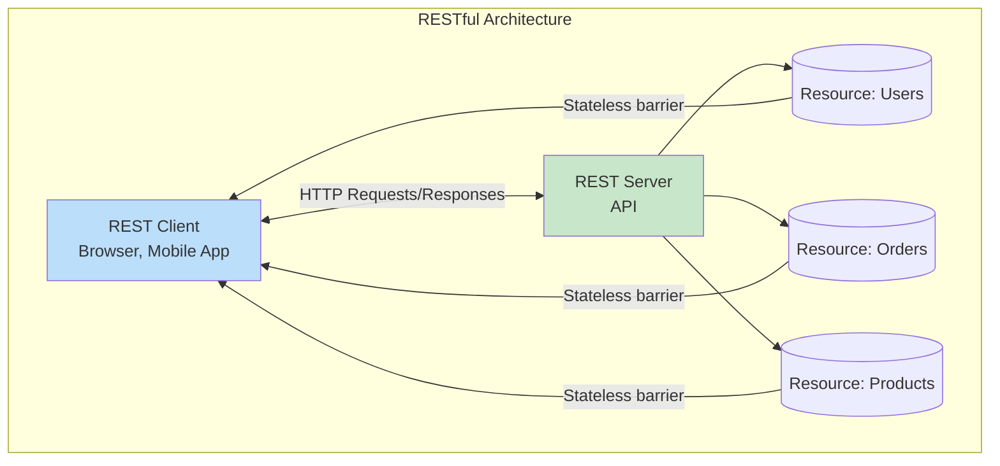

---

## REST Maturity & HATEOAS

### The Richardson Maturity Model

This model, developed by Leonard Richardson, categorizes REST APIs into levels based on how well they follow REST principles.

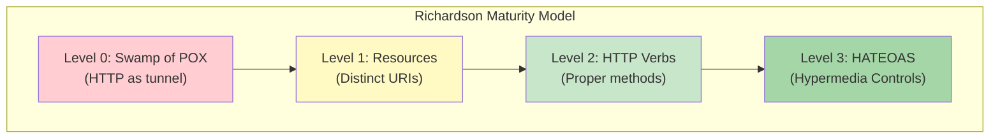

| Level | Name | Description | Example |
|-------|------|-------------|---------|
| **Level 0** | Swamp of POX | HTTP used as a tunnel, XML-RPC style | POST /api endpoint with action in body |
| **Level 1** | Resources | Distinct URIs for different entities | GET /users/123, GET /products/456 |
| **Level 2** | HTTP Verbs | Proper use of GET, POST, PUT, DELETE | POST /users, DELETE /users/123 |
| **Level 3** | HATEOAS | Hypermedia controls in responses | Response includes links to related actions |

### Level 0: The Swamp of Plain Old XML (POX)

This is essentially RPC over HTTP without using HTTP semantics.

```yaml
Level_0_Example:
  Bad_Practice:
    POST /api HTTP/1.1
    Content-Type: application/xml

    <request>
      <action>getUser</action>
      <userId>123</userId>
    </request>

  Problems:
    - "HTTP is just a tunnel"
    - "No semantic meaning to the request"
    - "Looks like RPC, not REST"
```

### Level 1: Resources

Now we have distinct URIs for different entities.

```yaml
Level_1_Example:
  Improvement:
    GET /users/123 HTTP/1.1
    GET /products/456 HTTP/1.1

  Still_Missing:
    - "HTTP methods don't match actions (using GET for everything)"
    - "No hypermedia to discover next actions"
```

### Level 2: HTTP Verbs

Proper use of HTTP methods to perform CRUD operations.

```yaml
Level_2_Example:
  CRUD_Operations:
    GET /users       # List all users
    GET /users/123   # Get specific user
    POST /users      # Create new user
    PUT /users/123   # Replace user
    DELETE /users/123 # Delete user

  Benefits:
    - "Semantic meaning to operations"
    - "Cacheable operations identified (GET is safe)"
    - "Idempotent operations identified (PUT, DELETE)"
```

### Level 3: HATEOAS

**HATEOAS (Hypertext As The Engine Of Application State)** means the API response includes links telling the client what actions are available next.

```yaml
HATEOAS_Concept:
  Definition: "Hypertext As The Engine Of Application State"
  Principle: "API tells you what you can do next via links in response"
  Benefit: "Client discovers API without hardcoding URLs"

  Example_Response:
    {
      "orderID": 3,
      "status": "pending",
      "total": 99.99,
      "links": [
        {"rel": "self", "href": "/orders/3", "method": "GET"},
        {"rel": "cancel", "href": "/orders/3", "method": "DELETE"},
        {"rel": "payment", "href": "/orders/3/payment", "method": "POST"}
      ]
    }

  Client_Behavior: "Links tell client what operations are valid in current state"
```

---

## REST Best Practices

### Nouns, Not Verbs

REST uses nouns to represent resources, not verbs to represent actions.

```yaml
Bad_Practices:
  - "/getAllUsers"      # Verb in URL - WRONG
  - "/createUser"       # Verb in URL - WRONG
  - "/updateUser/123"   # Verb in URL - WRONG
  - "/deleteUser/456"   # Verb in URL - WRONG

Good_Practices:
  - "GET /users"        # Get all users
  - "POST /users"       # Create new user
  - "PUT /users/123"    # Update user
  - "DELETE /users/456" # Delete user
```

### Use Plural Nouns

Use plural nouns for collections and add ID for specific items.

```yaml
Naming_Convention:
  Collections: "/users"     (all users)
  Specific_Item: "/users/123" (user with ID 123)

  Examples:
    /products              # List products
    /products/789          # Product 789
    /users/123/orders      # Orders for user 123
    /orders/456/items      # Items in order 456
```

### HTTP Method Mapping

```yaml
HTTP_Methods_CRD:
  GET:
    purpose: "Retrieve a resource"
    safe: true
    idempotent: true
    example: "GET /users/123"

  POST:
    purpose: "Create a new resource"
    safe: false
    idempotent: false
    example: "POST /users (body contains new user data)"

  PUT:
    purpose: "Replace or create a resource"
    safe: false
    idempotent: true
    example: "PUT /users/123 (body contains complete user)"

  PATCH:
    purpose: "Partial update to a resource"
    safe: false
    idempotent: true
    example: "PATCH /users/123 (body contains only changed fields)"

  DELETE:
    purpose: "Remove a resource"
    safe: false
    idempotent: true
    example: "DELETE /users/123"
```

### HTTP Methods and Idempotency

| HTTP Method | Safe | Idempotent | Use Case |
|-------------|------|------------|----------|
| **GET** | Yes | Yes | Retrieve data |
| **HEAD** | Yes | Yes | Get headers only |
| **OPTIONS** | Yes | Yes | Get allowed methods |
| **PUT** | No | Yes | Replace/Create resource |
| **POST** | No | No | Create resource |
| **PATCH** | No | Yes | Partial update |
| **DELETE** | No | Yes | Delete resource |

```yaml
Idempotency_Explained:
  PUT: "Calling PUT 5 times = same result as calling once"
  POST: "Calling POST 5 times = 5 new resources created"
  DELETE: "Calling DELETE on already-deleted resource = still successful"

  Key_Insight: "PUT is idempotent, POST is not - choose based on semantics"
```

### API Versioning

```yaml
Versioning_Strategies:
  URI_Path:
    description: "Version in URL path"
    example: "/v1/users", "/v2/products"
    pros: ["Simple", "Easy to test in browser", "Clear visibility"]
    cons: ["Violates HATEOAS purism", "URL changes on version bump"]

  Header:
    description: "Version in HTTP header"
    example: "Accept: application/vnd.company.v1+json"
    pros: ["Clean URLs", "HATEOAS friendly"]
    cons: ["Harder to test", "Requires client config"]

  Recommendation: "URI versioning for simplicity, Header for API-first design"
```

---

## gRPC: Google's High-Performance RPC Framework

### What is gRPC?

**gRPC** is an open-source RPC framework developed by Google and released in 2015. It is now part of the CNCF (Cloud Native Computing Foundation) landscape.

```yaml
gRPC_Overview:
  Origin: "Google - used internally for 15+ years before open-sourcing"
  Year_Open_Sourced: "2015"
  Current_Status: "Part of CNCF (Cloud Native Computing Foundation)"
  Language_Support: "Go, Java, Python, C++, Node.js, and 10+ more"

  Key_Technologies:
    Transport: "HTTP/2 (not HTTP/1.1)"
    Serialization: "Protocol Buffers (binary, not text)"
    Interface_Definition: ".proto files (contract-first)"
```

### The gRPC Philosophy

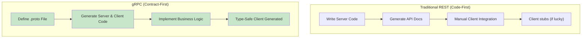

```yaml
Contract_First_Approach:
  Step_1: "Define your service interface in .proto file"
  Step_2: "Generate stub code for server and client"
  Step_3: "Implement server logic"
  Step_4: "Client uses generated code (type-safe from day one)"

  Benefits:
    - "Single source of truth"
    - "No ambiguity in API contract"
    - "Generated code ensures consistency"
    - "Type safety across languages"
```

### gRPC Timeline

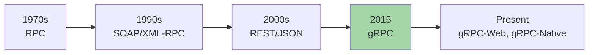

---

## Protocol Buffers (Protobuf)

### What is Protocol Buffers?

**Protocol Buffers** (Protobuf) is a mechanism for serializing structured data. It is binary, not text-based like JSON or XML.

```yaml
Protobuf_Characteristics:
  Format: "Binary (not human-readable)"
  Size: "3-10x smaller than equivalent JSON"
  Speed: "Faster serialization/deserialization"
  Schema: "Defined in .proto files (single source of truth)"

  Comparison:
    JSON: "Human-readable text, verbose, slow to parse"
    XML: "Human-readable text, very verbose, slow to parse"
    Protobuf: "Binary, compact, fast to parse"
```

### The .proto File

The .proto file defines your data structures and service interfaces.

```protobuf
syntax = "proto3";

message HelloRequest {
  string name = 1;
  string description = 2;
  int32 id = 3;
  bool is_active = 4;
  repeated string tags = 5;  // Repeated = array/list
}

message HelloResponse {
  string message = 1;
  int32 response_code = 2;
}

service HelloService {
  rpc SayHello(HelloRequest) returns (HelloResponse);
}
```

### How Protobuf Works

```yaml
Protobuf_Basics:
  Field_Tags:
    description: "Each field has a unique number (1, 2, 3...)"
    purpose: "Identifies field in binary format, saving space"
    benefit: "No field names sent in payload, just numbers"

  Field_Types:
    string: "UTF-8 text"
    int32/int64: "32/64-bit integers"
    bool: "true/false"
    bytes: "Raw bytes"
    repeated: "Array/List"
    enum: "Enumeration values"

  Binary_Advantage:
    JSON_Example: '{"name": "John", "id": 123, "active": true}'
    Protobuf_Equivalent: "[0x12 0x04 'J' 'o' 'h' 'n' 0x10 0x7B 0x18 0x01]"
    Size_Reduction: "~50-70% smaller payload"
```

### JSON vs Protobuf Comparison

```yaml
Payload_Comparison:
  JSON_Format:
    content: |
      {
        "userId": 12345,
        "username": "johndoe",
        "email": "john@example.com",
        "isActive": true,
        "roles": ["admin", "user"],
        "createdAt": "2024-01-15T10:30:00Z"
      }
    size: "~150 bytes of text
    readable: "Yes (human-readable)"

  Protobuf_Format:
    content: |
      [0x08 0x39 0x12 0x08 'j' 'o' 'h' 'n' 'd' 'o' 'e'
       0x1A 0x11 'j' 'o' 'h' 'n' '@' 'e' 'x' 'a' 'm' 'p' 'l' 'e' '.' 'c' 'o' 'm'
       0x20 0x01 0x3A 0x02 0x00 0x01 0x42 0x14 '2' '0' '2' '4' '-' '0' '1' '-' '1' '5'
       'T' '1' '0' ':' '3' '0' ':' '0' '0' 'Z']
    size: "~65 bytes of binary"
    readable: "No (binary format)"
```

---

## HTTP/2 vs HTTP/1.1

### HTTP/1.1 Characteristics

HTTP/1.1 is the traditional protocol used by REST APIs.

```yaml
HTTP_1_1_Characteristics:
  Format: "Text-based, human-readable headers"
  Connection: "One request per TCP connection at a time"
  Head_of_Line_Blocking: "Browser limits to 6 connections per domain"
  Header_Overhead: "Plain text headers repeated on each request"
  Binary: "No - everything is text"

  Performance_Issues:
    - "New TCP connection often required (3-way handshake)"
    - "Headers sent repeatedly (Cookie, Authorization)"
    - "Long polling workaround for server push"
```

### HTTP/2 Characteristics

HTTP/2 is the modern protocol used by gRPC.

```yaml
HTTP_2_Characteristics:
  Format: "Binary protocol (frame-based)"
  Multiplexing: "Multiple requests/responses over single TCP connection"
  Header_Compression: "HPACK compression (static + dynamic tables)"
  Server_Push: "Server can push resources proactively"
  Bidirectional: "Full-duplex communication"

  Performance_Benefits:
    - "No head-of-line blocking at application layer"
    - "Headers compressed (80-90% smaller)"
    - "Single TCP connection (no handshake overhead)"
    - "Parallel streams over one connection"
```

### HTTP/1.1 vs HTTP/2 Comparison

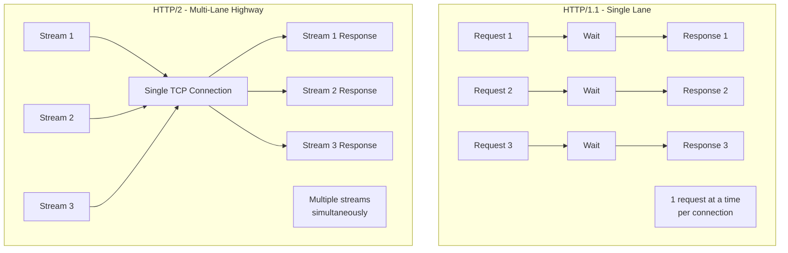

| Feature | HTTP/1.1 | HTTP/2 |
|---------|----------|--------|
| **Format** | Text-based | Binary frames |
| **Multiplexing** | No (1 request per connection) | Yes (multiple streams) |
| **Header Compression** | No | Yes (HPACK) |
| **Server Push** | No | Yes |
| **Encryption** | Optional | Required (ALPN) |
| **Connection** | Multiple connections | Single connection |
| **Latency** | Higher | Lower |

---

## The Four Types of gRPC

### 1. Unary RPC

The simplest type - a single request followed by a single response (just like a regular function call).

```protobuf
service UserService {
  rpc GetUser(GetUserRequest) returns (UserResponse);
}

message GetUserRequest {
  int32 user_id = 1;
}

message UserResponse {
  User user = 1;
}
```

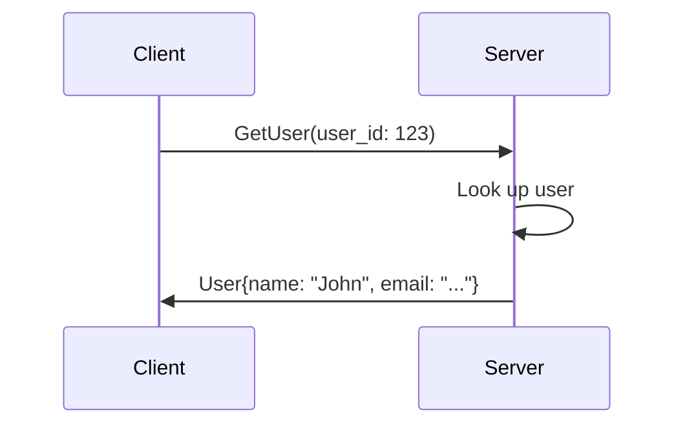

### 2. Server Streaming RPC

Client sends ONE request, server streams MULTIPLE responses.

```protobuf
service StockService {
  rpc GetStockPrices(StockRequest) returns (stream StockPrice);
}

message StockRequest {
  string symbol = 1;
}

message StockPrice {
  double price = 1;
  int64 timestamp = 2;
}
```

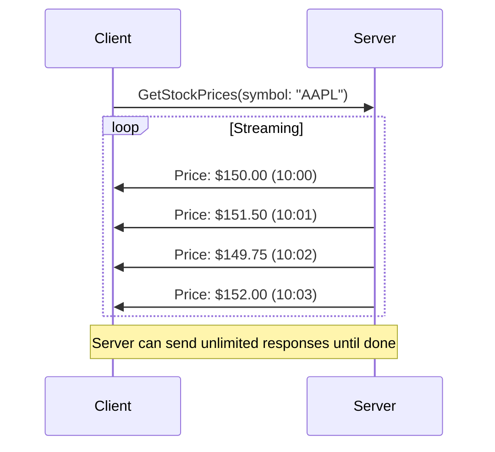

**Use Cases:**
- Stock tickers
- Real-time notifications
- Large file downloads
- Progress updates

### 3. Client Streaming RPC

Client streams MULTIPLE requests, server sends ONE response.

```protobuf
service AnalyticsService {
  rpc UploadEvents(stream EventRequest) returns (UploadResponse);
}

message EventRequest {
  string event_name = 1;
  map<string, string> properties = 2;
  int64 timestamp = 3;
}

message UploadResponse {
  int32 events_received = 1;
  bool success = 2;
}
```

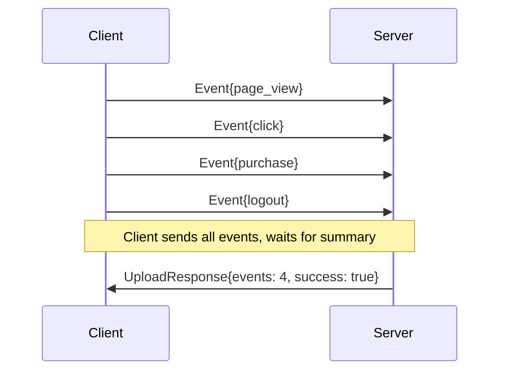

**Use Cases:**
- File uploads
- IoT sensor data ingestion
- Batch analytics
- Log aggregation

### 4. Bidirectional Streaming RPC

Both client and server stream independently.

```protobuf
service ChatService {
  rpc Chat(stream ChatMessage) returns (stream ChatMessage);
}

message ChatMessage {
  string user = 1;
  string text = 2;
  int64 timestamp = 3;
}
```

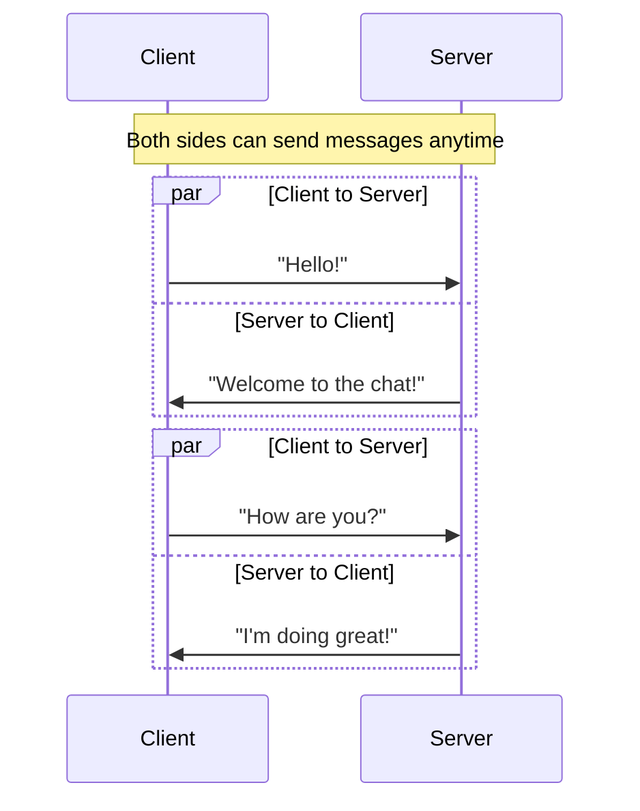

**Use Cases:**
- Real-time chat applications
- Online multiplayer gaming
- Collaborative editing
- Live trading platforms

### Complete gRPC Service Definition Example

```protobuf
// Complete example with all RPC types
service OrderService {
  // Unary - Create a new order
  rpc CreateOrder(CreateOrderRequest) returns (OrderResponse);

  // Server Streaming - Get real-time order updates
  rpc StreamOrderUpdates(OrderRequest) returns (stream OrderUpdate);

  // Client Streaming - Bulk order creation
  rpc BulkCreateOrders(stream CreateOrderRequest) returns (BulkOrderResponse);

  // Bidirectional - Real-time order processing
  rpc ProcessOrders(stream OrderRequest) returns (stream OrderResponse);
}
```

---

## Building a gRPC Service - Quick Start

For a fast setup with Node.js, here are the essential files you need:

### package.json

```json
{
  "name": "grpc-tutorial",
  "dependencies": {
    "@grpc/grpc-js": "^1.9.0",
    "@grpc/proto-loader": "^0.7.10"
  }
}
```

### greeting.proto

```protobuf
syntax = "proto3";

package greeting;

service GreetingService {
  rpc SayHello (HelloRequest) returns (HelloReply) {}
}

message HelloRequest {
  string name = 1;
}

message HelloReply {
  string message = 1;
}
```

### server.js

```javascript
const grpc = require('@grpc/grpc-js');
const protoLoader = require('@grpc/proto-loader');

const proto = grpc.loadPackageDefinition(
  protoLoader.loadSync('greeting.proto')
).greeting;

function sayHello(call, callback) {
  callback(null, { message: `Hello, ${call.request.name}!` });
}

const server = new grpc.Server();
server.addService(proto.GreetingService.service, { SayHello: sayHello });
server.bindAsync('0.0.0.0:50051', grpc.ServerCredentials.createInsecure(), () => {
  console.log('Server running on :50051');
});
```

### client.js

```javascript
const grpc = require('@grpc/grpc-js');
const protoLoader = require('@grpc/proto-loader');

const proto = grpc.loadPackageDefinition(
  protoLoader.loadSync('greeting.proto')
).greeting;

const client = new proto.GreetingService(
  'localhost:50051',
  grpc.credentials.createInsecure()
);

client.SayHello({ name: 'Alice' }, (err, response) => {
  console.log(response.message);
});
```

```bash
# Run the gRPC example
npm install
node server.js   # Terminal 1
node client.js   # Terminal 2 -> Output: "Hello, Alice!"
```

---

## Building a gRPC Service - Full Walkthrough

### Step 1: Define greeting.proto

```protobuf
syntax = "proto3";

package greet;

// The greeting service definition
service Greeter {
  // Unary RPC
  rpc SayHello (HelloRequest) returns (HelloReply);

  // Server Streaming RPC
  rpc SayHelloServerStream (HelloRequest) returns (stream HelloReply);

  // Client Streaming RPC
  rpc SayHelloClientStream (stream HelloRequest) returns (HelloReplyList);

  // Bidirectional Streaming RPC
  rpc SayHelloBidirectionalStream (stream HelloRequest) returns (stream HelloReply);
}

// The request message
message HelloRequest {
  string name = 1;
  int32 age = 2;
}

// The response message
message HelloReply {
  string message = 1;
  int32 reply_count = 2;
}

// For client streaming response
message HelloReplyList {
  repeated HelloReply replies = 1;
}
```

### Step 2: Generate Code

```bash
# Install protoc compiler
# macOS: brew install protobuf

# Generate Go code
protoc --go_out=. --go_opt=paths=source_relative \
       --go-grpc_out=. --go-grpc_opt=paths=source_relative \
       greeting.proto

# Generate Node.js code
protoc --js_out=import_style=commonjs,binary:. \
       --grpc_out=grpc_js:. \
       --plugin=protoc-gen-grpc=`which grpc_tools_node_protoc_plugin` \
       greeting.proto
```

### Step 3: Implement Server (Go Example)

```go
package main

import (
    "context"
    "log"
    "net"

    "google.golang.org/grpc"
    pb "path/to/generated package"
)

type greeterServer struct {
    pb.UnimplementedGreeterServer
}

// Unary RPC implementation
func (s *greeterServer) SayHello(ctx context.Context, in *pb.HelloRequest) (*pb.HelloReply, error) {
    log.Printf("Received: %v (Age: %d)", in.GetName(), in.GetAge())
    return &pb.HelloReply{
        Message:     "Hello " + in.GetName() + "!",
        ReplyCount:  1,
    }, nil
}

// Server Streaming RPC implementation
func (s *greeterServer) SayHelloServerStream(in *pb.HelloRequest, stream pb.Greeter_SayHelloServerStreamServer) error {
    log.Printf("Starting stream for: %v", in.GetName())
    for i := 0; i < 3; i++ {
        if err := stream.Send(&pb.HelloReply{
            Message:    "Stream message " + string(rune('1'+i)),
            ReplyCount: int32(i + 1),
        }); err != nil {
            return err
        }
    }
    return nil
}

func main() {
    lis, err := net.Listen("tcp", ":50051")
    if err != nil {
        log.Fatalf("Failed to listen: %v", err)
    }
    s := grpc.NewServer()
    pb.RegisterGreeterServer(s, &greeterServer{})
    log.Println("gRPC server listening on :50051")
    if err := s.Serve(lis); err != nil {
        log.Fatalf("Failed to serve: %v", err)
    }
}
```

### Step 4: Implement Client (Go Example)

```go
package main

import (
    "context"
    "log"
    "time"

    "google.golang.org/grpc"
    "google.golang.org/grpc/credentials/insecure"
    pb "path/to/generated package"
)

func main() {
    // Connect to server
    conn, err := grpc.Dial("localhost:50051", grpc.WithTransportCredentials(insecure.NewCredentials()))
    if err != nil {
        log.Fatalf("Failed to connect: %v", err)
    }
    defer conn.Close()

    client := pb.NewGreeterClient(conn)
    ctx, cancel := context.WithTimeout(context.Background(), time.Second)
    defer cancel()

    // Unary call
    r, err := client.SayHello(ctx, &pb.HelloRequest{Name: "Harsh", Age: 30})
    if err != nil {
        log.Fatalf("Could not greet: %v", err)
    }
    log.Printf("Greeting: %s", r.GetMessage())

    // Server streaming call
    stream, err := client.SayHelloServerStream(ctx, &pb.HelloRequest{Name: "Stream"})
    if err != nil {
        log.Fatalf("Could not stream: %v", err)
    }
    for {
        reply, err := stream.Recv()
        if err != nil {
            break // Stream ended
        }
        log.Printf("Stream reply: %s", reply.GetMessage())
    }
}
```

---

## Building a REST API - Quick Start

Here's a minimal REST example with Express.js:

### package.json

```json
{
  "name": "rest-tutorial",
  "dependencies": {
    "express": "^4.18.2"
  }
}
```

### server.js

```javascript
const express = require('express');
const app = express();

app.use(express.json());

app.post('/greet', (req, res) => {
  const name = req.body.name;
  res.status(200).json({ message: `Hello, ${name}!` });
});

app.listen(3000, () => {
  console.log('Server running on :3000');
});
```

### client.js

```javascript
fetch('http://localhost:3000/greet', {
  method: 'POST',
  headers: { 'Content-Type': 'application/json' },
  body: JSON.stringify({ name: 'Alice' })
})
  .then(res => res.json())
  .then(data => console.log(data.message));
```

```bash
# Run the REST example
npm install
node server.js   # Terminal 1
node client.js   # Terminal 2 -> Output: "Hello, Alice!"
```

---

## Building a REST API - Full Code Walkthrough

### Step 1: Set Up Express.js Server

```javascript
// server.js
const express = require('express');
const app = express();
const PORT = 3000;

// Middleware to parse JSON body
app.use(express.json());

// In-memory "database"
let users = [
    { id: 1, name: "Alice", email: "alice@example.com" },
    { id: 2, name: "Bob", email: "bob@example.com" }
];
```

### Step 2: Define REST Routes

```javascript
// GET /users - Retrieve all users
app.get('/users', (req, res) => {
    res.status(200).json({
        success: true,
        data: users,
        count: users.length
    });
});

// GET /users/:id - Retrieve specific user
app.get('/users/:id', (req, res) => {
    const userId = parseInt(req.params.id);
    const user = users.find(u => u.id === userId);

    if (!user) {
        return res.status(404).json({
            success: false,
            error: "User not found"
        });
    }

    res.status(200).json({
        success: true,
        data: user
    });
});

// POST /users - Create new user
app.post('/users', (req, res) => {
    const { name, email } = req.body;

    if (!name || !email) {
        return res.status(400).json({
            success: false,
            error: "Name and email are required"
        });
    }

    const newUser = {
        id: users.length + 1,
        name,
        email
    };
    users.push(newUser);

    res.status(201).json({
        success: true,
        data: newUser,
        message: "User created successfully"
    });
});

// PUT /users/:id - Update user
app.put('/users/:id', (req, res) => {
    const userId = parseInt(req.params.id);
    const userIndex = users.findIndex(u => u.id === userId);

    if (userIndex === -1) {
        return res.status(404).json({
            success: false,
            error: "User not found"
        });
    }

    // Update fields from body
    users[userIndex] = {
        ...users[userIndex],
        ...req.body,
        id: userId // Prevent ID change
    };

    res.status(200).json({
        success: true,
        data: users[userIndex]
    });
});

// DELETE /users/:id - Delete user
app.delete('/users/:id', (req, res) => {
    const userId = parseInt(req.params.id);
    const userIndex = users.findIndex(u => u.id === userId);

    if (userIndex === -1) {
        return res.status(404).json({
            success: false,
            error: "User not found"
        });
    }

    const deletedUser = users.splice(userIndex, 1)[0];

    res.status(200).json({
        success: true,
        data: deletedUser,
        message: "User deleted successfully"
    });
});

app.listen(PORT, () => {
    console.log(`REST API server running on http://localhost:${PORT}`);
});
```

### Step 3: Test with curl

```bash
# GET all users
curl http://localhost:3000/users

# GET specific user
curl http://localhost:3000/users/1

# POST new user
curl -X POST http://localhost:3000/users \
     -H "Content-Type: application/json" \
     -d '{"name": "Charlie", "email": "charlie@example.com"}'

# PUT update user
curl -X PUT http://localhost:3000/users/1 \
     -H "Content-Type: application/json" \
     -d '{"name": "Alice Updated", "email": "alice.new@example.com"}'

# DELETE user
curl -X DELETE http://localhost:3000/users/1
```

---

## Performance & Efficiency Comparison

### Payload Size

```yaml
Payload_Size_Comparison:
  Same_Data_Different_Format:
    JSON:
      content: |
        {
          "id": 12345,
          "username": "johndoe",
          "email": "john@example.com",
          "isActive": true,
          "roles": ["admin", "user"],
          "createdAt": "2024-01-15T10:30:00Z"
        }
      size: "~180 bytes"

    Protobuf:
      calculation: "Fields use numeric tags, binary encoding"
      size: "~75 bytes"
      reduction: "~58% smaller"

  Impact:
    - "Less bandwidth usage"
    - "Faster network transfer"
    - "Lower cloud infrastructure costs"
```

### Serialization Speed

```yaml
Serialization_Benchmark:
  JSON:
    parse_time: "High (text parsing required)"
    cpu_usage: "Higher (string processing)"
    memory: "Higher (string interning)"

  Protobuf:
    parse_time: "Low (binary decoding)"
    cpu_usage: "Lower (direct memory mapping)"
    memory: "Lower (pre-allocated structures)"

  Typical_Results:
    parsing_speed: "Protobuf 3-10x faster than JSON"
    serialization_speed: "Protobuf 5-20x faster than JSON"
```

### Network Efficiency

```yaml
Network_Comparison:
  REST_with_HTTP_1_1:
    connections: "Multiple TCP connections"
    latency: "Higher (handshake overhead per connection)"
    headers: "Plain text, repeated on each request"
    parallel_requests: "Limited to 6 per domain"

  gRPC_with_HTTP_2:
    connections: "Single TCP connection"
    latency: "Lower (no handshake overhead)"
    headers: "Compressed (HPACK), 80-90% smaller"
    parallel_requests: "Unlimited streams over one connection"

  Winner: "gRPC is generally 7-10x faster for internal microservices"
```

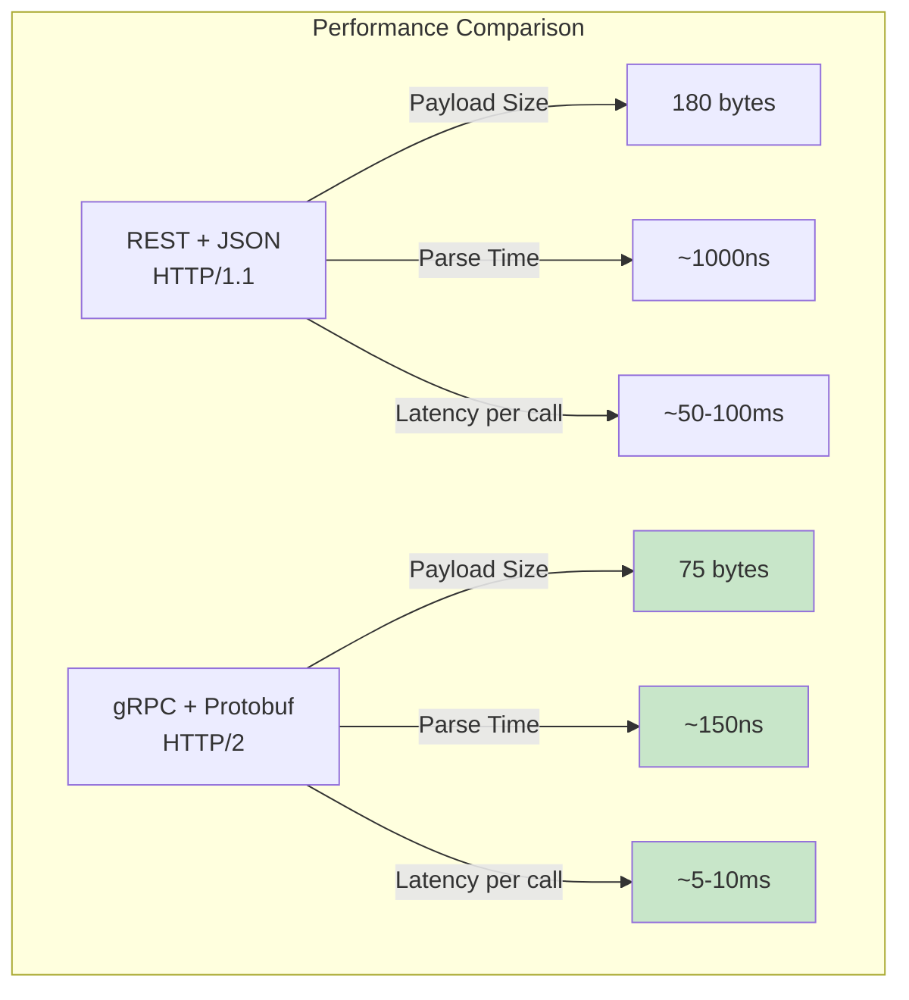

---

## Browser Support & Usability

### REST: Universal Browser Support

```yaml
REST_Browser_Support:
  Status: "100% universal support"
  Why: "REST runs on standard HTTP/1.1"
  Browser_APIs: "Fetch API, XMLHttpRequest"
  No_Configuration: "Works out of the box"

  Developer_Experience:
    - "Easy debugging in Chrome DevTools"
    - "Readable JSON in Network tab"
    - "No special tooling required"
```

### gRPC: Limited Browser Support

```yaml
gRPC_Browser_Support:
  Status: "Limited support"
  Why: "Browsers don't expose HTTP/2 control to JavaScript"
  Workaround: "gRPC-Web with proxy"
  Additional_Components:
    - "Envoy proxy (converts HTTP/1.1 to gRPC)"
    - "gRPC-Web client library"
    - "Special server configuration"

  Architecture:
    Browser -->|"HTTP/1.1 gRPC-Web"| Envoy_Proxy -->|"HTTP/2 gRPC"| Backend
```

### Debugging Comparison

```yaml
Debugging_Experience:
  REST:
    Tools: "Chrome DevTools, Postman, curl"
    Readability: "JSON is human-readable"
    Inspection: "See request/response in clear text"
    Difficulty: "Easy (standard tools work)"

  gRPC:
    Tools: "Postman, Evans CLI, grpcurl"
    Readability: "Binary blobs (protobuf)"
    Inspection: "Must deserialize to read"
    Difficulty: "Harder (requires protobuf definitions)"

  Example_View:
    REST_Response: '{"name": "John", "age": 30}'  # Readable!
    gRPC_Response: '[0x12 0x04 J o h n 0x10 0x1E]'  # Binary!
```

---

## Load Balancing Complexity

### REST Load Balancing (Simple)

With HTTP/1.1, each request typically opens a new TCP connection. Load balancers can easily distribute requests.

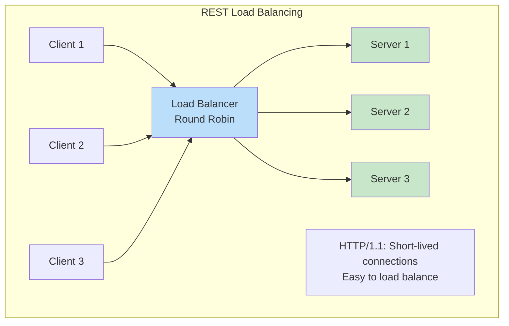

### gRPC Load Balancing (Complex)

With HTTP/2, a single TCP connection is kept open. All requests from that connection go to one server.

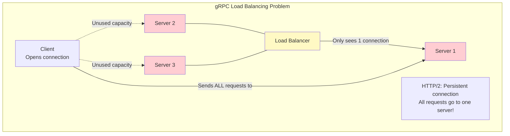

```yaml
gRPC_Load_Balancing_Problem:
  The_Issue:
    - "Client opens ONE connection to load balancer"
    - "HTTP/2 multiplexing sends all requests over that connection"
    - "Load balancer sees only ONE connection"
    - "All requests routed to ONE server instance"
    - "Other server instances sit idle"

  The_Result: "Terrible load distribution, server overload!"

  Solutions:
    Client_Side_Load_Balancing: "Client knows about all servers, distributes requests"
    L7_Load_Balancer: "Smart load balancer that understands HTTP/2 frames"
    Service_Mesh: "Istio, Linkerd handle service discovery + LB"
```

### gRPC Load Balancing Solutions

```yaml
Load_Balancing_Solutions:
  Option_1_Client_Side_Load_Balancing:
    How: "Client maintains list of server addresses, distributes requests"
    Libraries: "grpc-go's resolver, grpc-c++ load balancer"
    Pros: "No LB bottleneck, direct server communication"
    Cons: "Client complexity, must handle server discovery"

  Option_2_L7_Load_Balancer:
    How: "Load balancer understands HTTP/2 stream multiplexing"
    Products: "NGINX, Envoy, HAProxy"
    Pros: "No client changes"
    Cons: "Additional infrastructure component"

  Option_3_Service_Mesh:
    How: "Sidecar proxies handle LB transparently"
    Products: "Istio, Linkerd"
    Pros: "Most flexible, works for all services"
    Cons: "Operational complexity, resource overhead"
```

---

## Decision Matrix: When to Use What

### Use REST When:

```yaml
REST_Use_Cases:
  Public_Facing_APIs:
    description: "3rd party developers integrating with your API"
    reasons:
      - "Universal HTTP support"
      - "Easy to test in browser"
      - "Extensive tooling (Postman, Swagger)"

  Browser_Based_Clients:
    description: "Single Page Applications (SPAs)"
    reasons:
      - "Native browser support"
      - "Fetch API integration"
      - "No proxy required"

  Simple_Resource_Driven_Apps:
    description: "CRUD operations on resources"
    reasons:
      - "Natural fit for resource manipulation"
      - "Easy to understand"
      - "Documentation writes itself"

  Development_Speed_Priority:
    description: "Time-to-market over raw performance"
    reasons:
      - "Less boilerplate code"
      - "Rapid prototyping"
      - "Larger talent pool"
```

### Use gRPC When:

```yaml
gRPC_Use_Cases:
  Internal_Microservices:
    description: "East-West traffic within your system"
    reasons:
      - "Performance critical"
      - "Control both client and server"
      - "Polyglot environment"

  Polyglot_Environments:
    description: "Multiple languages talking to each other"
    reasons:
      - "Strong typing across languages"
      - "Consistent interfaces"
      - "Generated client libraries"

  High_Performance_Requirements:
    description: "Low latency, high throughput"
    reasons:
      - "Binary serialization"
      - "HTTP/2 multiplexing"
      - "Streaming capabilities"

  Streaming_Data:
    description: "Real-time data streams"
    reasons:
      - "Native streaming support"
      - "Bidirectional communication"
      - "IoT, real-time analytics"
```

### Decision Flowchart

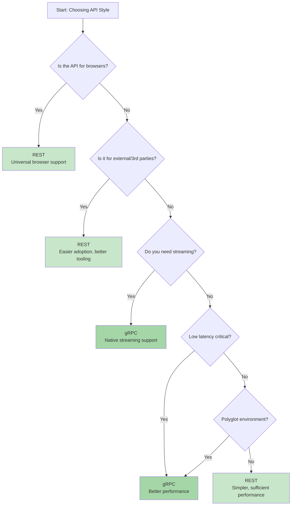

### Quick Reference Table

| Criteria | REST | gRPC |
|----------|------|------|
| **Browser Support** | 100% | Limited (needs proxy) |
| **Human Readable** | Yes (JSON) | No (binary) |
| **Performance** | Good | Excellent (7-10x faster) |
| **Streaming** | Limited (WebSockets) | Native (all 4 types) |
| **Typing** | Dynamic (no compile check) | Static (generated code) |
| **Learning Curve** | Low | Medium-High |
| **Tooling** | Universal (curl, Postman) | Specialized (Evans, grpcurl) |
| **Best For** | Public APIs, SPAs | Internal microservices |
| **Load Balancing** | Easy (L4 or L7) | Complex (L7 required) |

---

## Key Takeaways

### Remember This

- **REST is an architectural style**, not a protocol - it defines constraints (stateless, cacheable, uniform interface) that can be implemented using HTTP

- **gRPC is a framework** with a specific technology stack: HTTP/2 for transport and Protocol Buffers for serialization

- **Protocol Buffers use field tags** (numbers) in binary format - no field names in payload, making it 50-70% smaller than JSON

- **HTTP/2 enables multiplexing** - multiple streams over a single TCP connection, eliminating head-of-line blocking

- **gRPC has 4 RPC types**: Unary (like REST), Server Streaming, Client Streaming, and Bidirectional Streaming

- **REST is universal** - every language, browser, and tool supports it; gRPC requires proxies for browsers

- **gRPC requires L7 load balancing** - HTTP/2 persistent connections confuse traditional L4 load balancers

- **Contract-first development** with .proto files ensures type safety and prevents integration bugs

- **Use REST for external/public APIs** (browser clients, 3rd party developers) and **gRPC for internal microservices** (performance-critical, polyglot)

- **Idempotency matters**: PUT and DELETE are idempotent (calling multiple times = same result), POST is not

### Common Mistakes to Avoid

```yaml
Mistakes:
  - "Using verbs in REST URLs (/getUsers instead of GET /users)"
  - "Confusing REST with HTTP - REST is an architectural style, not HTTP"
  - "Using gRPC for browser clients without setting up gRPC-Web proxy"
  - "Overlooking load balancing complexity with gRPC (HTTP/2 connection issue)"
  - "Using POST for everything because it's 'easier' - use proper HTTP methods"
  - "Forgetting that gRPC payloads are binary and not readable in DevTools"
  - "Not versioning APIs - breaking changes will hurt clients"
  - "Missing HATEOAS in 'RESTful' APIs - resources should include discoverable links"
  - "Assuming gRPC replaces REST - they solve different problems"
  - "Using JSON in gRPC - the whole point is Protocol Buffers"
```

### Best Practices Summary

```yaml
Best_Practices:
  REST:
    - Use nouns, not verbs in URLs
    - Use proper HTTP methods (GET, POST, PUT, DELETE, PATCH)
    - Implement HATEOAS for discoverable APIs
    - Version your APIs (URI or header)
    - Use proper HTTP status codes
    - Make responses cacheable when possible

  gRPC:
    - Define service contracts before writing code
    - Use meaningful field tags (1-15 more efficient)
    - Plan for backwards compatibility (don't renumber fields)
    - Implement proper error handling with status codes
    - Use client-side load balancing or service mesh
    - Document .proto files clearly
```

---

<div align="center">

[Previous: Episode 18](../18-tcp-udp) | [Course Home](../../) | [Next: Episode 20](../20-coming-soon/)

</div>
