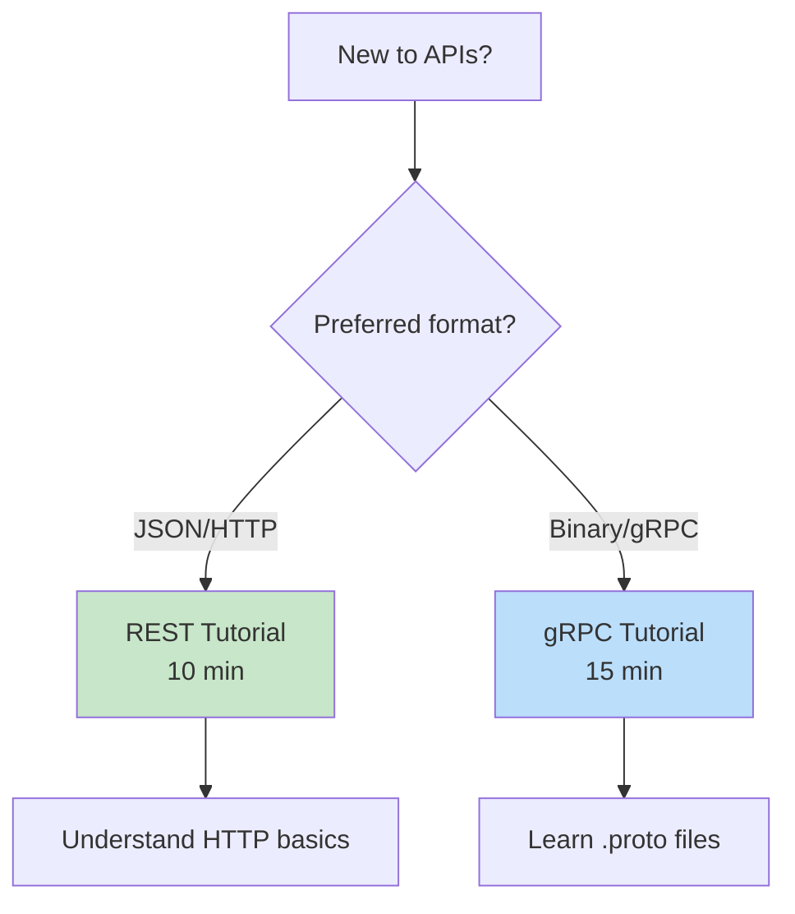

# Practical Tutorials

Hands on code examples to understand REST and gRPC basics.

## Tutorials

| Tutorial | Description | Time |
|----------|-------------|------|
| [REST Tutorial](./rest-tutorial/) | Simple Express.js REST API | 10 min |
| [gRPC Tutorial](./grpc-tutorial/) | Simple gRPC service with Protocol Buffers | 15 min |

## Which to Start With?



## Quick Comparison

### REST (HTTP + JSON)
```javascript
// Simple and familiar
fetch('/api/users')
  .then(r => r.json())
  .then(data => console.log(data));
```

### gRPC (HTTP/2 + Protobuf)
```javascript
// Fast and type-safe
client.GetUser({id: 1}, (err, user) => {
  console.log(user.name);
});
```

## Prerequisites

- Node.js installed
- Basic JavaScript knowledge
- Terminal/command line

## Installation

Each tutorial has its own `package.json`:

```bash
# REST Tutorial
cd rest-tutorial
npm install

# gRPC Tutorial
cd grpc-tutorial
npm install
```

## What You'll Learn

### REST Tutorial
- HTTP POST method
- JSON request/response
- Express.js basics
- Fetch API

### gRPC Tutorial
- Protocol Buffers syntax
- .proto service definition
- gRPC server implementation
- gRPC client calls